<!-- summary -->
## AI TL;DR

The June 2022 update introduces a complete overhaul of perk progression, tying perk unlocks to character prestige, expanding prestige to level 100, removing teachable rarity, and allowing direct purchases from the Shrine of Secrets. It also adds matchmaking incentives that grant large Bloodpoint bonuses for under-populated roles, and modest gameplay tweaks such as slower generator completion, stronger generator kicks, and faster Killer actions. In addition, 39 meta-defining perks for both Killers and Survivors receive nerfs or buffs—including changes to Barbecue and Chilli, Hex Ruin, Pop Goes the Weasel, Dead Hard, Borrowed Time and Iron Will—while dozens of secondary perks are rebalanced. All changes will appear in the Public Test Build next week and will headline the upcoming Mid-Chapter.
<!-- /summary -->

<!-- nav -->
&larr; _oldest_ · [Developer Updates](../index.md#developer-updates) · [Developer Update | July 2022](341-developer-update-july-2022.md) &rarr;
<!-- /nav -->

# Developer Update | June 2022

During our 6th Anniversary Broadcast, we announced a new progression system and a meta-shifting perk overhaul. We’re thrilled to say that both initiatives will headline the upcoming Mid-Chapter.

From the onset, it was important for us to release these changes as a package. Our objective is to shake up the current meta, provide alternatives, and make perks easier to earn. We were also careful to consider the reasons why this meta exists and address any base game issues it may have been concealing.

In this post, we’ll be detailing the upcoming changes, all of which will be available for testing in the Public Test Build (PTB) next week.

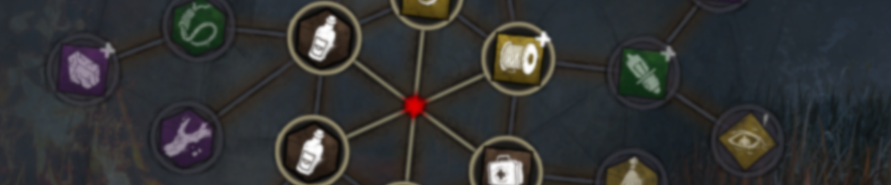

## Overhauled Progression System

Collecting all the perks has been an important goal for many players. However, since both the number of perks and characters are constantly increasing, the grind expands at an exponential rate with every new Chapter. To address this, we’re completely overhauling the way perks are earned, adding new rewards, and making completion easier than ever before.

### Comparison

In the current system, you must reach level 40 on a given character to unlock all their teachable perks, then find those perks in the Bloodwebs of every other character.

In order to unlock all the new perks on every character by the time next Chapter releases, you would need to play an estimated average of 4.1 hours *every day.* With this new system, that estimate decreases to an average of 1.01 hours each day – and that’s not even factoring in Bloodpoint bonuses from events, perks, or offerings.

In other words, this is the single largest reduction to grind we’ve ever made, cutting it by roughly **75%**.

### Unlocking Perks

The teachable rarity is no more. Now, perks are tied directly to prestige. Prestiging a character for the first time will instantly unlock the Tier 1 versions of their unique perks for all other Killers or Survivors, making them immediately available for use without ever opening the Bloodweb.

Prestiging a character for the second and third time will unlock the Tier 2 & 3 versions of their unique perks. Alternatively, higher tier versions of their perks will appear randomly in Bloodwebs once the first Tier has been unlocked.

Say you prestige The Trapper. This will instantly unlock Tier 1 versions of Agitation, Brutal Strength, and Unnerving Presence on all other Killers. Tier 2 & 3 versions of these perks will now appear randomly in the Bloodweb. Prestiging The Trapper again will make Tier 2 versions of these perks immediately available, and so on.

This way, you’ll only need to earn the perks once to use them on every character. The perks you’ve unlocked will be instantly available on any new characters as well, making them easier to pick up and play without a substantial Bloodpoint investment.

### No More Resets

Prestiging has always been a bit of a dilemma. Do you give up everything for bragging rights, or do you keep what you have to minimize the grind? Now that prestiging is the main way to unlock perks, we wanted to make the choice clear. **Prestiging a character will no longer remove their perks, items, add-ons, or offerings. Perk slots will also remain unlocked after prestiging.**

With no reason not to prestige, prestiging a character is no longer optional. After reaching level 50, you’ll receive a special Bloodweb with only a single node. Purchasing this node will increase your prestige level and reset your character’s level to 1.

### Expanded Prestige

With prestige now being the main way to progress, it’ll no longer be as impressive to have your characters maxed out at prestige level 3. It only made sense to have a new way to recognize our most committed players, so we’ve increased the prestige limit to 100. But what would more prestige levels be without rewards?

Reaching prestige levels 4, 5 and 6 will now award that character’s bloody prestige cosmetics, once again signifying those who went above and beyond. Now that prestiging for the first three times awards perks, it only made sense to move these higher. If you’ve already unlocked these cosmetics, don’t worry, we won’t be taking them away from you. You’ve earned it.

For the completionists, prestige levels 7, 8 and 9 will each grant one of that character’s unique perks as a charm. We also wanted to highlight your dedication to your favourite characters no matter how many times you’ve prestiged them. Once a trial is over, your prestige level will now be shown in the space previously occupied by grades. Those who spend millions of Bloodpoints stockpiling add-ons for your favourite characters will now have a way of showcasing your hard work to the world.

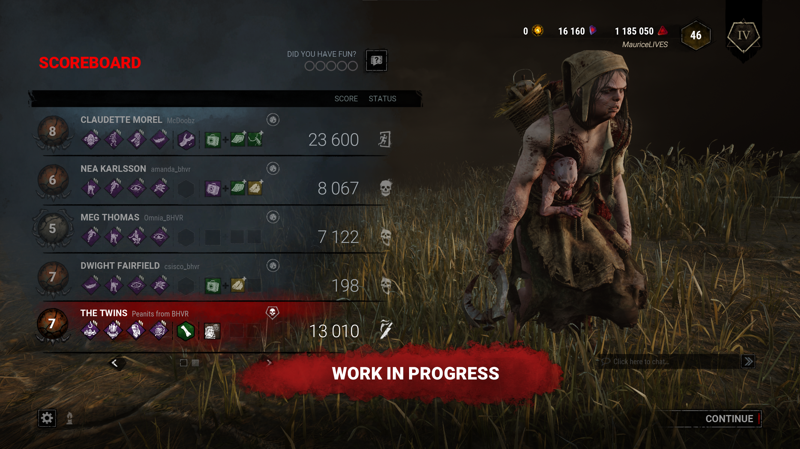

### Shrine of Secrets

Unlike before, where The Shrine of Secrets would offer teachable perks that then needed to be found in Bloodwebs, the Shrine will now allow you to purchase perks directly. Purchasing a perk through the Shrine of Secrets will make the Tier 1 version of it immediately available on all Killers or Survivors, much like prestige. Subsequent Tiers of that perk will also begin appearing in Bloodwebs.

You may also purchase a perk again to increase its Tier. This works seamlessly with the prestige system, as purchasing a perk you’ve already unlocked through prestige will instead increase its Tier.

### Transitioning to The New System

With many spending hundreds if not thousands of hours playing Dead by Daylight over the years, we want to make sure that everyone is rewarded fairly. When the system releases, we’ll be automatically awarding existing players an appropriate number of prestige levels based on how many perk tiers they’ve unlocked. If you’ve left all your characters at level 50 and focused on unlocking perks, your work won’t be for nothing.

It's also important that you don’t lose anything when the system is updated. You will keep any perks and bloody prestige cosmetics that you’ve already unlocked.

Those who reach prestige 3 before the update will receive a special prestige icon to recognize their achievements (and commemorate the perks and add-ons they lost in the process).

We’ll be hosting a livestream soon to show the updated system in action and answer any questions you might have ahead of the PTB.

## Matchmaking Incentives

Matchmaking has been a major focus over the past year, and we’re maintaining that throughout Year 7. Though many changes are planned to improve wait times and match quality, there are variables that we can’t control through code. Chief among them is the distribution of people playing each role. If there’s simply not enough people queuing for one role, the matchmaker’s ability to create quality matches suffers.

Being an asymmetrical game, Dead by Daylight works best when there’s roughly four Survivors to each Killer. If this 4:1 ratio deviates too far, matchmaking time and quality will start to degrade. Too many Survivors will cause Survivor queue times to increase, while too few Survivors will cause Killer queue times to increase. To complicate things further, this ratio varies greatly depending on your region, rating, and time of day. In some regions, we’ve observed an excess of Survivors queuing while in others, too few. Oftentimes this will change over the course of the day.

So, how do we go about improving this? Enter matchmaking incentives.

Whenever the number of Killers to Survivors differs too much from the ideal ratio, we’ll offer a Bloodpoint bonus to anyone who opts to play the needed role. This bonus ranges from +25% to +100% depending on demand levels. These bonuses will be shown on the main menu beside each role’s play button, as well as beside the ready button.

These bonuses double as an indicator of which role currently has the fastest queue times. If you want to get into a match as soon as possible, keep an eye out for incentives!

Matchmaking incentives are unique to you and dependent on your matchmaking ratings and region. You may see a bonus for playing Killer while your friend sees one for playing Survivor. This is intended. Bonuses are dependent on which roles are needed to improve matchmaking at the time. For example, Killers may be needed where you are, but there may be an excess of Killers where your friend is playing.

Playing in a group can also net you a bonus if Survivors are needed at the time. However, this will only apply if your group’s average matchmaking rating is currently in demand. We believe these matchmaking incentives will improve both queue times and the matchmaker’s ability to create quality matches.

**Heads up:** Matchmaking incentives will be disabled if cross-play is turned off. As most players play with crossplay on, the system would be highly susceptible to manipulation, and switching roles would have a negligible effect on matchmaking. If you’d like to take advantage of these incentives, we strongly recommend turning on cross-play through the settings menu.

## Gameplay Updates

Some of the most consistent feedback we receive centers around the perk meta. A handful of perks have a dominant usage rate, especially in higher-skill matches. Naturally, the gameplay can feel stale when you see the same perks again and again.

In the past, we’ve addressed individual perks through various updates, but the odd meta change is not enough to shake things up. In this update, we are reworking and rebalancing 39 perks, meta included. We aim to reduce the reliance on the current meta while also providing many new options to experiment with.

Before we can make meaningful changes to the meta, we needed to look at *why* these perks are so heavily used in the first place. While some perks are popular because of their strength, others are popular because they reduce the likelihood of an “unfun” situation. Therefore, we’ve prepared a few baseline changes to address some of these core gameplay issues.

### Generator Speeds

When looking at the perks most used by Killers, there’s a very clear trend: any perk that helps prevent generators from being powered - *slowdown perks for short* - are favored. **Corrupt** **Intervention**, **Pop Goes the Weasel**, **Scourge Hook: Pain Resonance**, and **Hex: Ruin** are a few notable examples, and each are amongst the most popular perks.

Many players feel like generators are powered too quickly without these perks, so we knew we needed to look at generators before making any perk changes. Slowdown perks should be an option, but not the only option to stay competitive.

**First:** We have increased the time it takes to power a generator to 90 seconds (up from 80 seconds).

The time it takes to complete a generator hasn’t been changed in a long time, but it’s clear that they are being powered quicker than we’d like. By slowing them down slightly, we hope to give Killers a bigger window to interrupt Survivors, particularly at the beginning of a trial.

**Second:** Kicking a generator will now instantly remove 2.5% of the maximum progress.

This change makes kicking generators more meaningful, even if a Survivor stops it from regressing shortly after. Additionally, Survivors must now decide whether they should tap a generator to prevent regression, as this allows the Killer to kick it again and knock off even more progress.

With these two changes, we hope to reduce the reliance on passive slowdown mechanics and promote increased interaction between Killers and Survivors.

### General Killer Improvements

The average kill rates (how many Survivors are killed each trial, on average) are a little lower than we’d like – a sentiment echoed by many community members. To ensure the Killer feels like an unstoppable force to be feared, we’re making slight improvements to many aspects of Killer gameplay.

We’ve reduced the time it takes to break walls and pallets by 10% (now 2.34 seconds, previously 2.6). Generators can also be kicked 10% faster than before (now 1.8 seconds, was 2 seconds). While these changes may seem small, a fraction of second can be the difference between hitting a Survivor and them reaching a pallet.

Next, we’ve reduced the cooldown for successful basic attacks by 10% (now 2.7 seconds, previously 3 seconds) and reduced the duration of the Survivor’s speed boost upon being hit by 10% (now 1.8 seconds, was 2 seconds). Moving forward, Survivors will gain slightly less distance upon being hit, making it more difficult for them to run long distances to a safe area.

Finally, we’ve tweaked Bloodlust to increase in power quicker than before. In most chases, Bloodlust does not activate, though there are rare cases where it can be necessary. The long build up often leaves the Killer in a bad spot even if they eventually get a hit. We are adjusting Bloodlust tiers to activate after 15/25/35 seconds of chasing rather than 15/30/45 seconds

As the first tier of Bloodlust has not changed, it will not be any more prevalent in the average chase. Bearing in mind the general improvements above, we expect Bloodlust will become even more uncommon outside of exceptional circumstances.

Though slight, these changes affect every Killer and can have ramifications on the game. We will be watching closely to ensure that nothing gets out of hand.

### Camping & Tunneling

On the Survivor side, there is a clear preference for perks that grant a second chance. **Borrowed Time**, **Decisive Strike**, **Dead Hard,** and perks of that nature help a Survivor avoid certain death, leading to an extreme usage rate.

A benefit of these *second chance* perks is how that they help prevent unfun situations, namely being camped or tunneled out of the game (repeatedly being targeted after being unhooked). In order to incentivize a meaningful change to the meta, it was clear that we needed to address these controversial tactics. Second chance perks should be nice to have, not essential to ensuring enjoyable gameplay.

Moving forward, Survivors will receive a 5 second Endurance effect after being unhooked. This gives the unhooked Survivor an opportunity to reach a nearby window or pallet, or for another Survivor to position themselves for a Protection Hit.

Additionally, the unhooked Survivor will receive a 7% Haste effect for 5 seconds. This will make them harder to catch and encourage Killers to shift focus to the unhooking Survivor.

Both effects will be cancelled prematurely if the unhooked Survivor performs what we now call a **Conspicuous Action**. These are interactions – *other than being chased –* that would improve your chances of survival. This includes:

- Repairing a generator
- Healing yourself or others
- Cleansing or Blessing a Totem
- Sabotaging a hook
- Unhooking others
- Opening an exit gate

With these base changes, we hope Survivors can switch up their perk loadouts without fear that camping and tunneling will cut their next match short.

## Meta Perk Changes

For this update, perk changes fall into one of two categories: meta perks that are used too often, and non-meta perks that serve a similar purpose but aren’t used as much.

We understand that many of you have grown attached to your favourite perks and loadouts. Unfortunately, shaking up the meta inevitably leads to a few changes. Rest assured that our goal is to provide alternatives that align with your preferred playstyle while widening the scope to include more viable perk options.

It’s also important to note that not every meta perk is equal, and each was considered on a case-by-case basis. So, what are Dead by Daylight’s meta perks? By referencing both community feedback and internal data, we can see that some perks stand above the rest.

For Killers: **Barbecue and Chilli**, **Hex: Ruin**, **Pop Goes the Weasel,** **Corrupt Intervention**, **Tinkerer**, **Hex: No One Escapes Death**, and **Scourge Hook: Pain Resonance**.

For Survivors: **Dead Hard**, **Borrowed Time**, **Decisive Strike**, **Iron Will**, **Self-Care**, and **Spine Chill.**

We’d like to share these graphs showcasing the ten most frequently used perks for both roles. These charts alone do not explain why the meta exists – for that, we turn to community feedback – but hopefully they provide context for how heavily these perks are used.

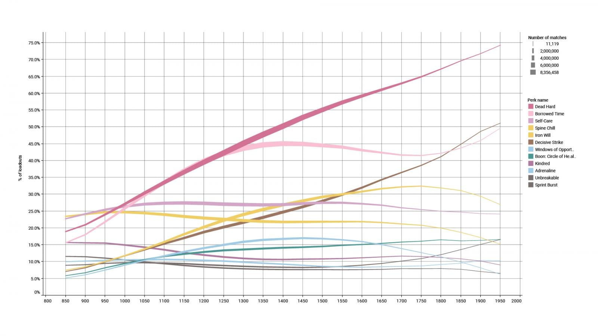 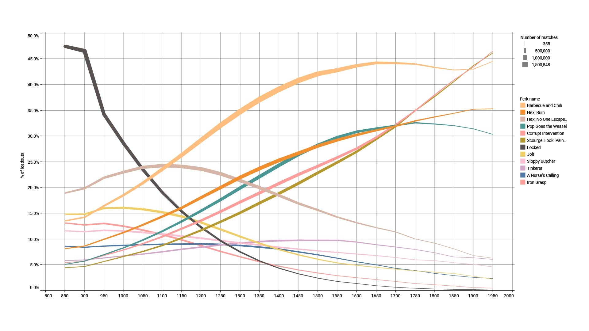

### Killer Meta Perks

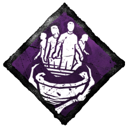

**Barbecue and Chilli**

> Current effect: Upon hooking a Survivor, see the auras of distant Survivors for a short duration. Gain a stacking Bloodpoint bonus for each unique Survivor hooked.

This perk is incredibly popular not because it’s particularly powerful, but because of the huge amount of Bloodpoints it provides. Choosing to go into a match without it massively slows your progression.

We do not want Bloodpoints to be the driving factor behind perk choices, so we will be removing the Bloodpoint bonus. While we understand this change may seem shocking, please keep in mind that this update reduces the grind by about 75%, with matchmaking incentives providing an additional avenue for Bloodpoints.

We believe this is a necessary step in making other aura reading perks more appealing, as Bloodpoint gain will no longer be the deciding factor.

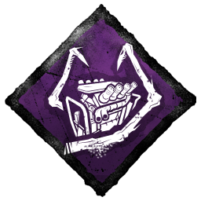

**Hex: Ruin**

> *Current effect: Generators regress automatically at an increased rate whenever a Survivor is not working on them as long as the associated Hex totem is standing.*` `

A massive part of Hex: Ruin’s appeal is not having to stop and kick generators, as well as the ability to passively regress them from a distance. These aspects make Ruin a unique slowdown perk, so we are not looking to change them.

To bring Hex: Ruin in line with other perks, we are reducing the regression speed to 50/75/100% from 100/150/200%. This will reduce its power without destroying its primary appeal. After a Survivor is killed, Hex: Ruin will automatically deactivate.

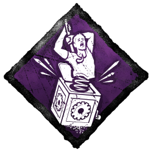

**Pop Goes the Weasel**

> *Current effect: After hooking a Survivor, the next generator you kick within the time limit instantly loses 25% of its total progress.*

Pop Goes the Weasel gives Killers a controlled way to remove significant progress from a generator of their choosing. Given that kicking a generator now removes 2.5% of its progress by default, we decided to tone down some numbers to compensate. This perk will now remove 20% of the generator’s *current* (not total) progress.

This change will make Pop Goes the Weasel very effective against generators that are nearly done, but weaker against those with a small amount of progress.

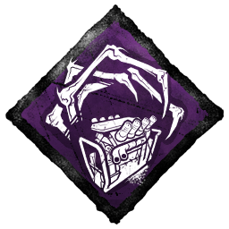

**Corrupt Intervention**

> *Current effect: At the start of the match, the three furthest generators are blocked for a while.*

This perk makes the beginning of a match more manageable, forcing Survivors to extend deeper into the map before repairing a generator. We aren’t looking to change this aspect.

Moving forward, the perk will deactivate once a Survivor enters the dying state. We believe this change will keep Corrupt Intervention effective in helping the Killer build early game pressure, while providing a limit to its power.

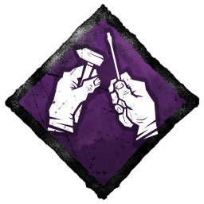

**Tinkerer**

> *Current effect: When a generator reached 70% progress, receive a loud noise notification and become Undetectable for a short duration.*

Tinkerer is a popular choice for the information it provides. Being able to prevent a generator from being powered is a game changer, particularly on Killers with high mobility. It can, however, become a little oppressive when paired with certain regression perks. Therefore, Tinkerer can now only activate once per generator – but with the base charges increased to 90, Killers will have extra time to approach.

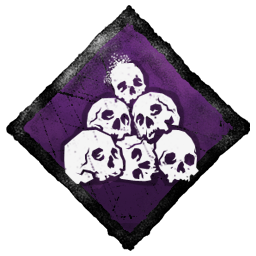

**Hex: No One Escapes Death (Or NOED, for short)**

> *Current effect: When the exit gates are powered, all Survivors become exposed as long as the associated Hex totem is standing.*

This perk makes for a very effective comeback tool, though it falls out of favour in high skill games. We like the way NOED encourages Survivors to pre-emptively cleanse Totems, so we are not looking to weaken its direct strength. Instead, Survivors will now see the Hex Totem’s aura within 4 meters upon activation. This range increases to 24m over the course of 30 seconds.

We believe this change will keep NOED a strong choice for endgame builds, while encouraging Survivors to find the Totem and attempt that last second save.

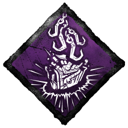

**Scourge Hook: Pain Resonance**

> *Current effect: Upon hooking a Survivor on a Scourge Hook, the generator with the most progress explodes, notifying the Killer and instantly loses a large chunk of progress.*

The most recent addition to the meta, Pain Resonance allows the Killer to remove a sizable chunk from the most progressed generator simply by hooking a Survivor. A loud noise notification also allows the Killer to disrupt the Survivors before they can continue repairing. A “jack of all trades” of sorts, granting both a powerful regression effect and crucial information.

With that in mind, we are removing the loud noise notification. Instead of exploding, the affected generator will now spark upon losing progress, and Survivors will no longer scream. We believe this will ensure Pain Resonance remains a strong regression perk while limiting its informational aspect.

### Survivor Meta Perks

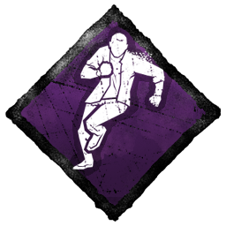

**Dead Hard**

> *Current effect: When activated, become immune to damage and dash a short distance.*

Dead Hard is by far the most used perk by Survivors, and it’s easy to see why. In the right hands, it acts like a third health state, allowing a Survivor to escape a situation where they would otherwise go down.

There are two main ways Dead Hard is used: To dodge a hit and for distance (to get to a nearby pallet or window). In the latter case, there’s not much a Killer can do. Therefore, Dead Hard will now provide the Endurance effect for 1 second when activated. If you time it right, you’ll prevent the hit and gain a movement speed boost.

This will remove “Dead Harding for distance” and make it solely used to dodge hits, which Killers can anticipate and even bait accordingly.

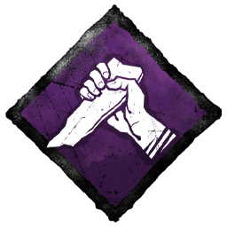

**Decisive Strike**

> *Current effect: After being unhooked, Decisive Strike activates for a long duration. When picked up, hit a special skill check to instantly wiggle free. Deactivates when used or when performing various actions.*

One of Decisive Strike's main appeals is its efficacy at preventing tunneling. In light of the upcoming base game changes, we expect Decisive Strike to drop in usage slightly.

For the most part, we find the perk to be healthy for the game, and easily avoidable for Killers who choose not to tunnel an unhooked Survivor. That said, at the end of the match, there’s often nothing the Killer can do to prevent a Survivor with Decisive Strike from escaping.

Moving forward, Decisive Strike will now deactivate once the Exit Gates are powered. In addition, the stun duration has been reduced from 5 seconds to 3 seconds. We’ll also be simplifying the description of the perk: Decisive Strike will now be cancelled by Conspicuous Actions.

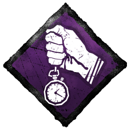

**Borrowed Time**

> *Current effect: Survivors you unhook gain the Endurance effect for a short duration, allowing them to ignore a hit that would otherwise put them in the dying state.*

Much like Decisive Strike, this perk gets much of its popularity by granting counterplay against a camping Killer. Considering a lighter version of Borrowed Time’s effect has been added to the Survivor’s base kit, we need to update the perk accordingly.

Borrowed Time will now extend the duration of the Endurance effect of unhooked Survivors by 6/8/10 seconds and increase the movement speed bonus duration by 10 seconds for any Survivor you unhook. These effects will be cancelled if the unhooked Survivor performs a Conspicuous Action.

While the overall duration with Borrowed Time is longer than before, we expect that having a lighter version in the base kit will cause the usage rates to drop.

**Iron Will**

> *Current effect: Makes your grunts of pain silent.*

This perk allows skilled players to mind-game more effectively in many areas by silencing grunts of pain. To address its high usage rates, we are lowering the grunts of pain reduction to 25/50/75%. Additionally, Iron Will is no longer active when Exhausted – though it will not cause Exhaustion itself.

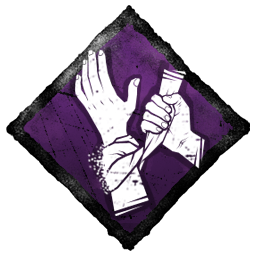

**Self-Care**

> *Current effect: Unlocks the ability to heal yourself without a Med-Kit at 50% speed.*

Though Self-Care has a divisive reputation among the community, we were surprised to find that its usage peaks in the highest skill matches. Having a consistent and reliable way to heal at will is a powerful tool in the right hands. On top of that, Self-Care increases the efficiency of Med-Kits, allowing Survivors to squeeze additional heals out of them.

To reduce its strength, Self-Care's heal speed will be lowered to 25/30/35%, and the item efficiency bonus has been removed entirely.

**Spine Chill**

> *Current effect: Activates when the Killer is nearby and looking in your direction, increasing action speeds and the chance for skill checks.*

This perk excels at alerting Survivors when a Killer is approaching, and in high skill lobbies, the vault speed increase becomes the primary draw. There are a few aspects of this perk we would like to clean up.

Spine Chill will now only activate if the Killer has a clear line of sight to the Survivor. This will remove the awkward counterplay where the Killer must look away to ensure a stealthy approach.

Next, we’ll be adding a short (0.5 seconds) lingering effect to Spine Chill. This will prevent the perk icon from flickering when the Killer looks around and make the action speed boosts more consistent.

Finally, we’ll be removing the vault speed bonus entirely, as it does not suit the perk’s nature.

## Non-Meta Perk Changes

With so many meta perks being changed, we wanted to make sure that everyone had something new to look forward to. We’ve updated 25 additional perks to try out, the majority of which fulfill a similar purpose to the meta perks listed above.

### Killer Perk Buffs

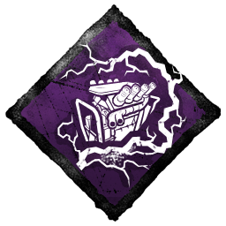

**Overcharge**

Along with its current effects, Overcharge will cause a kicked generator’s regression speed to grow from 100% to 400% over the course of 30 seconds. Survivors will want to stop this generator from regressing as soon as possible.

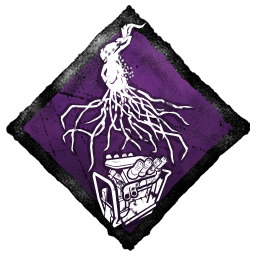

**Eruption**

Eruption released with fairly safe numbers, but upon reflection, we’re comfortable with increasing them. We have upped the generator regression penalty to 10% and the duration of the incapacitated effect to 15/20/25 seconds.

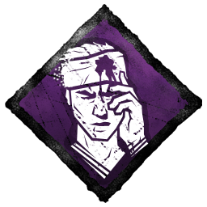

**Knock Out**

Those of you who like to leave Survivors on the ground can have a little more peace of mind. In addition to its current effect, Knock Out will cause dying Survivors to crawl 50% slower for 15 seconds and reduce their recovery speed by 25%.

**Coulrophobia**

To make healing in the Killer’s terror radius even more unappealing, Coulrophobia will now increase the speed of skill checks by 50% on top of its current effect.

**Dark Devotion**

This perk is great for confusing and sneaking up on Survivors, but the basic attack requirement makes it unappealing for certain Killers. Dark Devotion will now activate whenever the Obsession loses a health state.

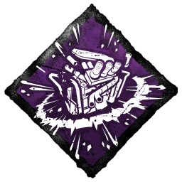

**Jolt**

Jolt allows the Killer to regress generators simply by downing a Survivor. To make it more consistent and punish careless Survivor plays, we have removed the cooldown.

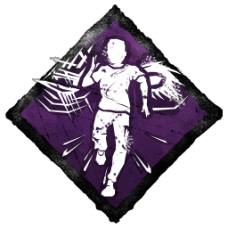

**Lethal Pursuer**

So, you like aura reading, huh? On top of the existing effect, Lethal Pursuer will now extend the duration of all aura reading effects by 2 seconds.

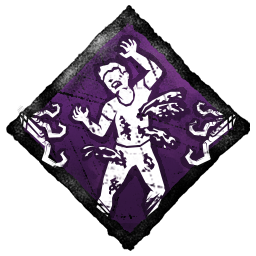

**Scourge Hook: Gift of Pain**

This perk also shipped with safer numbers, so we’ll be increasing the action speed penalty to 10/13/16%.

**Thanatophobia**

Another quick one: we are increasing the action speed penalty to 4.5/5/5.5% per Survivor, for a maximum of 18/20/22%.

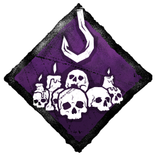

**Scourge Hook: Monstrous Shrine**

Long have we waited. Monstrous Shrine has received a rework. This perk will now convert all basement hooks to Scourge Hooks. Additionally, Scourge Hooks will now grant 10/15/20% faster Entity progression – but only if the Killer is not within 24 meters.

### Survivor Perk Buffs

**Calm Spirit**

In addition to Calm Spirit’s current effects, you can now open chests and cleanse and bless totems silently, albeit at 40/35/30% reduced speed.

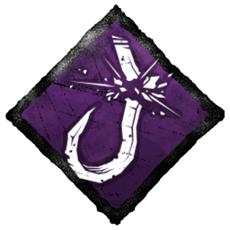

**Saboteur**

After months of studying, Saboteurs can now identify Scourge Hooks. Their auras are shown in yellow when a Survivor is being carried. Use this information to your advantage to prevent Scourge Hook perks from being activated.

**Botany Knowledge**

Botany Knowledge now increases healing speed by 30/40/50%, up from 11/22/33%.

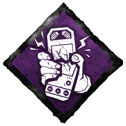

**Off the Record**

Upon being unhooked, gain the Endurance status effect for 60/70/80 seconds. The Endurance effect is lost upon performing a Conspicuous Action. While this is a lengthy Endurance effect, any game-progression action will cancel it prematurely, making it purely for evading the Killer after being unhooked.

**Lucky Break**

This perk is great for escaping a chase, but the effect quickly runs out. We’re giving Survivors a way to recharge Lucky Break: Each second spent healing another Survivor increases Lucky Break’s duration by 1 second. (The total time cannot exceed the starting duration.)

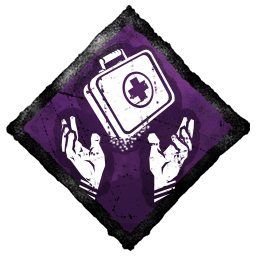

**Pharmacy**

Pharmacy used to guarantee an Emergency Med-Kit the first time you searched a chest, which you’d either hope nobody takes before you need it or hide in a far-off corner like a Med-Kit goblin.

Now, Pharmacy will activate whenever you’re injured, guaranteeing an Emergency Med-Kit when you search a chest. This effect can happen multiple times in one trial. Good luck stealing my Med-Kit now, *Meg.*

**Sole Survivor**

In addition to hiding your aura, Sole Survivor will now increase your generator repair speed by 75% and your exit gate and hatch action speed by 50%. These effects are only active when you are the last Survivor standing.

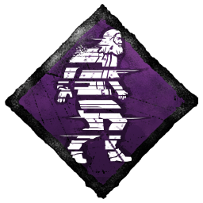

**Distortion**

For those who like to stay hidden, we’ve added a way to regain Distortion tokens. Gain 1 token for every 30 seconds spent within the Killer’s Terror Radius.

**Lightweight**

In addition to Lightweight’s existing effects, your scratch marks will be more sporadic, making you harder to track. Your scratch marks will also fade 5/4/3 seconds sooner, up from 1/2/3.

**Déjà Vu**

To help Survivors power the three closest generators, Déjà Vu will now grant a 5% repair speed bonus to the revealed generators.

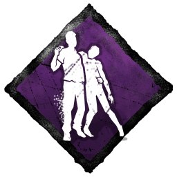

**No One Left Behind**

Beyond its current effects, No One Left Behind will grant a 7% movement speed bonus to any Survivors you unhook. Additionally, the perk now activates when the gates are powered rather than opened.

**Dark Sense**

We’ve changed the way Dark Sense works: When a generator is powered, Dark Sense activates. The next time the Killer comes within 24m of you, their aura is revealed for 5/7/10 seconds. Dark Sense then deactivates.

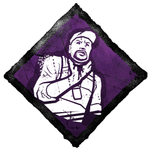

**Tenacity**

In addition to the current effects, Tenacity now reduces your grunts of pain by 75% when in the dying state. Combined with the increased crawling speed, this perk will now be much more effective in crawling away from the Killer.

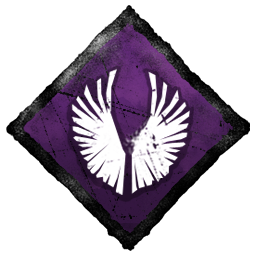

**Hope**

Hope is great for those who like to make late game saves, but the limited duration can cause it to expire at an inconvenient time. Since this perk is only useful at the end of the match, we’ve removed the duration entirely.

**Overzealous**

In its current state, cleansing a totem grants you a repair speed bonus of **6%/7%/8%.** Now, that bonus doubles if you cleanse a Hex totem.

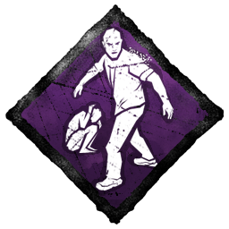

**We’re Gonna Live Forever**

Much like Barbecue and Chilli, this perk features a massive Bloodpoint bonus. We do not want Bloodpoints to dictate which perks are used, so we have removed the bonus Bloodpoints from We’re Gonna Live Forever.

This change will release at the same time as the progression overhaul, which is expected to cut the grind by about 75%, with matchmaking incentives providing an additional avenue for Bloodpoints.

Additionally, actions that previously granted a token will now activate the perk's secondary effect. While active, healing a Survivor from the dying state grants them the Endurance effect for 6/8/10 seconds. The secondary effect of We're Gonna Live Forever then deactivates.

---

We realize that following these changes, a new meta will surely rise. We’ll be closely monitoring the performance of each updated perk to ensure that none fall too far out of line. Moving forward, we hope to make meta-shaking updates like this one a more frequent part of our plans in order to keep gameplay feeling fresh.

With that, we’ve reached the end of this edition of the Developer Update. Kudos to those of you who made it this far -- it was a long one! As always, these changes will be available for testing next week in the PTB. Given the number of changes made, we’ll be keeping an extra close eye out for feedback. We’ll also be holding a livestream in the near future to preview the update and answer any questions you may have.

Until next time…

The Dead by Daylight team

<!-- nav -->
&larr; _oldest_ · [Developer Updates](../index.md#developer-updates) · [Developer Update | July 2022](341-developer-update-july-2022.md) &rarr;
<!-- /nav -->
