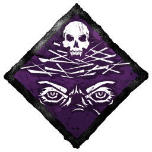
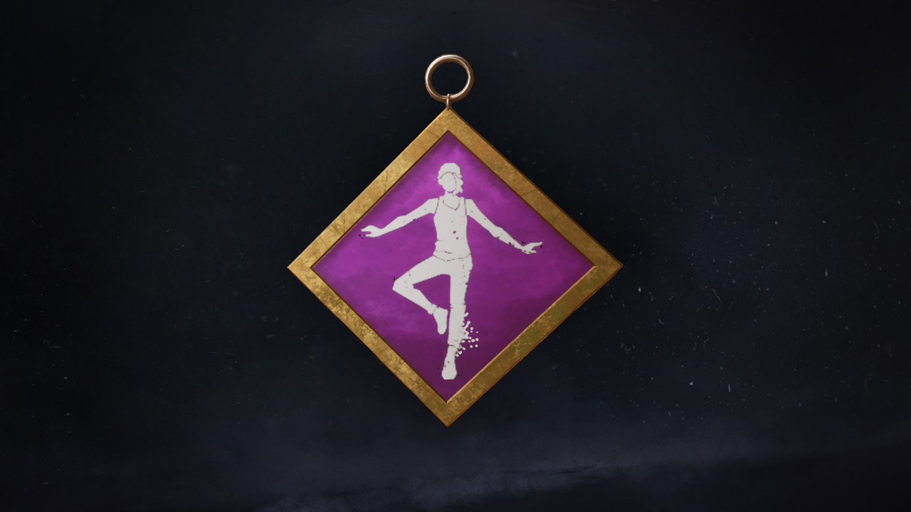
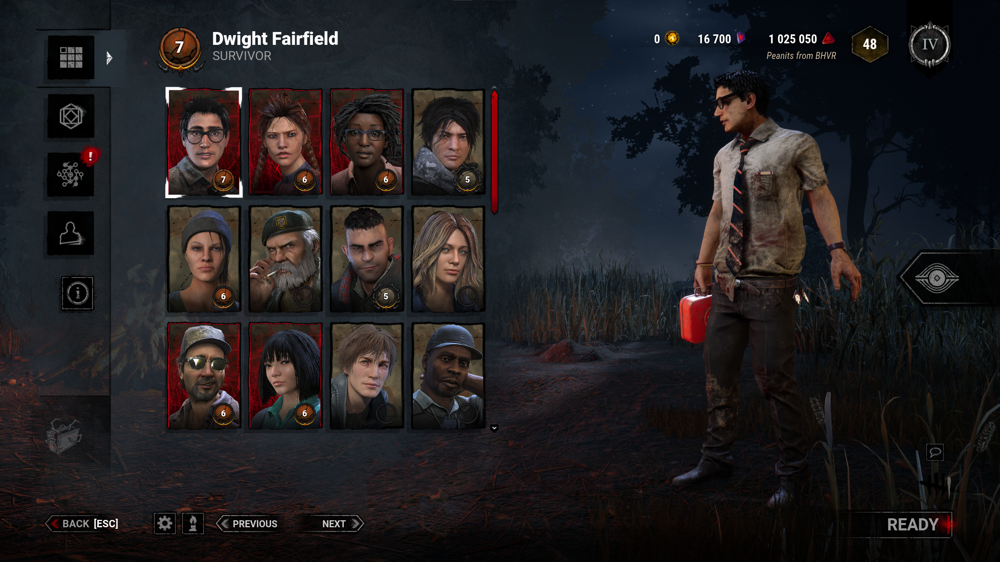
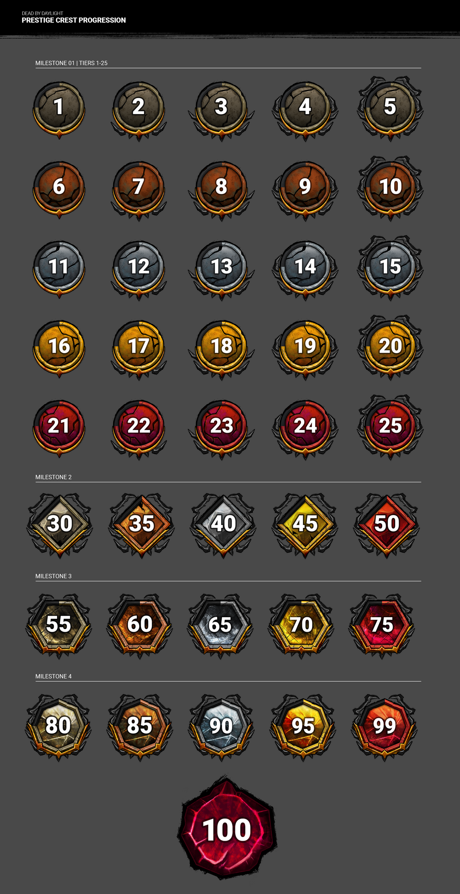

<!-- summary -->
## AI TL;DR

Mid-Chapter (post-6.1.0 PTB) overhauls progression: perks now unlock via prestige, Bloodpoint caps per category rise to 10 k (40 k per match), prestige cost drops to 20 k, total BP cap doubles to 2 M, and catch-up grants two bonus prestige levels up to prestige 9. Visuals are refined with purple-bordered perk charms, new prestige icons and animated scratch-mark portrait effects. Gameplay receives several perk tweaks—Endurance no longer bypasses Deep Wound, Spine Chill requires line of sight and shows a terror-radius icon, Dead Hard’s Endurance is trimmed to 0.5 s, Off the Record deactivates at powered gates, Overcharge regression is toned to 75-200 % speed, plus other minor perk adjustments. All changes launch with the Mid-Chapter later this month.
<!-- /summary -->

<!-- nav -->
&larr; [Developer Update | June 2022](337-developer-update-june-2022.md) · [Developer Updates](../index.md#developer-updates) · [Developer Update | August 2022](344-developer-update-august-2022.md) &rarr;
<!-- /nav -->

# Developer Update | July 2022

Late last month, we revealed possibly the largest balance patch in Dead by Daylight’s history along with an overhaul to the progression system. We’ve kept an extra close eye on feedback since these updates hit the Public Test Build (PTB) last week. In this special edition of the Developer Update, we’ll be covering all the changes we’ll be making to the Mid-Chapter following the 6.1.0 PTB.

If you haven’t already, be sure to check out our [June Developer Update](https://forum.deadbydaylight.com/en/kb/articles/337) for more information on what’s changing in the upcoming Mid-Chapter, or watch our [Mid-Chapter Preview Livestream](https://www.twitch.tv/videos/1515603799?t=00h04m51s).

## Progression

We’d like to start things off by talking about the overhauled progression system, in which perks are unlocked immediately through prestige rather than needing to be found in the bloodweb. While these changes make it far easier to collect the various perks on all your characters, we’ve received some feedback regarding the difficulty of obtaining add-ons. To remedy this, we’ll be making a few changes.

**First:** We have increased the Bloodpoint caps per category to 10,000 (from 8,000). By increasing these caps, you can potentially earn up to 40,000 Bloodpoints per match instead of 32,000, allowing you to purchase more nodes on the bloodweb. At the same time, this allows you to earn more points in a category before capping out, making matches where you’re pigeonholed into a certain role a little more rewarding.

**Second:** In a future update, we will revisit the rarity of Bloodweb nodes after prestiging. Currently resetting to level 1 also makes common quality nodes far more- well, *common*. If your favourite add-ons happen to be rare or very rare, prestiging may have made collecting them difficult. This change will make it easier to find a wider variety of add-ons, of both lower and higher rarities.

Beyond add-ons, we’ve also received some feedback on the cost of prestiging. In the PTB, the prestige node cost 50,000 Bloodpoints. While it may not sound like much, it could take several games to afford. We are reducing the cost of this node to 20,000 Bloodpoints to make progressing a little smoother.

Speaking of Bloodpoints, the 1,000,000 cap has long been a topic for discussion, and we felt this was a fitting time to revisit it. **We are raising the cap to 2,000,000 Bloodpoints.** As always, bonus Bloodpoints from things like login rewards, promocodes, or player support will exceed this cap.

Finally, we’ve made a tweak to our catch-up mechanic, which awards you bonus prestige levels based on your progress prior to this overhaul going live. This is based on the number of perk tiers you’ve unlocked on a character as well as their prestige.

In the PTB, we awarded one bonus prestige level for each prestige your characters had prior to the PTB. **For the full Mid-Chapter release, we have increased this to 2 bonus prestige levels.** This means if your character was prestige 3 before the update, they are guaranteed to be prestige 9 after the update, granting all the new rewards immediately. The catch-up mechanic will be limited to prestige 9, however, even if the calculated bonus would exceed this.

## Gameplay Changes

When changing base mechanics and close to 40 perks in a single update, some wacky interactions and powerful strategies are bound to appear. We went into the PTB hoping the community would experiment and abuse these changes to their fullest potential- and you did *not* disappoint! Thanks to your feedback on the PTB, we have a few changes in the works for the Mid-Chapter’s release.

**Endurance**

The Endurance effect has been a hot topic for discussion since the PTB went live. Historically this status effect has been used very sparingly, but with the advent of new ways to get the effect, some of you made it your personal mission to chain together as many Endurance effects as you could.

While this is technically working as designed, avoiding multiple hits in a row is not something that we want to see. As a result, the Endurance effect will no longer protect you from going down if you already have the Deep Wound status effect. This effectively limits the number of hits you can avoid with Endurance to 1 (until you mend your wounds), keeping it as a powerful effect than can be included on various perks while providing a hard limit to how powerful it can be.

As a note, you may still gain the Endurance status effect while you have Deep Wounds. This is intended: While it won’t prevent you from avoiding a hit, it will take effect if you’re able to mend your wounds while the effect is still active.

**Perks**

While we’re comfortable sending most of the updated perks to the Live version of the game, there were a few outliers in the PTB that we wanted to take a second look at before release.

As a reminder, the Public Test Builds typically do not have enough players for ranked matchmaking to work effectively. Therefore, everyone is paired together, regardless of their skill level. This can make it a little tricky to fine tune balance during a PTB. The changes below address some glaring issues spotted during the test, but they are by no means the only changes the updated perks may receive.

We’ll be closely monitoring the performance of each of the updated perks once they go live and making tweaks as needed. These tweaks would be made as soon as possible, not necessarily postponed until the next Mid-Chapter.

**Spine Chill** *now activates when the Killer has a clear line of sight to you.* After revealing this change, many voiced their concerns about how this would affect deaf & hard-of-hearing players who relied on Spine Chill as a replacement for the terror radius. While we don’t want accessibility to fall on perks, we also do not want to remove this aspect of the perk until we’re able to implement a more permanent solution. For release, we have added a visual indicator to Spine Chill’s icon that displays the terror radius’ strength.

In the future, we would like to revisit this and implement a permanent solution that does not require a perk. Only once this happens, the terror radius indicator will be removed from Spine Chill.

**Dead Hard** *now grants the Endurance status effect when activated instead of causing you to dash.* In the PTB, the duration of the status effect was set to 1 second. This gave Survivors a long window to dodge a hit when Dead Hard was used. For the Mid-Chapter’s release, we are reducing this to 0.5 seconds, requiring more precise timing to use effectively.

Balance aside, we’ve also seen some feedback on Dead Hard’s animation. The PTB version of Dead Hard uses a modified version of the original animation, but this isn’t ideal. In a future update, we’ll replace Dead Hard’s animation with a refined version designed to better match its new effect.

**Off the Record** *now grants Endurance in addition to its existing effects.* Some of you pointed out that like Decisive Strike, Off the Record could give Survivors a guaranteed escape once the gates are powered. As a result, this perk will deactivate and remove its effects once the gates are powered.

As mentioned earlier in this post, the Endurance effect will also no longer protect you from damage if you already have the Deep Wound status effect, making it very impractical to dodge subsequent hits. As with all Endurance effects, the effect is cancelled prematurely if you perform a Conspicuous Action.

**Overcharge** *now causes a generator’s regression to gradually speed up after you damage a generator, in addition to its existing effects.* On the PTB, this was set to grow from 100% speed to 400% speed over the course of 30 seconds. We found this to be a little extreme- especially when paired with Call of Brine- causing generators to quickly lose all their progress. This is particularly noticeable with solo Survivors who aren’t able to communicate that their nearly completed generator is regressing.

For the release, this is being toned down: The generator will start regressing at 75% speed and increase to 200% speed over the course of 30 seconds. If you’re curious, Overcharge becomes faster than the default regression after only 12 seconds. Overcharge can still be combined with Call of Brine to offset the reduced speed.

**Botany Knowledge** *increases your healing speed far more than before, but no longer provides Med-Kit efficiency.* While this change made the perk more appealing to the healers out there, it could be a little too powerful with Med-Kits. To remedy this, Botany Knowledge will receive a 20% efficiency penalty to Med-Kits. While this may sound minor, even a slight reduction to efficiency can cause Med-Kits to run out of charges before you can finish a heal.

**Distortion** *prevents your aura from being revealed to the Killer and can now be recharged by staying inside their terror radius.* As a small quality of life improvement, Distortion will now have an audio cue when a token is used. This will make the effects harder to miss.

**Iron Will** *now reduces your grunts of pain by 75% rather than making you silent, and no longer works while Exhausted.* We’ve seen some feedback concerning the volume of certain Survivors compared to others, causing this perk to be less effective on Survivors with louder grunts of pain. In a future update, we’ll be reviewing the volume levels of each Survivor’s grunts to ensure that each of them can make use of this perk.

**Inner Focus** was unchanged on the PTB, but it will be receiving a small tweak in time for the release. Currently Inner Focus allows you to see the scratch marks of other Survivors within 32m. We’re removing the range requirement entirely, letting those with a keen eye spot distant scratch marks too.

We’ll continue monitoring the updated perks once the Mid-Chapter goes live and readjust as needed.

## Visual Changes

The progression overhaul came paired with several new cosmetic details, including new charms and effects. Unfortunately, the feedback to some of these new elements in the PTB was less than stellar. We want these rewards to feel like a satisfying payoff for the effort they take to earn, so we’ve taken your feedback into consideration and iterated on each of them.

**Perk Charms**

Reaching prestige 7, 8, and 9 will each unlock one of that character’s unique perks as a charm, allowing you to showcase both your favourite perks and your dedication to your favourite characters. On the PTB, these charms had the perk’s icon on a red background. While these certainly stood out in a match, many felt they lacked the flair that such a reward should have.

Going forward, these charms will have a purple background like the actual Tier 3 perk and feature a golden border.

**Character Portrait Effect**

Those who reach prestige 3 prior to the progression overhaul will receive a special effect on their character’s portrait to commemorate their achievement. On the PTB, this effect appeared as yellow orbs drifting across their portrait. For the full release, this effect has been replaced entirely with animated scratch marks. Additionally, the effect will appear between the character and the background rather than on top of the character. As with on the PTB, you can disable this effect in the options menu if desired.

**Prestige Icons**

With prestige now extended all the way to 100, we unveiled some new icons to showcase your prestige level. This icon becomes more intricate and lavish the further you raise your prestige level. We’ve made some slight improvements following the PTB and added gold trim to all prestige icons, giving even the lowest prestiges some well-deserved flair.

With that, we’ve reached the end of this special edition of the Developer Update. The Mid-Chapter is expected to release later this month. As always, please be sure to share your feedback with us once you’ve had a chance to give these changes a try!

The Dead by Daylight team

<!-- nav -->
&larr; [Developer Update | June 2022](337-developer-update-june-2022.md) · [Developer Updates](../index.md#developer-updates) · [Developer Update | August 2022](344-developer-update-august-2022.md) &rarr;
<!-- /nav -->
