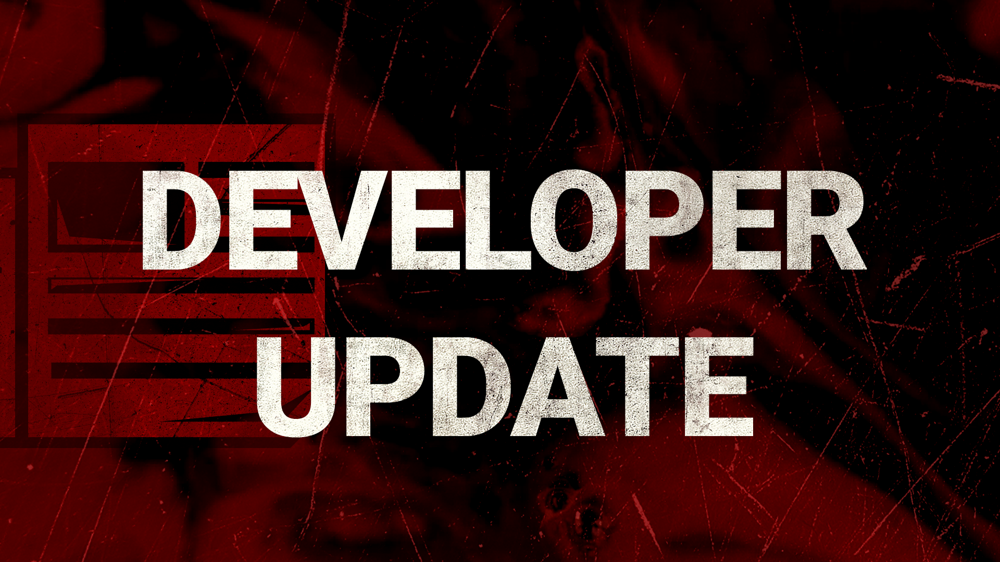
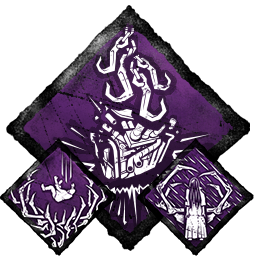

<!-- summary -->
## AI TL;DR

Thanatophobia receives a rework in the upcoming 6.1.2 update, scaling its action-speed penalty per injured survivor and adding a larger bonus when all four are down, while Mettle of Man is adjusted to behave like other Endurance perks, activating after two protection hits and breaking on conspicuous actions. Pain Resonance’s generator interruption is restored to stop a Merciless Storm combo, and Dead Man’s Switch duration is cut to 20/25/30 seconds. The Clown’s permanent Haste bug is fixed, making him playable again, and orange glyph challenges are temporarily swapped pending visual rework. Matchmaking Incentives, broken after the Mid-Chapter launch, will be fixed in the 6.2.0 PTB. The 6.1.2 patch ships this week.
<!-- /summary -->

<!-- nav -->
&larr; [Developer Update | July 2022](341-developer-update-july-2022.md) · [Developer Updates](../index.md#developer-updates) · [Developer Update | August 23, 2022](348-developer-update-august-23-2022.md) &rarr;
<!-- /nav -->

# Developer Update | August 2022

Earlier this month, we launched our largest balance patch to date, making changes to 40 perks- including the meta- and various base game mechanics. With such a major shake-up, we have been keeping an extra close eye on feedback and performance since the update released to ensure that nothing gets out of hand.

Now that we’ve had a chance to see how things play out, we have prepared our first follow-up round of changes to fine tune the balance. Please note that the tweaks listed here are by no means the only changes we may make: We’ll continue monitoring and adjusting things based on your feedback.

 

### Thanatophobia

Following the Mid-Chapter Update, Thanatophobia quickly rose in popularity, and it’s easy to see why. Between the increased numbers on the perk itself and the longer baseline generator repair times, Thanatophobia now slows down generators pretty significantly. Particularly with Killers who have an easier time keeping multiple Survivors injured (e.g. Legion, Plague, etc.), this could make Thanatophobia feel a little oppressive, especially when paired with other slowdown perks.

To address this, Thanatophobia will be receiving a rework in the 6.1.2 Update: *Each injured, dying, or hooked Survivor will now provide a 1/1.5/2% action speed penalty. If all four Survivors are either injured, dying, or hooked, Thanatophobia grants an additional 12% penalty to Survivors’ action speeds.*

This change will make Thanatophobia nearly as potent as before if all Survivors are injured but will require more effort on the Killer’s part to get full value.

### Mettle of Man

With the Endurance status effect updated, Mettle of Man continues to be an outlier. While it provides a similar effect to Endurance, the perk currently does not deactivate when performing a Conspicuous Action. This is by design, which is reflected in the perk’s description not mentioning Endurance: Since activating Mettle of Man is so difficult, it wouldn’t be fair to lose your hard-earned protection so easily. We wanted to clear up this inconsistency and give Mettle of Man a slight rework while we were at it.

*Taking 2 protection hits will now activate Mettle of Man, granting the Endurance status effect. While the Endurance effect is active, your aura will be revealed to the Killer when they are further than 12/14/16m away.* Like other Endurance effects, performing a Conspicuous Action will cause it to deactivate prematurely, and it will not protect you from entering the dying state if you already have Deep Wounds.

With this change, Mettle of Man will now work exactly like other Endurance perks, forcing the Survivor to make a choice between saving their Mettle of Man and working on generators. Since this will make it a little weaker, we have reduced the number of protection hits required to compensate. The aura reading effect is also active immediately rather than after you heal allowing the Killer to anticipate Mettle of Man and plan accordingly. We believe these changes will make the perk both easier to use and more interesting to play around.

### Pain Resonance, Merciless Storm & Dead Man’s Switch

Pain Resonance was changed such that it no longer forces Survivors to momentarily stop repairing the generator. This effectively prevented the perk from activating Dead Man’s Switch on its own; the Killer would need to chase them off of the generator manually.

However, this change caused an unexpected combination to appear. Since this new version allowed the Survivors to continue working on the generator, Merciless Storm would continue spawning an excessive amount of skill checks (nearly 40!) after the generator regresses.

To remedy this, we are restoring Pain Resonance’s generator interruption, though the Killer will still not receive a notification. This will cause Merciless Storm to no longer combo with Pain Resonance.

That said, this would bring back the combo of Pain Resonance and Dead Man’s Switch. Therefore, we’ll be reducing the duration of Dead Man’s Switch to 20/25/30 seconds in order to make the perk combo less oppressive than it previously was.

### The Clown

The Clown is currently affected by a bug which allows him to retain the Haste effect from his Afterpiece Antidote permanently. To prevent this from being exploited, we’ve recently kill switched The Clown, preventing him from being played.

In 6.1.2, this issue is now resolved, and The Clown will be available to play once again.

### Orange Glyphs

Tome 12: Discordance includes all-new orange glyph challenges. We’ve seen some reports of motion sickness caused by the swirling VFX after interacting with these glyphs. Alongside the 6.1.2 Update, we will be temporarily swapping out these glyph challenges for a different one while we retool the visuals. If you’ve already completed this challenge, don’t worry; the challenge will remain completed! The orange glyph is expected to return with improved effects in the following update.

### Matchmaking Incentives

Matchmaking Incentives reward you with additional Bloodpoints for playing whichever role is in demand at the time. When the Mid-Chapter launched, these incentives were not working as intended, granting 100% bonus Bloodpoints to Survivors at all times, including when there were more Survivors playing than Killers. This had an adverse effect on matchmaking: While Killer queue times were fairly quick, Survivor queue times skyrocketed. The system needed to be disabled after several hours.

We have investigated this issue and found the cause, but unfortunately it won’t make the deadline for the 6.1.2 Update. Matchmaking Incentives will be re-enabled on the 6.2.0 Public Test Build, then on the live version of the game if everything goes smoothly.

The 6.1.2 Update is currently planned to release this week. We’ll continue monitoring feedback on the Mid-Chapter changes and adjusting as necessary in future updates. As always, please be sure to share your thoughts once you’ve had a chance to give them a try. Until next time…

The Dead by Daylight team

<!-- nav -->
&larr; [Developer Update | July 2022](341-developer-update-july-2022.md) · [Developer Updates](../index.md#developer-updates) · [Developer Update | August 23, 2022](348-developer-update-august-23-2022.md) &rarr;
<!-- /nav -->
