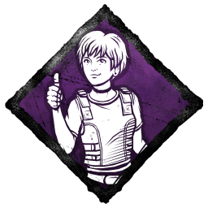

# Developer Update | August 23, 2022

We’re back with another Developer Update, a series of posts detailing all the changes coming to Dead by Daylight. In this edition, we’ll cover the balance changes from the 6.2.0 Public Test Build (PTB) and other various tweaks.

## Bloodweb Costs

Last month, we overhauled our progression system to make it easier than ever to earn Perks. Under this new system, Perks are now unlocked through Prestige and are immediately available to use on other characters without needing to be found in the Bloodweb. Higher tier versions of their Perks can be earned with subsequent Prestiges, or randomly throughout the Bloodweb.

Alongside these changes, we removed the Bloodpoint bonuses from two perks: Barbecue and Chili, and We’re Gonna Live Forever. As some of you have rightly pointed out, without these bonuses, you could afford fewer Bloodweb nodes per match making it harder to earn Items, Add-ons, and Offerings than before.

We want to remedy this as soon as possible. With the release of the Resident Evil: PROJECT W Chapter, we are reducing the cost of nodes in the Bloodweb by roughly 33%. See the chart below for a full cost breakdown.

You may be wondering, “Why not increase the Bloodpoints earned instead?” This is a good question, and one we took into consideration.

**First:** A 33% reduction in Bloodweb costs is effectively the same as increasing Bloodpoint earnings by 50% across the board. For example, 30,000 Bloodpoints can be exchanged for 15 common nodes when priced at 2,000 Bloodpoints each. At 3,000 Bloodpoints, you would need 45,000 Bloodpoints to get the same number of nodes.

**Second:** The reduction makes **all** Bloodpoints more valuable, not just those from matches. This means that even your Daily Rituals and Archive challenges have more purchasing power than before.

Ultimately, we found that reducing Bloodweb costs was the fairest option and provides the best value.

## Camping & Tunneling

In this past Mid-Chapter, we added 5 second Endurance & Haste effects to all unhooked Survivors. These status effects are designed to give the unhooked Survivor a fighting chance by allowing them to get to a nearby pallet or window if the Killer decides to chase them again.

We released this feature with safe numbers to ensure that things don’t get out of hand. Now that we’ve had some time to see how they play out, we feel comfortable increasing them further.

**In 6.2.0, we will be increasing the duration of the Haste & Endurance effects to 10 seconds. Additionally, we’ll be increasing the Haste effect to 10% increased speed (from 7%).**

We hope you’ll find these improvements to be much more effective in discouraging the Killer from chasing the same Survivor immediately after they’re unhooked.

## Mettle of Man

In a recent update, we released a new version of Mettle of Man which worked consistently with other Endurance effects. Many of you voiced concerns with this version of the perk being weaker than before, favouring a harder to earn effect that couldn’t be lost. Our intention with this change was never to make the perk weaker. Therefore, alongside the Chapter release, we will be reverting the recent update to Mettle of Man. Mettle of Man will instead grant a unique protection effect that is not cancelled by Conspicuous Actions like Endurance. To help differentiate them, this perk will no longer cause the Endurance status effect to appear in the HUD when activated.

## Post PTB Changes

The halls of the Racoon City Police Station were packed in this PTB. Whether you were hurling Survivors at literal breakneck speeds or being hurled, we want to thank you for taking the time to leave your feedback. We’ll be making a few changes in time for release. As always, these changes are by no means final: We’ll continue to monitor how everything performs and reassess once the dust has settled.

We’ll start with The Mastermind himself, Albert Wesker. One thing we noticed during this PTB was that the collision detection on The Mastermind’s rush was a little too sensitive, causing the Killer to bump into objects they shouldn’t have. For the release, we’ve toned this down so you don’t accidentally bump into obstacles as often.

We’ve also polished the way Virulent Bound interacts with pallets & windows. During the PTB, Survivors would not take damage if The Mastermind bounded towards them as they were vaulting. This was not intentional: The Mastermind will now hit them with his tentacles if they’re caught in the middle of a vault. Additionally, Survivors could wait on the other side of a pallet, vaulting back over it before The Mastermind could attack after vaulting. Going forward, standing too close to a vault location as The Mastermind bounds over it will result in the Survivor being injured.

Next, we’ve revisited his power in loops. We found his base movement speed between bounds to be a little slow, making it difficult to get into position for another bound. For the release, we have increased The Mastermind’s movement speed between bounds to 2.76m/s (from 2.3m/s)- the speed previously achieved by using The Loose Crank add-on. Since this add-on has been added the base kit, we have reduced its movement speed bonus to 8% (from 20%) to compensate for a new total of 2.98m/s.

One of the quirks of Virulent Bound is its ability to throw Survivors at each other, injuring both Survivors in the process. Often times, those unfortunate enough to have their friends flung at them would not even realize that they’d been injured. To make this more obvious, being injured from healthy from a Survivor thrown by The Mastermind will now cause Deep Wounds.

Last but not least, we’ve slightly toned down the Survivor collision detection of The Mastermind’s bound. We found this to be a little too generous on the PTB, allowing the Killer to grab Survivors that were not in front of him. This change will require a little more precision on the Killer’s part and make Virulent Bound feel fairer to Survivors.

On to perks: We’ve made a few tweaks to the new perks following the PTB. As always, we’ll continue to fine tune each of them as necessary once the update goes live.

**Reassurance:** This perk allows you to pause the hook progression of another Survivor, buying you and your team more time to work on generators if the Killer is camping. On the PTB, Reassurance had a 40 second cooldown and could be used repeatedly. When coordinated with other Survivors, this could have been abused to keep the hooked Survivor permanently on the hook, preventing them from being sacrificed against their will.

For the release, we have removed the cooldown of Reassurance. Instead, Reassurance can only be used once per hook instance. The effects of this perk can still be chained together if multiple Survivors are running Reassurance for a maximum delay of 90 seconds. This will keep the perk’s effects potent without being abusable.

**Awakened Awareness:** This perk grants the Killer aura reading while they are carrying a Survivor. On the PTB, this effect also lingered for 2 seconds after the carried Survivor is dropped, hooked, or wiggled free. This effect could be a little oppressive on certain Killers, especially when paired with Lethal Pursuer to extend the aura reading effect and Starstruck to make Survivors Exposed. For the release, we’ve removed the lingering aura reading from Awakened Awareness. As a result, Lethal Pursuer will no longer extend the duration of Awakened Awareness’ aura reading.

**Low Profile:** Low Profile hides your scratch marks and pools of blood when you become the last Survivor for 70/80/90 seconds. Unfortunately, this meant the perk would only activate once per match, and only if you happened to be the last Survivor standing. For the release, we have changed this to include any time you are the only Survivor who is not dying, hooked, or dead as well, allowing it to activate throughout the match. Additionally, Low Profile will also mask your grunt of pain in addition to its existing effects.

**Better Than New:**This perk granted any Survivor you healed a 6% action speed bonus to repairing, healing, chest opening, and totem cleansing for 25/30/35 seconds. We found the duration of this perk to be a little low to make much use out of the bonus speed. For release, we’ve made a few changes to this perk:

- Better Than New now grants a 12%/14%/16% action speed bonus to healing, chest opening, and totem cleansing & blessing.
- Better Than New no longer has a duration. Survivors instead keep this bonus until the next time they take damage.

We hope this will make it easier to get value out of Better Than New.

Finally, we come to the Racoon City Police Station. In this Chapter, the map has been split into two: The East Wing, and the West Wing. Each map includes the main hall and a small section of the opposite wing, greatly reducing its size compared to the original. We’ve also opened new pathways between various rooms to make the maps easier to navigate, as well as widening some hallways to make the make feel less claustrophobic and allow more interesting gameplay.

In the PTB, we found that there were too many pallets scattered around the Racoon City Police Station now that its size has been reduced. We’ve reduced the number of pallets on the newly renovated maps for when the Chapter releases.

With that, we’ve reached the end of this edition of the Developer Update. Everything we covered today will appear in alongside the release of Dead by Daylight: Resident Evil: PROJECT W Chapter in the coming weeks. As always, we look forward to hearing what you think once you’ve had a chance to try out the changes!

Until next time…

The Dead by Daylight team
