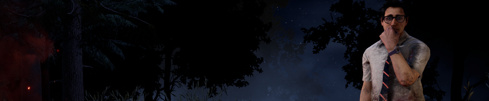
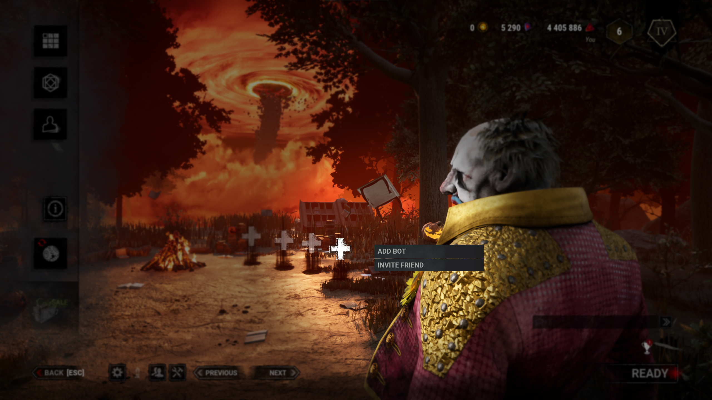
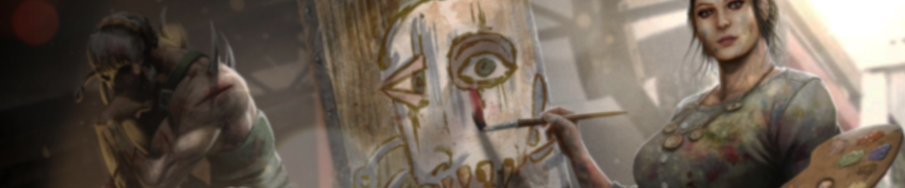
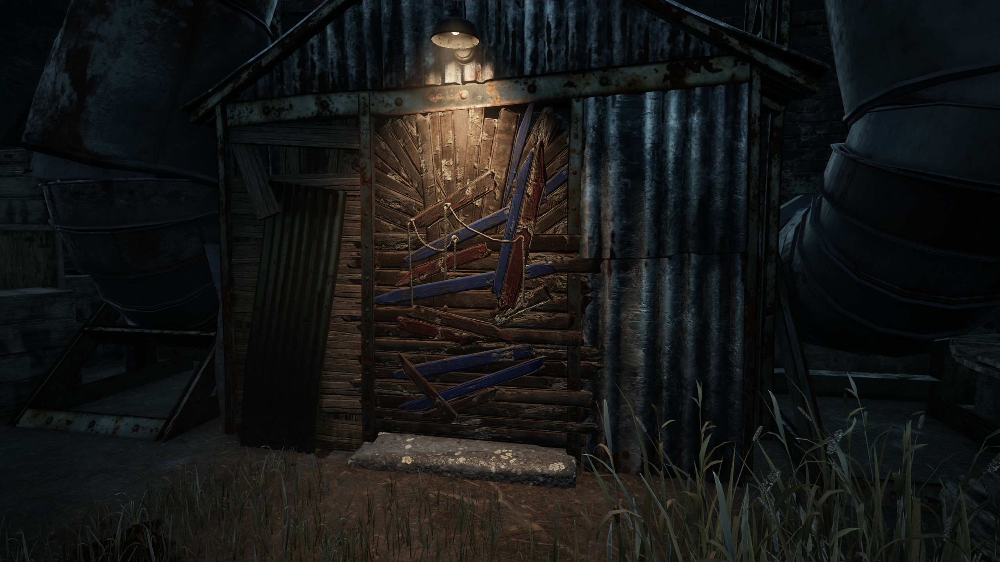
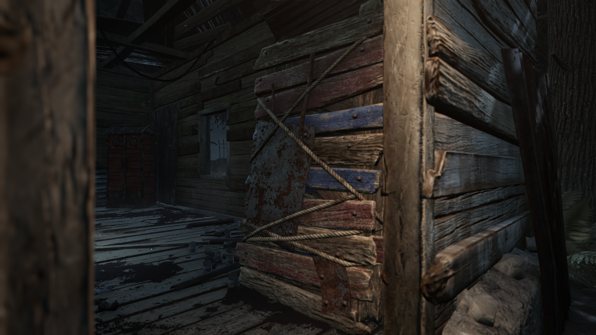
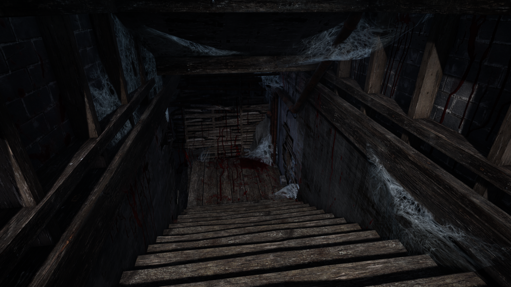
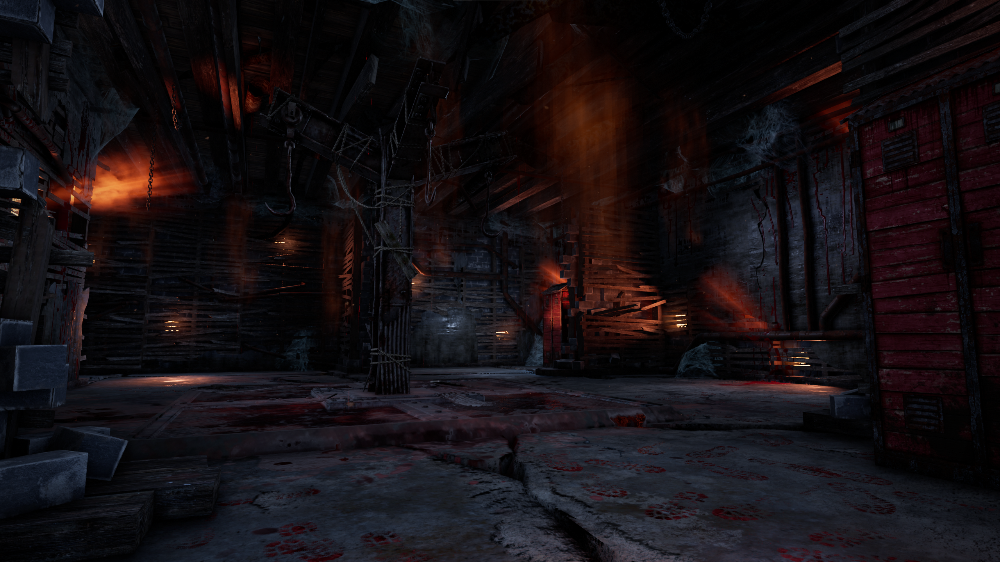
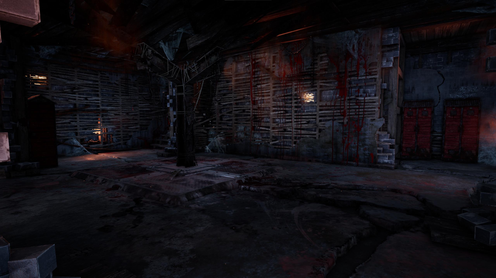

# Developer Update | October 2022

The final Developer Update of the year is here. In this series of posts, we discuss the biggest upcoming changes and provide updates on ongoing processes. This time, we’ll cover the various features and improvements coming with next month’s 6.4.0 Update.

## Bots in Custom Matches

Kicking things off, we have a much-anticipated feature that was first announced during our Anniversary Broadcast earlier this year. Whether you’re looking for a place to practice a new Killer before hopping into live games, or you just have an irrational hatred for bots that needs to be satiated, we’re happy to announce that bots will now be available in custom games.

Starting in 6.4.0, the host of a custom game can click the ‘+’ icon to add a random Survivor bot to the lobby. Don’t like the way that bot looked at you? The host can click their name and remove the bot at their discretion. You can face off against an entire lobby of robot Survivors, fill empty slots when playing with friends, or ignore them entirely and play with a partial lobby of human friends like before (but our future Robot Overlords *will* remember this).

While the first version of the feature focuses on Survivor bots, **we plan to include Killer bots in a future update** so you can practice *against* each Killer as well. This will take some time, however, since the AI needs to be trained to use each Killer’s power first.

Additionally, we have a few other improvements in store for this feature in the future, including the ability to select which characters you want by your side and their loadouts (though not all perks, items, and add-ons will be available to bots). If there’s something else that you really want to see, as always, let us know!

## Visual Improvements

Continuing our ongoing efforts to improve the graphics of Dead by Daylight, we have updated the visuals for breakable objects (pallets & breakable walls). Rather than making you read all about them, we figured we would show you. Take a look!

    

That’s not all the visual improvements we have in store. Check out the new basement! (Please excuse the mess, we weren’t expecting company.)

        

## Flashlight Adjustments

We recently updated flashlights to prevent them from being triggered too frequently to address concerns of epilepsy. While we were working on this change, we took the opportunity to revisit flashlights and plan some additional updates for them. In the 6.4.0 update, flashlights will receive two changes:

**1: Locker Blind Immunity**

Some lockers are positioned in such a way that a clever Survivor can blind the Killer as they are grabbing another Survivor out of it. While cool in theory, there’s not a whole lot the Killer can do to counter this: Even if they do chase away the other Survivor waiting with a flashlight, the Survivor in the locker can take advantage of the distraction to make a break for it.

*To prevent situations like this, Killers will receive blind immunity while grabbing a Survivor from a locker.*

**2: Flashlight Save Buffer**

A flashlight save can be a game changer, but they’re a little tricky to pull off. On top of getting into position for a save, the timing on flashlight saves is incredibly precise. You need to blind the Killer right as the pickup animation ends *but before* they can turn away. While experienced Survivors have mastered this timing, pulling off a save can feel off limits for a newer player.

*To address this, we are adding a short (0.25 second) buffer to the end of a Killer’s pickup animation.* If they are blinded during this window, they will be stunned and drop the Survivor as soon as the animation finishes.

## Matchmaking Improvements

Dead by Daylight is always changing, so it only makes sense for the matchmaking system to change with it. We are always keeping an eye on matchmaking and making small tweaks behind the scenes to strike a nice balance between wait times and match quality. In addition to this, we have some larger much-requested improvements on the way. Matchmaking is a very complex subject, so we’ll have a dedicated post going into detail on how exactly these new features work next week, but in the meantime, here’s what you can expect:

**Team Based Ratings**

With escapes being the win condition for Survivors, dying heroically to save your team can feel a little anti-climactic. We’re introducing Team Based Ratings to remedy this. Your rating will adjust based on not only your own performance, but the team’s performance as well. Sacrificing yourself to save the team won’t be nearly as punishing.

**Extended Breaks**

If you’re just coming back from an extended break, contending with rust on top of facing the same caliber of players as when you left can make things rough. To make returning from a break easier, your matchmaking rating will adjust quicker after your first few matches back. This will help you settle into a place where you’re more comfortable much quicker than before.

Both changes will be a part of the 6.4.0 Update, coming next month. Keep an eye out for a matchmaking blogpost for more details!

## An Update on Cheating

We recently shared a roadmap detailing our plans to combat cheating. In the weeks since, we’ve fixed a number of vulnerabilities to lessen the impact of cheats. Here’s a list of just some of the exploits we’ve prevented recently:

- Prevented cheaters from hooking themselves
- Prevented generators from being instantly powered
- Prevented cheaters from starting a match with 2 Killers
- Prevented cheaters from stacking duplicate Perks & Add-ons
- Prevented extended flashlight blind durations
- Reduced maximum length of matches to prevent extraordinarily long matches
- Added countermeasures to force the match to end after the End Game Collapse
- Added countermeasures to prevent player sniping
- Fixed an issue that could allow cheaters to crash the game
- We are now able to confirm that these fixes were effective and have limited the abilities of cheaters for the time being. We have already identified additional vulnerabilities and will roll out fixes over the coming weeks, but we can’t give details on these just yet to avoid giving cheat makers a heads up. We’ll share more on what we’ve been working on in our next update on cheating.

## Temporary Bans

Last but not least, we’d like to notify you about an update to our temporary ban policy. Temporary bans are used for minor infractions such as griefing, harassment, and unsportsmanlike conduct. *These are separate from matchmaking bans acquired from disconnecting from a match.*

To better discourage toxic behaviour, we are increasing the duration of our temporary bans across the board:

- First strike: 48 hours (was 24 hours)
- Second strike: 1 week (was 48 hours)
- Third strike: 1 month (was 1 week)
- Fourth strike: Permanent (unchanged)

Particularly bad or repeated behaviour may result in more than one strike if our support team deems it necessary. A list of bannable offenses can be found here: [https://support.deadbydaylight.com/hc/en-us/articles/4408581146516-What-actions-will-result-in-a-temporary-ban-](https://support.deadbydaylight.com/hc/en-us/articles/4408581146516-What-actions-will-result-in-a-temporary-ban-)

We want to make it very clear: Toxicity has no place in our game. We hope these increased durations will both discourage players from spreading toxicity in the first place, as well as give them more time to reflect on their behaviour afterwards. As a reminder, cheating will result in an immediate permanent ban.

And with that, we’ve reached the end of the final Developer Update of 2022- but don’t worry, we’ll keep in touch until these posts return. All of the changes mentioned here will be available in the 6.4.0 Public Test Build starting next week. If you get a chance to give them a try, please let us know what you think!

Until next time…

The Dead by Daylight team
