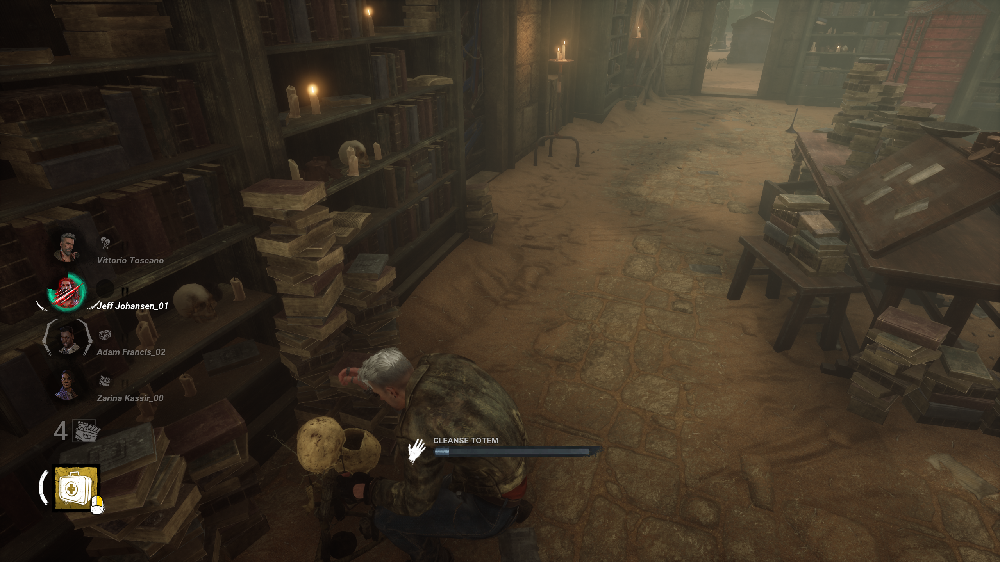
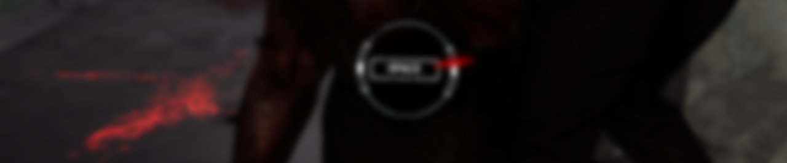
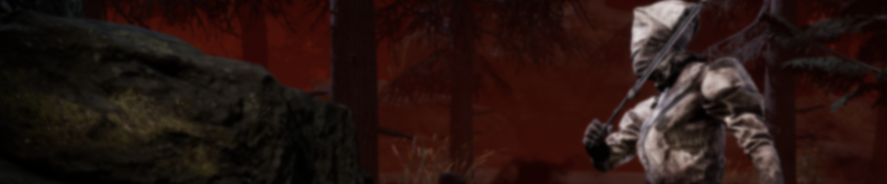
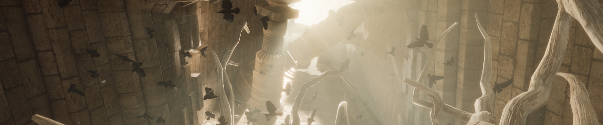
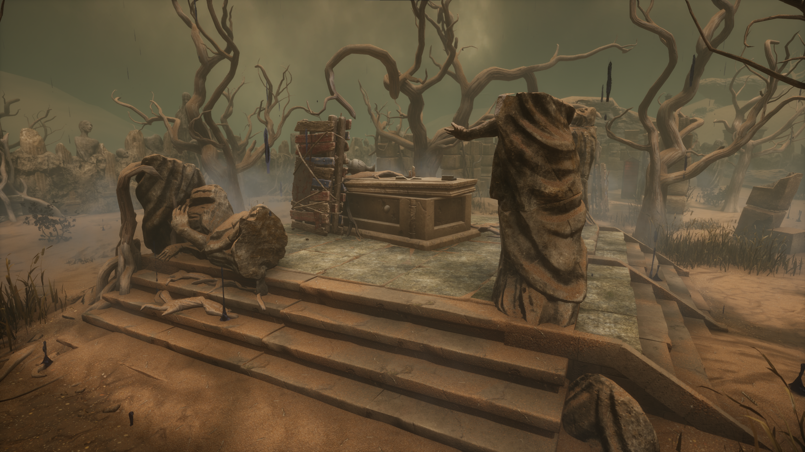
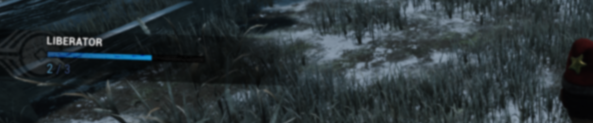
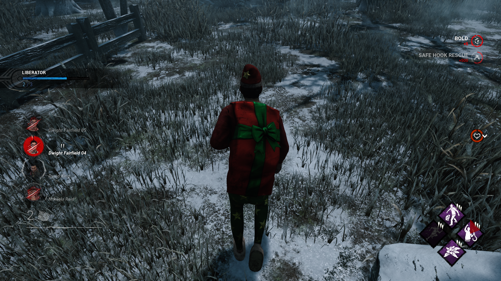
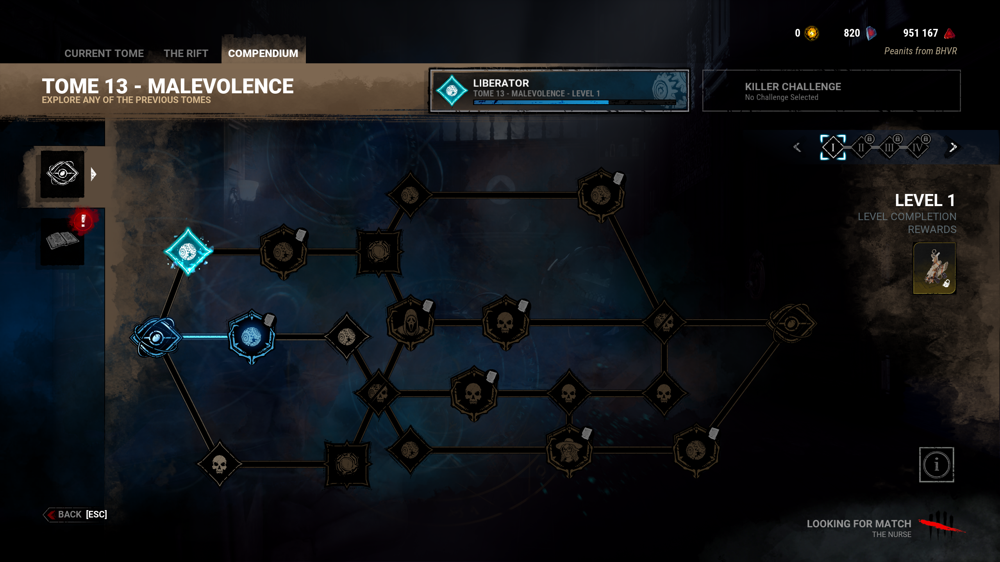
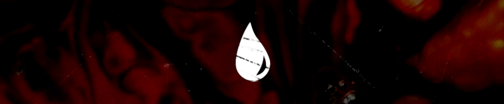
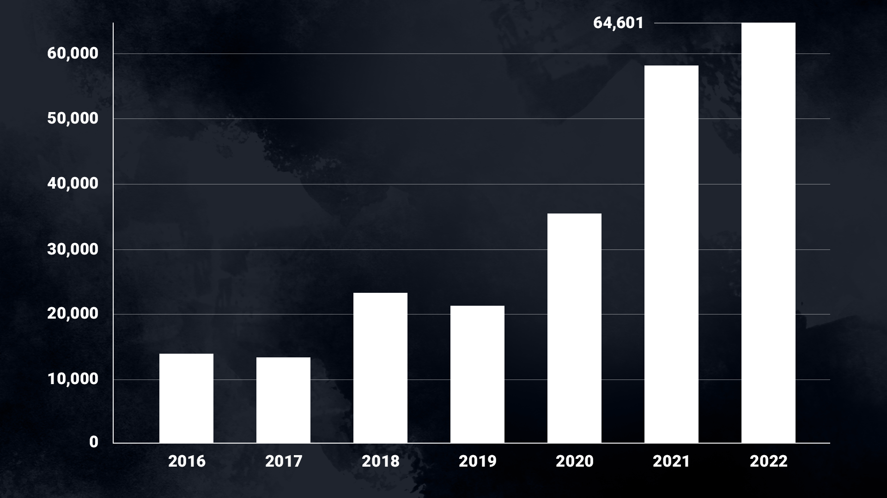

<!-- summary -->
## AI TL;DR

The 6.5.0 update adds a Survivor Activity HUD showing each survivor’s action, chase indicator and carry state to play. Wiggle leaves beta, removing the fast-wiggle bonus from great skill checks and adding quieter idle sounds. The Nurse’s blink attacks become special attacks and her add-ons are rebalanced. The Knight gains path speed bonuses and a 10-second patrol limit. The Eyrie of Crows map is reshaped into a square layout with moved maze tiles for killer balance.

A tracker shows progress, and the matchmaking screen lets you browse the archive, store and bloodpoints while queuing. Merciless Killer ratings switch to a tier based on kills. Iridescent Shard purchases expand to several more characters, releasing on all platforms after a PTB preview.
<!-- /summary -->

<!-- nav -->
&larr; [Developer Update | October 2022](363-developer-update-october-2022.md) · [Developer Updates](../index.md#developer-updates) · [Developer Update | Year 7 Roadmap Additions](372-developer-update-year-7-roadmap-additions.md) &rarr;
<!-- /nav -->

# Developer Update | January 2023

Happy New Year! The team is back from holidays, and we’ve brought a new Developer Update with us. In this series of posts, we cover all the biggest upcoming changes coming to Dead by Daylight. We have many quality of life improvements up our sleeves, so without further ado, let’s kick 2023 off with a bang.

## Survivor Activity HUD

It’s no secret that playing with friends may improve your odds of survival. Communication can at times make the difference between life and death. Solo Survivors need to work extra hard to keep up, often sacrificing perk slots for crucial information that could be easily shared between players in a call.

Last year, we shared an early design for a system that would help bridge the gap between solo Survivors and premade groups. The response to this idea was positive, so we’ve been ironing out the details and working on it behind the scenes since. We’re happy to say that this system will be debuting in the 6.5.0 update.

Each Survivor will now display their current action next to their portrait. These actions include:

- Repairing a Generator
- Opening an Exit Gate
- Healing, Mending & Recovering
- Cleansing & Blessing a Totem
- Searching a Chest
- Killer specific actions (e.g. Snapping out of it, waking up a Survivor, etc.)

This not only gives you vital information to plan your next move, but also gives you some visibility on what your teammates are doing to build camaraderie between you and your fellow Survivors. These actions are only visible among Survivors: Killers won’t be told what you’re doing at all times.

Beyond actions, we have added a new indicator to signify that a Survivor is in a chase. Previously it was only possible to tell when the Obsession was being chased due to the twitching icon. Going forward, any Survivor that is being chased will have a small set of Entity claws surrounding their portrait. Meanwhile the Obsession will always have a larger set of Entity claws around their portrait, keeping the effect visually similar. Unlike your current activity, the Killer also sees who they are chasing, making it possible to distinguish two similarly dressed Survivors.

Finally, we’ve added a new health state to show when a Survivor is being carried by the Killer. Previously the carried Survivor would be shown in the dying state, but this could be confusing for newer players who were looking for the aura of a dying teammate.

**Why these actions?**

The goal with this feature is solely to bridge the gap between solo Survivors and premade groups. All this information can be easily conveyed between friends in a call, but not between solo Survivors (without the use of perks). Therefore, this information will not make a coordinated group any stronger than before.

We specifically want to avoid anything that could give already coordinated groups an advantage, such as showing a Survivor’s exact location. Due to the procedural nature of Dead by Daylight maps, callouts like these can be hazy at times, so pinpointing an exact location could give even premade groups an advantage.

We hope you’ll find this decision to be the fairest option for bridging the gap, and we will be closely monitoring the impact this change has on solo Survivors, premade groups, and overall gameplay. We look forward to hearing from you all once you’ve had a chance to try it out!

## Updated Wiggle Mechanics

The updated wiggle system was the first feature to appear in the beta tab last year. Since its introduction, we’ve collected feedback from countless games and around the internet. Roughly 83% of players are currently opted into the wiggle beta.

The time has come for this system to be officially integrated into the game, and as a result, the wiggle beta will disappear from the betas tab in the 6.5.0 update. There’s a couple changes that will be made before this goes live.

**First:** We are removing faster wiggle progression from great skill checks. Hitting all great skill checks could shave off a whole second. While this sounds small, it can be the difference between wiggling free and getting hooked. Rather than increasing wiggle speed, great skill checks will instead increase the amount the Killer sways while carrying you by 20%. Great skill check success zones have also been increased in size since they are now less impactful. Good skill checks, on the other hand, still bump the Killer, but 50% less than was previously normal.

**Second:** We have added a new sound for non-attempts (i.e. not attempting to hit a skill check at all). Previously, this would play the missed skill check sound, which can be a little intense when played over and over if you’ve decided not to wiggle. This new sound will be much more subtle.

**Third:** We have cleaned up the new system’s interaction with Decisive Strike. Previously, wiggle skill checks would start immediately after the Decisive Strike skill check. This caught a lot of people off guard and caused some confusion. There is now a short (0.5 second) delay after the Decisive Strike skill check before wiggle skill checks appear. You’ll be credited a small amount of wiggle progress to make up for the added delay before these skill checks appear.

## The Nurse

In the right hands, The Nurse can no doubt be the strongest Killer in the game. Though she has a steep learning curve, not much can stand between a good Nurse and the Survivor she’s trying to kill (not even walls). Although it’s been a while since we’ve made any major changes to her, The Nurse has steadily grown in power thanks to the introduction of new perks, making already strong playstyles even stronger. This in large part comes down to the fact that her attacks are considered **basic attacks**, meaning they can benefit from a wide variety of perks.

Since The Nurse can be threatening enough on her own, we’ve decided that it’s time to make her blink attacks **special attacks.** This means they will no longer activate basic attack perks such as Starstruck, Hex: No One Escapes Death, and so on.

Next, we’ve added a new sound cue when The Nurse has fully regenerated all her blink charges. This way, you’ll know when you’re ready to blink again without having to keep an eye on the corner of your screen.

Beyond that, we took some time to revisit The Nurse’s add-ons to add new effects and bring the strongest and weakest of the bunch closer in line with the rest. Notably any add-on that increases The Nurse’s maximum blink range has been replaced with a completely new effect. Here’s a sneak peek at what’s to come:

**“Bad Man’s” Last Breath**

After hitting a Survivor with a blink attack, The Nurse becomes Undetectable for 25 seconds. This effect can only be triggered once every 45 seconds.

**Jenner’s Last Breath**

Once all blinks have been exhausted, The Nurse may teleport back to her original position. Once she returns to her original position, all blink charges are restored.

The full details for the changed add-ons can be found in the patch notes once the update goes live, but you can also expect changes for the following:

- Catatonic Boy’s Treasure
- Dark Cincture
- Heavy Panting
- Ataxic Respiration
- Fragile Wheeze
- Campbell’s Last Breath
- Kavanaugh’s Last Breath
- Torn Bookmark
- Matchbox

Spasmodic Breath will also receive new audio and visual feedback to make it clearer when its effects are active.

## The Knight

The Knight and his guards have been patrolling the realm for a little over a month now, and we’ve been combing through your feedback all the while. One recurring piece of feedback we’ve received is about how The Knight’s power is best used in loops rather than over longer distances. While this is a totally valid way to use his power, we’d also like to make it more appealing to use your power in different ways. We’ve made a few changes aiming to make longer paths more powerful.

First, the orb Survivors see when the Killer is creating a path will shrink with distance, disappearing completely when the path is longer than 10 meters. This will make it more difficult for Survivors to avoid a guard before they become active, though the Killer will still need to predict where the Survivor will go.

Second, after creating a path longer than 10 meters, The Knight will gain the Haste Status Effect for a few seconds. The longer the path, the longer the movement speed bonus will last. This aims to help the Killer catch up after using his power.

Third, guards will move to the position they spotted a Survivor and begin chasing faster depending on the length of the patrol path. Like the Haste, only paths longer than 10 meters will benefit from this.

Beyond promoting longer paths, we’ve increased the instant generator regression from guards to 5% (compared to the default 2.5%). Guards will not activate generator damaging perks, however, so use them wisely!

Lastly, we have the admire the… creative ways some of you have used The Knight’s power. Rather than locking down an area or aggressively chasing Survivors, some of you have discovered that you can start drawing a path and not move to hide your terror radius- particularly near a hook Survivor. While the efficiency of doing this is debatable, it doesn’t exactly suit his playstyle, so we’ve added a 10 second limit to his patrol path creation. This gives enough time to not affect a typical path, but it will put a hard limit on how long you can stay still and hide your terror radius.

## Eyrie of Crows

Last year, the Forsaken Boneyard appeared in The Entity’s Realm alongside the Portrait of a Murder Chapter. You’ve given us a lot of feedback on this surreal landscape, and we’ve prepared some gameplay adjustments for the Eyrie of Crows which will launch in this upcoming patch.

Many players reported that the map felt Survivor-sided, and this is something we can back up looking at our data. To remedy this, the map will be changing shapes: Rather than a long rectangle, the map will be roughly square, allowing Killers to patrol generators more easily. This change in shape also reduces the overall size of the map slightly.

Additionally, maze tiles (stronger tiles made up of tall walls) have been moved away from the main building and shack, making it harder to combine them into stronger loops.

Last but certainly not least, several new tiles have been added to the map. Multiple existing tiles have had new foliage added in strategic places to allow trapping Killers to better hide their traps. Keep an eye out as you explore!

We hope you’ll find the new Eyrie of Crows to be a much more even experience for both sides.

## In-Game Challenge Tracker

We’ve all been there. You’re not quite sure if you finished your challenge or not. You spend the rest of the match questioning, “Was that 5 Totems, or 4?” Doubt starts to creep in, but you lie to yourself and say, “No. It was 5.” Then the match ends and you find yourself just shy of the goal.

Never again: We are adding a challenge tracker during the match. This widget will appear at set intervals as you make progress on an active challenge. You can choose to toggle between two settings that will indicate progression on a challenge, as well as its completion. No more guessing!

If you’d prefer to keep your screen clear, this widget can be switched off in the Options menu.

    

## Gameflow Improvements

Speaking of challenges, if you’ve ever queued up for a match before realizing that you didn’t have a challenge selected, you’ll know that you’re faced with two choices: Keep queuing and play the next match without a challenge, or back out and select one.

Starting in 6.5.0, this is a thing of the past: You can now browse the Archives and the Store while searching for a match. The “Searching for Match” indicator will stay in the bottom right corner of the screen as you browse. You’ll also be able to spend Bloodpoints in the Bloodweb as you wait!

New for our Killers players, you’ll also be able to customize your non-selected Killers while you wait for a match to start. Note: the Killer you will enter the match with will be the Killer you started your search with. As always, returning to the main menu will automatically cancel your search or exit your group, as it always did.

Whether you forgot something or you just love clicking around while you wait, we hope you’ll enjoy having more freedom while searching!

    

## Merciless Killer

Finally, we have a small update to Merciless Killer ratings. These ratings are currently tied to the grades system, where a double pip earns you a Merciless Killer result and the corresponding adept Killer achievement/trophy. Unfortunately, this means that as your grade increases, it becomes harder to earn these achievements. Since the emblem system has transitioned to a monthly ladder, it no longer makes as much sense for match results to be based on them.

**To clean things up, the result you get after a match will now be tied directly to kills.**

- 0 Kills: The Entity Hungers…
- 1-2 Kills: Brutal Killer
- 3 Kills: Ruthless Killer
- 4 Kills: Merciless Killer

With this change, the requirement for a Merciless Killer rating is much clearer and remains the same regardless of your grade. This will also make Killer adept achievements a similar level of difficulty to their Survivor counterparts.

## Iridescent Shard Prices

A few months back, we announced that all non-licensed outfits would receive an option to purchase with Iridescent Shards roughly a month after they first appear in the store.

By extension, existing outfits will also receive Iridescent Shard options, but this is being done in batches of a few characters at a time. So far, we’ve added this option to outfits for The Trapper, The Wraith, The Hillbilly, The Nurse, The Huntress, The Doctor, The Hag, Dwight, Claudette, Meg, Jake, Nea, and David King.

We can reveal that the next characters to get this treatment will be The Clown, The Spirit, Ace Visconti, and Feng Min. You can expect the Iridescent Shard prices to appear around the time the update releases on all platforms (not the PTB!).

## An Update on Cheating

Now that 2022 is behind us, we wanted to leave you with a chart showing the number of cheaters banned each year since Dead by Daylight was released.

The team is still hard at work finding and patching new vulnerabilities, and we hope to share more information with you soon!

With that, we’ve reached the end of the first Developer Update of the year. Everything we shared in this post will be available in the Public Test Build starting **tomorrow** and are planned to be released on all platforms later this month. Be sure to let us know what you think once you’ve had a chance to try them out!

Until next time…

The Dead by Daylight team

<!-- nav -->
&larr; [Developer Update | October 2022](363-developer-update-october-2022.md) · [Developer Updates](../index.md#developer-updates) · [Developer Update | Year 7 Roadmap Additions](372-developer-update-year-7-roadmap-additions.md) &rarr;
<!-- /nav -->
