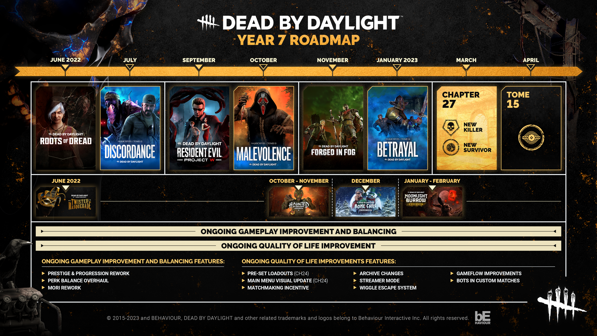
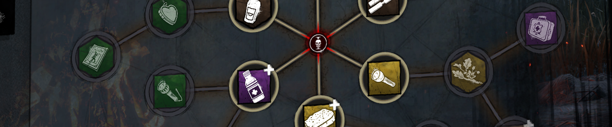
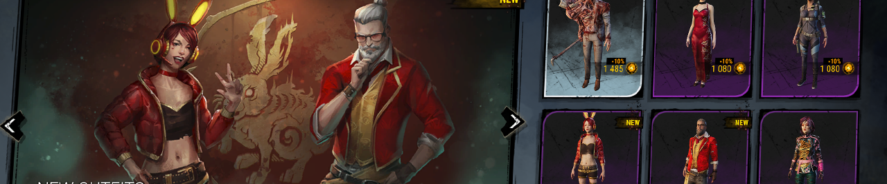

<!-- summary -->
## AI TL;DR

The Year 7 roadmap now outlines several upcoming systems: streamlined Bloodweb spending, expanded Survivor bot loadouts with custom perk sets, a map-repeat-prevention mechanic, visual terror-radius cues for accessibility, a visual refresh of the remaining Realm Beyond map, a renewed cadence of perk balance updates, and a new limited-time cosmetic rotation purchasable with Auric Cells. These initiatives follow the July perk overhaul, September Finishing Mori PTB, December bots in custom matches and team-based ratings, and the January rollout of the wiggle system, queue improvements, archive-challenge tracking and Survivor Activity HUD. All listed features are slated for release over the next few months via multiple updates, with details to be revealed as each approaches.
<!-- /summary -->

<!-- nav -->
&larr; [Developer Update | January 2023](369-developer-update-january-2023.md) · [Developer Updates](../index.md#developer-updates) · [Developer Update | February 2023](375-developer-update-february-2023.md) &rarr;
<!-- /nav -->

# Developer Update | Year 7 Roadmap Additions

It’s hard to believe that it’s already been 8 months since our last Anniversary Broadcast, yet January somehow managed to sneak up on us. During that broadcast, we shared a roadmap detailing some of the features we would introduce over the following year, many of which have already become a reality. Our next anniversary is still several months away, so today, we’re happy to announce even more exciting additions to our Year 7 Roadmap!

But first, a look back at the roadmap itself.

Kicking things off in July, we released one of the largest updates to date. This update rebalanced around 40 perks and completely overhauled the game’s progression system. Further progression and balance changes would be made throughout the year. Matchmaking Incentives were also introduced to help alleviate long queue times and provide a new avenue to earn Bloodpoints.

In September, an early preview of the Finishing Mori system was tested on the Public Test Build (PTB). This new mechanic brought trials to a gruesome end, allowing Killers to finish off the final Survivor with style. We collected plenty of feedback throughout this test, and the team is hard at work implementing it.

December, meanwhile, brought Bots in Custom Matches, letting you practice in a no-stakes setting to your heart’s content. Not to be forgotten, we also introduced the much-requested Team Based Ratings to the matchmaking system thanks to your feedback.

Before we knew it, January was upon us. The wiggle system was officially taken out of beta and fully implemented with some tweaks. We also improved the queuing experience, allowing you to browse various menus while waiting for a match. Archive challenges could now be tracked during a match, letting you know when you’ve completed your selected challenge(s). And with that… we’d reached the end of the roadmap, leaving us free to work on exciting new things. The January update also featured the much-anticipated Survivor Activity HUD, something that was not originally on the roadmap.

But the question is, what’s next? As always, we’ll share our plans for the next year during our anniversary, but there’s still a few months before then, so let’s dig into a few more exciting features you can expect in the coming months.

## Bloodweb Improvements

If you went back in time one year and told people that “too many Bloodpoints” would be an issue, nobody would have believed you. Yet here we are. With the various improvements made to progression over the past year, many of you have  found yourself with a surplus of Bloodpoints and not enough time to spend them, making the spending process a bit of an inconvenience.

Within the next few months, we’ll be making improvements to the Bloodweb to make it easier and faster to spend your Bloodpoints than ever before.

## Survivor Bot Loadouts

Survivor bots received a very warm welcome when they debuted late last year. Though the Survivor Bots are robots, we’re sure their cold mechanical hearts were touched. Since then, an average of 70,000 bot matches have been played *each day*. This feature made it easy to jump in and try out the new content in the Forged in Fog Chapter when it released, a time where Killer queue times tend to be longer as everyone flocks to try out the newest addition to the roster.

The first version of Bots in Custom Matches was fairly simple, but we’ll be expanding on the feature shortly with loadouts, allowing you to introduce more variety in the Survivor bots you face. Please note that not all perks will be available to bots: Some perks will ultimately be too complicated for them to use effectively, and we’d hate to make them too smart and be the cause of the robot uprising.

## Map Repeat Prevention

Variety is the spice of life and Dead by Daylight is no exception. With so many maps in the game, it can feel a little underwhelming when The Entity decides to send you to the Groaning Storehouse for the sixth time today. Even if it’s your favourite map, eventually you’ll want a breath of fresh air.

Soon, we’ll introduce a new mechanic which guarantees that you won’t be sent to the same map twice in a row. The odds of being sent to the same map will also be decreased (yet still possible) for the next few matches.

## Visual Terror Radius

This past year, we’ve been working hard to make Dead by Daylight more accessible to a wider audience. For those who are deaf or hard of hearing, the terror radius can be difficult or even impossible to keep track of despite being a crucial part of the game.

To remedy this, we’ll be introducing new accessibility options which, when enabled, will provide a visual representation of terror radius.

## Visual Update

The Realm Beyond continues! We’re in the process of visually updating one of our older realms. By now, you probably know what to expect, so we’ll save the teasers for when this update is a little closer. That said, there aren’t many realms left to update, so you’ve got a pretty good chance of guessing which one it is.

## Perk Updates

We’ve put a lot of focus on general improvements and quality of life features as of late, but we’re pleased to say that perk balancing is going to pick back up shortly. Like before, we’re hoping to include a small package of perk changes with each Mid-Chapter Update going forward. We’ll share more details as these perk changes are closer to release, but since we know what you’re about to ask, yes, one of the perks we’re looking into do rhyme with Shmeruption.

## Limited Time Cosmetics

For recent events, some of the more festive and spooky outfits we’ve debuted have only appeared for a limited time before returning to the vault, taking some holiday themed cosmetics from past years with them. We never had an opportunity to announce these cosmetics, so we’d like to take a moment to discuss how they will work moving forward.

As the game has grown, hundreds of outfits have been added to the store. Where one outfit used to be a major addition, these days it is just one of many to choose from. By vaulting these holiday themed cosmetics, we hope to simplify the store and make these seasonal offerings more meaningful when they return each year. (Do not fear: We guarantee they will return!)

We know many of you don’t want to miss your opportunity to get these outfits, so we want to clarify how these limited time cosmetics will work. New limited time cosmetics will be available for purchase with Auric Cells. When the event period ends, these outfits will be vaulted (removed from the store) until they return the following year. The next time they return, they will be available with both Auric Cells and Iridescent Shards (excluding licensed characters).

For the sake of transparency, here is a complete list of all the seasonal collections to date which will be available for a limited time. We hope this list gives you a better idea of what to expect and allows you to plan around it.

Spoiler

**Halloween:**

Tricks and Treats

Midnight Grove

Halloween 2021

Future Halloween Collections

**Winter:**

Ugly Sweater Collection

Deck the Trials

Bone Chill

Holiday Horror

Winter Tales

Cozy Break

Future holiday collections

**Lunar New Year:**

Lurking Stripes

Gilded Stampede

Scarlet Swarm

Moonrise

Moonlight Burrow

Future LNY collections

These new additions to the roadmap will be releasing as part of multiple updates over the next few months. As is tradition, we’ll go into more details regarding each one when they’re closer to release. Before we sign off, we want to take a moment to thank you for diligently providing feedback over this past year. You have helped shape these additions to our Year 7 Roadmap, and will no doubt impact the plans for years to come.

Until next time…

The Dead by Daylight team

<!-- nav -->
&larr; [Developer Update | January 2023](369-developer-update-january-2023.md) · [Developer Updates](../index.md#developer-updates) · [Developer Update | February 2023](375-developer-update-february-2023.md) &rarr;
<!-- /nav -->
