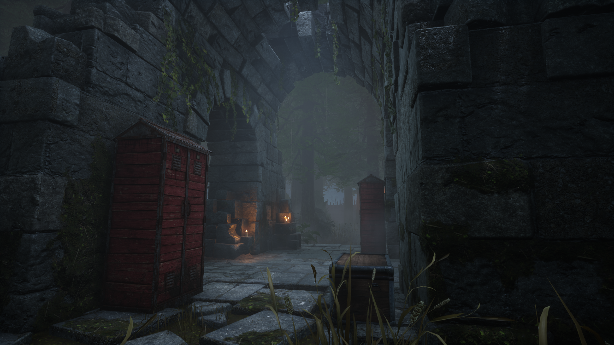
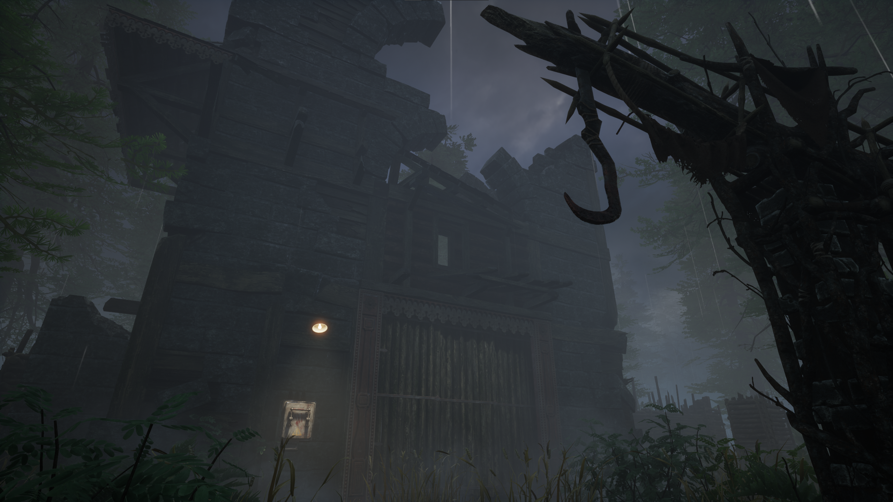
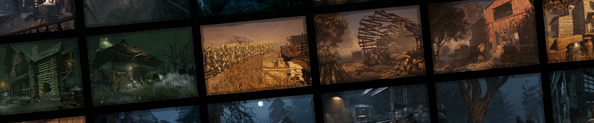
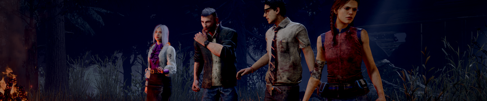
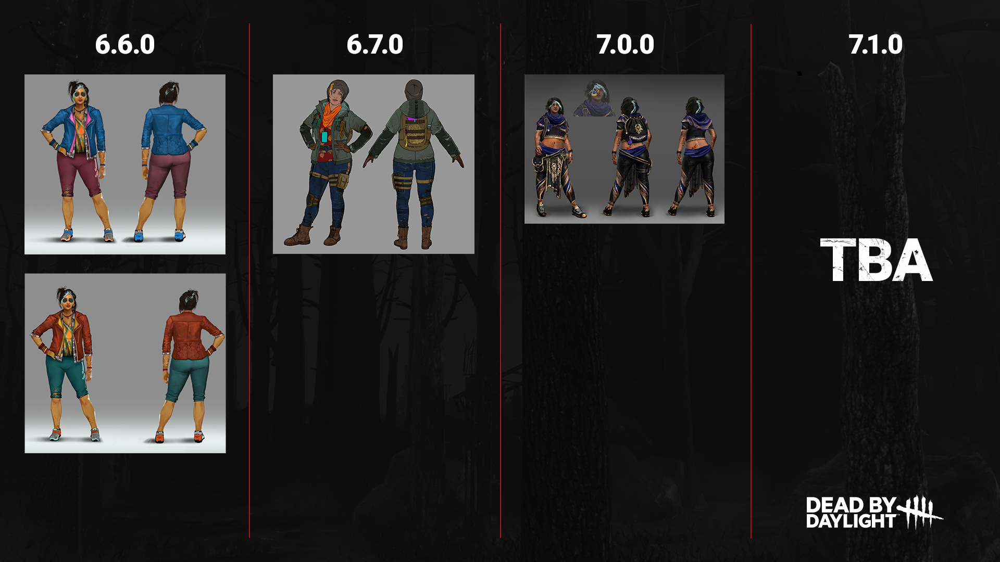

<!-- summary -->
## AI TL;DR

Red Forest receives a visual overhaul, preserving its rainy feel and lore details, while a new Map Repeat Prevention system stops consecutive map repeats unless an offering is used. Survivor bots in custom matches now allow full loadout editing and gain extensive AI upgrades—better navigation, aggressive rescues, totem hunting, audio cue reactions, and power-specific behaviors. Perk tweaks include Eruption losing only current generator progress and revealing a survivor’s aura instead of incapacitating, and Any Means Necessary losing its cooldown to reset unbroken pallets. The studio also announced expanded outfit production capacity and a strengthened anti-cheat team; most of these changes enter the Public Test Build next week.
<!-- /summary -->

<!-- nav -->
&larr; [Developer Update | Year 7 Roadmap Additions](372-developer-update-year-7-roadmap-additions.md) · [Developer Updates](../index.md#developer-updates) · [Developer Update | Tools of Torment PTB](377-developer-update-tools-of-torment-ptb.md) &rarr;
<!-- /nav -->

# Developer Update | February 2023

It’s about that time for another Developer Update, the series of posts where we discuss upcoming changes making their way to Dead by Daylight. This time, we’ll go through some notable changes happening in the next update alongside a brand-new Chapter and beyond!

## Red Forest Visual Update

Over the past few years, various realms have gradually received facelifts. This process- which we named The Realm Beyond- has us revisit older maps and bring their visuals up to modern standards. We’ve already updated the majority of maps, and today, we turn our focus to the classic Red Forest.

Home to both The Huntress and The Plague, the Red Forest debuted nearly six years ago. This visual update maintains the iconic rainy climate of the original maps as well as the small details and nods to their respective Killers’ lore.

They say a picture’s worth a thousand words, so rather than having you read a few thousand words, take a look at these previews!

    

## Map Repeat Prevention

Speaking of maps, many of you can probably single out a favourite; a map that you’re always excited to see. But with so many maps to choose from, you *probably* don’t want to play the same map several times in a row even if it happens to be your favourite. Variety is the spice of life, and variety in Dead by Daylight is no exception.

No longer will you need to resort to map Offerings in a plea to The Entity to stop sending you to Fractured Cowshed: Map Repeat Prevention is here!

This new feature eliminates the possibility of playing the same map twice so long as a map Offering is not used. The same goes for any other players in your trial: If each person played a different map in their last match, none of those maps will be chosen. Furthermore, the chance for these maps to be chosen will also be reduced for the next few matches, steadily returning to their usual odds.

We hope you enjoy seeing a wider variety of maps as you play!

## Bot Loadouts & Improvements

We recently introduced Survivor bots to custom matches, allowing you and your friends to fill the remaining spots with robot allies, or just practice a new Killer against an entire lobby of bots. We were thrilled to see such an enthusiastic response to this feature from the community. Since then, we’ve been working hard on improvements to the Survivor bots and their AI, and as such, you’ll notice a few changes in the next update.

First, we’ve added the ability to customize a Survivor bot’s loadout. Once you’ve added a bot to the lobby, simply click their name and you’ll find a new edit button. Here, you can customize the bot’s Perks, Item, Offering, and even which Survivor you’d like them to be. We’ve also taught the bots to use most –but not all– of the perks, so go wild and test out various combinations!

Second, we’ve made a large number of improvements to the Survivor AI. Some of these improvements are smaller than others, but here are just some of the more noteworthy tweaks:

- Improved navigation in some areas, preventing bots from getting stuck in some places or attempting to loop something that they shouldn’t.
- Bots are now more bold when it comes to unhooking their fellow Survivors. Though they prefer to go for the save when it’s safe, they will now attempt an unsafe rescue as a last resort.
- Bots will now actively attempt to seek out Totems when using Totem hunting perks such as Small Game or Counterforce.
- Bots will now react to some audio queues (e.g. The Wraith’s bell). Previously, they would only respond to the Terror Radius.
- Bots have learned to better respond to certain Killer powers. For example, they will now crouch near The Hag’s Traps and disarm Bear Traps.
- Bots will now attempt to break line of sights in a loop while a ranged Killer is aiming at them.
- And many, many more!

Bots are by no means meant to replace a real person, but we hope these improvements will make them a slightly more realistic practice buddy.

## Perk Changes

Although we typically save perk changes for our Mid-Chapter Updates, we had a little room in this Chapter to squeeze in a few perk tweaks. We are in the midst of planning another package of perk changes for the next major update.

**Eruption**

Eruption has been a hot topic as of late, and for good reason. This perk was updated in our meta shake up last year and has steadily grown in usage ever since. These days, it has solidified its spot in the new meta.

Many of you have raised concerns surrounding how the perk disproportionally affects solo players. Since solo players cannot warn their teammates when they are about to go down, their teammates cannot stop working on the generator to avoid the Incapacitated effect. This made Eruption very powerful: Not only would it immediately lose 10% of its progress, but it would continue to regress until the Incapacitated effect wore off.

This made Eruption a very clear choice for any loadout, not only regressing generators, but also preventing further repairs from being done. To bring Eruption more in line with other generator perks, we have made a few changes.

First, Eruption will now cause the generator to lose 10% of its **current** progress, not total. This means the effect will be less severe on generators with less progress, but more impactful on generators that are nearly completed.

Second, Eruption will no longer apply the Incapacitated effect to Survivors who were repairing the generator when it exploded. Instead, Survivors who are actively working on the generator will scream and reveal their aura to the Killer for 10 seconds. Not only will this make the perk less frustrating for solo players, but it will also give the Killer crucial information on the other Survivors’ whereabouts so they can attempt to interrupt them.

We hope you’ll find this new version of Eruption to be much more comparable to other generator related perks!

**Any Means Necessary**

This perk makes it possible for a Survivor to pick up a dropped pallet, allowing it to be used again later in the match. Back when this perk launched, many people (us included!) were worried that it may be too powerful, so it had a fairly long cooldown. Over time, it became clear that the biggest obstacle to using this perk was not in the fact the cooldown, but rather finding a pallet that had not yet been destroyed. Since the perk requires a fairly lengthy interaction and can be interrupted by the Killer, Any Means Necessary cannot be used aggressively.

To give this perk a slight boost, we have removed its cooldown entirely. Survivors running this perk can now reset a dropped –yet unbroken– pallet whenever they have the chance! Killers will want to keep an eye out for pallets mysteriously resetting and be extra vigilant when it comes to breaking them.

While Chapter releases like this one tend not to come with many balance changes, you can expect a larger package of perk changes in the following Mid-Chapter.

## New Outfit Plans

In recent weeks we have noted a passionate conversation amongst the community in regard to who in the game is, and is not, getting cosmetics.

Over the years, the roster has grown to an astonishing count of 64. With such a wide variety, producing new Outfits for each of them has become a tall task. Each new cosmetic takes a good amount of time and careful planning to bring to life, and there’s only so much time in between updates. We have to be very conscious about the Outfits we release, balancing both character and style variety, but also content which we know players will love.

This can result in some characters receiving a new Outfit less frequently that we, or you, would like. We try our best to include a vast array of Survivors and Killers so everyone can find one that resonates with them, and it can be upsetting when it feels like that character was forgotten. That feeling is mutual; we love everyone who has been brought into the Fog and want the best for each of them.

But there’s good news on this front which we wanted to share today! We have recently expanded our production capacity to increase the number of cosmetics we can produce for each update, and you should start seeing the results over the coming months. With this, we hope to increase both the quantity and variety of Outfits we release without sacrificing quality.

To illustrate with an example, here’s a look at how we’re planning content around one beloved Survivor, Haddie Kaur, in the upcoming releases:

While the example above will not always be possible across all Killers and Survivors, it’s the type of release scope we’d like to see for the whole cast, especially newer ones who have joined the Fog.

We are all looking forward to this increased output capacity in our Outfits, and will be happy to share more as we progress.

## An Update on Cheating

Wrapping things up, we have a quick update to our ongoing plan to combat cheating. Not only have we continued to detect and patch out various cheats since our last update, but we’ve also expanded our team! We’ve recently welcomed a new Team Lead to our growing security team who will help coordinate our efforts moving forward.

And with that, we’ve once again reached the end of the Developer Update. Most of the changes we’ve talked about today will be available to try during the Public Test Build starting next week. As always, we’ll be keeping a watchful eye out for your feedback once you’ve had a chance to try them out!

Until next time…

The Dead by Daylight team

<!-- nav -->
&larr; [Developer Update | Year 7 Roadmap Additions](372-developer-update-year-7-roadmap-additions.md) · [Developer Updates](../index.md#developer-updates) · [Developer Update | Tools of Torment PTB](377-developer-update-tools-of-torment-ptb.md) &rarr;
<!-- /nav -->
