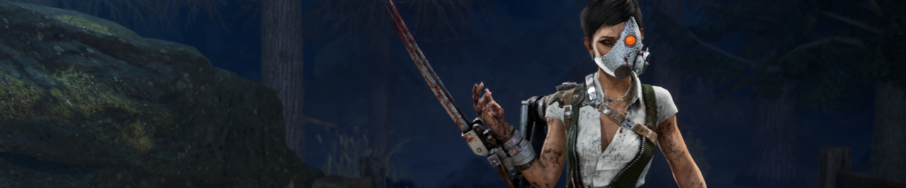

<!-- summary -->
## AI TL;DR

The Skull Merchant receives a growing Haste bonus based on tracked survivors, pallet-breakage when vaulting a Claw Trap, delayed drone return until traps are destroyed, instant trap loss on battery expiry, and unhackable drones near traps; several add-ons (Ultrasonic Trap Speaker, Expired Batteries, Prototype Rotor, Adaptive Lighting) are re-tiered and rebalanced. Perk-induced screams are also reverted to 2D, map-wide sounds with the original audio instead of the 3D version introduced in 6.6.0.

These changes aim to improve chase risk, generator defense, and trap utility based on community feedback, and will go live in next week’s update while the team continues work on the next major release.
<!-- /summary -->

<!-- nav -->
&larr; [Developer Update | Tools of Torment PTB](377-developer-update-tools-of-torment-ptb.md) · [Developer Updates](../index.md#developer-updates) · [Developer Update | March 2023](382-developer-update-march-2023.md) &rarr;
<!-- /nav -->

# Developer Update | Tools of Torment

Another special edition of the Developer Update! Next week’s update will feature changes for screams and the newest Killer, The Skull Merchant. We wanted to take this opportunity to share what’s on the way as well as the reasoning behind these changes.

## The Skull Merchant

Between the Public Test Build (PTB) and live release of the Tools of Torment Chapter, we made a wide variety of changes to The Skull Merchant to help address some of the feedback we received. We’ve been keeping a close eye on her since, and while it seems like these changes have had a positive effect on her performance, there are a few frustrations we want to address sooner rather than later. In no particular order, these are:

- It doesn’t feel like The Skull Merchant’s Power helps her enough in a chase.
- It doesn’t feel as though there’s enough risk to having a Claw Trap.
- The Skull Merchant is too good at holding 3 generators, causing very long matches.

The pain points are a common thread between the feedback many of you have given since the Chapter released. To rectify each of them, we have made a large number of changes.

### On the Hunt

The Skull Merchant’s drones will Lock On to Survivors, making them Exposed for some time. This can push Survivors away from stronger structures and into a sparser part of the map. However, as many of you have pointed out, this doesn’t really pose a threat if you’re already injured; getting hit will already put you into the dying state.

Likewise, Claw Traps don’t feel equally threatening to all players. While the thought of having your location constantly broadcasted to the Killer is enough of a deterrent for some, more confident Survivors may actually welcome a chase, opting instead to keep the Killer distracted for their teammates.

To improve her strength in a chase, we have made a couple changes.

First, *The Skull Merchant will now gain a growing Haste effect for each Survivor tracked on her radar*. This bonus starts at 3% for one Survivor, raises to 5% for two, 6% for three and 7% for four. Both Claw Traps and active drone zones will contribute to this, and the Killer *does not* need to inspect their scanner to gain the benefits. This will reward the Killer for efficiently using their Power to keep tabs on their prey.

Second, *vaulting a pallet with a Claw Trap will cause that pallet to break, destroying the Claw Trap in the process.* This was previously part of the common Ultrasonic Trap Speaker Add-on. With this change, being chased with a Claw Trap attached becomes a lot more dangerous.

These combined adjustments allow The Skull Merchant to more frequently get value out of her Power, regardless of whether or not the Survivor she’s chasing is injured.

### Generator Defense

The Skull Merchant excels when it comes to defending a cluster of three generators. Not only will her drones notify her any time a Survivor approaches a generator, but she can also easily replace them once they are disabled. This can make matches go on for an excessively long time with neither side making much progress. These matches tend not to be too terribly interesting for anyone involved and only end when someone gives up.

To put a damper on her ability to defend generators, *drones are no longer immediately returned to The Skull Merchant once they are disabled. Instead, they will be returned once their respective traps are destroyed*. This will make it more difficult to replace disabled drones on these generators.

That said, this will limit how often The Skull Merchant can deploy new drones. Therefore, we have a series of changes to compensate for this loss of power.

First, to ensure Survivors cannot hold a Claw Trap indefinitely to deny her from using her Power, *Claw Traps will now be instantly destroyed as soon as their battery expires*, and *Claw Trap batteries will no longer refill when entering an active zone*. This way, Claw Traps will *always* return after a set amount of time.

Second, *drones will enter an unhackable state whenever a Survivor with a Claw Trap is near*. This will prevent a single Survivor from running around and disabling every drone, meaning the Killer will always have some combination of four Claw Traps or drones available to them. Combined with the changes to Claw Traps mentioned above, The Skull Merchant will always get value out of her ability whether it’s through deployed drones or traps.

### Add-ons

Last but not least, we have a few Add-on changes to round out this update.

**Ultrasonic Trap Speaker**

Since this Add-on has been incorporated into the Killer’s base kit, it needed a new effect.

*Ultrasonic Trap Speaker now reduces the time taken for Undetectable to take effect when inside an active zone by 50%.*

**Expired Batteries**

*This Add-on has been changed to Ultra Rare to match its high effectiveness.*

*Since Claw Traps now provide a Haste effect, this would make the Killer* ***very fast*** *at the start of the match in addition to revealing the Survivors’ positions. Therefore, we have reduced the duration of the Claw Traps Survivors spawn with to 40% of the normal battery life (was 150%).*

**Prototype Rotor**

*This Add-on has been changed to Very Rare to better suit its effectiveness.*

**Adaptive Lighting**

*Adaptive Lighting now increases the length of the Undetectable effect by 50%* (was 20%).

## Screams

I scream, you scream, we all scream when the Killer is using a Perk or Power that makes people scream. Unless you’re using Calm Spirit.

In 6.6.0, we changed screams caused by perks. Historically, these Perks would cause the Survivors to use the same scream sound as when they were hurt. We decided to change this considering the Survivor was not actually being hurt, just scared. When we made this tweak, these screams became ‘3D’ – meaning you could tell which direction they were coming from – and limited their range as a side effect.

In this update, we’ll be readjusting these Perks to bring them back to the original functionality, but with the proper scream sounds. Screams caused by Perks will once again be ‘2D’ – meaning you can’t quite tell which direction they’re coming from – and be heard map-wide.

With that, we’ve reached the end of this special edition Developer Update. The changes in this post will be live in next week’s update. We are also hard at work on our next major release and we look forward to sharing more details about that soon.

Until next time…

The Dead by Daylight team

<!-- nav -->
&larr; [Developer Update | Tools of Torment PTB](377-developer-update-tools-of-torment-ptb.md) · [Developer Updates](../index.md#developer-updates) · [Developer Update | March 2023](382-developer-update-march-2023.md) &rarr;
<!-- /nav -->
