# Developer Update | March 2023

The Tools of Torment Mid-Chapter Update is quickly approaching, so that can only mean one thing: It’s time for another Developer Update! In this series of posts, we cover some of the biggest changes and additions making their way to the game. In this edition, we’ll dive into various quality of life and accessibility improvements as well as an extensive list of balance adjustments. Without further ado, let’s kick things off with a highly requested feature.

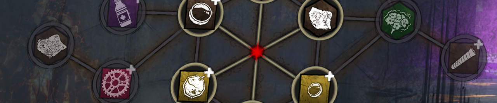

### Bloodweb Improvements

Who would have thought that *too many Bloodpoints* could ever be a problem? After our progression overhaul last year, many of you found yourself with a hefty amount of Bloodpoints- so many in fact that finding the time to spend them before your next match could be difficult. We’ve seen many suggestions for ways to improve the spending process, and rather than picking just one, we’ve implemented a few fan favourite ideas. We hope these new features will allow you to spend more time playing and less time shopping!

**Bloodweb Chain**

The first new addition is very simple; select any node and the game will automatically buy anything needed along the way. This allows you to purchase multiple nodes with a single button press and ensures that you can get exactly what you want.

But as always, The Entity is ever-present and may consume one of these nodes before the chain can be completed, so plan wisely!

**Automatic Purchase**

If you’re just looking to level up your character quickly and cheaply and don’t care what you get, the new center node in the Bloodweb is perfect for you. Selecting this node will automatically purchase items until the current Bloodweb has been completed. This will prioritise Perks, then the cheapest option available.

This can also be used on partially completed bloodwebs, allowing you to grab anything you’ve got your eye on first.

To ensure that players familiarize themselves with the contents in a Bloodweb, this button will only appear once the character has been prestiged for the first time.

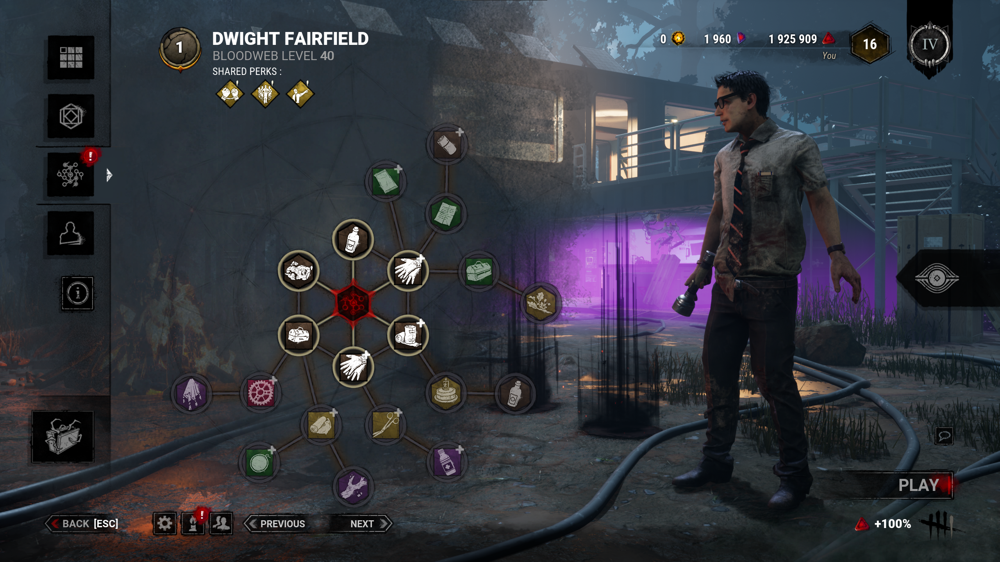

**Press to Buy**

Ever wanted to watch the Bloodpoints fly from your pockets at an alarming rate? The new default interaction only requires you to press a node to purchase it, instead of having to hold it. This can be used in conjunction with the other options mentioned above to further speed up the spending process. The interaction can be toggled if you would rather use Hold instead.

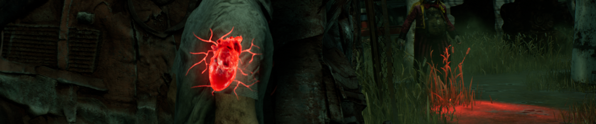

### Visual Terror Radius

The terror radius is an integral part of the game, both warning Survivors about the approaching Killer and activating multiple Perks. This can make things difficult for our deaf or hard of hearing players since there is no visual representation of the terror radius’ strength, forcing them to use a perks which work in the terror radius as an alternative. This is of course not ideal, we’d like everyone to be able to use the perks they’d like and not be forced to use one to have access to a core part of the game.

But we have some good news: A visual terror radius option is here!

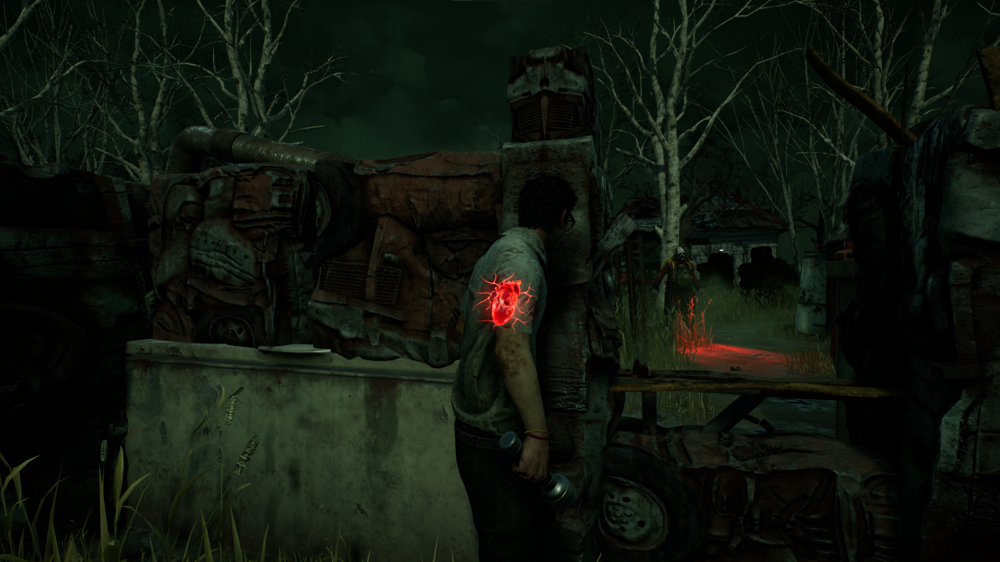

When enabled in the Accessibility Options, a heart will appear in your Survivor’s chest whenever the Killer’s terror radius can be heard. Lullabies will also appear as a haze in their chest. This heart will become more vibrant and beat more intensely the closer the Killer comes. If your character is ever offscreen, an indicator will appear if the Terror Radius is heard signaling that you should look at your character to see the current state of the Terror Radius visual feedback.

For those who may need it, this heart will also be affected by colorblindness settings to ensure that it is adequately visible.

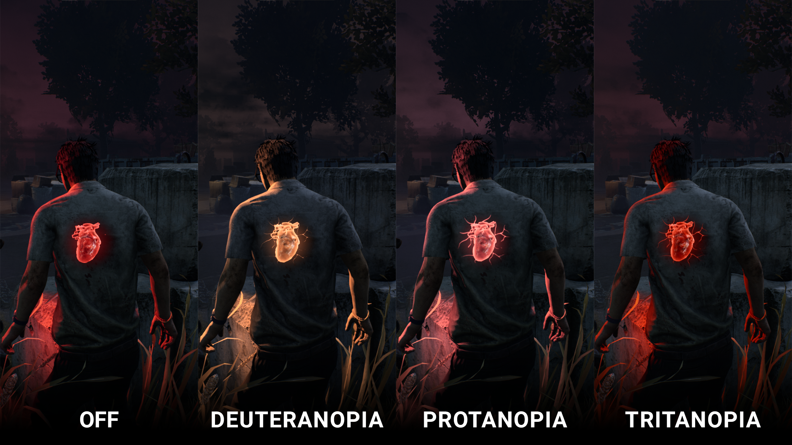

This option will *not* provide a competitive advantage compared to the usual audio terror radius and will respect any terror radius Perks, Add-ons, and Powers.

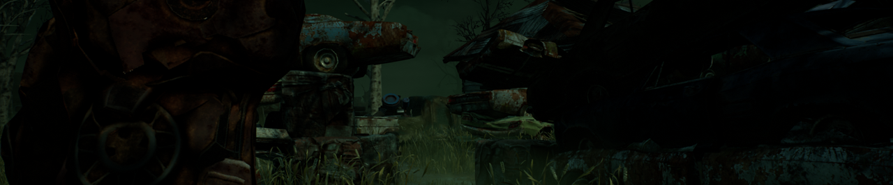

### Autohaven Wreckers Map Updates

This update will feature balance updates to two Autohaven Wreckers maps, namely Blood Lodge and Gas Heaven.

**Blood Lodge**

Blood Lodge can be a bit of a mixed bag: Depending on how the map generates, there can be plenty of safe pallets near the center or very few, creating either a very safe area or a deadzone. This area also has very few line of sight blockers which can make it difficult for stealthy Killers to sneak up on Survivors. Around the edge of the map, on the other hand, features several maze tiles (high walls with a pallet and/or window). Clever Survivors can combine these tiles to create stronger loops making them very difficult to catch.

To remedy this, we are making significant layout changes to this map. The Blood Lodge itself will now appear closer to the center of the map, breaking up line of sight and separating some of these safer loops. The maze tiles have also been separated from one another, making it more difficult to combine them together.

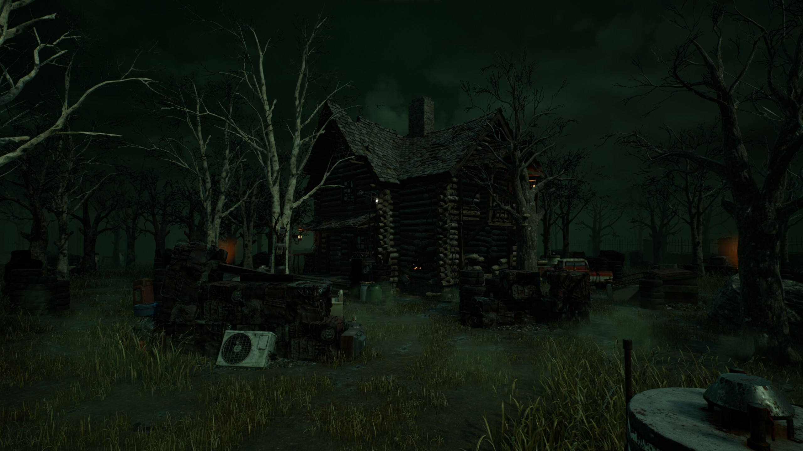

**Gas Heaven**

Gas Heaven features unique car piles which stretch several tiles long. These special tiles can get in the way of gameplay, however, making it difficult to traverse the map. Chasing a Survivor around these walls of cars can also waste a lot of time if they start the chase with a significant lead.

Going forward, these car piles will be broken up into smaller single-tile chunks. These car piles will also feature potential spawn locations for pallets, helping reduce the potential for deadzones to appear.

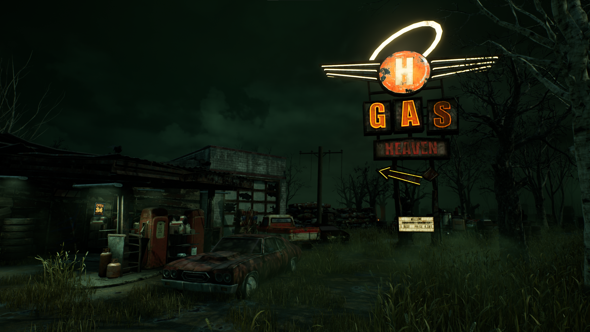

The Gas Heaven gas station itself has also been moved closer to the center of the map. Since this makes this building much easier to get to from anywhere on the map, we’ve reviewed its spawning rules to prevent strong combinations of windows from spawning and adjusted its pallet spawn locations.

**Throughout the Realm**

Some of these changes will spill over into the remaining Autohaven Wreckers maps, including new edge tiles (small tiles that run along the map’s boundaries), some of which include new gameplay such as possible pallet spawn locations.

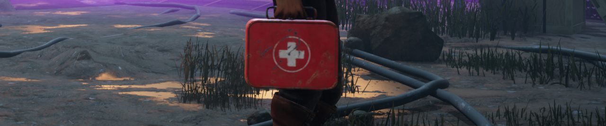

### Healing

There’s no better way to avoid being put on a hook than healing your injuries. Even if the Killer is relentless, an extra health state can buy your team more time to work on generators. Having easy access to quick and plentiful heals can cause problems, particularly for highly skilled Survivors who can evade the Killer for quite some time. An Emergency Med-kit alone can heal the damage done after a long chase in roughly 10 seconds. This doesn’t even begin to factor in all sorts of Perks and Add-ons which can speed up healing even further and grant more heals before your Med-kit is depleted.

For Killers, this means that any chase that doesn’t end with a hook- even if they managed to damage a Survivor- can be completely undone in a matter of seconds. Keeping Survivors injured and switching targets are often wise decisions, and with this in mind, we have a few changes in store for healing to make this more practical.

First, **healing will now take 24 seconds** by default (previously 16 seconds). This will make each hit more impactful, ensuring that Survivors need to spend longer to heal their wounds.

Second, **we have rebalanced Med-kits across the board**. All Med-kits will now have 24 charges by default, allowing one heal before they are depleted. The different rarities of Med-kits are as follows:

**Camping Aid Kit (Common)**

- Increases the Altruistic Healing speed by 20% (was 25%).

**First Aid Kit (Uncommon)**

- Increases the Altruistic Healing speed by 25% (was 35%).

**Emergency Med-kit (Rare)**

- Increases the Altruistic Healing speed by 30% (was 50%).
- No longer increases the speed at which you heal yourself.

**Ranger Med-kit (Very Rare)**

- Increases the Altruistic Healing speed by 35% (was 50%).
- Increases Skill Check success zones by 10% (was 14%).
- Increases Great Skill Check zones by 10% (was 15%).

Lastly, **we have done a pass on Med-kit Add-ons**, bringing those which were overperforming in line with the rest. Add-ons which add more charges to your Med-kit have also been reviewed with the new healing time in mind, though it is now impossible for a Med-kit to fully heal a Survivor more than twice in a match.

### Perk Updates

Moving on to Perks, we have a bundle of tweaks for this update targeting both meta and non-meta options.

**Gearhead**

First up, Gearhead currently reveals the aura of the next Survivor to hit a great skill check after a Survivor loses a Health State. These conditions require quite of bit of work and luck on the Killer’s part to get value out of it.

Gearhead will receive a slight rework: **When a Survivor loses a Health State, Gearhead activates for 30 seconds. While active, any Survivor who hits a good skill check will have their aura revealed to the Killer for 6/7/8 seconds.**

This allows Gearhead to potentially provide information multiple times for each hit. Killers who efficiently catch Survivors will be able to keep Gearhead activated for a good portion of the match.

**Overzealous**

Overzealous grants a repair speed bonus when Cleansing a Totem, and a larger bonus when Cleansing a Hex Totem. Little did we know the skirmishes this would cause between the Boon lovers out there. Moving forward, **Overzealous will also activate when Blessing a Totem in addition to Cleansing. We’ve also slightly increased the bonus to 8/9/10% (from 6/7/8%).**

**Scourge Hook: Pain Resonance**

This perk has gradually found its way back into the meta. To address this, we have given Scourge Hook: Pain Resonance a slight rework. **The perk starts with 4 tokens. The first time each Survivor is hooked on a Scourge Hook, the generator with the most progress will explode and lose progress, and a token is lost.We’ve also reduced the difference between different Tiers of the perk (now 11/13/15%).**

**Dead Hard**

Though Dead Hard initially fell from grace after the 6.1.0 Update, it has steadily climbed back to being one of most prominent Survivor perks. Dead Hard already requires some precision to use, and further reducing the invulnerability window would make it far too unreliable and frustrating. Therefore, Dead Hard has also received a slight rework.

**Dead Hard will activate after safely unhooking a Survivor. When activated, press the active ability button while injured and running to gain the Endurance Status Effect for 0.5 seconds, then become Exhausted. Dead Hard will then deactivate.**

This will put a damper on how often Dead Hard can be used, keeping it as a powerful reward for Survivor who have earned it.

**Call of Brine**

Call of Brine quickly rose in popularity following the meta shake up last year. Granting a large increase to the regression rate of generators, it’s not uncommon for a generator to fully regress once a Survivor is chased away.

To tone down its power, we have reduced the additional regression speed to 115/120/125% (was 150/175/200%).

**Overcharge**

Similar to Call of Brine, Overcharge saw a similar rise in power over the past year. This perk also increases the regression rate of generators pretty substantially.

To bring it in line with other perks, we reduced the maximum regression speed to 130% (was 200%). This would make it take longer for the regression rate to become beneficial, so at the same time, we’ve increased the starting regression speed to 85% (was 75%) to help offset this.

Additionally, the penalty for missing the special Skill Check has been reduced to 2/3/4% (was 3/4/5%).

**Boon: Circle of Healing**

This perk has become the ‘jack of all trades’ of healing perks. Not only does it allow you and your fellow Survivors to heal without a Med-Kit, but it also increases the speed of healing across the board.

Going forward, **Boon: Circle of Healing will no longer allow Survivors to heal without a Med-Kit**. Instead, **it will provide a 40/45/50% healing speed bonus to healing others.**This bonus will not apply to healing done with a Med-Kit. Additionally, **the auras of injured Survivors with the Boon’s range will be revealed to all other Survivors.**

### Killer Updates

Starting with this Mid-Chapter, we’d like to include a bundle of small tweaks to various Killers in each update. These will be smaller scale than the reworks we’ve done in the past, focusing more on number tweaks than new features or significant changes. Larger reworks are still planned, be we want to show some love to our growing roster along the way!

**The Hillbilly**

Start your chainsaws- and don’t worry about them overheating- we’ve adjusted The Hillbilly’s overheat mechanic to be much more forgiving.

The amount of heat generated from both starting to rev and continuing to rev your chainsaw has been dramatically reduced, making the overheat mechanic almost a non-factor when used in loops and over short distances, much akin to how he used to play. Just as before, heat will begin to dissipate as soon as the Chainsaw Sprint ends, meaning most of the heat generated from a short sprint will already be gone by the time your chainsaw is ready for another attack.

The amount of heat generated while Chainsaw Sprinting, on the other hand, has been increased slightly. Though the changes above will help counteract this, longer sprints will cause your chainsaw to overheat quicker, so be careful not to let it overheat in an empty corner of the map!

Last but not least, we’ve toned down the Doom Engravings and Death Engravings Add-ons. These Add-ons will provide less movement speed than before and increase heat generation further.

**The Pig**

The John’s Medical File Add-on increases The Pig’s crouched movement speed. This Add-on hasn’t been performing very well, so we’ve ~~decided to nerf The Pig~~**increased this Add-on's movement speed bonus to 10%** (was 6%).

**The Oni**

Two of The Oni’s Add-ons- Blackened Toenail and Bloody Sash- allow him to move faster while absorbing Blood Orbs, losing less ground in the process. These Add-ons weren’t performing as well as we’d like, so we’ve given them some slight improvements. They will now **increase movement speed while absorbing by 0.4m/s and 0.7m/s respectively** (was 0.3m/s and 0.6m/s).

**The Nightmare**

The Nightmare’s Sheep Block and Unicorn Block Add-ons inflict Blindness on Survivors who trigger a Dream Snare or Dream Pallet. These Add-ons weren’t doing so well, so we’ve **increased the duration of the Blindness Status Effect on each of these Add-ons by 30 seconds.**

**The Executioner**

The Executioner’s Scarlet Egg Add-on increases the duration of Killer Instinct inflicted by Rites of Judgement by 1.5 seconds. This doesn’t provide much value since Killer Instinct only updates its position periodically. To make it more meaningful, we are **increasing this bonus to 3 seconds**.

**The Clown**

The Redhead’s Pinky Finger Add-on can be incredibly powerful, allowing The Clown to instantly down a Survivor after hitting them directly with a bottle. We’ve previously toned this Add-on down by reducing the maximum number of bottles The Clown can hold, but it seems like this downside was not enough to bring it in line with other Ultra Rare Add-ons.

**Going forward, this Add-on will reduce the maximum held bottles by 3 (was 2)**.

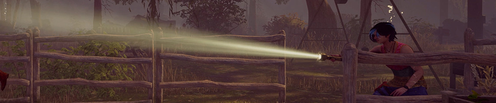

### Bright Light Interactions Removal

When Dead by Daylight first released, only three Killers were in the game. It wasn’t unreasonable to bring a Toolbox just in case you faced off against The Trapper or a Flashlight to burn The Wraith when it was a 1-in-3 chance.

But as the Killer roster has grown, these mechanics have started to feel out of place. The majority of Killers do not have any interaction with Survivor items, leading to the ones that do feeling unfairly punished by something beyond their control. In the past, we removed the ability to sabotage The Trapper’s Bear Traps to alleviate this issue. In this update, we’ll be removing Flashlight interactions with various Killer Powers. Since some of these actions aren’t very well known, we’ll quickly run through each of them.

**The Wraith**

We have removed the ability to burn The Wraith out of his cloak. This would also stun him in the process.

**The Nurse**

Similar to The Wraith, The Nurse could also be burned while blinking. This didn’t come up very often since it was very risky and difficult to pull off, but it is also being removed.

**The Artist**

Survivors could shine a Flashlight at crows to scare them away. This also didn’t come into play very often since crows could easily be shooed away without using Flashlight charges.

**The Hag**

Arguably the most impactful, Flashlights have long been the sole counter to The Hag’s Phantasm Traps. Not only could they reveal the aura of nearby traps, but shining a Flashlight at the trap would destroy it. Removing the Flashlight effect from The Hag’s Power is a little trickier since it would leave Survivors with no option but to set off a trap and risk The Hag teleporting to it.

To ensure that this doesn’t make The Hag too oppressive, we are adding the ability to wipe away a Phantasm Trap. In order to do so, Survivors will need to spot the trap, crouch over to it to avoid setting it off, then perform a several second long action to clear it.

While this will allow *all* Survivors to clear traps, it will now be much more difficult and time consuming to do so. Additionally, this prevents a Survivor with a Flashlight from destroying The Hag’s traps mid-chase.

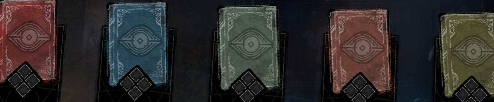

### The Deep Rift and Beyond

Late last year, a deeper level of the Rift was revealed, allowing players who had already reached Tier 70 to go above & beyond and continue progressing to earn alternate versions of Outfits. Starting with the Tools of Torment Mid-Chapter Update, this Deep Rift will feature unique visuals to better differentiate the bonus Deep Rift Tiers from the regular Rift.

As for Tomes, you may notice a new trend emerging where the most recent Chapter’s lore is expanded in the following Tome. It’s no coincidence; this is something we’ll be doing for all new original Chapters moving forward. This will allow us to expand further on the most recently introduced characters’ lore in a more natural and exciting way.

Licensed Chapters, meanwhile, may be an exception to this. While we would love to expand upon their stories- as we have done in the past with the likes of Ghost Face and Bill Overbeck- licensed characters come from franchises of their own with their own stories to tell. Therefore, the Tomes followed licensed Chapters may feature existing original characters instead.

And if you’ve been waiting to learn more about your favourite characters from years past, don’t worry, they won’t be forgotten! Older characters will still be featured throughout new Tomes as minor characters.

With that, we’ve reached the end of this month’s Developer Update. The Public Test Build for the Tools of Torment Mid-Chapter Update will open next week. We look forward to reading your feedback once you’ve had a chance to try it out!

Until next time…

The Dead by Daylight team
