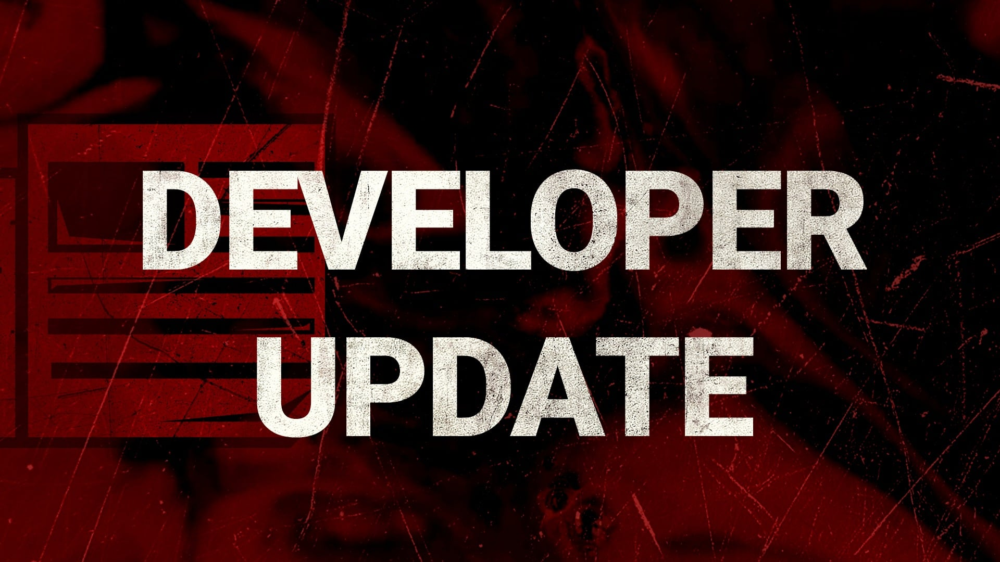
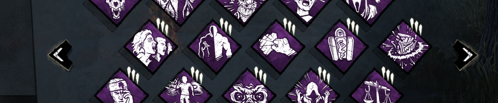
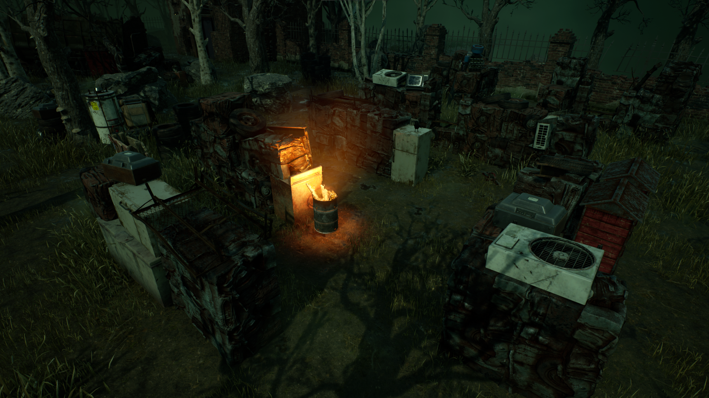

<!-- summary -->
## AI TL;DR

The live Tools of Torment Mid-Chapter reverts the PTB’s 24-second base healing to 16 seconds, standardises all Med-Kits at 24 charges, adds a 33 % self-heal penalty and boosts teammate-heal bonuses, while revising several Med-Kit add-ons. The Hillbilly’s overheat is kept softened but its Death and Doom Engraving add-ons are restored. Perk tweaks include Dead Hard now activating on unhook, increased regression on Scourge Hook: Pain Resonance to 15/20/25 %, and a higher healing speed bonus on Circle of Healing (50/75/100 %). An unsafe new tile on Autohaven Wreckers receives a safety rebalance.
<!-- /summary -->

<!-- nav -->
&larr; [Developer Update | March 2023](382-developer-update-march-2023.md) · [Developer Updates](../index.md#developer-updates) · [Developer Update | End Transmission](390-developer-update-end-transmission.md) &rarr;
<!-- /nav -->

# Developer Update | April 2023

It’s been a little over a week since the Tools of Torment Mid-Chapter hit the Public Test Build (PTB), the server where we test out and fine tune upcoming changes before pushing them live. As always, our team has been combing through your feedback and identifying room for improvement before the update debuts on live servers.

We want to start by giving a huge thank you to everyone who took the time to leave detailed and constructive feedback. Thank you! Your feedback has helped shape this update’s release. In this month’s Developer Update, we’ll reveal all of the changes we’ve made to the Mid-Chapter between the PTB and live releases.

### Healing

Possibly the hottest topic since it was announced, the PTB raised the base healing time to 24 seconds from the usual 16 seconds. Some tweaks were made to Med-Kits with this in mind. Changing such a fundamental part of the game is a very touchy subject, so we kept an extra close eye on this change to see how it would play out.

After reviewing player feedback, we found that many of you agreed that the speed which you heal others was already in a good spot prior to the update. This change also had knock-on effects elsewhere in the game, making effects like Mangled and Hemorrhage stronger and making ‘slugging’ (leaving Survivors in the dying state) even more effective.

Therefore, **we have reverted the base healing time to 16 seconds**.

On the other hand, we found there was a lot of support for tuning down Med-Kits in particular. Med-Kits allowed Survivors to heal themselves multiple times whenever it was convenient to them, leaving their teammates free to work on Generators while they do so. We have decided to shift our focus to Med-Kits with a series of changes.

First and foremost, **all Med-Kits will have a total of 24 charges** (the same as the PTB).

Second, **we’ve increased the healing speed bonus when healing others across all Med-Kits**. The new bonus is as follows:

- Camping Aid Kit: Increases the speed that you heal others by 35%,
- First Aid Kit: Increases the speed that you heal others by 40%.
- Emergency Med-Kit: Increases the speed that you heal others by 45%.
- Ranger Med-Kit: Increases the speed that you heal others by 50%.

Third, **all Med-Kits will now have a 33% speed and efficiency penalty when used for self healing**. This will reduce the number of times a Med-Kit can be used to heal yourself and make it take longer to do so. This means that a Med-Kit will by default grant one *self* heal over the span of 24 seconds (before factoring in Add-ons).

Combined, these changes will decrease the power of Med-Kits when used for self healing, but increase their power when used for healing teammates in return. (We all know you’ll probably continue using them for self heals, but at least the choice is there!)

Last but not least, in light of the tweaks above, we’ve made some adjustments to various Med-Kit Add-ons:

- Rubber Gloves: New effect – Increases the Great Skill Check success zone by 10%.
- Butterfly Tape: Increases healing speed by 5% (was 3%).
- Sponge: New effect – Increases the Great Skill Check success zone by 20%.
- Needle & Thread:
- Added effect – Increases progression bonus for succeeding a Great Skill Check by 5%.
- Removed effect – No longer provides bonus Bloodpoints for hitting Great Skill Checks.
- Medical Scissors: Increases healing speed by 10% (was 12%).
- Surgical Suture:
- Added effect – Increases progression bonus for succeeding a Great Skill Check by 10%.
- Removed effect – No longer provides bonus Bloodpoints for hitting Great Skill Checks.
- Abdominal Dressing:
- Increases healing speed by 15% (was 20%).
- Rarity increased to Very Rare (was Rare).
- Gel Dressings:
- Adds 16 charges to the Med-Kit (was 14).
- Rarity increased to Ultra Rare (was Rare).
- Anti-Hemorrhagic Syringe: While this Add-on is unchanged, please note that its healing speed will be reduced by the Med-Kit self healing penalty (resulting in a 24 second heal by default).

We hope these changes will tone down Med-Kits when used for self healing while making them more appealing for altruistic heals.

### The Hillbilly

On the PTB, we tested out some changes for The Hillbilly, both toning down the overheat mechanic and adjusting two of his top performing Add-ons. While the overheat mechanic felt less oppressive, many of you raised concerns with the changes to the Engraving Add-ons, reminding us that these Add-ons allowed The Hillbilly’s power to be used in more situations. This overshadowed the overheat adjustments and made the whole package feel like a downgrade.

For the release, **we have reverted the changes to the Death Engravings and Doom Engravings Add-ons**.

We have kept the tweaks to the overheat mechanic to make it less limiting than before, making The Hillbilly feel better to play.

### Perks

The PTB featured updates to various Perks, including some meta options for both Killer and Survivor. When it comes to toning down a powerful Perk, some level of contention is expected. But with that said, we’ve heard some very convincing arguments for a few of these perks, so we have done some fine tuning before the changes go live.

**Dead Hard**

Since reducing the Endurance effect any further would make Dead Hard too finicky to use, we instead opted to limit the number of times it could be used by requiring a safe unhook to activate the Perk. While this had the intended result of limiting the number of times it appeared in the match (and prevented it from being used in the first chase of the match), some of you pointed out that this new design indirectly encouraged the Killer to chase the unhooked Survivor. This makes a lot of sense; the unhooker may have activated their Dead Hard, but you can be sure that the unhooked Survivor does not have it.

For the update’s release, we have changed Dead Hard to instead **activate when *you* are unhooked or unhook yourself**. This way, the unhooked Survivor becomes less of a clear target for the Killer.

**Scourge Hook: Pain Resonance**

On the PTB, Pain Resonance was changed to only activate the first time each Survivor is placed on a Scourge Hook. This change was specifically made to reduce the number of times Pain Resonance could activate in a given match, especially later in the match when one or more Survivors were likely to be sacrificed. While this did have the intended result, many pointed out that this left the Perk in a fairly weak state, not quite stacking up to other regression Perks.

Considering Scourge Hook: Pain Resonance can now only activate four times in a match and requires the Killer to target different Survivors, we feel comfortable making it more rewarding for Killers who choose to take on the added challenge.

Therefore, **we have increased the regression amount of Scourge Hook: Pain Resonance to 15/20/25%** (was 11/13/15%).

We hope those who choose not to chase the unhooked Survivor will find this perk much more rewarding.

**Boon: Circle of Healing**

Since this Perk no longer grants the self-heal ability, Circle of Healing found itself in an awkward spot. The altruistic heal speed bonus was nice, but when you crunched the numbers, Circle of Healing rarely provided any benefit. A 50% healing speed bonus would only shave roughly 5 seconds off of a heal, but it’s easy to spend that much time running over to the Boon’s area of effect- and that doesn’t even begin to factor in the time it takes to set up.

With this in mind, **we have increased the healing speed bonus on Circle of Healing to 50/75/100%** (was 40/45/50%).

While this won’t make setting up or running to the Boon the optimal choice in every situation, we expect this to make it more impactful if the Boon is nearby.

### Autohaven Wreckers

Last but not least, we managed to sneak one more change into the Autohaven Wreckers map updates. A while back, we added some new tiles to the realm. One of these new tiles- which featured a window and pallet- ended up being fairly unsafe. We rebalanced this tile, but it unfortunately didn’t make it into the PTB in time. However, an updated version of this tile will be available upon release. Take a look!

With that, we’ve reached the end of the Developer Update. We want to once again thank everyone who gave the changes a try and left detailed and constructive feedback. Our team will continue to keep a close eye on things once the update goes live to ensure that everything goes smoothly.

Until next time…

The Dead by Daylight team

<!-- nav -->
&larr; [Developer Update | March 2023](382-developer-update-march-2023.md) · [Developer Updates](../index.md#developer-updates) · [Developer Update | End Transmission](390-developer-update-end-transmission.md) &rarr;
<!-- /nav -->
