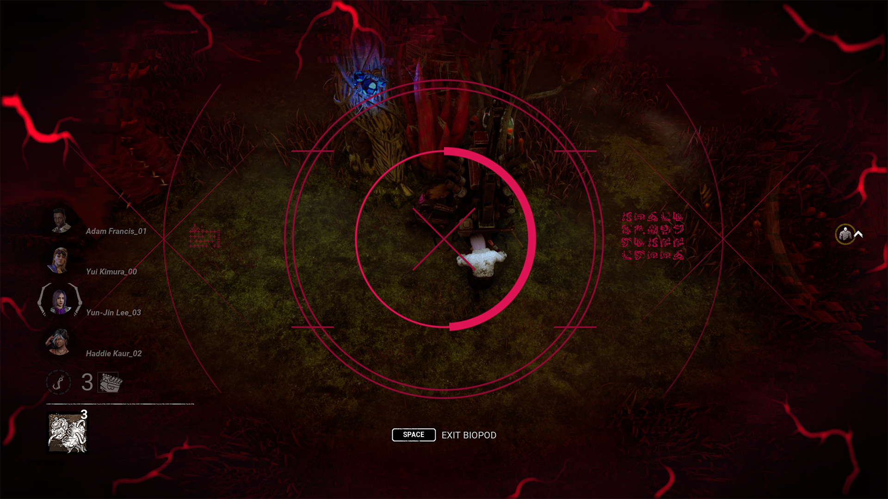

# Developer Update | End Transmission

Last week, the upcoming End Transmission Chapter hit the Public Test Build (PTB). Since then, we’ve been watching very closely to see what you have to say about it. While it’s been a pleasure seeing so many people enjoying the new content, we’ve also caught on to a few pain points which we plan to address before the Chapter goes live June 13th.

In this post, we’d like to take a moment to share our findings as well as the changes you can expect to see when the update goes live.

## The Singularity

First up, we’ll cover the new Killer, The Singularity. This AI driven android launches Biopods around the map. These Biopods not only allow it to surveil their surroundings, but also inflict Survivors with a Temporal Slipstream, allowing The Singularity to teleport to them. Survivors can fight back using EMPs found around the map, granting them the ability to remove Temporal Slipstreams and temporarily disable Biopods.

We found that while the EMPs were effective in countering The Singularity’s Power, too many of them lead to frustrating matches for the Killer. This is something that was echoed in your feedback: Many felt that their Biopods were disabled too often, and Survivors almost always had an EMP at hand just in case.

We want to keep EMPs meaningful and worth seeking out for Survivors, so for the release, we are instead reducing the number of EMPs available through the following changes:

- **Decreased the number of Supply Cases to 5** (was 7).
- **Supply Cases now take 90 seconds to print an EMP passively** (was 80 seconds). Interacting with the Supply Case prints an EMP four times faster.

Additionally, **Survivors who are currently holding an EMP will no longer see the auras of Supply Cases** to reduce visual clutter and make it harder to efficiently chain together multiple EMPs.

Another piece of feedback we received is that it wasn’t very clear when Biopods were disabled. During the PTB, the only way to tell you were controlling a disabled Biopod was the colour of the targeting reticle. This isn’t immediately obvious if it’s your first time playing The Singularity, so we’ve revisited these visuals to make it more clear:

Lastly, we’ve added a meter to the Power icon to represent Overclock duration. This will give you a better idea of how long it will last after teleporting so you can better plan your next move. At the same time, we’ve updated two Add-ons (Diagnostic Tool (Repair) and Nanomachine Gel) to be active during Overclock rather than ‘after teleporting’ in order to make it clearer when their effects are active.

## The Executioner

During the PTB, we made a change which allowed The Executioner’s Punishment of the Damned attack to afflict Torment. The goal with this change was to give the Killer more ways to consistently apply Torment on careful Survivors who were able to avoid Torment Trails.

While this absolutely had the intended effects of spreading more Torment, we’ve also read some concerns regarding how this could be used to more effectively camp & tunnel. Since Punishment of the Damned can hit multiple Survivors, an unhook leaves both Survivors ripe for unavoidable Torment. Since it’s not possible to take protection hits to prevent a Survivor from being sent to the cage, we felt it was safer to reverse this change for the time being.

## Perks

### Scavenger

We’ve received a lot of feedback surrounding one of Gabriel Soma’s Perks: Scavenger. This Perk allows the user to replenish a Toolbox’s charges by hitting Great Skill Checks and rummage through an opened chest to find a guaranteed Toolbox.

Many have voiced concerns over how powerful this effect can be when paired with a strong Toolbox, doubling the value of an already strong Item. More specifically, it allowed the Survivor to replenish their Toolbox while continuing to work on Generators (unlike Built to Last which requires them to leave the Generator and hide in a locker).

For the release, we have made a few changes to this Perk to make it less of a clear choice:

- **Increased the number of Great Skill Checks required to 5** (was 4).
- **Once activated, your Generator repair speed is reduced by 50% for 40/35/30 seconds.**
- **Scavenger can now be used more than once per trial.**

With these adjustments, Scavenger becomes more effective when used to repair Generators in short bursts, but heavily discourages continuing to repair a Generator for some time after it is activated. Efficient Survivors will instead want to plan accordingly and spend this time elsewhere, such as healing, unhooking, searching for Totems, and so on.

### Machine Learning

This Perk allows the Killer to compromise a Generator by kicking it. When the compromised Generator is powered, the Killer receives Haste for some time.

Try as you might, it’s inevitable that a few Generators will be powered eventually. With this Perk, we want to add some risk to completing a recently damaged Generator, granting the Killer a major speed increase if you’re not careful. This Perk only activates under strict conditions, so we want to make sure it’s effective when it kicks in.

For the release, **we have increased the Haste effect to 10%** (was 7%). In practice, this means a Killer will catch up to a sprinting Survivor upwards of 66% faster!

### Forced Hesitation

Forced Hesitation causes nearby Survivors to become Hindered when a Survivor is put into the dying state, making it easier for the Killer to switch targets and get additional hits on overly altruistic Survivors.

On the PTB, this perk had some pretty safe values to make sure it didn’t get out of hand. Upon further review, we’ve decided to show it some love before the update releases.

- Increases the Hindered effect to 20% (was 15%).
- Decreased the cooldown to 40/35/30 seconds (was 60/50/40 seconds).

With this, Forced Hesitation will make it very risky to be near another Survivor as they are put into the dying state.

We want to give a special thank you to everyone who took the time to leave feedback after playing the PTB. You can expect to see all the adjustments mentioned in this post when the End Transmission Chapter releases on June 13th. As always, we’ll be keeping an eye out for your feedback once these changes go live.

Until next time…

The Dead by Daylight team
