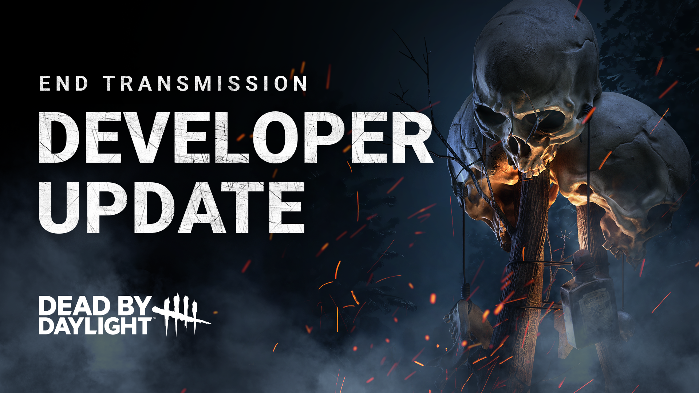

<!-- summary -->
## AI TL;DR

The Singularity’s Biopods and EMP mechanics received balance tweaks after the End Transmission launch. Supply Cases were cut from five to four, EMP generation time was raised to 100 seconds, and disabled-Biopod duration trimmed to 45 seconds. EMPs now charge in 2.5 seconds (up from 2) and survivors are slowed 10 % while charging, discouraging the “hold-EMP-until-chase” strategy. These adjustments aim to restore killer counterplay and encourage more strategic use of EMPs. All changes roll out in the upcoming 7.0.1 bug-fix patch.
<!-- /summary -->

<!-- nav -->
&larr; [Developer Update | End Transmission](390-developer-update-end-transmission.md) · [Developer Updates](../index.md#developer-updates) · [Developer Update | July 2023](397-developer-update-july-2023.md) &rarr;
<!-- /nav -->

# Developer Update | End Transmission Release

It’s been almost a week since the debut of the End Transmission Chapter. We’ve been keeping a close eye out for feedback since the launch, and we are already preparing a few balance changes for an upcoming update. Today, we’ll take a moment to run through each of the adjustments we have made and give some explanation as to why we are making them.

But first, let’s cover a few trends we’ve noticed:

1. The Singularity’s **Biopods are often disabled**, making it difficult to use its Power.
2. Holding an **EMP offers a Survivor too much protection against The Singularity’s Power**, allowing them to quickly and easily remove Slipstream and disable Biopods while being chased.

For the former, we made some incremental changes between the Public Test Build (PTB) and live release, reducing the number of Supply Cases and increasing the time it takes for them to print. We needed to be careful since making EMPs too hard to get could have the opposite problem of removing counterplay from Survivors. Now that we’ve had some time to see how these tweaks have played out, we feel comfortable reducing the frequency of EMPs even further. We have:

- **Reduced the number of Supply Cases to 4** (was 5).
- **Increased EMP Generation time to 100 seconds** (was 90 seconds).
- **Reduced the duration of disabled Biopods to 45 seconds** (was 60 seconds).

With these adjustments combined, EMPs will be less readily available and leave Biopods disabled for a shorter period of time. Survivors will still be able to defend themselves against Biopods in key locations, but they will want to use them strategically as to not waste them.

Second, we have noticed a developing strategy where Survivors would hold an EMP at all times and only use it once the Killer attempts to tag them with a Temporal Slipstream during a chase. Although we like the options this provides, it can make chasing a Survivor holding an EMP a little underwhelming since your Power is effectively “blocked” until the EMP is used. To make this strategy a little more risky, we’ve done the following:

- **Increased the time to charge an EMP to 2.5 seconds** (was 2 seconds).
- New effect: **Survivors are now slowed by 10% when charging the EMP**.

With this in mind, saving your EMP for a chase becomes a lot more dangerous. While you may remove your Slipstream, the Killer will also catch up much quicker and potentially get a hit. If you decide to use your EMP defensively, you’ll want to plan ahead and use it when the time is right.

Each of the changes mentioned in this post will be available in the upcoming 7.0.1 Bugfix Patch. Stay tuned to our channels for more information when the update is available! As always, we’ll be monitoring for feedback once these tweaks go live, so be sure to let us know how they feel.

Until next time…

The Dead by Daylight team

<!-- nav -->
&larr; [Developer Update | End Transmission](390-developer-update-end-transmission.md) · [Developer Updates](../index.md#developer-updates) · [Developer Update | July 2023](397-developer-update-july-2023.md) &rarr;
<!-- /nav -->
