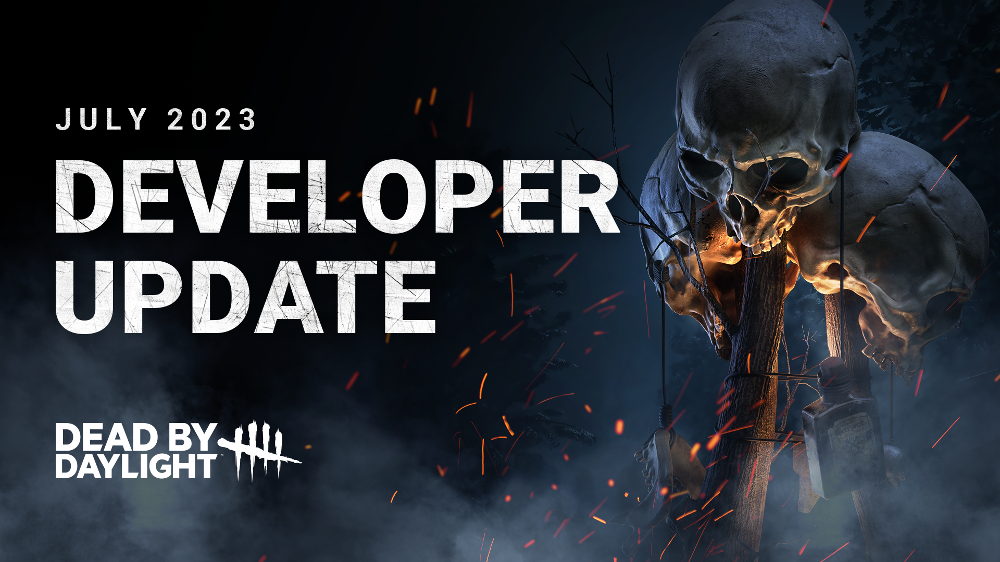
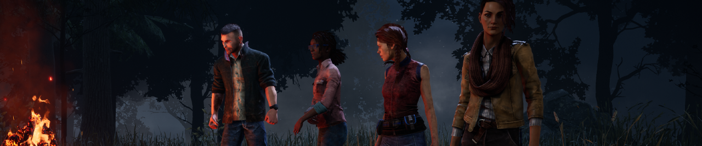
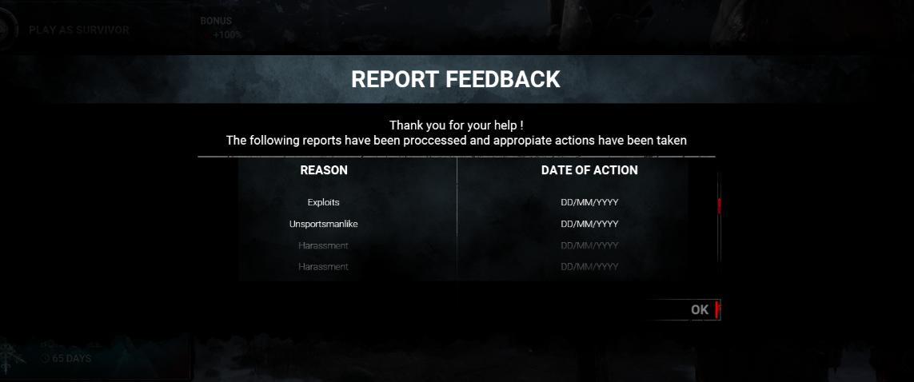
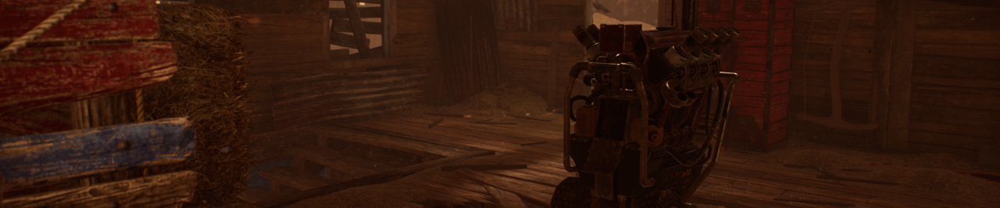
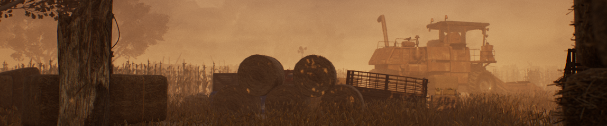
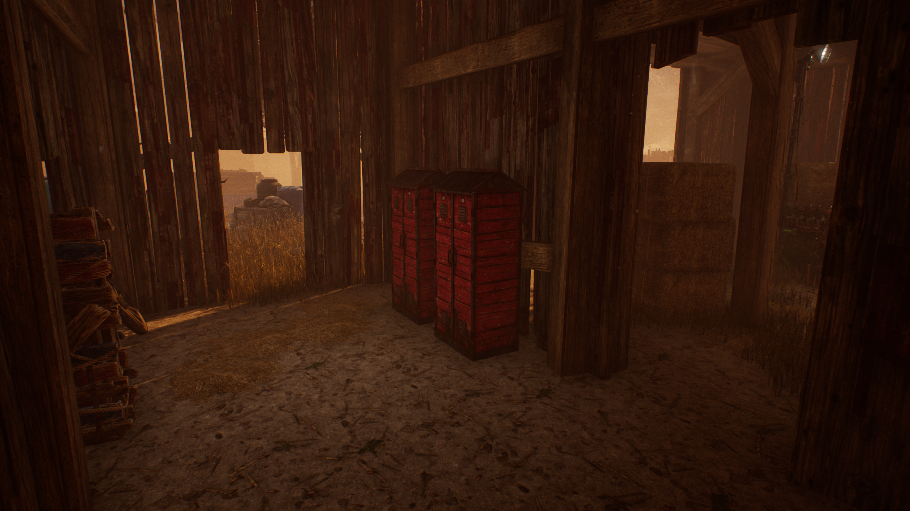
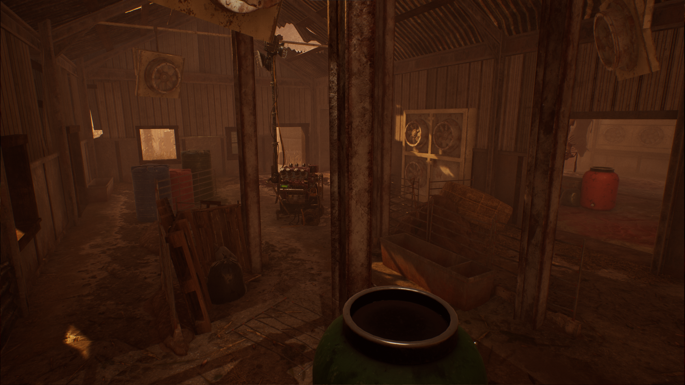
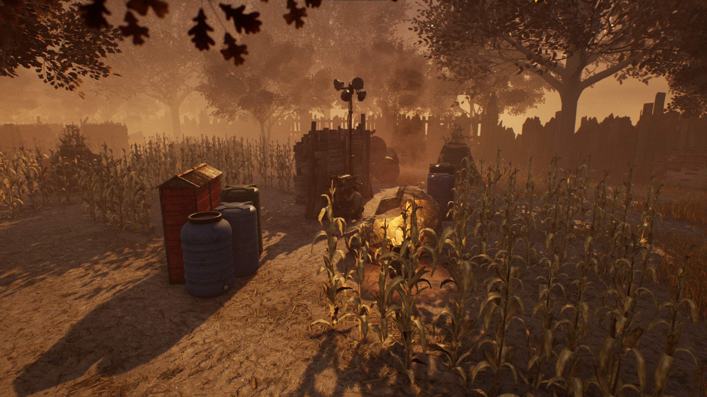

<!-- summary -->
## AI TL;DR

The update introduces AI survivor bots that replace disconnected players, and a “Successful Report” window that notifies you when your reports lead to bans. The Onryo receives major power adjustments—including altered Condemned application, new cooldowns and revised Cursed Tape behavior—while hook-grab mechanics are removed. Brand New Parts now trigger a skill check and reduce generator charge faster. A large batch of perk balances for both killers and survivors lands, alongside minor tweaks to the Executioner, Spirit and Hag add-ons. Coldwind Farm’s Fractured Cowshed and Rancid Abattoir maps get layout revisions to curb survivor-friendly setups. All changes will be testable on the upcoming Public Test Build.
<!-- /summary -->

<!-- nav -->
&larr; [Developer Update | End Transmission Release](393-developer-update-end-transmission-release.md) · [Developer Updates](../index.md#developer-updates) · [Developer Update | Nicolas Cage PTB](399-developer-update-nicolas-cage-ptb.md) &rarr;
<!-- /nav -->

# Developer Update | July 2023

Summer is upon us, and The Entity’s Realm is heating up. Between an extra special guest making his long-awaited debut and the return of a classic summertime event, our next update is already packed with content. But we’re just getting started: We have loads of exciting features and balance changes in store for you, and we’re going to dive into each of them today.

## Survivor Disconnect Bots

Nobody likes being left hanging, especially when you’re literally left hanging on a hook. Disconnections are sometimes unavoidable, and while disconnection penalties can help discourage people from leaving a match, they don’t soften the blow when you’re abandoned early on. Our studies (unsurprisingly) found that your odds of escaping drop significantly when you remove even one Survivor from the trial – who would have guessed?

That’s where Dwight-bot and his many friends come in. Going forward, any Survivor who disconnects will be replaced with an AI substitute. When this happens, everyone in the match will be notified that a bot has taken over. *This does not change anything on the disconnecting player’s side:* They will still receive a disconnection penalty and forfeit any Bloodpoints they’ve accumulated thus far.

We have been working hard towards improving our Survivor bot AI ever since their introduction to custom games late last year. While bots cannot truly replace the experience of playing with real people, they are more than capable of stepping in when needed to help repair Generators, save their fellow Survivors, and keep the Killer busy. We will continue to improve the Survivor bot AI over time as we have done in recent updates.

## Successful Report Feedback

When you come across player behaviours in a trial that don't comply with our [game rules](https://support.deadbydaylight.com/hc/en-us/sections/6713959050644-Game-Rules), we highly encourage that you report them. That said, we recognize that never hearing back from us on what was done with your reports doesn't exactly encourage that practice.

This is why the team has designed a "Successful Report" feature. In the next update, you'll notice a window appear when logging in if one or more of your report(s) has led to a ban.

The message will show you the date of the player ban and the reason for banning. Note that if a player gets banned and un-banned multiple times, you as the reporter will only get notified once per report you sent.

These feedback messages will apply to both temporary for things like harassment, as well as for permanent bans for cheating. We are constantly improving our anti-cheat and security measures to prevent cheaters from playing to begin with, but we want to reassure you that cheaters are dealt with seriously whenever they manage to slip through.

We're hoping that this feature will make reporting problematic in-game behaviours feel more purposeful and worthwhile. We’re very grateful to all of you out there who are investing your personal time & effort toward keeping our game safe and fun. Thank you for your help!

## The Onryo

A little over a year ago, Sadako crawled out of a TV and into our hearts (and The Entity’s Realm) for the first time. It’s been interesting to see different playstyles emerge since then, and today we have some changes in store to make The Onryo more terrifying than ever.

**Projection**

When The Onryo is Demanifested, she can Project herself to any powered TV around the map. This would inflict nearby Survivors with a stack of Condemned in the process. We have made significant changes to this mechanic:

- **Projecting to a TV now applies ¾ of a stack of Condemned to *all Survivors not carrying a Cursed Tape*** (was 1 stack to nearby Survivors).
- **The time a TV is disabled after The Onryo Projects to it has been reduced to 70 seconds** (was 100 seconds). This can be further reduced using Add-ons.
- **The time a TV is disabled after a Survivor removes the Cursed Tape has been increased to 90 seconds** (was 60 seconds).
- **Projection now has a 15 second cooldown.** Since there is no longer a range limit on the Condemned effect, we need to limit how frequently this can happen.

Combined, these changes make it much easier to spread Condemned while using your Power in a way that feels natural.

**Cursed Tapes**

Cursed Tapes have become more dangerous as well. Though holding a Cursed Tape may protect you from the Condemned effect when The Onryo teleports, they come with their own risks:

- **Getting hit with a Basic Attack while carrying a Cursed Tape will apply one stack of Condemned.**
- **When a Survivor carrying a Cursed Tape is hooked, *all other Survivors* gain one stack of Condemned and the Tape is destroyed.**
- **Holding a Cursed Tape no longer passively builds Condemned.**
- **Cursed Tapes can now be placed in any TV other than the one they were retrieved from.**

Taking a Cursed Tape is now a strategic choice you will need to make. The protection it offers may be beneficial for now, but it is much more punishing if you are caught carrying one. You’ll want to plan carefully and get rid of your Tape if you fear The Onryo may be on her way.

**Demanifestation**

We have also made a few adjustments to The Onryo’s Demanifested state:

- **The Onryo can no longer be stunned while Demanifested**.
- **Chases are prevented when Demanifested**, making it more difficult to keep track of The Onryo’s position.
- **Demanifesting now removes Bloodlust**, similar to other Killer Powers.

**Add-ons**

Lastly, we have done a balancing pass on The Onryo’s Add-ons, bringing her highest and lowest performing Add-ons closer in line with the rest of the options.

## Hook Grabs

We’ve all been in that situation before. A Survivor runs toward their hooked friend, but the Killer is nearby, so you both play a thrilling game of unhook-chicken. The Survivor attempts to trick the Killer into swinging so they don’t get grabbed, meanwhile the Killer tries to predict when the Survivor may commit to the unhook to grab them and prevent the save. Beyond this scenario leading to some very awkward gameplay, this also makes it possible for a facecamping Killer to potentially defend the hooked Survivor and put a second Survivor into the dying state while they’re at it.

In this next update, **we are removing grabs from unhooking Survivors**. In practice, this means that the awkward mindgame when unhooking has been eliminated. Be warned, however: You still are not safe while unhooking. Though you may succeed in rescuing the hooked Survivor, the Killer will still be able to hit you twice before you can make your escape. In most cases, you will trade your safety for your friend’s.

## Brand New Part

In recent months, Brand New Parts have once again become a hot topic for discussion. On their own they can shave quite a bit of time from a generator, but this is compounded when multiple Survivors bring one to a trial. We realize this can be frustrating for Killers to face, and so we have decided to rework this Add-on.

When a Brand New Part is installed, you will face a difficult Skill Check. Upon succeeding the Skill Check, **the generator’s required charges are reduced by 10 and the Add-on is consumed**.

In terms of time saved, the updated Brand New Part will save 10 seconds compared to the previous 22.5 seconds. As this lowers the required charges for the affected generator, any regression Perks which apply regression based on the generator’s total charges will have their effectiveness slightly reduced.

## Perks

This update will also feature balance changes to many Perks for both Killers and Survivors. There’s a lot to cover, so we’ll try to keep these brief. As always, the exact details are subject to change following feedback from the upcoming Public Test Build (PTB).

### Killer Perks

**Coup de Grâce**

Activating when generators are powered means this Perk can only activate up to five times per match. Extended lunges can surely make a difference, but it’s difficult to benefit from this Perk when they are so limited.

**To help it come into play more often, Coup de Grâce will now gain 2 tokens whenever a generator is powered (was 1).**

**Claustrophobia**

This Perk also activates when a generator is powered. Since it only blocks vault locations within 32 meters of the completed generator, it’s very likely that this Perk won’t come into play unless you happen to be chasing a Survivor nearby.

**We are removing the range restriction from Claustrophobia.** Survivors will want to react quickly and find a pallet instead of a window when this Perk is activated.

**Hangman’s Trick**

Hangman’s Trick finds itself in a tricky spot. Its range is fairly small given that hooks are very common. However, increasing the range any further would cause it to reveal auras across nearly the entire map.

**Hangman’s Trick will become Scourge Hook: Hangman’s Trick. This Perk now reveals the auras of Survivors within 8/9/10 meters of a Scourge Hook whenever a Survivor is being carried.**

**Territorial Imperative**

Territorial Imperative’s short aura reading duration can make it easy to miss. Add on to that the fairly large distance requirement and it quickly becomes very tricky to use effectively.

**We have increased the duration of the aura reveal to 4/5/6 seconds** (was 3). **We have also lowered the distance the Killer must be from the basement entrance to 24 meters** (was 32 meters). **To give Survivors an opportunity to sneak in for a rescue, we have increased the cooldown of Territorial Imperative to 45 seconds.**

**Remember Me**

This Perk can help turn a match around towards the end, but it currently is not as effective as we’d like.

**Each time your Obsession loses a health state, gain a token. Each token increases the opening time of the exit gates by 6 seconds up to a maximum of 12/18/24 seconds** (was 4 seconds per token for a maximum of 8/12/16 seconds).

**Hex: Crowd Control**

Having a window block behind a Survivor after they vault it can come in handy in certain circumstances, but in many cases, the Survivor can simply outlast the Entity blocker. This doesn’t create much pressure on the Survivors to find and cleanse the Hex Totem.

**We are increasing the duration of Entity blockers caused by Hex: Crowd Control to 40/50/60 seconds** (was 10/12/14 seconds). Survivors will want to find and cleanse the associated Hex Totem before it’s too late.

**Trail of Torment**

Trail of Torment allows the Killer to hide their terror radius and sneak up on Survivors. Since it disables the next time a Survivor loses a health state, there often isn’t much pressure on the Survivors to venture over and stop the generator from regressing.

To make this Perk more threatening, **Trail of Torment will now only deactivate when the affected generator stopped regressing, not when a health state is lost.**

### Survivor Perks

**Prove Thyself**

This Perk grants a repair speed bonus for each Survivor within a small range, allowing Survivors to negate the penalty for working on a generator simultaneously. Though it is just as efficient to work on separate generators, there is still tremendous value in being able to finish a specific generator very quickly through co-op repairs.

To bring this Perk in line with other options, we are reducing the repair speed bonus to 6/8/10% per nearby Survivor (was 15%). We have also removed the Bloodpoint bonus for co-op repairs.

**Blast Mine**

Few things are more crushing that installing Blast Mine on a generator only for the Killer to ignore it for so long that your trap expires.

**We have increased the duration of Blast Mine to 100/110/120 seconds** (was 35/40/45 seconds).

**Wiretap**

Wiretap is in a similar position to Blast Mine, but we also wanted to take the opportunity to standardize how these sorts of perks work.

**We have increased the duration of Wiretap to 100/110/120 seconds** (was 60/70/80 seconds). **We have also normalized the activation requirements and text descriptions between Blast Mine and Wiretap, meaning Wiretap will now activate after 50% worth of generator repairs** (was 33%).

**Saboteur**

The hook-breaking heroes out there will know that even a fraction of a second can make the difference between sabotaging the hook and getting hit. When you swing in for the save, you want to get the job done as quickly as possible.

**We have reduced the time it takes to sabotage a hook without a toolbox to 2.3 seconds** (was 2.5 seconds). **We have also adjusted the cooldown for the perk to 70/65/60 seconds** (was 90/75/60 seconds) **so Tier 1 & 2 versions of the Perk can be used more frequently**.

**Clairvoyance**

Aura reading can be handy, but there’s only so many Totems to go around.

**Clairvoyance will now activate upon Blessing a Totem in addition to Cleansing.**

**Breakout**

Breakout helps you save a friend by putting yourself in harm's way. With the spacing between hooks, it can be very difficult for a Survivor to wiggle out before getting hooked. Though we don’t want this to be too common, we found that it wasn’t coming into play too often.

**Breakout now increases the wiggle speed of the carried Survivor by 25%** (was 20%). However, to make this more risky, **Breakout now activates within a 5 meter range** (was 6 meters).

**Buckle Up**

You can’t always be guaranteed that the Killer will leave a Survivor on the ground in the first place, so when a Perk like Buckle Up comes into play, we want to make sure that it is impactful. We have revisited this perk and given it a new effect.

**Upon healing a Survivor from the dying state, both you and the healed Survivor gain the Endurance status effect for 6/8/10 seconds.**

**Smash Hit**

When it comes to Exhaustion Perks, Smash Hit isn’t all too popular. Stunning the Killer with a pallet is sometimes easier said than done.

To make Smash Hit a more interesting choice, **we have reduced the duration of the Exhaustion effect to 30/25/20 seconds** (was 60/50/40 seconds).

**Spine Chill**

Before the Visual Terror Radius was introduced, Spine Chill was often used by deaf & hard of hearing players to give themselves some sort of indication of the Killer’s terror radius. When Spine Chill was reworked, we made sure to keep this element unchanged until a proper accessibility setting could be introduced.

**Now that the Visual Terror Radius is available, we are removing the terror radius visualization aspect of this Perk.**

## Killer Tweaks

Keeping up our recent efforts to regularly review and tweak various Killers and their Add-ons, we have a small set of adjustments making their way to this update as well. As a reminder, these are meant to be minor changes and do not replace full-scale Killer updates.

The Executioner

The Executioner has a built in mechanic to prevent him from camping a Survivor in one of his cages. If he comes within 5 meters of a cage, it will disappear and reappear elsewhere on the map. This range is fairly small, which means the Killer can stay nearby and wait for a Survivor to move in for the save. To make this mechanic a little more effective, **we are increasing its range to 10 meters**.

The Spirit

We have a number of Add-on changes in store for The Spirit.

**Mother-Daughter Ring**

This Add-on – which increases The Spirit’s movement speed while using Yamaoka's Haunting – is currently far stronger than we’d like. To bring it closer in line with other Add-ons, **we have reduced the movement speed bonus to 25%** (was 40%).

**Dried Cherry Blossom**

This Add-on triggers Killer Instinct on Survivors who come within 4 meters of The Spirit while she is in Yamaoka’s Haunting. Any information about a Survivor’s location is crucial while The Spirit is using her Power, and given its fairly large range, this Add-on has been overperforming.

**We have reduced the Killer Instinct range of Dried Cherry Blossom to 3 meters** (was 4 meters).

**Yakuyoke Amulet, Shiawase Amulet and Kaiun Talisman**

Each of these Add-ons increase the duration of Yamaoka’s Haunting. However, since The Spirit’s Power recharges over a set time regardless of duration, this also meant that these Add-ons had a hidden secondary effect of making her Power recharge faster.

**These Add-ons will no longer cause Yamaoka’s Haunting to recharge faster.** Their respective duration increases remain unchanged.

**Origami Crane**

Since the Add-ons above no longer increase recovery rate, we wanted to ensure that options were available if you want your power to recover faster.

**Origami Crane now increases the recovery rate of Yamaoka’s Haunting by 20%** (was 10%).

**Rusty Flute**

Likewise, Rusty Flute is also receiving an increase in light of the changes above.

**Rusty Flute now increases the recovery rate of Yamaoka’s Haunting by 40%** (was 25%).

The Hag

The Hag is also receiving a few Add-on adjustments in this update.

**Waterlogged Shoe**

Waterlogged Shoe removes The Hag’s ability to teleport to her Phantasm Traps, but slows nearby Survivors while providing The Hag with a permanent movement speed boost.

This Add-on isn’t doing as well as we’d like, so **we have increased the movement speed boost to 7.5%** (was 4.5%).

**Mint Rag**

This Add-on allows The Hag to teleport to any Phantasm Trap in the trial, even if they haven’t been triggered, but with a 15 second cooldown. This can allow for some interesting mindgames, but the long cooldown can make it very punishing if you use it at the wrong time.

**We have reduced the teleport cooldown to 10 seconds.**

**Half Egg Shell and Cracked Turtle Egg**

These Add-ons increase the duration of triggered Phantasm Traps, allowing her more time to get in range to teleport and a longer window to teleport in a chase. Both are underperforming at the moment, so we are giving them a slight increase.

**Half Egg Shell now increased Phantasm Trap duration by 45%** (was 30%), and **Cracked Turtle Egg now increases Phantasm Trap duration by 55%** (was 35%).

## Coldwind Farm Balance Update

As announced during this year’s Anniversary Broadcast, we are planning to regularly revisit and rebalance existing maps. First up on our to-do list for this year: Fractured Cowshed and Rancid Abattoir.

For Fractured Cowshed, we found this map leaned too heavily in favour of the Survivors. There’s a few causes for this. First, the most useful tiles form a big ring around the entire map. This made it very easy for Survivors to run from one pallet to another with very little risk of being caught in between. Second, the barn itself was a fairly strong setup for Survivors, allowing them to waste quite a bit of the Killer’s time before leaving. Third, the center of the map is mostly empty, featuring only corn. Once any generators in the corn are completed, the Killer has to patrol in a big circle around the entire map to find Survivors, making it very time consuming.

To remedy this, we have made significant layout changes to the map, breaking up the strong outer ring of tiles in the process. Additionally, we have made some adjustments to the layout of the barn itself – which is now slightly closer to the middle of the map – to reduce its strength.

As for Rancid Abattoir, depending on how the map generated, the slaughterhouse could feature strong setups for Survivors, allowing them to waste a good amount of the Killer’s time. Additionally, the large freezer in the center of the building featured a single entrance and nothing important to gameplay (i.e. no pallets or windows), leaving little reason for anyone to explore it.

We have updated the layout of the slaughterhouse to make stronger setups less effective. We have also opened up the wall in the back of the freezer to allow players to navigate it more easily.

Across the entire realm, you’ll notice updated corn tiles with added detail, as well as updated edge tiles along the map’s outer fences.

With that, we have reached the end of this Developer Update. All the changes in this post will be available to test on the Public Test Build starting later this week. We look forward to reading through your thoughts once you’ve had the opportunity to try them out!

Until next time…

The Dead by Daylight team

<!-- nav -->
&larr; [Developer Update | End Transmission Release](393-developer-update-end-transmission-release.md) · [Developer Updates](../index.md#developer-updates) · [Developer Update | Nicolas Cage PTB](399-developer-update-nicolas-cage-ptb.md) &rarr;
<!-- /nav -->
