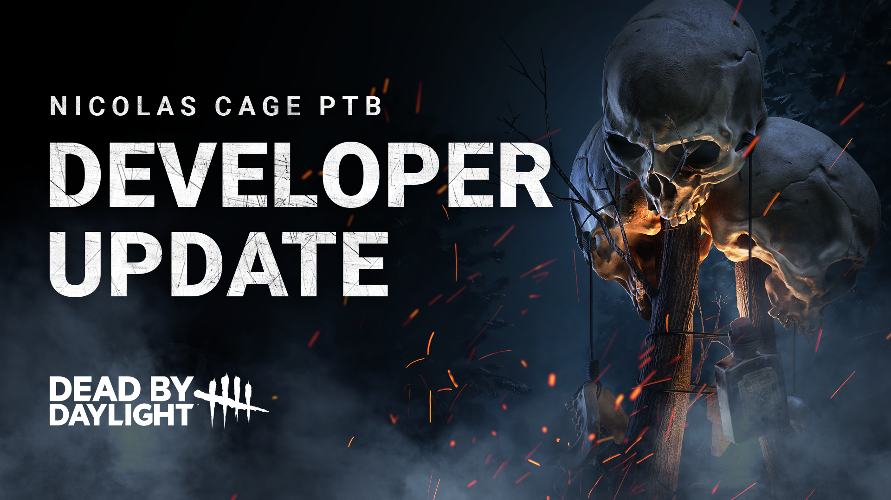
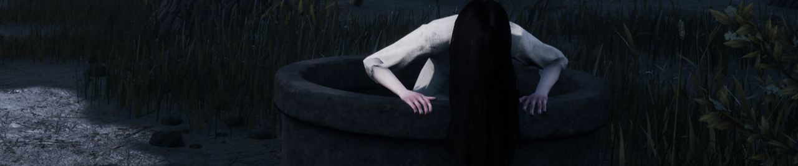
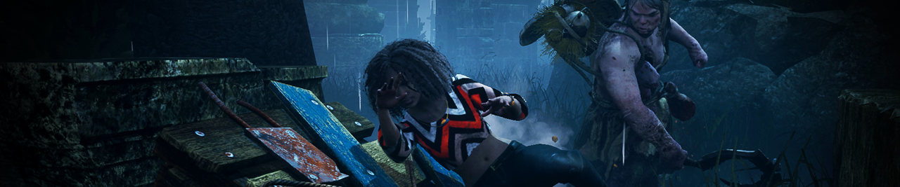

<!-- summary -->
## AI TL;DR

The Onryo received balance tweaks: hitting a survivor carrying a Cursed Tape now adds two Condemned stacks and destroys the tape, and hooking a tape-carrier no longer spreads Condemned. Projection cooldown is cut to 10 seconds (from 15) and TV disable times are lowered to 45 seconds for projection and 70 seconds for survivor-caused disables. Hangman’s Trick’s Scourge Hook aura range was doubled to 12 m, though this change will land in a future minor patch rather than the upcoming release. Planned blade-wipe animation changes were rolled back after causing motion-sickness. All adjustments stem from PTB feedback ahead of the Nicolas Cage Chapter launch.
<!-- /summary -->

<!-- nav -->
&larr; [Developer Update | July 2023](397-developer-update-july-2023.md) · [Developer Updates](../index.md#developer-updates) · [Developer Update | September 2023](409-developer-update-september-2023.md) &rarr;
<!-- /nav -->

# Developer Update | Nicolas Cage PTB

It’s been a little over a week since our star-studded Public Test Build (PTB). It’s been delightful to see so many Nicolas Cages running through The Entity’s Realm, screaming at the sight of the Killer and getting befuddled by Flashlights. As we get ready for the premier, we have been working on a few adjustments based on your feedback which we’d like to share with you today.

## The Onryo

We’ve been keeping a close eye (pun intended) on The Onryo to see how her balance update played out on the PTB. After reviewing your feedback, we’ve identified some opportunities for fine tuning before this update goes live.

**Cursed Tapes**

During the PTB, being hit with a basic attack while carrying a tape would cause you to gain a stack of Condemned. Additionally, being hooked with a tape would inflict all other Survivors with some Condemned as well. While risky to hold, these tapes protected you from gaining Condemned when The Onryo projects.

Though this did have the desired effect of making tapes a more active part of the match, we found that taking and holding a tape offered too much protection to Survivors. For the release, we have made the following adjustments:

- **Survivors who are hit while carrying a tape will now gain 2 stacks of Condemned, destroying the tape in the process.**
- **Being hooked while carrying a tape will no longer inflict other Survivors with Condemned. The tape will still be destroyed.**

This will allow The Onryo to more easily inflict Condemned on Survivors who are carrying a tape, even if she does not commit to the chase afterward. This also addresses a potential exploit that allowed the Killer to repeatedly down a Survivor who was carrying a tape to build Condemned with no opportunity for counterplay.

**Projection**

With Survivors having more reason than ever to pick up a Cursed Tape, it wasn’t unusual to find most TVs disabled at any given time. Though strategically shutting off TVs is an intended counterplay to The Onryo, we found this to be a little too restricting for the Killer, preventing her from projecting too often. Her ability to quickly and frequently traverse the map is one the most fun things about playing The Onryo, and so we have made the following tweaks.

- **Projection now has a 10 second cooldown** (was 15).
- **TVs disabled by projection now remain disabled for 45** seconds (was 100 seconds).
- **TVs disabled by Survivors now remain disabled for 70 seconds** (was 90 seconds).

Combined, these changes allow Sadako to project herself around the map far more frequently.

## Hangman’s Trick

Hangman’s Trick found itself in a tricky spot. Since it would reveal auras around every hook on the map, it wasn’t possible to increase its range without the Perk covering the entire map. Though it wasn’t performing as well as we would have liked, this made it very difficult to adjust.

For the PTB, we tested Hangman’s Trick as a Scourge Hook Perk, which allowed us to safely increase its effective range. Upon further review, we have decided to increase the range a little more before the update goes live.

While carrying a Survivor, Scourge Hook: Hangman’s Trick will now reveal the aura of Survivors **within 12m of a Scourge Hook** (double the previous range of 6m).

This change *will not* be available as of the update’s release, though you can expect it to appear in one of the following minor patches.

## Animations

In this past PTB, we reviewed the successful basic attack animation – or “blade wipe” for short – for Killers with the goal of making them behave more consistently. Previously, some Killers would look down during this animation, giving Survivors an opportunity to throw the Killer off their trail, while others would not. To remedy this, we adjusted all the blade wipe animations of the remaining Killers to have them look down in the process.

After monitoring these changes in action, we discovered that some players were experiencing motion sickness due to the added camera motion. As the camera would pan down, players naturally tried to combat this and looked up. These conflicting camera movements could cause the motion to feel unstable or “wavy”.

In order to address this, we have decided not to go through with these changes for the update’s release. We have reverted the animation updates to any Killers that were affected by this change.

With that, we have reached the end of this Developer Update. We invite you to walk the red carpet when the Nicolas Cage Chapter releases on July 25. As always, we look forward to hearing what you think once you’ve had the chance to try these adjustments out!

Until next time…

The Dead by Daylight team

<!-- nav -->
&larr; [Developer Update | July 2023](397-developer-update-july-2023.md) · [Developer Updates](../index.md#developer-updates) · [Developer Update | September 2023](409-developer-update-september-2023.md) &rarr;
<!-- /nav -->
