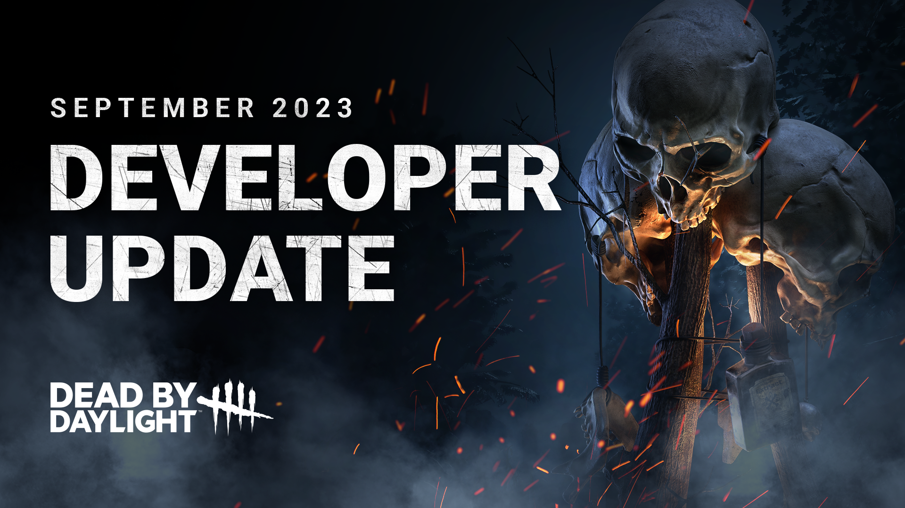
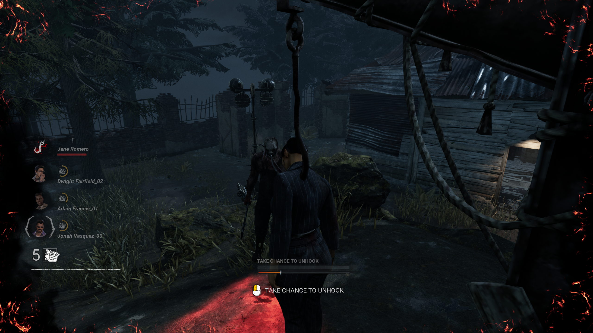
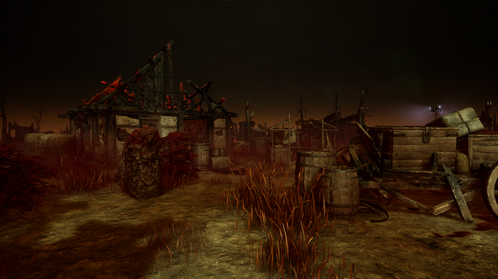
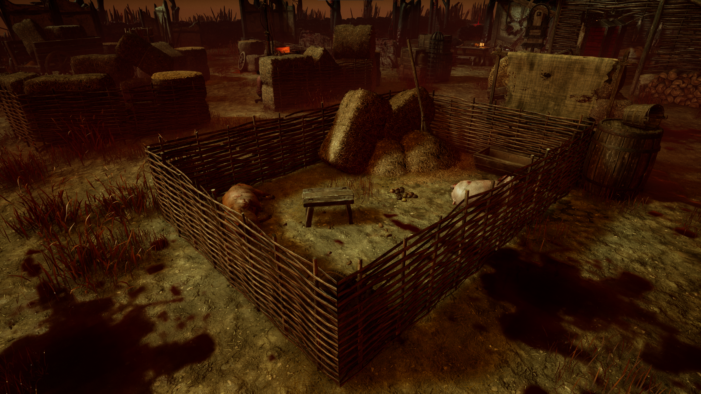
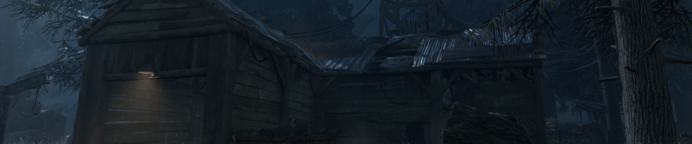
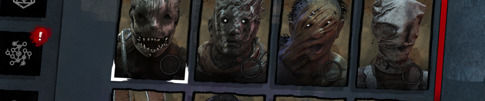

<!-- summary -->
## AI TL;DR

An anti-face-camping meter now appears on hooked Survivors, letting them unhook when the Killer stays nearby, but it disables after gates open. The Skull Merchant’s drones are overhauled: active zones are removed, drones gain Stealth and Scouting modes, three Lock-On stacks trigger a Claw Trap, and QoL tweaks raise drone count and reduce detection penalties, shifting her toward chase. Shattered Square is reshaped into a true square with clearer obstacles and shorter sightlines, and MacMillan Estate maps receive an alternate layout. Minor perk tweaks raise Furtive Chase’s terror-radius reduction and extend Background Player’s sprint boost. Killer balances add Bear-Traps and haste to Trapper, cut reloads for Huntress, Trickster and Deathslinger, and boost Legion’s speed. Changes land on PTB this week.
<!-- /summary -->

<!-- nav -->
&larr; [Developer Update | Nicolas Cage PTB](399-developer-update-nicolas-cage-ptb.md) · [Developer Updates](../index.md#developer-updates) · [Developer Update | October 2023](412-developer-update-october-2023.md) &rarr;
<!-- /nav -->

# Developer Update | September 2023

Spooky season is officially underway, and we’re getting in the spirit with a hefty Developer Update covering everything coming to the game within the next month. This time, we have news to share about new features, Killer updates, and various Perk & map changes.

## Anti Face-Camping

You probably don’t want to find yourself on the hook in the first place, but it can quickly become frustrating if the Killer decides to wait nearby, preventing all but the most coordinated of teams from rescuing you. Camping has long been a contentious topic: While there are times where camping is the smart thing for the Killer to do (if there are Survivors nearby, for example), there’s not much the Survivor being camped can do. To help in the most extreme cases, we are introducing a new feature which may give you a second chance.

Going forward, you’ll notice a new meter appears whenever you are on the hook. This meter will gradually fill whenever the Killer is near you. The closer the Killer is, the faster the meter will build. Once it is full, you’ll gain the ability to unhook yourself with a 100% chance of success, even during the second hook phase. Unhooking yourself in this way will grant you all the usual benefits such as Endurance and Haste.

To ensure that this cannot be abused by aggressive Survivors, the rate at which the meter fills will decrease – or potentially even stop entirely – when other Survivors are nearby. Additionally, once the exit gates are powered, this feature is disabled entirely. This is because at this point in the match, the Killer needs to do whatever they can to secure one last kill, so we can’t expect them to graciously leave the hook.

This new mechanic is intended to address the most egregious camping scenarios, discouraging Killers from standing too close to a hooked Survivor for an extended period and creating opportunities for the other Survivors to make the save.

## The Skull Merchant

It’s been a while since the sound of drones first filled The Entity’s Realm. Since then, The Skull Merchant’s Eyes in the Sky have largely been used as “eyes on the generators”, leading to some very long matches. In this update, we are overhauling The Skull Merchant’s drones to reduce their effectiveness in defending generators while improving their strength in a chase.

**Lock On**

Active zones – being the main culprit behind The Skull Merchant’s ability to defend generators – are no more. On top of making Survivors exposed, these zones provided The Skull Merchant with too much information on the Survivors within them, allowing the Killer to quickly react and chase them away.

With active zones removed, The Skull Merchant’s drones need a new way to lock onto Survivors. Now, whenever a Survivor is scanned by a drone’s beams, they will receive one stack of Lock On. Upon reaching three stacks of Lock On, the Survivor will immediately receive a Claw Trap.

However, avoiding a drone’s scanners won’t be easy thanks to the introduction of two new modes.

**Two Modes**

Eyes in the Sky will now have two modes: Stealth Mode, and Scouting Mode.

*In Stealth Mode:* The drone’s spinning beams will be invisible, and the drone will be much quieter. Survivors will want to watch closely for the lights on the drone itself to tell where the beams are so they can sneak up and disable it.

*In Scouting Mode:* The drone’s scan lines will be visible and rotate much faster, making them more difficult to approach or run by undetected.

In either mode, the drone’s scan lines **will not detect a Survivor who is stationary**, effectively preventing them from being used to guard generators. A Survivor can interact with a drone in either state to disable it for 45 seconds, after which they will return to Stealth Mode.

**Claw Traps**

Survivors who end up with a Claw Trap will find themselves on the receiving end of the following effects:

- If they are healthy, they will be instantly injured.
- If they are injured, they will receive Deep Wounds. This will **not** grant the Survivor a speed boost.
- The Survivor suffers from the Broken Status Effect until the trap is removed.
- Their location will be revealed on the Killer’s scanner for a short duration.

Additionally, Survivors with a Claw Trap who are scanned by one of the Killer’s drones:

- Receive a 10% movement speed penalty for 6 seconds.
- Are revealed to the Killer with Killer Instinct on their location for 3 seconds.

The Claw Trap’s battery will expire, and the trap will be removed automatically after 45 seconds.

**Quality of Life**

We have also made many adjustments across many aspects of The Skull Merchant to improve the way it feels to play as and against her:

- The Skull Merchant now has 6 drones available (was 4).
- The Skull Merchant will now immediately become Undetectable for 8 seconds after deploying a drone.
- The minimum distance between drones is now 16m (was 22m).
- The Killer’s movement speed is no longer decreased when checking the scanner.
- Lock On progress no longer decays.
- Drones can no longer be manually reactivated.
- Drones can now be placed above or below other drones deployed on different floors.
- Failing to hack a drone will now grant one stack of Lock On instead of instantly Locking On.
- The Skull Merchant’s footsteps are now quieter, making her harder to track behind walls.
- We have updated The Skull Merchant’s chase music.
- We have reviewed The Skull Merchant’s Add-ons, adjusting some and giving new effects to others.

Combined, these changes push The Skull Merchant’s drones in a more chase-oriented direction, giving them more immediate consequences when they are triggered rather than slowly building over time. At the same time, her ability to defend generators for excessive lengths of time has also been reduced substantially. We will be keeping a close eye on these changes and making further adjustments as needed.

## The Shattered Square

This update will feature a gameplay update to the Shattered Square map. When reviewing feedback for this map, we identified a few points of feedback we wanted to address.

**Low Obstacles**

It was possible to bump into some small objects, such as piles of hay or carcasses. Since these obstacles were so small, it was possible that you could bump into them without even seeing them, leading to some frustrating moments. We have done a pass on these sorts of objects to ensure that anything which might block your path is clearly visible, in most cases making them taller so they are easier to see.

**Size & Layout**

The Shattered Square is among the largest maps in the game, and contrary to its name, it isn’t even a square. It’s actually a rectangle! 🤯

The size of this map can make patrolling a little difficult. To help with this, we have reduced the size of the map (turning it into a proper square in the process). The positions of some tiles have been readjusted as a result.

**Line of Sight**

Most obstacles in the map tended to be fairly low, making it quite easy for Killers to spot Survivors at long ranges, and difficult for stealthy Killers to sneak up on Survivors. To break up these long sight lines, we have rearranged some tiles to limit how far you are able to see from any given point.

**Navigation**

Last but not least, we have made various changes to make the map easier to navigate. This includes making it clearer which objects can be walked on and which will block your path.

 

## The MacMillan Estate

Our work on maps doesn’t stop there, the entire MacMillan Estate Realm is being expanded. Each map in this Realm has received a second alternate version.

*What does this mean?* The next time you load into Suffocation Pit, for example, things might be a little different. The trademark mineshaft will still be there, but it may be in a different spot. The shape and layout of the map might also be slightly different.

The goal with these variants is to add more variety to existing maps without changing the unique properties that sets them apart, such as their size, a bottleneck or chokepoint that separates either side of the map, and so on.

## Perks

Next up, we have a few small tweaks for a handful of Perks.

**Furtive Chase**

Furtive Chase is one of the lesser used Killer Perks, providing a way to switch Obsessions throughout the match and reduce your Terror Radius during a chase. To give this Perk a slight boost, **we are increasing the Terror Radius reduction for each token to 5 meters** (was 4 meters) for a maximum of 20 meters.

**Background Player**

This Perk allows you to sprint very quickly when the Killer picks up another Survivor, creating an opportunity to get into position for a save. Not only is this Perk highly situational, but it leaves you Exhausted, which could hinder you if you’re chased shortly after. To make sure this Perk is meaningful when it activates, **we are increasing the duration of the speed boost to 5 seconds** (was 4 seconds).

## Killer Tweaks

To cap things off, we also have a short list of adjustments for a few different Killers. As usual, these are smaller scale tweaks that we manage to squeeze into various updates.

**The Trapper**

The Trapper fills a very unique role in Dead by Daylight. Since he is all over the cover and is unlocked right away, he ends up being a lot of people’s first experience playing as Killer. Because of this, we try to keep him as simple and straightforward as possible: See a trap, set a trap. Among newer players, The Trapper already performs fairly well, and we don’t to throw off that balance too much. That said, in higher end matches, The Trapper can struggle to keep up. To assist in those cases, we have made a few changes:

- **8 Bear-Traps will now spawn on the map** (was 6).
- **The Trapper will receive a 7.5% Haste effect after setting a Bear-Trap.**

We expect these changes to have a minimal impact in lower skill matches where The Trapper is already performing well but provide a nice boost to higher end players who know how to take advantage of them. Additional Bear-Traps will help ensure that you have an adequate supply particularly on larger maps, and the added Haste effect can help close the gap in case Survivors catch on and begin running away while you set them.

**The Huntress & The Trickster**

For both these Killers, reloading your projectiles at a locker is a must. However, doing so gives Survivors a big head start to run away and gain some distance. For this reason, many Huntress & Trickster players will run Add-ons or Perks like Iron Maiden to reduce their reload time. To improve quality of life and reduce reliance on these Perks & Add-ons, **we have reduced the reload time for each Killer to 3 seconds** (was 4 seconds).

**The Deathslinger**

Speaking of reloads, The Deathslinger will also find himself reloading very frequently. Because of this, Add-ons which reduce his reload time see a lot of use. To make these Add-ons less essential, we have taken part of the effect of the Warden’s Keys Add-on and incorporated it into the base kit and adjusted this Add-on accordingly. **The Deathslinger now reloads in 2.6 seconds by default** (was 2.75).

Second, we have increased the movement speed bonuses while aiming down sights for both the Jaw Smasher and Wanted Poster Add-ons to 1.5% and 3% respectively (was 1% and 2.5%) to make them more interesting choices to consider.

**The Legion**

Lastly, we’ve adjusted The Legion’s BFFs Add-on. This Add-on granted a 4% movement speed increase when the gates were powered so long as the Killer managed to land enough Feral Frenzy strikes during the match. Since this effect needed to be earned and is only active during the very end of the match, **we are increasing this movement speed bonus to 6%** to make it more impactful.

With that, we’ve reached the end of this month’s Developer Update. Each of the features and adjustments mentioned in this post will be available to try on the Public Test Build starting this week, with the full update going live on all platforms at a later date. For the first time, join us tomorrow at 10am ET in the [Dead by Daylight Discord server](https://discord.com/invite/deadbydaylight) as our designers run through the full patch notes early. As always, be sure to let us know what you think after you’ve gotten your hands on them!

Until next time…

The Dead by Daylight team

<!-- nav -->
&larr; [Developer Update | Nicolas Cage PTB](399-developer-update-nicolas-cage-ptb.md) · [Developer Updates](../index.md#developer-updates) · [Developer Update | October 2023](412-developer-update-october-2023.md) &rarr;
<!-- /nav -->
