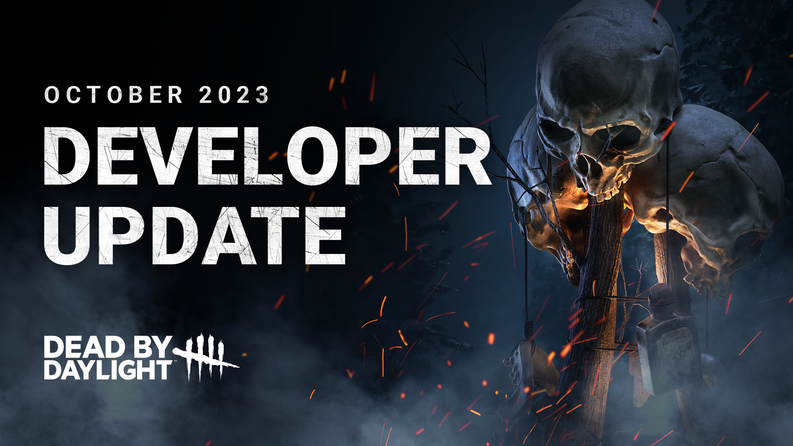
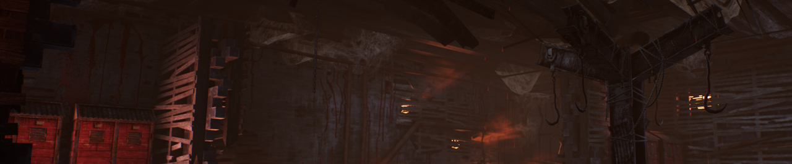
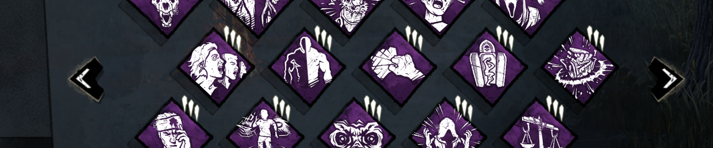
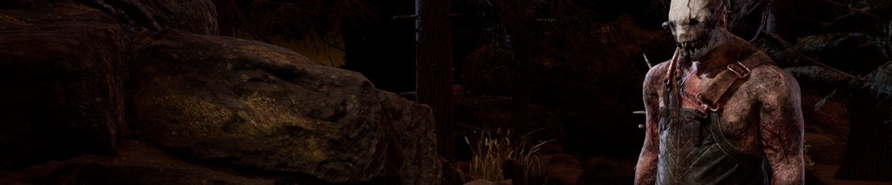
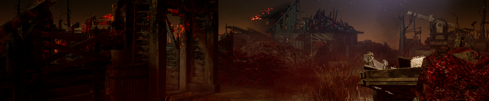
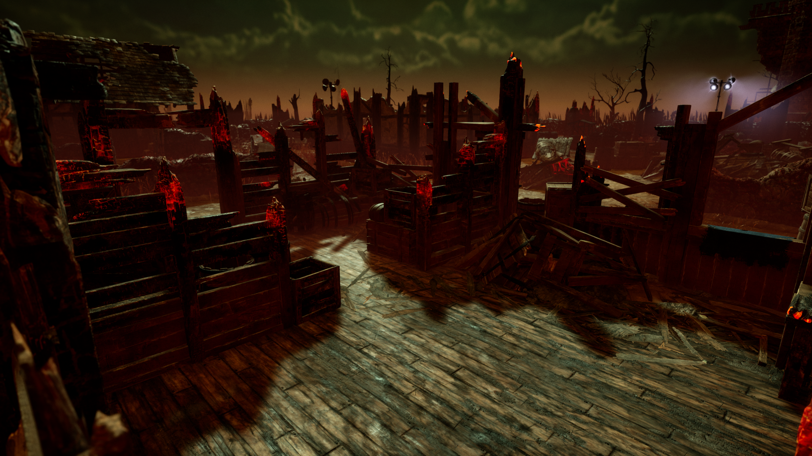

<!-- nav -->
&larr; [Developer Update | September 2023](409-developer-update-september-2023.md) · [Developer Updates](../index.md#developer-updates) · [Developer Update | November 2023](416-developer-update-november-2023.md) &rarr;
<!-- /nav -->

# Developer Update | October 2023

Greetings ghosts and ghouls! We’re back with another Developer Update, this time covering all the adjustments on the way following our last Public Test Build (PTB). We unveiled some major changes during this PTB, including the new Anti Face-Camping mechanic and an overhaul to The Skull Merchant’s Power. You’ve left us with plenty of feedback to go through, and we’d like to share a few tweaks we’ll be making when this update goes live (and a few more in the minor patches that follow)!

## The Skull Merchant

With the overhaul on the PTB, we set our sights on the frustrating strategies that emerged due to how The Skull Merchant’s Power worked. While we’re pleased to see that she was no longer a gen-defending powerhouse, we noticed many felt that she was left in a weaker state. The intent of this update is not to weaken this Killer overall, so we’ll be making a series of adjustments to address some of the feedback we received.

**Scanning**

During the PTB, many Killers reported having difficulties scanning Survivors with their drones, making the frequency of Lock On lower than we’d like. To ensure that her Eyes in the Sky truly are *tools of torment*(sorry), we have a series of changes in store.

First, we noticed that because drones always rotated clockwise, it was far less likely that Survivors would be scanned if they were also running a loop clockwise since the beams would cross their path less often. This is most noticeable on tiles which Survivors ideally want to run in a clockwise direction anyway to line themselves up for a fast vault.

To remedy this, **The Skull Merchant can now toggle the direction her drones rotate** while using her radar.

This way, you can swap directions to force the beam to cross a Survivor’s path more often. Experienced Killers who know the best ways to run certain tiles will also be able to pre-emptively choose the best direction for the loop they’ve deployed their drone in.

Second, some found drone management to be a little stressful, largely since recalling a drone would put your Power on cooldown. This forced the Killer to rush to recall drones that are no longer needed whenever they had a moment of downtime so their Power was ready for their next chase.

To address this, **drones can now be recalled at any time**and**recalling a drone no longer incurs a cooldown**.

**Eyes in the Sky**

Third, we’ve made a series of smaller adjustments to make it harder for Survivors to cross through a drone’s effective area without being scanned:

- **Increased the drone’s radius to 10m** (was 8m).
- **Increased the drone’s rotation speed in Stealth Mode to 60 degrees per second** (was 50).
- **Increased the drone’s rotation speed in Scouting Mode to 85 degrees per second** (was 75).

Lastly, to give The Skull Merchant more control when deploying a drone, **the drone’s beams now face directly in front and behind her by default,** allowing skilled Killers to scan Survivors as soon as they’re deployed. We have also **decreased the drone’s initialization time to 0.3 seconds** (was 1.5 seconds) so they activate more quickly and feel more responsive.

Combined, these changes will make The Skull Merchant feel better to play and more consistent now that her drones can’t be used to defend generators.

## Anti Face-camping

Anti Face-camping is here- and so is the Killer. This mechanic aims to provide Survivors with counterplay for some of the most egregious cases of camping. From what we observed on the PTB, the system seems to come to the rescue when needed most, though we’ll of course continue monitoring and make adjustments as needed. However, there were a few rough edges which we’re looking to refine before this goes live.

**Grace Period**

One of the most common critiques of this mechanic comes from the way the meter immediately starts to fill before the Killer could possibly walk away. Although this alone wouldn’t cause Survivors to free themselves, this understandably feels as if the game is wrongly treating you as if you’re camping.

There will now be a**7 second grace period before the meter starts filling after hooking a Survivor**. This will give the Killer an opportunity to walk away before the system kicks in, with a little wiggle room to kick a nearby generator or reload at a locker.

**Dying & Carried Survivors**

During the PTB, dying and carried Survivors did not influence the fill rate of the meter. The former led to some awkward scenarios where a dying Survivor with a Perk that allowed them to pick themselves up could force the Killer to stay nearby, while the latter both exacerbated that strategy as well as punishing the Killer for hooking multiple Survivors in the basement.

Therefore, **dying will slow the meter (as though they were standing) so long as they are in the area, and carried Survivors now pause the progress bar completely**.

**Verticality**

When this feature was tested on the PTB, it treated both horizontal and vertical distances equally. However, this had a side effect of detecting Killers on different floors as camping even if the shortest path to the hooked Survivor was rather long. This was especially noticeable on indoor maps such as The Game.

In a later update, **the meter will be weighted more heavily toward horizontal distance than vertical**. This will make the meter a little more forgiving if the Killer passes by on another floor.

## Perk Updates

We received a bunch of feedback on the two Perks which were tweaked in this past PTB, so we went back to the drawing board to deliver a new set of changes.

**Furtive Chase**

We initially increased the terror radius reduction for each token, though many still did not find this a very appealing choice. Furtive Chase will be receiving a rework when the update goes live.

**When hooking the Obsession, gain Undetectable and a 5% Haste status effect for 14/16/18 seconds.** When the Obsession is rescued from the hook, the rescuer becomes the Obsession (unchanged).

With this new version, Furtive Chase rewards the Killer for switching targets and allows them to find a new Survivor to chase more quickly after hooking.

**Background Player**

This Perk is most often used for saving teammates, allowing you to get into position quickly in key moments. However, since the Killer’s pickup animation is shorter than the Perk’s duration, it would usually be too late to save your teammate by the time the speed boost ended.

Therefore, **Background Player now causes you to sprint at 200% speed** (was 150%) **for 5 seconds**(was 4 seconds) **when the Killer picks up a dying Survivor**.

This way, Background Player will allow you to cover more distance quicker than before, potentially allowing you to get into position in time to make the save.

## The Trapper

We were delighted to see such a positive reaction to the adjustments we made to The Trapper. As we dug through the PTB feedback, we noticed many of you found it impractical to wander so far to gather your traps at the start of the match. While The Trapper is still in the spotlight, we’ve decided to make one more change as soon as we’re able to.

**The Trapper’s Bear-Traps will spawn closer to generators.** This way, you’ll have to stray less from your usual patrol routes than before to collect a trap.

Unfortunately, we weren’t able to squeeze this change into the initial release, but this will be a part of one of the smaller patches in the coming weeks!

## Shattered Square

Last but certainly not least, we have a few more adjustments on the way for the Shattered Square. We received some feedback regarding the strength of certain pallet loops and the number of pallets overall. For the update’s release, we have **reviewed the loops in question** and **slightly reduced the number of pallets which spawn**.

And that brings us to the end of this Developer Update! We want to thank you as always for taking the time to test out the changes on the PTB. Nearly all the adjustments mentioned in this post will be available when the update releases, with the rest following in a minor patch shortly after. We look forward to hearing what you think!

Until next time…

The Dead by Daylight team

<!-- nav -->
&larr; [Developer Update | September 2023](409-developer-update-september-2023.md) · [Developer Updates](../index.md#developer-updates) · [Developer Update | November 2023](416-developer-update-november-2023.md) &rarr;
<!-- /nav -->
