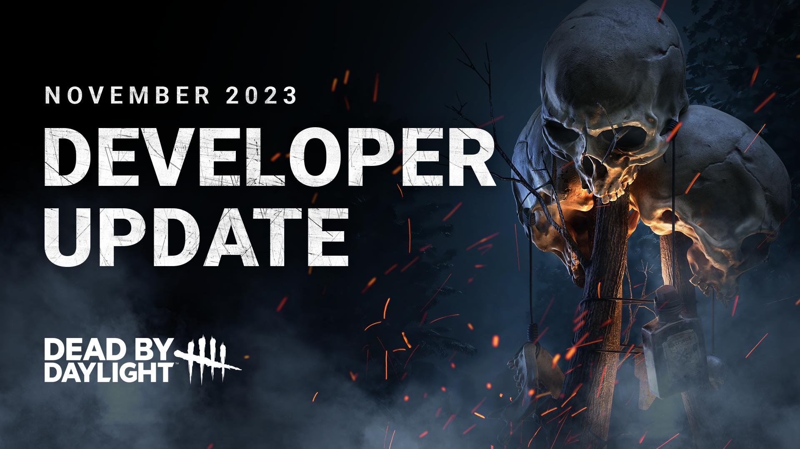
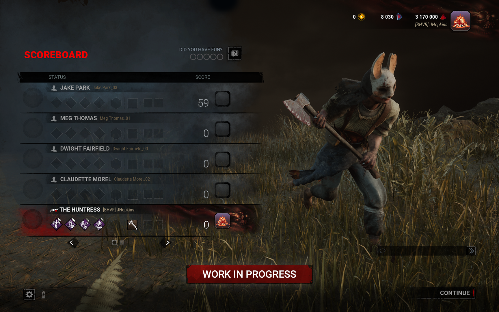
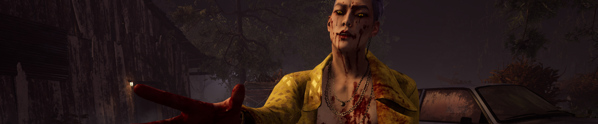
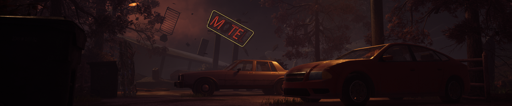
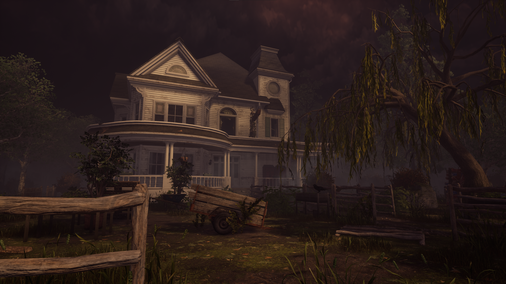
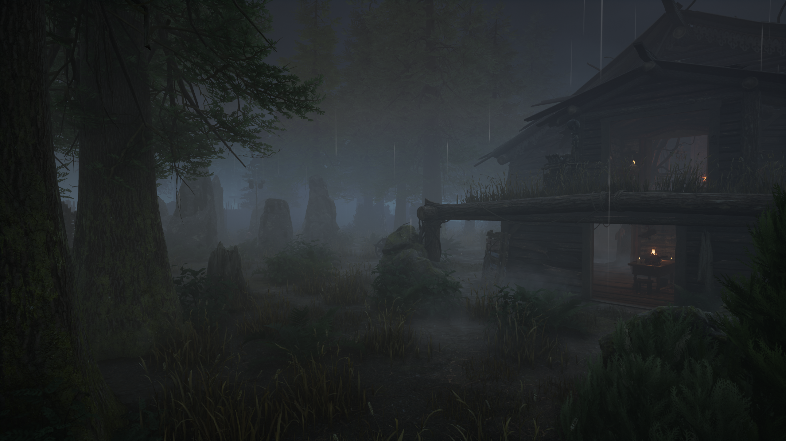
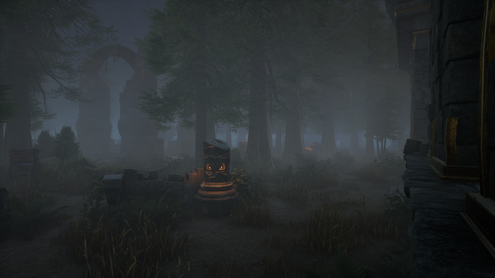

<!-- summary -->
## AI TL;DR

Player Cards arrive as a new decorative banner and badge system, visible in menus and post-match scoreboards, with rarity-based visuals and future expansion. The Trickster receives a major overhaul: blade fire rate rises to four per second, recoil is removed, laceration meter expands to eight hits and decays faster, movement speed climbs to 4.6 m/s with a larger terror radius, and Main Event now charges after six blades and lasts five seconds, plus several add-on tweaks. Garden of Joy and Red Forest maps get layout, pallet loop and visual adjustments, and both realms’ size is reduced for better pacing. All changes appear in the PTB starting Nov 8, with a full rollout in the following weeks.
<!-- /summary -->

<!-- nav -->
&larr; [Developer Update | October 2023](412-developer-update-october-2023.md) · [Developer Updates](../index.md#developer-updates) · [Developer Update | November 2023 PTB](420-developer-update-november-2023-ptb.md) &rarr;
<!-- /nav -->

# Developer Update | November 2023

The end of the year is almost upon us, but we’ve still got news to share. In this Developer Update, we’ll cover some of the new features and balance changes making their way to the game in our next update, including a new customization option, a sizeable update to an existing Killer, and gameplay passes for two Realms.

## Player Cards

A new customization option has arrived! Player Cards are decorative banners and badges which appear in the top right corner of various menus. Your Player Card will also be featured in the post-match scoreboard so other players can see them as well.

Banners and badges can be mixed and matched as you please, and higher rarity ones will be more detailed with some even being animated. Like other cosmetics, you’ll be able to be earn them in various ways, such as events, the Rift, through login rewards or promocodes, and so on.

With this update, we’ve also cleaned up the menus and moved your player level and grades to a new Player Profile screen, accessible by clicking on your badge.

A small selection of Player Card options will be available starting with this update, but you can expect to see a wider range of choices appearing over time.

## The Trickster

When he’s not working on his next album, he’s following his other passion: Throwing a boatload of knives at Survivors. In this update, we’re aiming to address points of frustration for both sides. For Killers, many feel like The Trickster doesn’t quite stack up to the other ranged options. For Survivors, dodging Blades could feel inconsequential since so few would injure you, making it feel unavoidable. We’ll be making a series of balance and quality of life changes to our resident rapid fire ranged Killer.

### Rapid Fire

The Trickster’s fast-paced attacks are what set him apart from other ranged Killers, so we wanted to focus on this rapid fire ‘machine gun’ gameplay for this update. We asked ourselves: What’s better than throwing a bunch of knives? Answer: *Throwing* *even more knives.*

**The Trickster** **now throws 4 Blades per second** (was 3 Blades per second) by default, and his **throw rate no longer increases with each Blade thrown**.

To keep this feeling fair for Survivors, **we have also increased the laceration meter to 8 hits** (was 6), as well as **decreased the time before it decays to 10 seconds** (was 15). This means that the laceration meter will fill at the same rate as before, but successfully dodging Blades will be a little more rewarding.

Lastly, recoil when rapidly throwing Blades can be tricky to deal with, particularly for those playing with a controller. Therefore, **we have removed recoil entirely**.

This will make your Blades easier to control, making them more skill dependent. The downside: You won’t be able to blame the recoil for that Blade you missed.

### Fast Paced

To compliment his quicker throws, we have also reviewed The Trickster’s movement speed. **The Trickster now moves at 4.6m/s by default** (was 4.4m/s). This puts him on par with other fast Killers, and as a result, **The Trickster’s Terror Radius has been increased to 32m** (was 24m).

This will not only help him close the gap during a chase, but also spend less time traversing the map looking for his next target.

Combined, these changes will leave The Trickster feeling much more agile and fast paced.

### Main Event

Main Event allows you to throw *even more Blades even faster*. However, this required you to hit quite a few Blades to activate first, taking several chases to charge up. This made it feel fairly rare for the Killer, but also made it a little frustrating if you happened to be the unlucky Survivor to be caught when it was finally activated. As a result, we are making the following changes:

- **Main Event now requires 6 Blades to charge** (was 30).
- **Main Event’s duration has been reduced to 5 seconds** (was 10).

These changes will make Main Event available much more often but require the Killer to use it strategically to take advantage of it.

### Add-ons

Lastly, we have reviewed the effects of a handful of his Add-ons:

- **Memento Blades:** *New Effect –* Decreases time between Blade throws by 5%.
- **Inferno Wires:** Increases duration of Main Event by 40% (was 25%).
- **Ji-Woon’s Autograph:** *New Effect -* Decreases the number of Blades required to charge Main Event by 1.
- **Tequila Moonrock:** Increases duration of Main Event by 60% (was 50%).
- **Fizz-Spin Soda:** *New Effect -* Decreases the number of Blades required to reach Main Event by 2.
- **Waiting for You Watch:** Increases the duration of Main Event by 0.25 seconds for each Blade hit while it is active (was 0.4 seconds).
- **Iridescent Photocard:** *New Effect -* For each consecutive Blade hit, gain a stackable 1% Haste effect, up to a maximum of 7%. This bonus is lost when missing a Blade or putting a Survivor into the dying state.

## Made For This

Even a small speed boost can make a big difference in the right hands, making some Survivors very difficult to catch. Since Made For This would activate as soon as a Survivor became injured, this Perk would often be unavoidable. To make this fairer and create opportunities for Killers to play around it, we have added an additional condition to the Haste effect.

After healing another Survivor, gain the Endurance Status Effect for 6/8/10 seconds (unchanged). **While you are affected by Deep Wounds, you run 3% faster**. Since this is much more situational, this effect now applies while Exhausted as well.

With this change, the Killer can potentially prevent Made For This’ speed boost from activating entirely by avoiding inflicting Deep Wounds on that Survivor. This also ties both of Made For This’ effects together, granting a way to gain Deep Wounds in order to make use of the Haste effect.

## Garden of Joy

Joy for some, at least. We have gathered and reviewed feedback for the Garden of Joy map, and in this update, we’ll be making a series of changes to improve gameplay.

First, we turned our attention to the windows of the large house. Previously there were several strong windows which granted Survivors plenty of distance each time they were vaulted, making some chases drag on. We have reviewed the layouts of these windows & breakable walls to make chases in this building fairer.

Second, we have rebalanced several pallet loops to bring them closer to the sweet spot where they are both useful to Survivors and have the potential for Killers to play around them. We have also cleaned up certain loops and removed some small objects which players might bump into by mistake.

Lastly, we have made a few art changes throughout the map to both improve visibility of objects which block your path and introduce small pieces of lore throughout the environment.

## Red Forest

The Red Forest is home to both Mother’s Dwelling and the Temple of Purgation. We have similarly reviewed feedback for both maps and are making a series of changes to improve gameplay on them as well.

First and foremost, size: These two maps are some of the largest in the game. This can cause some gameplay issues, costing the Killer a lot of time to cross from one end to the other in search of Survivors. We are reducing the size of both maps to bring them more in line with the rest of the Realms.

Second, we’ve reviewed various pallets loops and reduced the amount of vegetation surrounding them, making it easier to identify loops at a glance.

With that, we’ve reached the end of this Developer Update. Everything mentioned in this post will be available to try in the Public Test Build, planned to start November 8, with the update going live on all platforms in the weeks following. We look forward to hearing what you think!

Until next time…

The Dead by Daylight team

<!-- nav -->
&larr; [Developer Update | October 2023](412-developer-update-october-2023.md) · [Developer Updates](../index.md#developer-updates) · [Developer Update | November 2023 PTB](420-developer-update-november-2023-ptb.md) &rarr;
<!-- /nav -->
