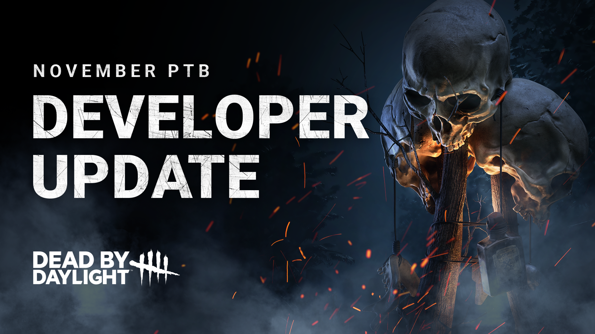

# Developer Update | November 2023 PTB

For possibly the last time this year, we’re back with another Developer Update, a series of posts covering everything coming to Dead by Daylight. This time around, we have a pint-sized post focusing on all the changes being made after this past Public Test Build (PTB).

## The Good Guy

We were thrilled to see Chucky receive such a warm welcoming during the PTB – he is your new friend ‘til the end, after all! First impressions seemed to be positive, so we’ll be keeping changes to the Dead by Daylight: Chucky content minimal for the full release.

First up, to ensure that Survivors have a chance to react, we have **slightly increased the time it takes to Scamper under a pallet to 1.4 seconds** (was 1.2 seconds). Similarly, we’ve **adjusted the Killer’s movement speed after missing a Slice & Dice attack** to allow the Survivor to gain more distance after a successful dodge.

Second, we’ve fine-tuned the Slice & Dice attack. Duration extending Add-Ons (such as Jump Rope) were strong favorites. To reduce reliance on these Add-Ons and make others more appealing, we’ve reduced the effects of these Add-Ons and incorporated part of their effects into the base kit. **Slice & Dice’s duration has been increased to 1.2 seconds** (was 1 second).

Speaking of Add-Ons, we’ve done a balancing pass on many of the other Add-Ons, bringing the strongest and weakest options more in line with one another.

## Batteries Included

Last up, we have a small tweak to one of the new Perks, Batteries Included. This Perk gives the Killer a lingering speed boost when they pass by a powered Generator. But there’s a *slight* problem with this: When the last Generator is powered, *all Generators* become powered. This made the Perk far stronger during the end game than intended, especially on smaller maps and/or when paired with other Perks such as Hex: No One Escapes Death.

Rather than reducing the effects of the Perk, we are instead adding a new clause: **Batteries Included now deactivates when the exit gates are powered**.

## The Trickster

This past PTB featured a bundle of balance changes for The Trickster, aiming to improve his lethality and make him feel better to play. While these changes did make The Trickster stronger, many felt they made him a little too powerful, making him difficult & frustrating to play against. With this in mind, we have a few adjustments on the way for when the update will be released.

First: **We are reverting The Trickster’s throw rate to 3 blades per second** (was 4 during the PTB). This will give Survivors a little more time to break line of sight before they are injured. The laceration meter will remain at 8 blades like in the PTB, but his increased movement speed will help The Trickster catch up to Survivor to land a few more blades more often.

Second: Although we’d like for Main Event to happen more often than it historically has, we found that it was a little too easy to earn during the PTB. This was especially true when certain Add-Ons were used, allowing it to be charged up with just a few blades.

Going forward, **Main Event will require 8 blades to activate**.

Similarly, we have replaced the effects of a handful of Add-Ons, most of which interact with Main Event:

- Ji-Woon’s Autograph: New Effect – Increases the time before a combo ends by 10%.
- Fizz-Spin Soda: New Effect – Increases the time before a combo ends by 15%.
- Death Throes Compilation: New Effect – Reveal the aura of Survivors hit during Main Event for 6 seconds.
- Iridescent Photocard: The Haste bonus is now lost when a Survivor is injured (previously when a Survivor entered the dying state).

With that, we’ve reached the end of another Developer Update. Each of the changes discussed in this post will be available when the update is released on November 28. We hope you have a blast with your new friend ‘til the end, and we look forward to hearing what you think.

Until next time…

The Dead by Daylight team
