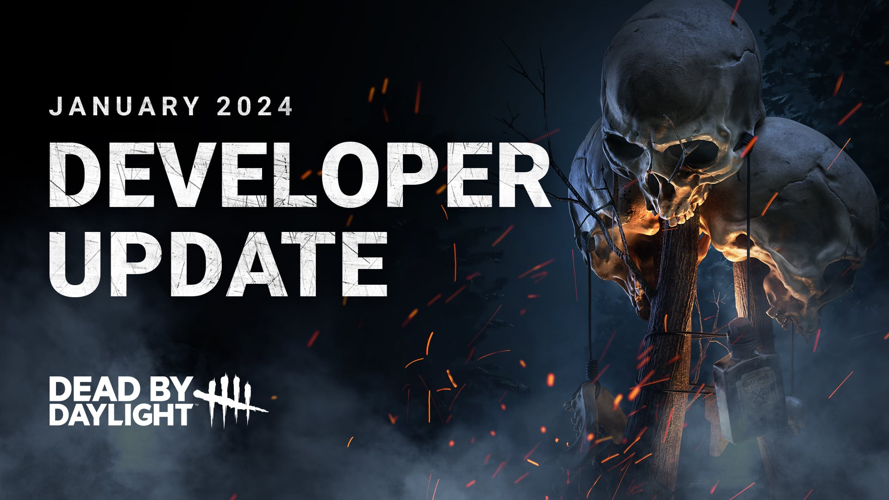
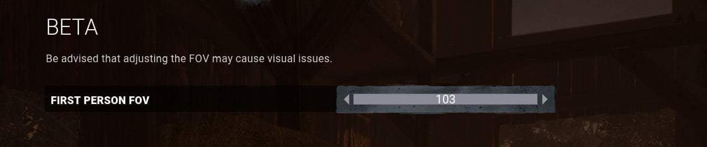
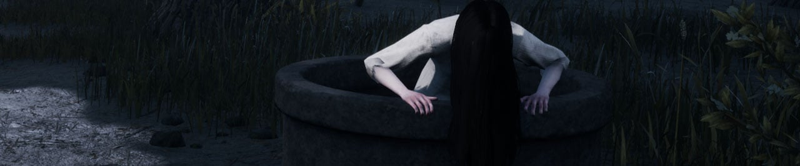
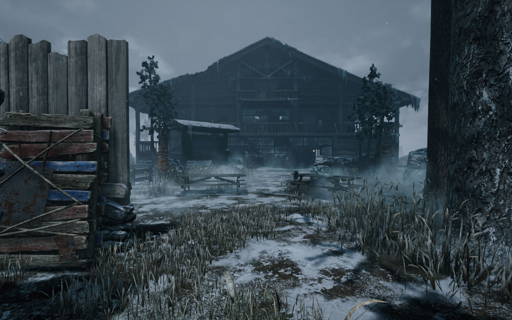
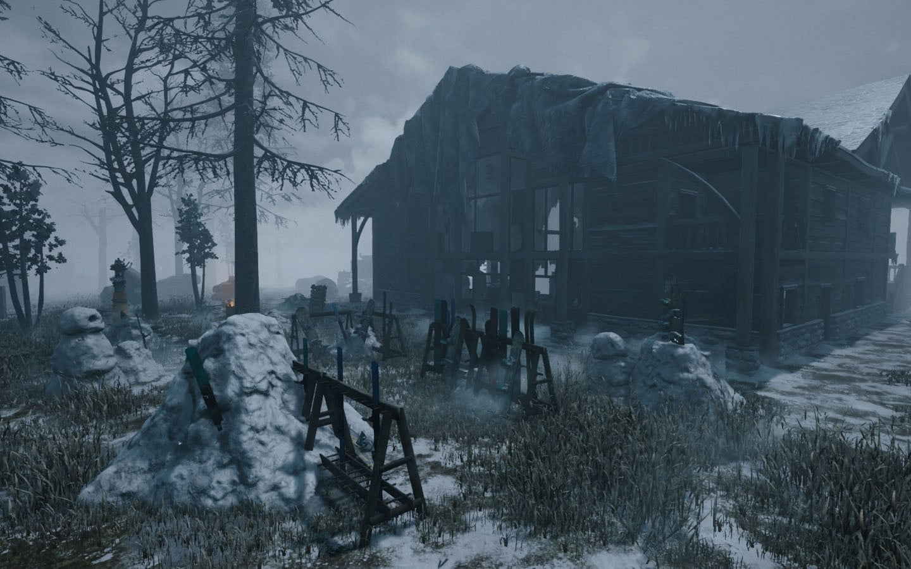

<!-- summary -->
## AI TL;DR

The January 2024 developer update introduces key gameplay tweaks: generator regression is capped at eight events and kick damage raised to 5%; a new FOV slider (87-103°) for killers; The Onryo’s Condemned mechanics, cursed-tape behavior, and ability to chase while Demanifested are restored; The Hillbilly’s Overheat is replaced by Overdrive and his chainsaw sprint is faster; The Blight’s add-ons are rebalanced; perks Save the Best for Last, Grim Embrace, Quick Gambit, Hex: Ruin, Shadowborn and Monitor & Abuse receive adjustments; and Mount Ormond’s layout is overhauled.

All changes will be testable on the Public Test Build starting tomorrow, with the full live release scheduled for the weeks after. A limited-time Lights Out modifier is also announced for future months.
<!-- /summary -->

<!-- nav -->
&larr; [Developer Update | November 2023 PTB](420-developer-update-november-2023-ptb.md) · [Developer Updates](../index.md#developer-updates) · [Developer Update | January 2024 PTB](429-developer-update-january-2024-ptb.md) &rarr;
<!-- /nav -->

# Developer Update | January 2024

Happy new year! Our team is back in action, and we’ve got a doozie of a Developer Update in store for you today. In this edition, we’ll be covering everything coming to Dead by Daylight in our first major update of the year, from various Killer, Perk, and Map updates and more. We’ve been busy, so buckle up, it’s a long one.

## Generators

Kicking things off (no pun intended), we have a few updates to Generators. More specifically, these changes target how Generators are damaged by the Killer and how their regression can be stopped by Survivors. The goal with this update is to bring an end to excessively long matches (3 gen scenarios in particular) and at the same time improve the Killer’s ability to damage Generators. 3 gen scenarios are those where the killer aims to defend 3 generators that are close by in particular, and does not participate in normal gameplay – not chasing survivors etc, in this instance survivors are not able to make any meaningful progress to those generators.

Going forward, **each Generator can only suffer from a maximum of 8 ‘regression events’** – where a regression event is any time the Killer or their Perks removes at least 2.5% of the Generator’s progress in an instant. An indicator will show the Killer if a Generator can no longer be damaged. In the overwhelming majority of games, this will not come into play. However, in scenarios where the Killer is defending a set of Generators and refusing to chase Survivors, there will eventually come a point where they can no longer damage the Generator, helping bring an end to excessively long matches.

At the same time, we want to address a point of frustration for Killers as well: Survivors working on a generator briefly to stop it from regressing, or “Gen tapping” for short. Given that the number of regression events is now limited, stopping a Generator from regressing is more meaningful than ever. To prevent Survivors from tapping a Generator to negate one of those regression events, we have made two changes:

- **The base damage from kicking a Generator has been increased to 5%** (was 2.5%).
- **At least 5% of the Generator’s total charges must be repaired to stop regression**, otherwise it will begin regressing again when the Survivor stops repairing.

This will help ensure that the Killer always gets some value from kicking a Generator and encourage Survivors to think twice before attempting to stop the regression.

## FOV Setting

Is Shadowborn permanently locked into one of your Perk slots? Well, that’s about to change thanks to the new first-person field of view (FOV) slider. Starting with this update, Killers in first person will be able to adjust their FOV to something they’re more comfortable with, ranging from 87 degrees (the current default) to 103 degrees (the current maximum with Shadowborn).

Perks which alter your FOV (Shadowborn and Monitor & Abuse) will need to be adjusted. We’ll cover exactly how those Perks are changing later in this post.

Bear in mind this option only applies to first person field of view and therefore will not affect Survivors. Since Survivors play the game from the third person perspective, a wider FOV would add to an already advantageous camera view.

Initially this feature will be accessible through the Beta Tab in game.

## The Onryo

A few months ago, we released a major update to The Onryo. Though some players were pleased with the changes, many longtime Onryo mains felt that her gameplay had changed too much from the Killer they once loved. In this update, we want to revisit Sadako once more to find a middle ground which better appeals to all her players, old and new.

**Condemned**

In the last update, Condemned would spread to *all* Survivors who were not holding a tape whenever Sadako projected to a TV. This allowed her to spread her curse more often, but many felt that this favoured teleporting as soon as possible rather than strategically during a chase. We have a few changes in mind to restore this gameplay while keeping Condemned more prominent:

- When The Onryo teleports, Survivors within 16m of a powered TV will receive a stack of Condemned.
- The teleport cooldown has been removed, allowing her to teleport more frequently.
- When a Survivor is hooked, their current Condemned progress becomes locked in, preventing it from being removed.

This will make it very risky for Survivors to ignore Sadako’s curse. Survivors will want to shut off nearby TVs and deposit their tapes before it’s too late. Speaking of tapes…

**Cursed Tapes**

We’ve also reviewed the way Cursed Tapes work to bring back some of their fondly remembered behaviour.

- Cursed Tapes no longer protect Survivors from gaining Condemned.
- Cursed Tapes are no longer destroyed or inflict Condemned when a Survivor is hit.
- Cursed Tapes can only be deposited in the furthest TV from where they were picked up.

This will once again force the Survivors to spend some time crossing the map in order to delay the curse.

**Demanifested**

The previous update made it so The Onryo couldn’t start a chase while Demanifested. This had a side effect of making it very obvious when she Demanifested in the middle of a chase, allowing Survivors to anticipate and play around it.

- The Onryo can now chase Survivors while Demanifested.

Additionally, many pointed out that one of The Onryo’s changed Add-Ons, Reiko’s Watch, was very fun to use. Rather than add the effect back into the Add-On, we instead incorporated it into her base kit to make the Add-On feel less essential.

- The duration of invisibility while Demanifested has been increased to 1.2 seconds (was 1 second).

**Add-Ons**

With all these changes in mind, we’ve reviewed a handful of The Onryo’s Add-Ons which either no longer have a purpose or promoted strongly disliked playstyles.

## The Hillbilly

Uh oh, watch out Survivors, it looks like someone unwrapped a brand new chainsaw. It’s The Hillbilly’s turn for an update!

**Overdrive**

The controversial **Overheat mechanic is no more**; Overdrive is the new talk of the town. As The Hillbilly uses his chainsaw, it will generate heat just like before. When the heat meter is full, not only will he continue being able to use it, but his chainsaw will kick into Overdrive and gain the following effects for the next 20 seconds:

- Chainsaw charge speed is increased by 5%.
- His Chainsaw Sprint movement speed increases to 13m/s.
- Chainsaw Sprint cooldowns are reduced by 10%.

The short version? Heat is good now.

**Cleaning Up**

At the same time, we’ve made some general improvements to The Hillbilly’s kit and smoothed out some of the rougher edges.

- The base Chainsaw Sprint movement speed has been increased by 10%.
- Reduced the size of the Chainsaw’s collision detection  to make Chainsaw Sprints more maneuverable in maps with high density tiles
- Camera sensitivity is no longer incorrectly tied to the controller sensitivity setting while using a mouse & keyboard. (Chainsaw controls are now equal to 100% sensitivity before.)

**Add-Ons**

Last but certainly not least, we have done a pass on The Hillbilly’s Add-Ons with these changes in mind. This blogpost is long enough as is, so keep an eye on the patch notes when the Public Test Build (PTB) goes live for more details!

## The Blight’s Add-Ons

Next up, we have changes in store for a handful of The Blight’s Add-Ons.

**Blighted Rat & Blighted Crow**

These Add-Ons are fairly strong, making it far more difficult to get out of the way of his Rush in time. We have reduced the Rush speed bonus of these Add-Ons to 2% and 3% respectively (was 4% and 6%).

**Adrenaline Vial**

This Add-On has a lot going on, making it jack-of-all-trades. To simply it and bring it closer in line with other options, we are removing the following effects:

- No longer decreases time to recharge a Rush token by 1 second.
- No longer increases Rush speed by 10%.

The Add-On now does the following (these effects are unchanged):

- Increases maximum Rush tokens by 2.
- Increases maximum Rush look angle by 20 degrees.
- Decreases Rush turn rate by 55%.

**Alchemist’s Ring**

(The one you probably aren’t surprised to see on this list.) Restoring Rush tokens on hit is incredibly powerful, so we’ve reworked this Add-On entirely.

- Increases Rush duration by 20% for each consecutive Rush.

**Compound Thirty-Three**

Reducing the Survivor’s movement speed acts very similarly to increasing The Blight’s Rush speed. We’ve decided the best course of action is to give this Add-On a new effect:

- Each consecutive Rush which is longer than 4 meters increases turn rate by 33%.

**Iridescent Blight Tag**

This Add-On can also be extremely powerful in the right hands. It also promotes the awkward gameplay of repeatedly slamming into a wall to take advantage of the effects of the last Rush. We’ve given this Add-On a brand-new effect as well:

- Enables Rush to be performed without spending tokens.
- Rush bonuses are capped after 3 consecutive rushes.
- Blighted Corruption goes on cooldown for 20 seconds after a successful Lethal Rush attack.

## Perk Updates

Next up, we’ve got a bunch of Perk updates to share!

**Save the Best for Last**

This Perk indirectly became stronger when the successful basic attack cooldown was reduced some time ago. Certain Killers can also circumvent the downside by using their special attack to injure the Obsession. To tone it down and make it more consistent across all Killers, we have made the following changes:

- **Each Token grants a stackable 4% decreased successful basic attack cooldown** (was 5%).
- **2 tokens are lost when the Obsession loses a health state by any means** (was basic attacks).

**Grim Embrace**

Grim Embrace blocks Generators for a substantial duration. However, it only activates once and requires the Killer to hook every Survivor once, it can be a little inconsistent and hard to activate. Therefore, we’re adding a secondary effect on top of the existing effect:

- **The first time each Survivor is hooked, all generators are blocked for 8/10/12 seconds once the Killer moves at least 16 meters from the hook**.

This will ensure the Killer is always able to get some value out of their Perk even if the last elusive Survivor manages to evade them and reward Killers who switch targets.

**Quick Gambit**

This Perk grants other Survivors a repair speed boost when you are being chased nearby. However, its range is fairly low, making it difficult to get close enough for other Survivors to benefit from without also putting them in danger.

- **We have increased the range to 36 meters** (was 24 meters).
- **We have reduced the repair speed bonus to 3/4/5%** (was 6/7/8%).

**Hex: Ruin**

We toned this Perk down in a previous update. In retrospect, since the Perk could already be disabled by being cleansed, the added activation condition did not feel necessary.

- Hex: Ruin is no longer disabled once a Survivor is killed or sacrificed.

**Shadowborn**

With the new FOV slider being introduced, Shadowborn is now obsolete and needs a new effect.

- **When blinded by any means, gain a 6/8/10% Haste effect for 10 seconds**.

**Monitor & Abuse**

Likewise, the FOV altering effects of Monitor & Abuse are now unnecessary considering the added FOV slider. Monitor & Abuse allows for some interesting niche playstyles as is, so we have simply **removed the FOV adjustments from this Perk** and left the Terror Radius effects unchanged.

## Ormond Gameplay Update

The newly renovated Mount Ormond Resort is open for the season! This update consists of layout changes to the front & back of the lodge, as well as miscellaneous loop adjustments.

The front of the lodge currently has a long row of rocks stretching across it. This can get in the way and make it difficult to traverse the map. Additionally, there’s no room in this portion of the map for any windows or pallets, essentially making it a big dead zone. We’ve given this portion of the map an overhaul to create more interesting gameplay.

The back of the lodge, meanwhile, is comprised of mostly picnic tables. Great for enjoying a meal in the freezing cold, but not very impactful when it comes to gameplay. Pallet loops around these tables are fairly short, making them incredibly unsafe. We have similarly adjusted this area to improve gameplay.

## Game Modifiers

Whilst these will not be in the upcoming PTB, our first limited time modifier Dead by Daylight – Lights Out, will be available to play in the coming months. Stay tuned for more information!

Congratulations, you’ve reached the end of this very long Developer Update! Everything we’ve mentioned here will be available to test on the Public Test Build starting tomorrow.

For more information on the Live Game Changes, **please join us in the**[**Dead by Daylight Community Discord**](https://discord.com/invite/deadbydaylight)**on the 9th January at 9.30am ET.**

As always, we’ll take the time to read through your feedback and make further adjustments as needed before this update goes live on all platforms in the weeks following.

Until next time…

The Dead by Daylight team

<!-- nav -->
&larr; [Developer Update | November 2023 PTB](420-developer-update-november-2023-ptb.md) · [Developer Updates](../index.md#developer-updates) · [Developer Update | January 2024 PTB](429-developer-update-january-2024-ptb.md) &rarr;
<!-- /nav -->
