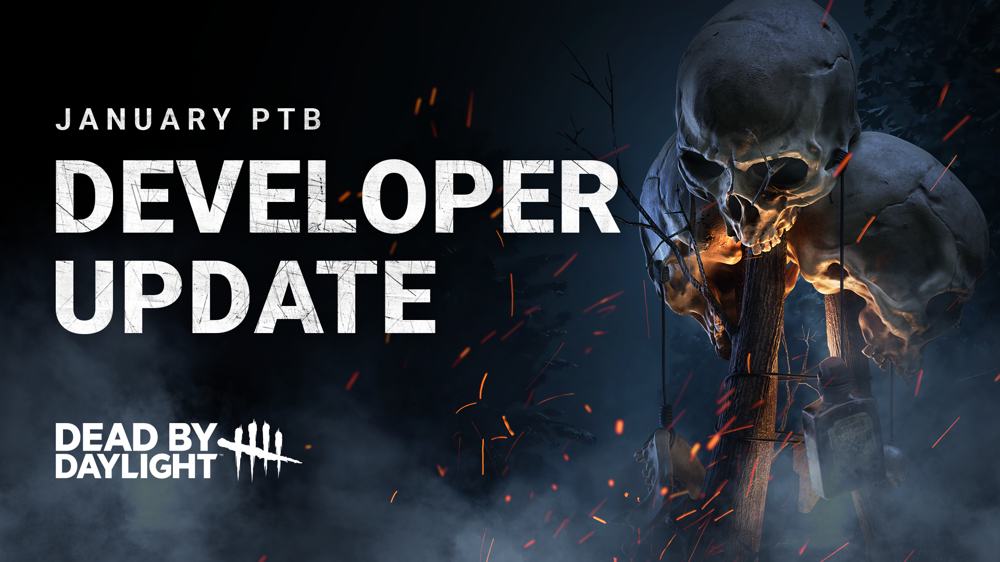
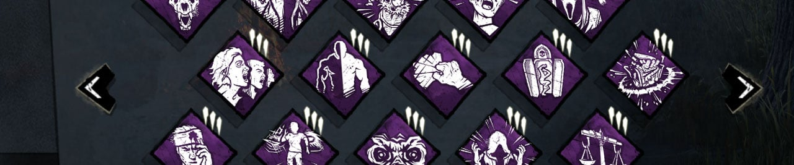
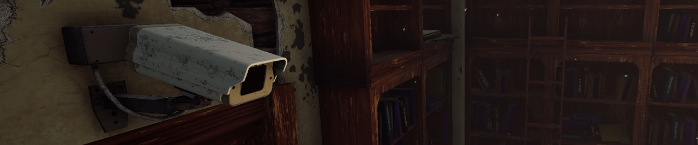

<!-- summary -->
## AI TL;DR

The January 2024 PTB rebalanced The Onryō, The Blight and The Hillbilly and tweaked two Survivor perks. Onryō caps Condemned at two stacks per hook (four after a second hook) and only projects Condemned when her power meter, recharging over ten seconds, is full. Blight’s Compound Thirty-Three turn-rate boost was cut to 11% per rush and its distance lowered; Iridescent Blight Tag now triggers a 20-second power cooldown on any rush, and Adrenaline Vial lost its turn-rate penalty. Hillbilly add-ons received reduced recovery and heat-dissipation values. Save the Best for Last now loses two tokens per hit, Quick Gambit’s repair boost returns to 6-8%, and a Watch List was added for Onryō, Hillbilly, Grim Embrace + Dead Man’s Switch and Generator changes.
<!-- /summary -->

<!-- nav -->
&larr; [Developer Update | January 2024](427-developer-update-january-2024.md) · [Developer Updates](../index.md#developer-updates) · [Developer Update | Stats!](433-developer-update-stats.md) &rarr;
<!-- /nav -->

# Developer Update | January 2024 PTB

We’re a few weeks into the new year, and that can only mean two things: 1) Most of us have broken our resolutions already, and 2) It’s time for us to recap our first PTB of the year. In this Developer Update, we’ll discuss the feedback we’ve received from the most recent Public Test Build (PTB) and the changes we’ll be making before the update goes live.

## The Onryō

In this update, we aimed to restore the gameplay longtime Onryō players missed while also maintaining some of the more recent quality of life improvements. We were glad to see such a positive reaction to these changes on the PTB. However, there are a few rough edges we’d like to iron out before this update releases.

**Locked-In Condemned**

With your current Condemned progress becoming permanent when you were hooked, Survivors who were hooked with several stacks became a clear target for The Onryō; it would only take a few more stacks of Condemned to secure a quick and early kill. This indirectly encouraged the Killer to seek out and chase the same Survivor after they were unhooked (or “tunnelling” for short).

To tone this down, **hooking a Survivor will now lock in a maximum of 2 stacks of Condemned**. Any additional Condemned will remain but can be removed by the Survivor as normal. **This can happen again when the Survivor is hooked for a second time for a maximum of 4 locked-in stacks**.

This will give Survivors an opportunity to remove some of their Condemned after they are unhooked while keeping Condemned kills as a far more prominent threat later in the match.

**Projection Spamming**

One of the awkward playstyles we wanted to address with this update was the dominant strategy of teleporting as much as possible to quickly spread Condemned. We had hoped that limiting the range of Condemned to powered TVs would address this and allow us to remove the projection cooldown. However, some crafty Onryō players discovered that they could intentionally teleport to the wrong TVs first in order to spread more than one stack of Condemned to Survivors near/heading towards a powered one. Clever!

We’ve read a lot of positive comments saying that she feels better to play without a cooldown on teleporting, so we do not want to bring it back. Instead, we have made the following change.

**The power meter recharges over the course of 10 seconds.**

- **If the power meter is full, projecting will inflict one stack of Condemned to any Survivor near a powered TV and empty the power meter.**
- **If the power meter is not full, projecting will not inflict Condemned and the power meter will not be reset.**

This will allow The Onryō to move around the map freely (so long as there are powered TVs to project to) but prevent quickly building Condemned by repeatedly teleporting to multiple TVs.

## The Blight

The Blight received a bunch of Add-On changes during the PTB. After watching them closely and reviewing feedback, we’ve identified a few troublemaking Add-Ons which we’d like to address before the update releases.

**Compound Thirty-Three**

On the PTB, this Add-On increased The Blight’s turn rate by 33% for each consecutive rush. This effect ended up being stronger than we’d like and made rush attacks very difficult for Survivors to avoid.

We have **reduced the turn rate bonus to 11% per consecutive rush** (was 33%). We have also **reduced the required rush distance to 3 meters** (was 4 meters). This effect can stack up to 3 times.

**Iridescent Blight Tag**

On the PTB, this Add-On gave The Blight an endless supply of rushes in exchange for putting his Power on cooldown after a *successful* Rush attack. It turned out this downside was not enough to keep this Add-On under control, so we’ve made a few adjustments.

**A Rush attack (successful or missed), failing to slam, or breaking a pallet with Iridescent Blight Tag equipped will now cause The Blight’s Power to be put on cooldown for 20 seconds**.

This will cause the Power to go on cooldown more often, creating more opportunities for the Survivors to evade the Killer.

**Adrenaline Vial**

Originally, this Add-On provided many positive effects, making it a “jack of all trades”. On the PTB, we simplified the Add-On by removing some of the effects. This left the Add-On weaker than we’d like, so we’ve made the following changes.

We have **removed the turn rate penalty (was -55%)**. We have also **reintroduced a 5% Rush speed bonus** (was 10%).

## The Hillbilly

Start your chainsaws! We were pleased to see such a positive response to The Hillbilly on the PTB. For the release, we’d like to take the opportunity to improve a few more Add-Ons and offer as many viable choices as possible.

**Greased Throttle & The Thompson’s Mix**

On the PTB, these Add-Ons reduced the recovery time for successful Chainsaw hits. This understandably didn’t provide much benefit in most cases.

They now **reduce recovery time after using the Chainsaw- not just successful hits- by 8% and 12% respectively** (was 10% and 15%).

**Thermal Casing & Ragged Engine**

Simple number tweaks for these: Thermal Casing & Ragged Engine now **decreases the speed at which heat dissipates when not using the Chainsaw by 20% and 30% respectively** (was 10% and 15%). Keep it warm!

**Discarded Air Filter & High-Speed Idler Screw**

These two Add-Ons increase the time it takes before Overdrive starts dissipating. We’ve also **increased the numbers on these to 20% and 30% respectively** (was 15% and 20%).

## Perks

Lastly, we’ve got a pair of tweaks for two of the Perks which were updated in this past PTB.

**Save the Best for Last (STBFL)**

During the PTB, STBFL would lose tokens whenever the Obsession lost a health state by any means. This allowed the Obsession to do silly things, such as intentionally allowing themselves to bleed out from Deep Wounds, in order to reduce the Killer’s STBFL tokens.

Save the Best for Last **will now lose 2 tokens whenever the Obsession is hit by a Basic Attack or a Special Attack**.

This way, the Obsession will need to put themselves in harms way in order to reduce the Killer’s accumulated tokens.

**Quick Gambit**

The PTB featured a change for Quick Gambit which increased its effective range and simultaneously lowered the repair speed bonus. Many felt as if this lowered repair speed bonus was not worth the added risk of potentially leading the Killer to your repairing teammates. Therefore, we have reverted the repair bonus: Quick Gambit **now provides a 6/7/8% repair speed bonus to Survivors within 36m**.

## Watch List

Before we leave off, we wanted to try something new: The Watch List.

We do our best to make informed decisions with each update. Sometimes we need to take a closer look and see how something plays out in a real setting before we commit to making changes. However, we don’t want to leave you in the dark in the meantime. This is where the Watch List comes in. The items on this list are things we’ll be keeping an extra close eye on once the update goes live before determining if further changes are necessary.

Please note: Just because something is featured on this list does not guarantee that it will be changed. Likewise, things not on this list are also subject to change as needed. The purpose of this list is to provide visibility on what we’re monitoring and acknowledge the feedback we’ve been given.

**Grim Embrace + Dead Man’s Switch**

This Perk combo was reported to be potentially problematic on the PTB. When Grim Embrace activates, Survivors are forced to stop repairing the Generator, causing Dead Man’s Switch to activate and block the Generator for an even longer period of time. This gives the Killer a consistent way to activate Dead Man’s Switch on all Generators and take advantage of nearly the entire duration.

Though this combo requires two Perk slots, this can cause the Generators to be blocked for quite a while. We will keep an eye on this build and make sure it does not get out of hand.

**Generator Changes**

Generators are at the core of every trial, so any changes we make to them must be monitored closely. Unfortunately, due to an error, this system was temporarily disabled when the PTB went live, limiting the amount of feedback we were able to collect. We’d like to gather more info on how this system plays out in real matches before drawing any conclusions.

The regression event system is not intended to impact a typical match, but instead to help bring an end to excessively long stalemates. We’ve received some concerns that the system may in fact impact matches where several regression Perks are used at once. This didn’t seem to happen often on the PTB, but it’s possible this may be more common on the live game where matches are much closer.

**The Onryō**

The Onryō has gone through quite a few changes lately, and that can make it difficult to predict where she’ll fall in terms of strength. We feel pretty confident with this version, but we will be watching carefully to see if any dominant strategies or shortcomings emerge and reassess as needed.

**The Hillbilly**

The Hillbilly has a lot of potential, but a steep learning curve. A good Hillbilly can be scary as is, but the Overdrive mechanic can make them ever scarier. It may take some time for Hillbilly players to get used to the way the Chainsaw controls during Overdrive and manage their heat effectively. We will continue to watch The Hillbilly as players master the Chainsaw (or shake off the rust) to determine if some fine tuning is needed down the line.

With that, we’ve reached the end of this Developer Update. Each of the changes mentioned in this post will be available when the update goes live January 30th. We look forward to hearing what you think!

Until next time…

The Dead by Daylight team

<!-- nav -->
&larr; [Developer Update | January 2024](427-developer-update-january-2024.md) · [Developer Updates](../index.md#developer-updates) · [Developer Update | Stats!](433-developer-update-stats.md) &rarr;
<!-- /nav -->
