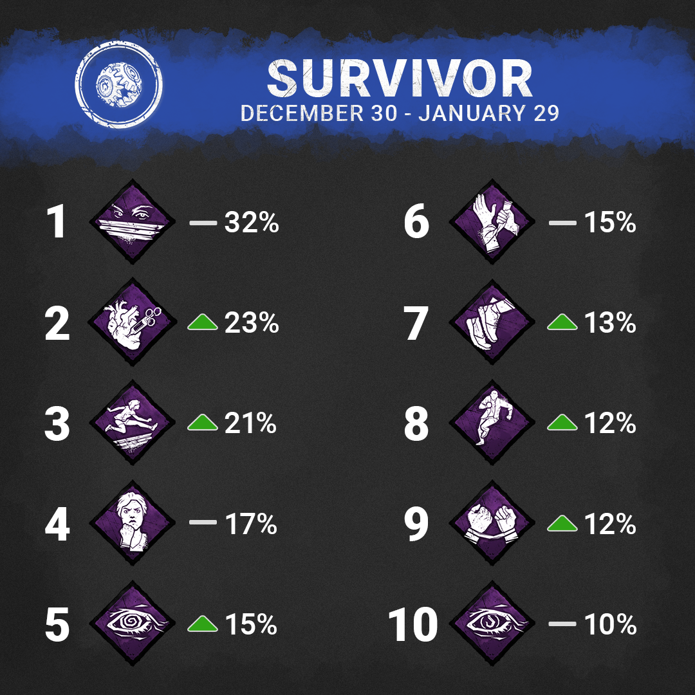
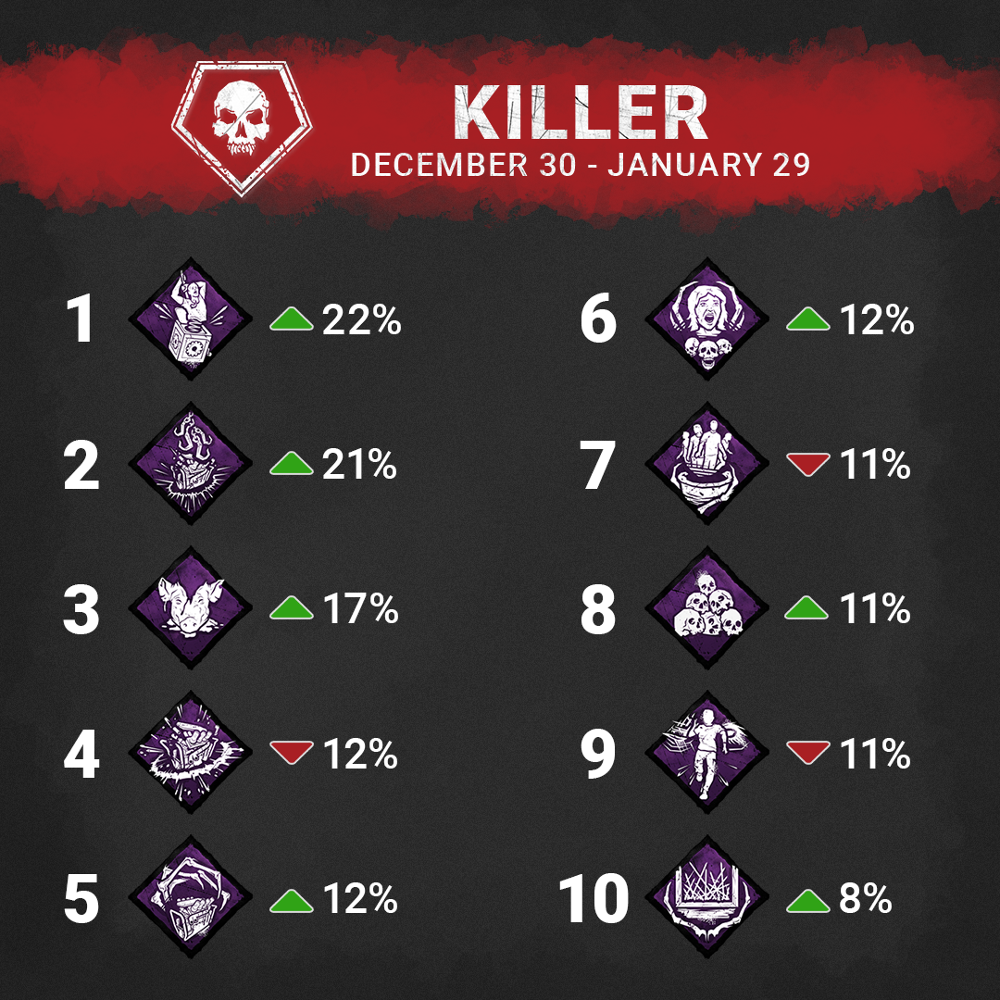
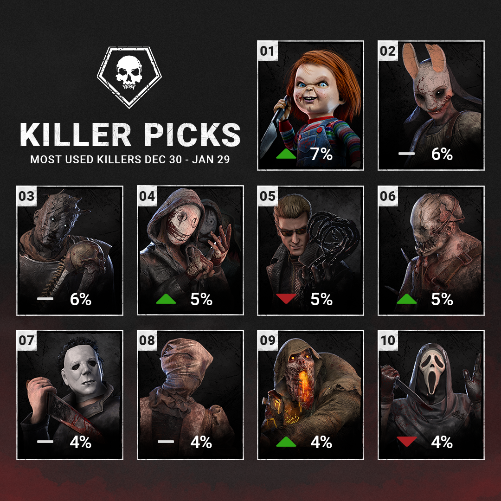
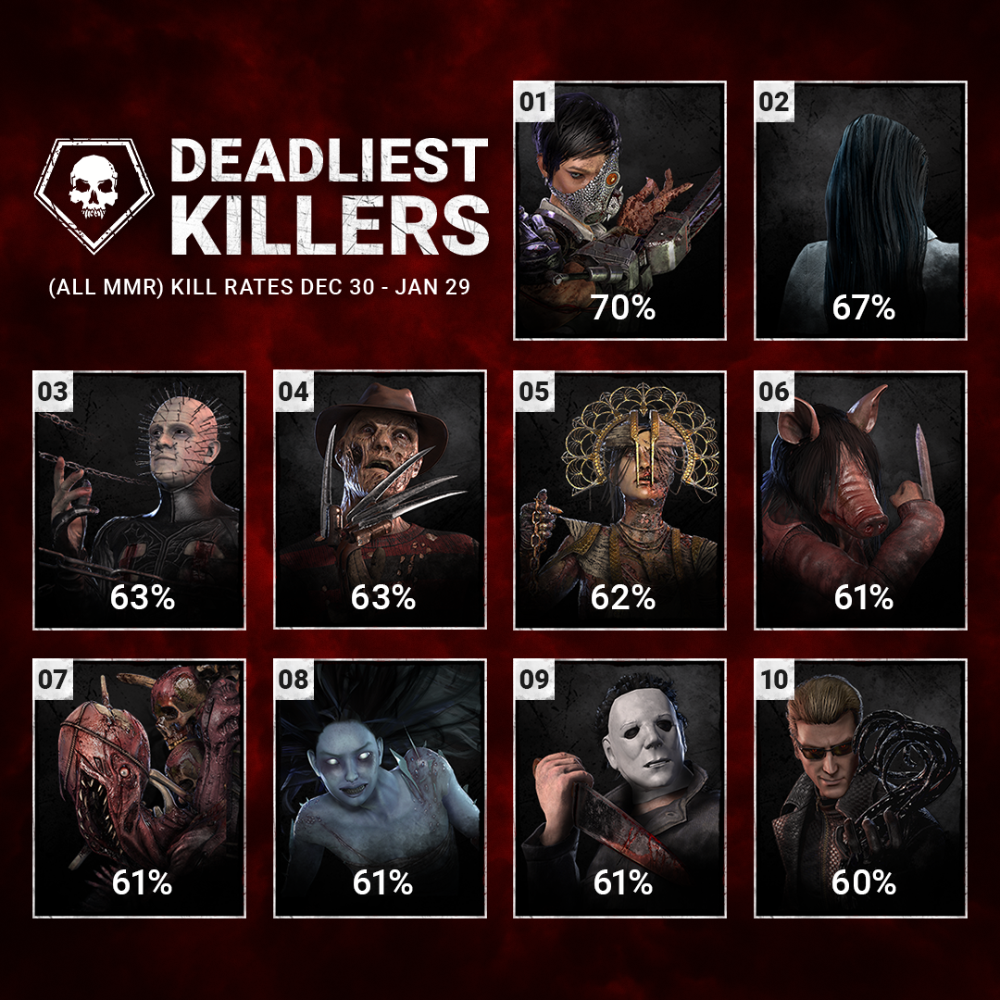
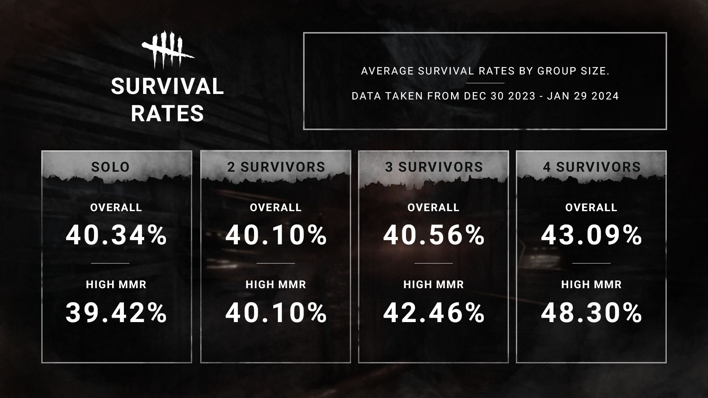

<!-- summary -->
## AI TL;DR

Developers shared an expanded stats roundup, adding the 10 most-used Perks for each role, the top 10 Killer pick-rates, and a new “Deadliest Killers” list showing kill percentages, plus survival odds for solo versus group play and high-MMR survivors. The data covers millions of matches and highlights shifts in popularity, with the Doctor, Deathslinger and others hovering around 3-4% pick-rate, while Executioner, Hag and Artist top the kill-rate chart at 60%. The update is purely informational, bundling community-requested metrics and reminding players that raw numbers don’t reflect individual experience.
<!-- /summary -->

<!-- nav -->
&larr; [Developer Update | January 2024 PTB](429-developer-update-january-2024-ptb.md) · [Developer Updates](../index.md#developer-updates) · [Developer Update | February 2024](434-developer-update-february-2024.md) &rarr;
<!-- /nav -->

# Developer Update | Stats!

Since we’ve started regularly sharing stats last year, we’ve received various requests for different kinds of data you would like to see. On top of the usual statistics we share, we’ve selected a few of the most requested topics to share with you today.

Before we dive in, we would like to remind everyone that while data may be fun to talk about, it does *not* paint a full picture. The numbers we’ll be sharing are very broad, covering millions of matches played all around the world, so the numbers may not reflect your personal experiences. We encourage you to have fun discussing this info, but please try not to draw any conclusions from data alone! It’s important to dig deeper understand the context behind the numbers you see; even we don’t make decisions based on data on its own.

## Popular Perks

Starting things off, here’s an update to the 10 most popular Perks for each role! The percentage listed next to each Perk indicates their usage rate- in other words, the likelihood that someone will have it in their loadout. Arrows indicate if the Perk has moved up or down the list since we last shared stats, while a line shows that they remained in the same spot.

 

## Popular Killers

Like Perks, we’ve also tallied up the 10 most popular Killers over the past month. The number below represent the percentage of all matches where that given Killer was played, with the arrows and lines again indicating how they have changed in popularity since we last shared this data.

Beyond the top 10, the pick rates are as follows (in descending popularity). For the sake of simplicity, we have rounded these numbers to the nearest whole percent.

- Doctor: 4%
- Deathslinger: 3%
- Spirit: 3%
- Nemesis: 3%
- Trickster: 3%
- Clown: 3%
- Oni: 3%
- Xenomorph: 3%
- Hillbilly: 2%
- Plague: 2%
- Onryo: 2%
- Executioner: 2%
- Demogorgon: 2%
- Cannibal: 2%
- Cenobite: 2%
- Skull Merchant: 2%
- Pig: 2%
- Dredge: 2%
- Artist: 1%
- Hag: 1%
- Nightmare: 1%
- Singularity: 1%
- Twins: 1%

## Deadliest Killers

Who spilled the most blood last month? Many of you wanted to know, so we’ve gathered the data to share with you this time around. The numbers below are the percentage of all Survivors who are killed when facing that Killer. For example, a 50% kill rate would mean they kill two Survivors per match on average. We try to keep Killers near a 60% kill rate on average to keep matches relatively even and support the horror theme of the game, where the Killer is a force to be reckoned with and the survival is not guaranteed.

We’d like to remind you again that this data covers millions of matches across all skill levels. Some Killers may be stronger when mastered, but less powerful in the hands of someone less experienced. (Yes, a good Nurse is much scarier!)

Kill rates *do not* include matches where a disconnect takes place.

Beyond the top 10, the standing look like this:

- Executioner: 60%
- Hag: 60%
- Artist: 60%
- Xenomorph: 59%
- Blight: 59%
- Wraith: 59%
- Nemesis: 59%
- Legion: 58%
- Good Guy: 58%
- Twins: 58%
- Oni: 58%
- Cannibal: 58%
- Clown: 58%
- Deathslinger: 57%
- Trapper: 57%
- Trickster: 57%
- Demogorgon: 57%
- Singularity: 56%
- Huntress: 56%
- Ghost Face: 56%
- Nurse: 55%
- Hillbilly: 54%
- Doctor: 51%
- Overall Average: 58.50%

## Survival Rate in Groups

Last but certainly not least, many of you were curious about a Survivor’s odds of escaping depending on if they’re flying solo or playing with friends. In this case, a higher survival rate would mean that a Survivor is escaping more. We’ve also included the survival rates for high MMR Survivors as well for those who are curious.

One last time, we’d like to remind you that these numbers do not paint a full picture. For instance, a group of friends may be more coordinated, but they might also be more willing to sacrifice themselves in an attempt to save their friends.

That’s all for this time! We’d like to continue sharing statistics like these with you in the future. If there’s something else that you’re curious about, be sure to let us know!

Until next time…

The Dead by Daylight team

<!-- nav -->
&larr; [Developer Update | January 2024 PTB](429-developer-update-january-2024-ptb.md) · [Developer Updates](../index.md#developer-updates) · [Developer Update | February 2024](434-developer-update-february-2024.md) &rarr;
<!-- /nav -->
