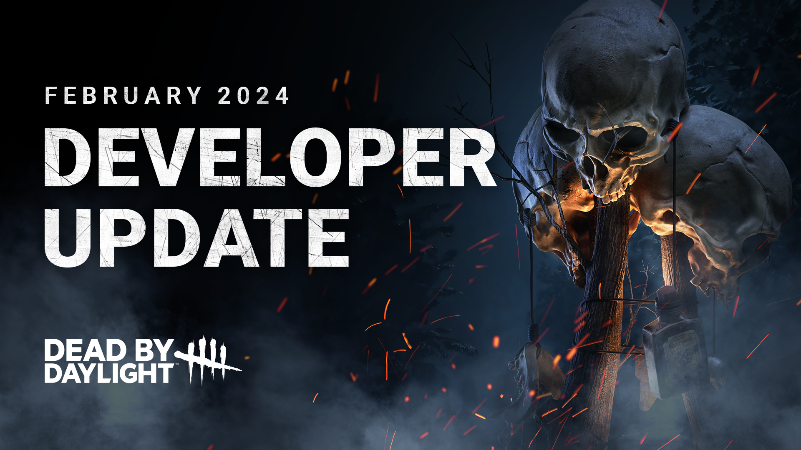
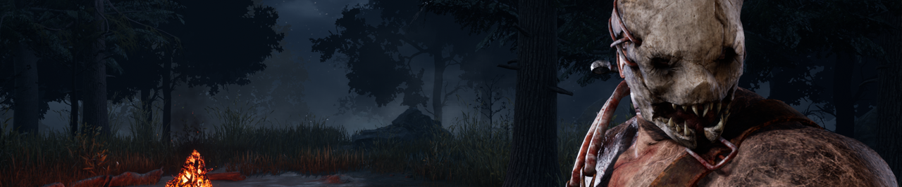

<!-- summary -->
## AI TL;DR

The February 2024 developer update rebalances several killers—The Pig, The Hag, The Clown, The Doctor, The Demogorgon, The Huntress and The Blight—with tweaks such as longer Ambush duration and faster crouch for The Pig, increased teleport range and quicker trap setup for The Hag, faster Afterpiece Antidote and larger bottle capacity for The Clown, extended Shock Therapy range, reduced Shred cooldown, higher hatchet capacity and faster wind-up for The Huntress, and an extra rush for The Blight. The Mangled status now expires after 60-90 seconds, and the automatic Bloodweb purchase button is unlocked for all characters once any survivor is prestiged; all changes are in the upcoming public test build.
<!-- /summary -->

<!-- nav -->
&larr; [Developer Update | Stats!](433-developer-update-stats.md) · [Developer Updates](../index.md#developer-updates) · [Developer Update | All Things Wicked PTB](436-developer-update-all-things-wicked-ptb.md) &rarr;
<!-- /nav -->

# Developer Update | February 2024

It’s time for another Developer Update! In this post, we’ll cover all the balance changes & improvements making their way to the game the next major update.

## Killer Tweaks

For this update, we’ve given a few of the Killers in our roster both quality of life and balance improvements. We’ve identified a handful of Killers that could use some small base kit improvements to help reduce their dependency on certain Add-Ons. There’s a lot to go through, so we’ll do our best to keep them brief!

### The Pig

In a shocking turn of events, we have decided to buff The Pig. More specifically, we have made improvements to both The Pig’s Ambush and Crouch abilities. The goal with these changes is to make her Ambush and stealth abilities more useful and make her less reliant on her Reverse Bear Traps.

Ambush:

- Increased Ambush duration to 2.3 seconds (was 2 seconds)
- Decreased Ambush successful attack cooldown to 2.7 seconds (was 3 seconds)
- Decreased Ambush missed attack cooldown to 1.5 seconds (was 2 seconds)

Crouch:

- Increased crouched movement speed to 3.8m/s (was 3.6m/s)
- Decreased time taken to crouch to 1 second (was 1.3 seconds)

Reverse Bear Traps:

- The Pig can no longer see the auras of Jigsaw Boxes
- Reverse Bear Traps now have a base timer of 3 minutes (was 2.5 minutes)

The Pig can now cover 15% more ground with her Ambush attack, making it harder for Survivors to break away from the loop. We’ve also made missed attacks less punishing to encourage using Ambush more often and updated her successful attack cooldown to match the normal Basic Attack cooldown. Improving her crouch makes it quicker and easier to set up for an Ambush and allows her to spend less time sneaking up on unsuspecting Survivors.

A handful of Add-Ons that decreased her missed attack cooldown or decreased her crouch time have had their effects reduced to compensate as their effects are now part of her base kit.

### The Hag

The Hag’s most popular Add-Ons decrease the setting time of her Phantasm Traps and increase the distance at which they can be teleported to. With that in mind, we have:

- Increased the maximum teleport distance to 48m (was 40m)
- Decreased Phantasm Trap setting time to 0.9 seconds (was 1 second)

And additionally:

- Increased the time triggered Phantasm Traps remain active to 6 seconds (was 5 seconds)
- Increased time taken to wipe away a Phantasm Trap to 4 seconds (was 3.5 seconds)

These adjustments will make it easier to set and teleport to Phantasm Traps, reducing the reliance on Add-Ons that improve these aspects. The increased duration will also give her more time to respond and get in range when a trap is triggered. Meanwhile, Survivors will have to spend a little longer to wipe away a trap, making it more difficult to do during a chase.

As for triggering traps, The Hag had some Add-Ons which increased their trigger range. In practice, this would be counterproductive since it would position the Survivors further away from the trap, making them more difficult to hit after teleporting. We have:

- Decreased the base trap rigger range to 2.7 meters (was 3 meters)
- The Bog Water, Bloodied Water, and Bloodied Mud Add-Ons – which previously increased the trap trigger range – have had their effects inverted and now decrease trap trigger range

Like The Pig, the effects of some Add-Ons have been toned down now that part of their effects are always active.

### The Clown

Between the two bottles, The Clown’s Afterpiece Tonic is the clear favourite for most players. We want to show some love to the Afterpiece Antidote and make it a more compelling option, so we have:

- Increased the Afterpiece Antidote speed boost duration to 6 seconds (was 5 seconds)
- Decreased the Afterpiece Antidote activation time to 2 seconds (was 2.5 seconds)

Additionally, we have:

- Increased the base bottle carrying capacity to 6 (was 4)
- Decreased the visual intensity of the Afterpiece Tonic effects to reduce motion sickness

This will allow The Clown to clown-around the map more easily and make the Afterpiece Antidote feel less awkward to use. The increased capacity will allow him to keep up the chase for longer before needing to reload.

### The Doctor

His practices may call his PHD into question, but he’s been honing his craft. We have made the following adjustments to The Doctor’s Shock Therapy:

- Increased Shock Therapy range to 12m (was 10.7m)
- Decreased Shock Therapy detonation delay to 0.8 seconds (was 1 second)

These changes will make his Shock Therapy attack feel more responsive and allow it to reach slightly further. Once again, the Add-Ons which provide similar effects have been toned down to take this base kit increase into account.

### The Demogorgon

A short and sweet one for everyone’s favourite upside-down Killer:

- Decreased successful Shred attack cooldown to 2.7 seconds (was 3 seconds)

This change brings The Demogorgon’s Shred attack back in line with the modern standard Basic Attack cooldown. The Barb’s Glasses and Black Heart Add-Ons have been adjusted to compensate now that part of their effects have been incorporated into the base kit.

### The Huntress

Out of hatchets with no locker in sight? Or maybe The Entity sent you to a map with poor line of sight, making it difficult to line up a shot? To help her stay topped up and give her opportunities to attack in busier areas, we have made the following changes:

- Increased base Hatchet capacity to 7 (was 5)
- Increased movement speed while holding a hatchet to 3.54m/s (was 3.08m/s)
- Increased Huntress’ wind up speed by 10%

The Manna Braid and Flower Babushka Add-Ons – which increase the Hatchet wind up speed – have had their effects reduced slightly to compensate.

### The Blight

Lastly, we wanted to fine tune a Blight Add-On which was changed in one of our recent updates: Compound Thirty-Three.

- Compound Thirty-Three now limits The Blight’s Rushes to 3 (was 2)

## Mangled

Mangled currently provides a lot of value throughout the match by slowing down Survivor healing. At the moment, there is no way for Survivors to remove the Mangled effect other than healing through it. We want to make this status effect more interesting and introduce some risk & reward to it.

The Mangled Status Effect will now have a limited duration, with the exact duration depending on the source and ranging between 60 and 90 seconds. This maintains Mangled’s effectiveness at slowing down healing while forcing Survivors to make a choice: Do they spend more time to heal now, or risk staying injured until the effect expires?

## Bloodweb Improvement

In a previous update, we added the ability to automatically spend Bloodpoints to the Bloodweb. To ensure that newer players took the time to familiarize themselves with the items in their Bloodweb, this button was originally hidden until the selected character had been prestiged at least once.

Since this feature was added, we’ve received many requests to show this button on other characters before they’re prestiged, so we’re doing just that: The automatic purchase option will now appear in all character’s Bloodwebs once any character has been prestiged once. Spend away!

We’ve reached the end of this Developer Update. As always, you can get your hands on every change we’ve discussed in the Public Test Build starting this week. We’d love to hear what you think once you’ve had a chance to try them out!

Until next time…

The Dead by Daylight team

<!-- nav -->
&larr; [Developer Update | Stats!](433-developer-update-stats.md) · [Developer Updates](../index.md#developer-updates) · [Developer Update | All Things Wicked PTB](436-developer-update-all-things-wicked-ptb.md) &rarr;
<!-- /nav -->
