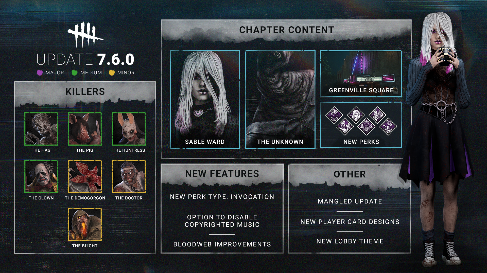

# Developer Update | All Things Wicked PTB

The All Things Wicked PTB has come and gone. As always, our team has discussed the feedback you’ve shared with us on all the new and changed content, and we’ve prepared a series of adjustments which will be made before this update goes live. In this post, we’ll go through each of them and provide a brief explanation of our thought process.

We’re trying out a new, less wordy format this time. Feel free to let us know what you think!

- \[NEW\] **Weakness’ duration now increases by 6 seconds when a Survivor is injured by UVX.**
- \[CHANGE\] **Increased Hindered effect on airborne hits from 3% to 6%**
- \[CHANGE\] **Increased Blindness duration for the Homemade Mask Add-On to 60 seconds** (was 45 seconds)

*Dev note: The Weakness effect was a little too easy to remove during the PTB, which meant the Killer would often have to hit a healthy Survivor with UVX four times to down them. By increasing Weakness’ duration when the Survivor is hit by a blast, accurate Killers will need one less shot to down a Survivor.*

*We’ve also increased the Hindered effect to address the feedback of airborne hits feeling underwhelming.*

    

- \[REVERTED\] **Decreased Reverse Bear Traps base time to 150 seconds** (was 180 during PTB)

*Dev note: We wanted to shift some power away from The Pig’s Reverse Bear Traps and into her stealth & Ambush abilities to make her more fun and interactive to play. Many felt that this change was too significant during the PTB, so we have reverted it for the update’s release. We’ll be keeping a close eye on her performance once this update goes live and re-evaluate if this change is needed at a later date.*

    

- \[REVERTED\] **Decreased Huntress movement speed while holding a Hatchet to 3.08m/s** (was 3.54m/s during PTB)

*Dev note: This change made it too forgiving for The Huntress to raise a Hatchet at the wrong time, potentially even keeping up with Survivors with Add-Ons. We have reverted this change for the update’s release.*

    

- \[CHANGE\] **The Redhead’s Pinkie Finger Add-On now limits The Clown’s bottle carrying capacity to 1** (previously reduced capacity by 3)

*Dev note: This Add-On allows The Clown to down healthy Survivors in a single hit, so it has always had a significant downside to keep it under control. Since we’ve increased his base carrying capacity, this would have made this Add-On stronger as a result. We have added a hard limit of 1 bottle, similar to The Huntress’ Iridescent Head.*

    

- \[CHANGE\] **When the Invocation is completed, permanently reduce the required charges of all Generators by 10**(previously added 15 charges of progress during the PTB)

*Dev note: This Perk has a lot of risk and a heavy time commitment. If the invocation is interrupted, the time spent would be lost, making it unappealing compared to a normal repair. To make the reward match the risk, we have changed the effect to permanently reduce the required repairs all Generators need, similar to the Brand New Part Add-On.*

    

- \[CHANGE\] **Increased healing speed to 70%** (was 60% during PTB)

*Dev note: It will often take some time to get to the basement before you can heal with this Perk, and there’s also risk involved with being caught injured in the basement. We have increased the healing speed slightly to make it a more interesting (but still niche) choice compared to other self healing Perks. This allows you to heal in about 23 seconds by default.*

    

- \[REWORKED\] Your self-unhook attempts in the basement always succeed. When you are unhooked or unhook yourself, you see the Killer’s aura for 16/18/20 seconds.

*Dev note: We didn’t feel the original Perk was very effective, so we have given it an overhaul. The ability to unhook yourself from a basement hook may come in handy if you’re caught during an invocation, but be warned, Killers may catch on and carry to a hook above ground! The aura reading effect will allow you to gain some value from this Perk even if you are never hooked in the basement.*

    

Watch List

Dead by Daylight is always changing, and this Watch List covers a few things we’ll be keeping an extra close eye on once the update goes out. As a disclaimer, the things on this list are not guaranteed to be changed.

**The Unknown**

It always takes some time for a new Killer to settle. We’ll be watching to see if The Unknown is too strong, too weak, or if any points of frustration arise in the coming weeks and months.

**Invocation: Weaving Spiders**

Being a brand-new mechanic, it will take some time to see how Invocation Perks fit into the game. The effect is strong but carries a significant risk. We’ll be watching closely to make sure they end up in a good spot strength-wise.

**The Pig**

As mentioned previously, we’ve made some pretty significant improvements to The Pig’s Ambush ability and left her Reverse Bear Trap timer untouched for the time being. We will monitor her performance in the near future to ensure that these changes don’t push her over the top and re-evaluate as needed.

Until next time…

The Dead by Daylight team
