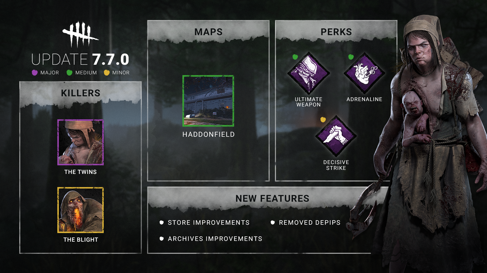
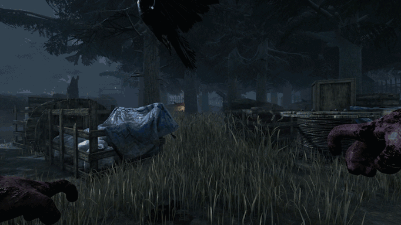
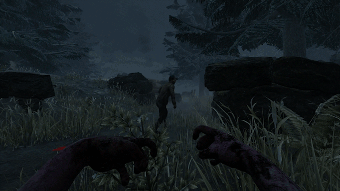
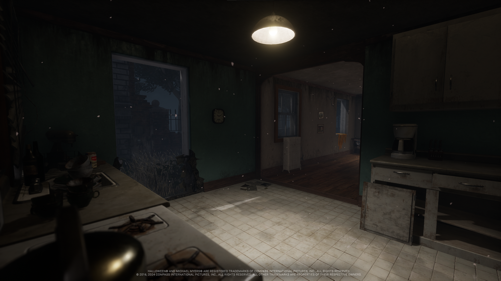
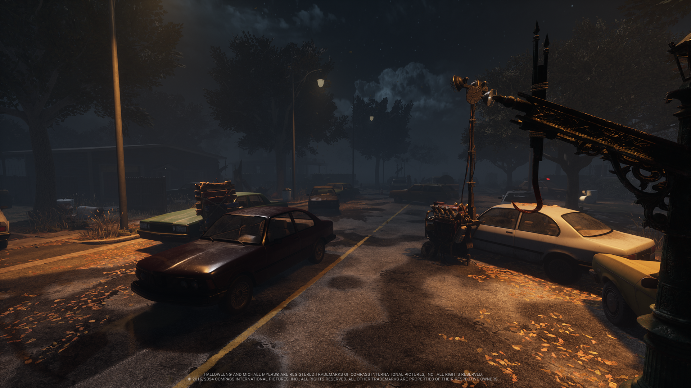
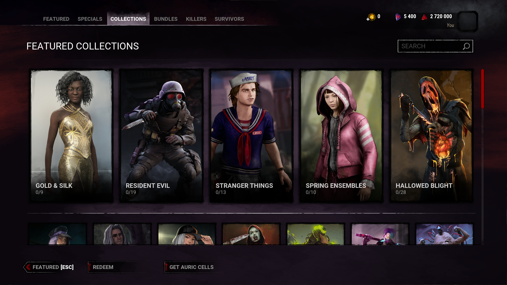
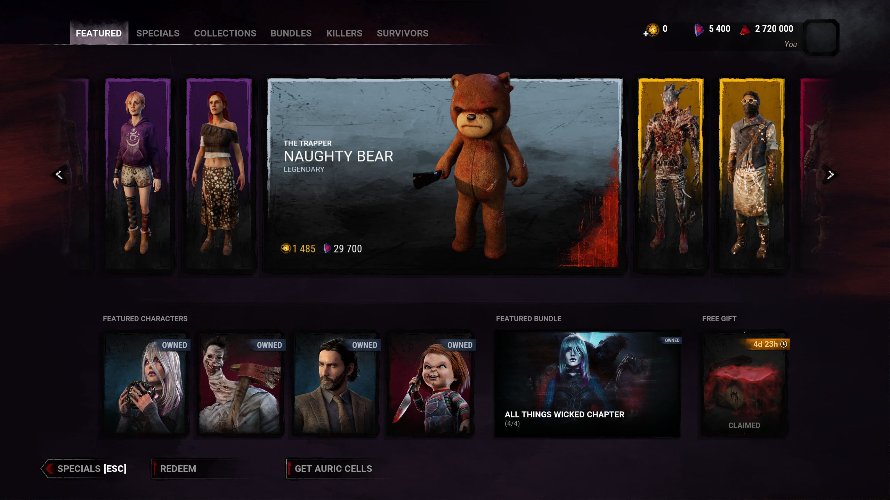

<!-- summary -->
## AI TL;DR

The Twins receive faster swaps—Charlotte now switches in 1.5 seconds, Victor unbinds in 0.75 seconds and can be recalled anytime, with pounce mechanics that latch onto dying Survivors, grant Charlotte 10 % haste while attached, and no longer reveal nearby Survivors. The Blight’s rush collision detection is tightened, and a map overhaul shrinks the layout, adds openings, pallets and lockers, and eases house loops. Decisive Strike gains a stab animation and a longer five-second stun, while Adrenaline’s exceptions are removed and its speed boost shortened. Ultimate Weapon now reveals auras instead of screams with a cooldown. Emblem pip loss is eliminated, store gets a redesign with Specials, Collections, bundles and a free gift, and Rifts open on update day with a Rift bundle.
<!-- /summary -->

<!-- nav -->
&larr; [Developer Update | All Things Wicked PTB](436-developer-update-all-things-wicked-ptb.md) · [Developer Updates](../index.md#developer-updates) · [Stats | March 2024](443-stats-march-2024.md) &rarr;
<!-- /nav -->

# Developer Update | March 2024

Spring has sprung, and so has a new Developer Update! In this post, we’ll share everything we’ve been working on for our next update. As always, these changes will first head to the Public Test Build on Steam. We encourage you to give them a try if you can and let us know what you think!

- **`[CHANGE]`** Reduced the time it takes to switch back to Charlotte to 1.5 seconds (was 3 seconds)
- **`[CHANGE]`** Reduced the time it takes to unbind Victor to 0.75 seconds (was 1 second).
- **`[CHANGE]`** Reduced the time it takes to charge Victor’s Pounce to 0.85 seconds (was 1 second).
- ***`[NEW]`*** Added the ability to recall Victor at any point while he is unbound.
- ***`[NEW]`*** Added the ability to change between Victor & Charlotte near a hooked Survivor. \*

*Dev note: We have made switching between Charlotte and Victor more responsive and given the Killer the ability to recall Victor at any time so they feel better to play.*

*\* Be warned: The anti-face camp meter will still fill if you’re too close!*

- **`[CHANGE]`** Updated 7 Add-Ons.
- **`[CHANGE]`** Victor’s Pounce no longer latches onto healthy Survivors.
- **`[CHANGE]`** Victor can no longer be kicked after successful pounces which do not latch onto a Survivor.
- ***`[NEW]`*** Victor’s Pounce now latches onto Survivors when they are put into the dying state. Other Survivors can crush Victor during this to help the dying Survivor. Victor will automatically return to Charlotte after 20 seconds.
- ***`[NEW]`*** While Victor is attached to a Survivor or holding a Survivor in a locker, Charlotte gains a 10% Haste effect. This effect will be lost prematurely if Charlotte hits a Survivor.
- **`[REMOVED]`** Survivors near Victor while he is latched onto another Survivor are no longer revealed by Killer Instinct.

*Dev note: Previously, The Twins’ Power heavily encouraged ‘slugging’ (leaving Survivors in the dying state) since Victor could chain together pounces on multiple injured Survivors, but only pounce a single healthy one. Furthermore, Survivors could often save each other before Charlotte could make it to them.*

*We have flipped this around: Victor will now be much more effective at injuring multiple Survivors and instead assist Charlotte – who now moves faster while Victor is latched on – in picking up the Survivor. This makes it possible for Victor to both injure and down a Survivor without being forced to switch back to Charlotte in between.*

- ***`[NEW]`*** The Visual Terror Radius accessibility setting will now include Victor’s grunts.
- ***`[NEW]`*** Victor will now glow red whenever he is vulnerable to being crushed.

*Dev note: We have updated the Visual Terror Radius to include Victor’s grunts to improve accessibility, and added a red glow to Victor whenever he is vulnerable to being crushed to improve visual feedback.*

    

- **`[CHANGE]`** Improved collision detection to reduce cases where The Blight slides off objects.

*Dev note: It could be frustrating to slide off an object you were trying to bump into and end your Rush prematurely. We have improved the collision detection to make The Blight’s Rush more consistent. This also fixes an issue which allowed The Blight to incorrectly slide along obstacles and lunge around tighter corners than intended.*

    

- **`[CHANGE]`** Updated map layout and reduced the overall size.
- **`[CHANGE]`** Reduced the length of hedges and fences to create more openings.

*Dev note: The map’s long & narrow shape and rows of unbroken fences and/or hedges made getting around very time consuming. We have reduced the overall size and added more openings to make it easier to traverse.*

- **`[CHANGE]`** Adjusted various houses to reduce the strength of strong loops.
- **`[CHANGE]`** Reduced the number of houses in the map. All remaining houses can be entered.

*Dev note: Many houses were closed off, making the map larger without any room for gameplay. We have reduced the number of houses that spawn, though each one that remains will now be open and playable. We’ve also reduced the strength of some of the strongest window loops to be fairer and more interesting to play.*

- **`[NEW]`** Added pallets and lockers along the edge of the map.
- **`[CHANGE]`** Updated street tiles to feature more pallet loops.
- **`[CHANGE]`** Adjust pallet loops in park tiles.

*Dev note: The outdoor areas were fairly empty before, encouraging Survivors to make a run for the nearest house when they were chased. Since we’ve reduced the strength of houses, we have added some additional loops to the street & edges of the map to spread out chases and reduce deadzones.*

        

- **`[CHANGE]`** Increased stun duration to 5 seconds (was 3 seconds).
- ***`[NEW]`*** Added a new stabbing animation when Decisive Strike is used successfully.

*Dev note: The Survivor is locked in place for part of the stun while they are being dropped by the Killer, so it didn’t leave them with much time to run away once they hit the ground. We have increased the duration of the stun to give the Survivor a fair chance to create some distance.*

*While we were at it, we added a new animation which plays when a Survivor successfully uses Decisive Strike to break free to give some visual flair to the Perk.*

    

- **`[CHANGE]`** Adrenaline no longer activates if you are hooked when the gates are powered.
- **`[CHANGE]`** Reduced speed boost duration to 3 seconds (was 5 seconds).
- **`[CHANGE]`** Adrenaline no longer causes you to wake up when facing The Nightmare.

*Dev note: Adrenaline had a lot of exceptions which made it difficult to play around. If a Survivor was hooked while the exit gates were powered, they would be healthy and receive a substantial speed boost upon being unhooked, making it very difficult for the Killer to catch them before they could escape. We have made it so Adrenaline no longer pauses when you are on the hook.*

*We’ve also removed the wake-up effect when facing The Nightmare to clean up the Perk as we’ve moved away from Perks that affect specific Killer Powers over the years.*

    

- **`[CHANGE]`** Now reveals Survivors aura instead of causing them to scream.
- **`[CHANGE]`** Reduced activation time to 15 seconds (was 30 seconds).
- **`[CHANGE]`** Increased cooldown to 80/70/60 seconds (was 40/35/30 seconds).

*Dev note: Ultimate Weapon was a jack of all trades, providing both information and a consistent way to interrupt Survivor actions (allowing it to synergize too well with other Perks). Rather than screaming, Survivors will instead have their aura revealed. This means it will no longer interrupt Survivor’s interactions, though Survivors won’t know that they are being revealed to the Killer.*

*Since Ultimate Weapon is easy to activate, it was possible to keep its effect active throughout the entire match. We have increased the cooldown and decreased its activation window to ensure some downtime between uses.*

    

- **`[CHANGE]`** Removed the ability to lose a pip.

*Dev note: With Emblems being used solely for monthly rewards these days, it felt needlessly punishing to lose a pip after a rough match. This quality-of-life change will make the Emblem system less stressful. This also applies to Modifiers – you can enjoy these limited time modes without worrying about your grade!*

    

- **`[CHANGE]`** Visual overhaul to the entire store menu.
- **`[`*NEW*\]** Added “Specials” tab to highlight items that are on sale.
- **`[`*NEW*\]** Added “Collections” tab to find cosmetics from a specific collection.
- **`[`*NEW*\]** Added bundles, containing multiple items at a discounted price.
- **`[`*NEW*\]** Killer mori animations can now be viewed in the store.
- **`[`*NEW*\]** Added a weekly gift that can be claimed for free.

*Dev note: The store hasn’t changed much since it was introduced in 2018. This update makes it easier to find what you’re looking for and allows us to bundle content together at a reduced price. For example, it’s now possible to purchase an entire DLC pack through the in-game store rather than purchasing each character separately.*

            

- **`[CHANGE]`** New Tomes & their respective Rifts will now open at the same time as the update.
- **`[`*NEW*\]** New Rift Bundle option, which grants the Premium Rift rewards & a 20 tier head start at a discounted price.

*Dev note: Rifts have historically opened the day after our Mid-Chapter updates, but no more! You can now get cracking on those challenges right away. We have also introduced a new Rift bundle which includes the Premium Rift Pass and 20 Tiers at a discounted price. (The Premium Rift Pass can still be purchased separately if you prefer!)*

Until next time…

The Dead by Daylight team

<!-- nav -->
&larr; [Developer Update | All Things Wicked PTB](436-developer-update-all-things-wicked-ptb.md) · [Developer Updates](../index.md#developer-updates) · [Stats | March 2024](443-stats-march-2024.md) &rarr;
<!-- /nav -->
