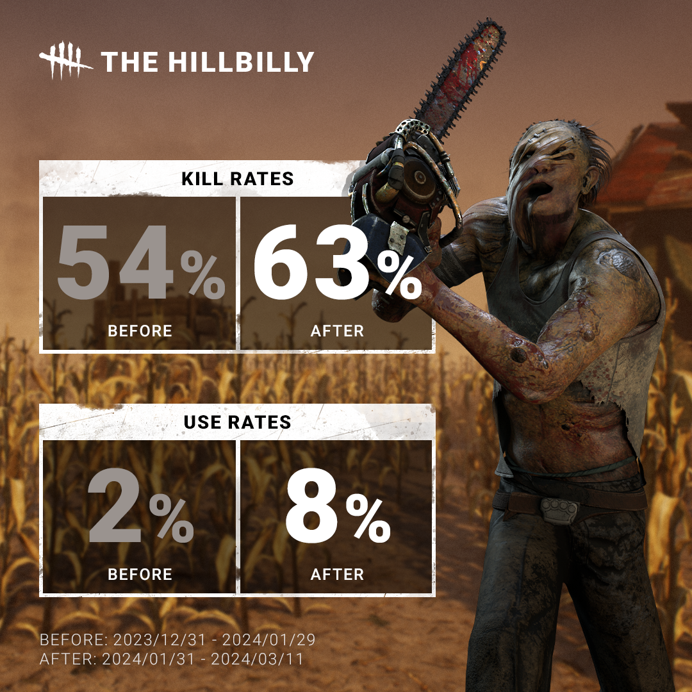
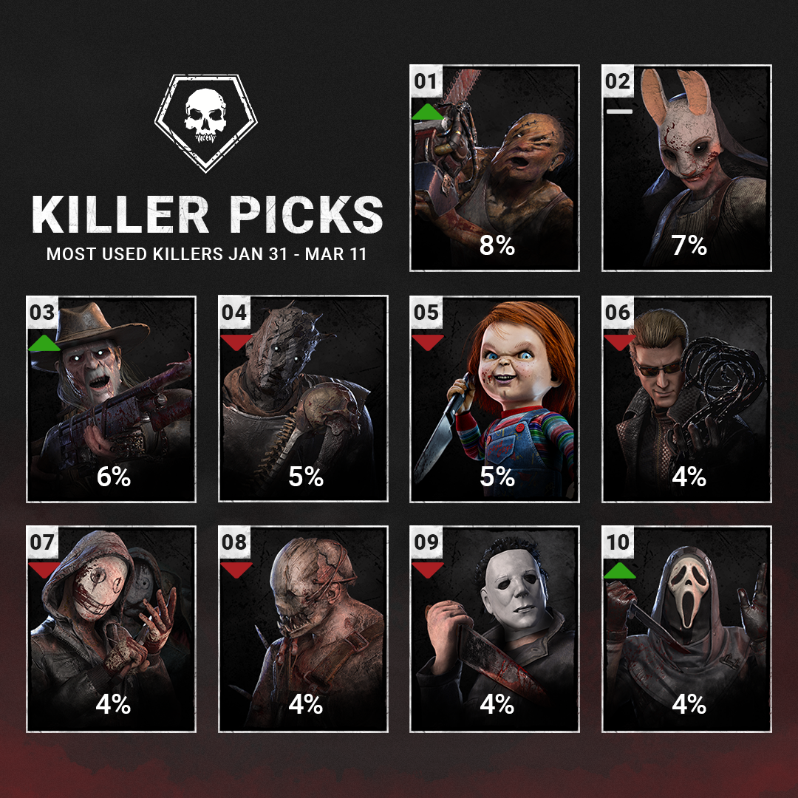
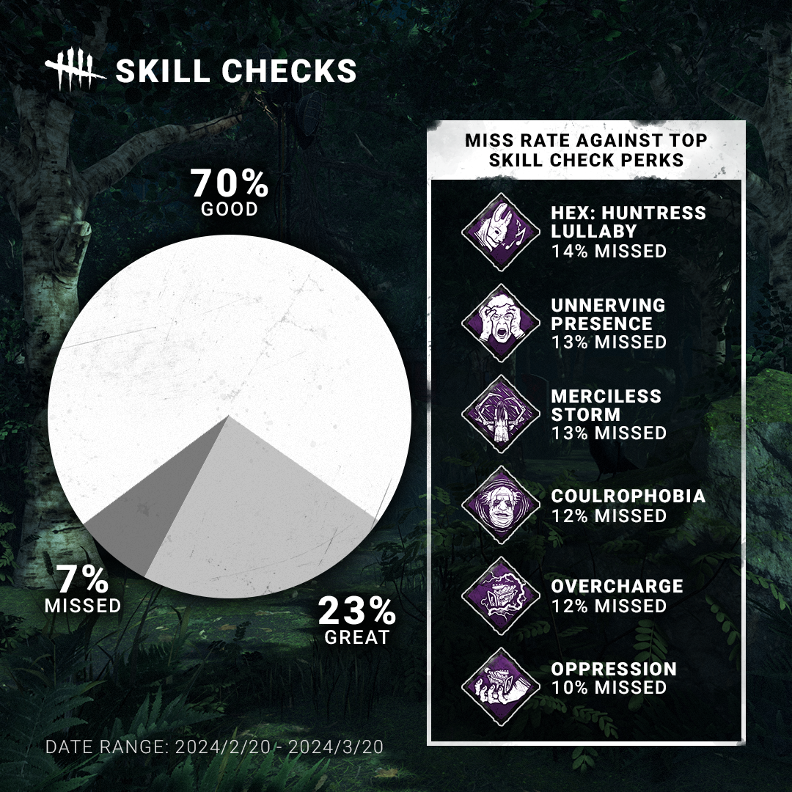
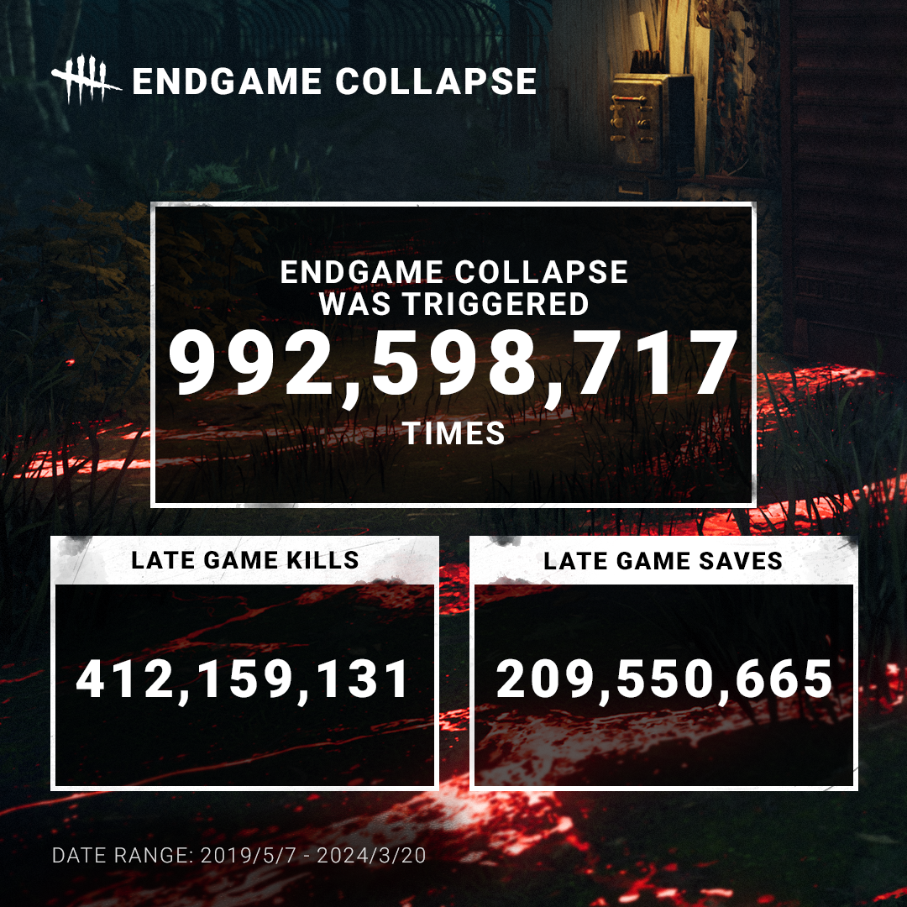

<!-- summary -->
## AI TL;DR

The Hillbilly’s latest balance patch pushed him to the top of killer popularity, with use and kill rates climbing across all MMRs, while the Deathslinger saw a noticeable rise after appearing in Tome challenges. The update also revealed that 70 % of skill checks are hit (good), 23 % are great and only 7 % missed, with high-MMR players performing even better. Data on perk-induced misses, nearly a billion End-Game Collapse activations, and the fact that twice as many survivors die than are saved at match end were also shared, and the team pledged more regular statistical insights.
<!-- /summary -->

<!-- nav -->
&larr; [Developer Update | March 2024](440-developer-update-march-2024.md) · [Developer Updates](../index.md#developer-updates) · [Developer Update | April 2024 PTB](444-developer-update-april-2024-ptb.md) &rarr;
<!-- /nav -->

# Stats | March 2024

Kicking things off, we wanted to take a look back at The Hillbilly’s recent update and see how it has affected his strength and popularity. We’ve seen a substantial increase in both his use rate and kill rate across all MMRs.

This update skyrocketed The Hillbilly to the top of the list of most popular Killers. The Deathslinger also saw a noticeable bump after being featured in Tome challenges.

Have you ever thought about how many skill checks are hit or missed? It turns out that 70% of all skill checks are good, 23% are great, while 7% are missed entirely. Among high MMR players, this becomes 63% good, 33% great, and 4% missed.

If you’re curious, we also gathered data on which Perks cause Survivors to miss the most skill checks!

It has been nearly 5 years since the End Game Collapse was introduced. Since then, it has activated almost a *billion* times.

For those who find themselves on the hook at the end of the match: The outlook is not very good. Nearly twice as many Survivors die at the end of the match than are saved.

We’d love to share a mix of insightful and fun stats more regularly in the future. If you have suggestions for different kinds of data you’d like to know, be sure to let us know!

<!-- nav -->
&larr; [Developer Update | March 2024](440-developer-update-march-2024.md) · [Developer Updates](../index.md#developer-updates) · [Developer Update | April 2024 PTB](444-developer-update-april-2024-ptb.md) &rarr;
<!-- /nav -->
