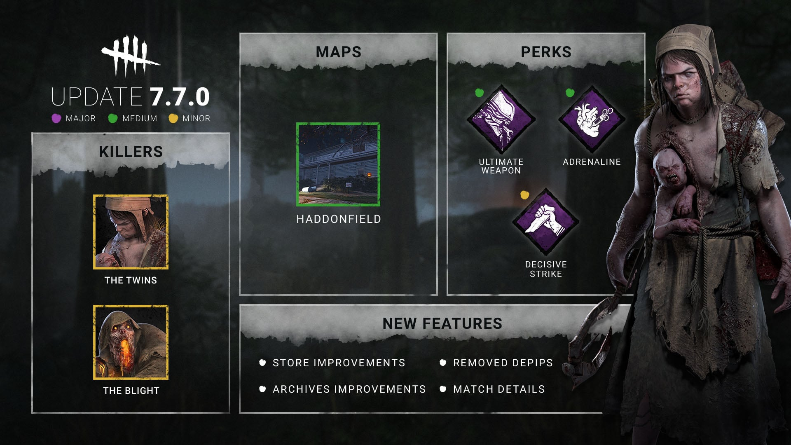

<!-- summary -->
## AI TL;DR

The Twins’ Victor has been reverted to latched onto injured Survivors and no longer triggers Charlotte’s Haste, restoring original behavior while keeping quality-of-life tweaks like faster switching and recall. The Blight’s Summoning Stone and Soul Chemical addons were toned down, and his collision detection remains unchanged. The new Decisive Strike animation was removed after it altered the perk’s timing. Upcoming changes to the Ultimate Weapon perk will revert to the scream aura and shift its effect radius to 32 m from the locker instead of the Killer’s terror radius. Overall the PTB adjustments focus on rebalancing The Twins, modest addon nerfs, and reverting a problematic perk animation.
<!-- /summary -->

<!-- nav -->
&larr; [Stats | March 2024](443-stats-march-2024.md) · [Developer Updates](../index.md#developer-updates) · [Developer Update | May 2024](448-developer-update-may-2024.md) &rarr;
<!-- /nav -->

# Developer Update | April 2024 PTB

As the 7.7.0 Update approaches, we’ve prepared some adjustments after going through the feedback we’ve collected during the Public Test Build (PTB).

- \[REVERTED\] Victor no longer latches onto Survivors who are put into the dying state.
- \[REVERTED\] Victor once again latches onto Survivors who are injured by his pounce.
- \[REVERTED\] Charlotte no longer gains Haste when Victor is latched onto a Survivor.

*Dev note: We have received a lot of comments about The Twins’ strength during the PTB. We have made the decision to revert the changes to Victor’s pounce and keep the various quality of life improvements (faster switching between Charlotte and Victor, ability to recall Victor, and Add-on adjustments & base kit inclusion). We may revisit The Twins in a future update, if necessary, but these smaller tweaks will make The Twins feel better to play for the time being.*

 

- \[CHANGED\] Summoning Stone Addon – this will increase the initial rush duration by 0.5s (was 1s)
- \[CHANGED\] Soul Chemical Addon – this increases the initial Rush speed by 5% down from 10% on the PTB

*Dev note: Feedback around The Blight often centered on the two addons and his improved collision detection. We made some adjustments to the addons to slightly lower their strength whilst still maintaining their usefulness. The Blight’s collision detection will remain as it was on the PTB, and we will continue with our ongoing efforts to improve this collision across all maps.*

 

- \[REMOVED\] Decisive Strike no longer has a new animation.

*Dev note: This PTB featured a new animation for Decisive Strike in which the Survivor would stab the Killer to free themselves. This animation had too much of an effect on the Perk’s expected behaviour (adding a delay before the Survivor wiggled free). We have decided to remove the animation for Decisive Strike before the update is released. The stun time for the Perk will remain at 5 seconds for the time being.*

 

*Note: The following changes will be part of a future update. The Perk will remain as it was on the PTB in the meantime.*

- \[REVERTED\] Affected Survivors will once again scream instead of having their aura revealed.
- \[CHANGE\] Now affects Survivors within 32m of the locker (previously inside the Killer’s Terror Radius).

*Dev note: We received some mixed feedback during the PTB; while the Perk was less appealing for some Killers, it remained a strong choice for Killers with high mobility. To make its strength a little more even across more Killers, we’ve changed Ultimate Weapon to be based on the locker’s position rather than the Killer’s. This way Killers without traversal abilities or with a smaller Terror Radius can take advantage of the Perk more consistently without it being excessive on highly mobile Killers.  
 With this in mind, we have also brought back the scream to allow it to synergize with other Perks once again.*

Until next time...  
 The Dead by Daylight Team.

<!-- nav -->
&larr; [Stats | March 2024](443-stats-march-2024.md) · [Developer Updates](../index.md#developer-updates) · [Developer Update | May 2024](448-developer-update-may-2024.md) &rarr;
<!-- /nav -->
