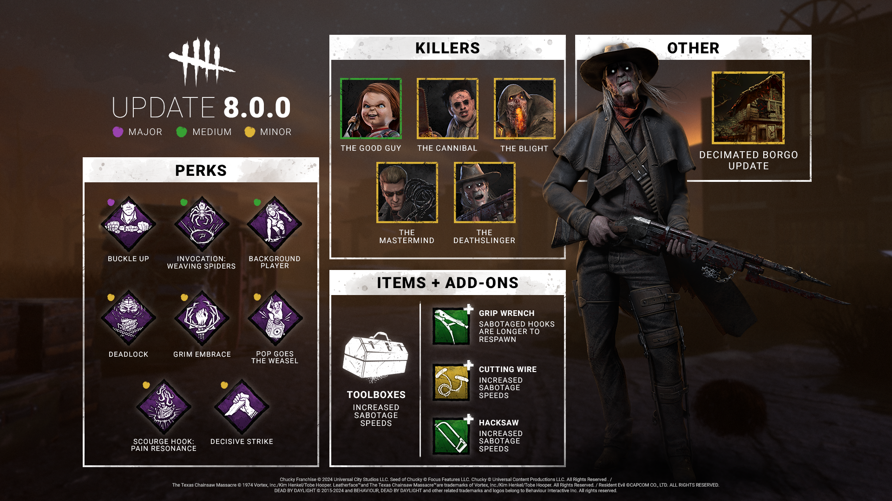
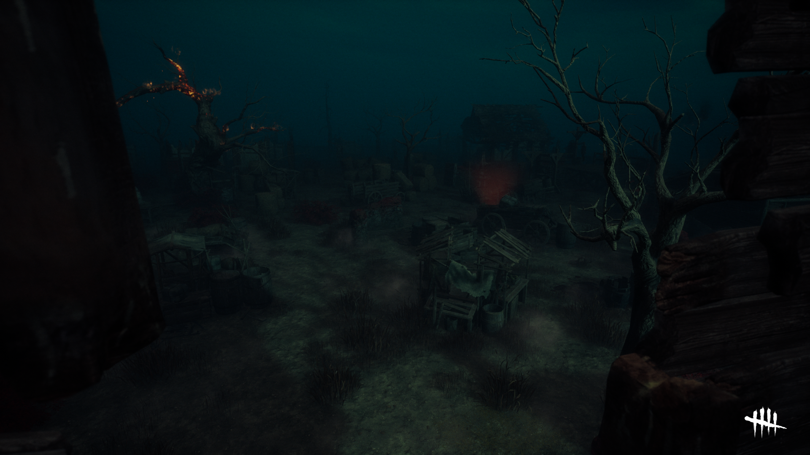
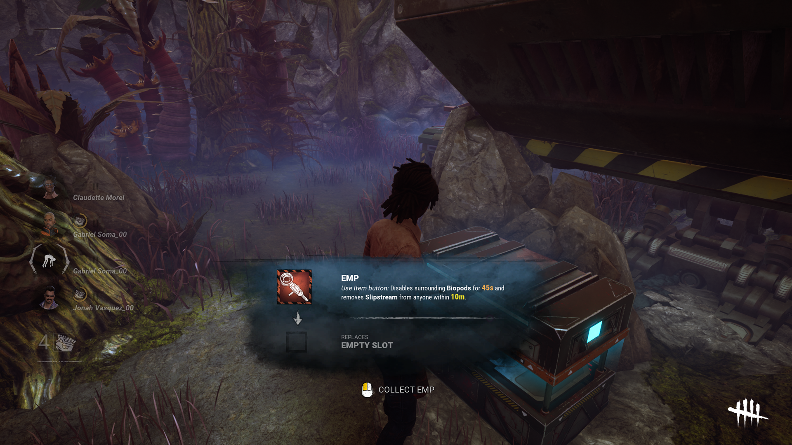

<!-- summary -->
## AI TL;DR

Ahead of the 9th-year Chapter 8.0.0, the May 2024 developer update introduces a suite of balance tweaks and quality-of-life changes that will first appear on the Public Test Build. Chucky’s Scamper now only works with Slice & Dice and its cooldown is cut, while the Cannibal’s Chainsaw Sweep, tantrum time and collision box are adjusted to reduce add-on reliance. The Deathslinger gains faster reeling and reload speed, and the Blight’s ultra-rare add-ons are toned down. Several high-impact survivor perks (Deadlock, Background Player, Buckle Up, Pop Goes the Weasel, Pain Resonance, Invocation) see reduced durations or effects. The Shattered Square map lighting and item pop-up UI are reworked for better visibility.
<!-- /summary -->

<!-- nav -->
&larr; [Developer Update | April 2024 PTB](444-developer-update-april-2024-ptb.md) · [Developer Updates](../index.md#developer-updates) · [Stats | April 2024](450-stats-april-2024.md) &rarr;
<!-- /nav -->

# Developer Update | May 2024

We’re heading into our 9th Year! Alongside a brand-new Chapter coming in the 8.0.0 Update, we’ve prepared a large number of balance changes and quality of life improvements for existing content. As always, these adjustments will head to the Public Test Build (PTB) shortly where we’ll collect feedback and make some tweaks where necessary before the update releases on all platforms.

- \[CHANGE\] **Decreased Hidey-Ho cooldown to 12 seconds** (was 18 seconds).
- \[CHANGE\] **Chucky can only Scamper while performing a Slice & Dice attack.**
- \[CHANGE\] **Decreased the time it takes to Scamper to 1.3 seconds** (was 1.4 seconds)

*Dev note: Scamper could sometimes lead to unavoidable hits since Survivors could not possibly get someplace safe in the time it took for Chucky to crawl under the pallet. We want to shift his gameplay away from these easy hits (Scamper then basic attack) and instead encourage using his unique Slice & Dice attack.*

*Since this change would affect his strength, we have reduced the cooldown of Slice & Dice to allow Chucky to use his Power much more frequently.*

 

- \[CHANGE\] **Increased Chainsaw Sweep duration to 2.5 seconds per token** (was 2 seconds).
- \[CHANGE\] **Increased Chainsaw Sweep movement speed to 5.35m/s** (was 5.29m/s).
- \[CHANGE\] **Decreased collision detection size to help navigate tight spaces.**
- \[CHANGE\] **Decreased base tantrum time to 3 seconds** (was 5 seconds).
- \[CHANGE\] **Several Add-Ons have been adjusted accordingly.**

*Dev note: To reduce The Cannibal’s dependence on certain Add-Ons, we’ve taken part of the effects of the most popular Add-Ons and incorporated them into his base kit and toned down the Add-Ons to compensate. This way they’ll feel less essential and allow you to experiment with other options.*

*We’ve also reduced the size of the chainsaw’s collision detection against the environment to make it less likely to bump into things that aren’t directly in front of you to make it easier to use his Power in tight spaces (and reduced the tantrum duration in case you still bump into something).*

 

- \[CHANGE\] **Decreased stun time when a Survivors breaks free to 2.7 seconds** (was 3 seconds).
- \[CHANGE\] **Increased reel speed to 2.76m/s** (was 2.6m/s).
- \[CHANGE\] **Increased movement speed while reloading to 3.08m/s** (was 2.64m/s).

*Dev note: Every second counts, so we’ve made some tweaks to save The Deathslinger some time when reeling and when a Survivor breaks free. We have also increased his movement speed while reloading so he doesn’t lose as much distance in the process.*

 

- \[CHANGE\] **Decreased Hindered penalty from infection to 4%** (was 8%).
- \[CHANGE\] **Infection is now reduced to 1% when hooked** (was 50%).

*Dev note: On top of Virulent Bound being a strong chase Power to begin with, infected Survivors also suffered from a severe movement speed penalty. We have reduced this effect to 4% - still significant, but not a death sentence.*

*We have also further reduced Survivors’ infection when hooked to make tunneling (chasing them as soon as they are unhooked) less of an obvious choice.*

 

- \[CHANGE\] **Compound 33 now increased Rush turn rate and duration by 11%** (was 33%).
- \[CHANGE\] **Iridescent Blight Tag now increased Rush speed by 10%** (was 20%).

*Dev note: The Blight’s ultra-rare Add-Ons have proven to be too strong, so we have toned both of them down to a more reasonable level.*

 

- \[CHANGE\] **Increased Toolbox sabotage speed across most variants.**
- \[CHANGE\] **Increased effects of sabotage related Add-Ons** (Grip Wrench, Cutting Wire, Hacksaw).

*Dev notes: Toolboxes are often considered “the repair item” – while this is fine for those who want to use them to repair, we’d like to make sure that sabotage feels like a viable alternative for those who want it.*

This update features balance changes to a selection of the strongest and most frustrating Perks to face. The majority of these adjustments are slight; the intention is to keep the Perks feeling effective and to bring them a bit more in line with other options.

- \[CHANGE\] **Decreased block duration to 15/20/25 seconds** (was 20/25/30 seconds).

*Dev note: Deadlock is quite effective while being rather easy to activate. We have slightly reduced the duration of the generator blocker to bring it in line with other options.*

 

- \[CHANGE\] **Decreased movement speed bonus to 150%** (was 200%).
- \[CHANGE\] **Decreased Exhausted duration to 30/25/20 seconds** (was 60/50/40 seconds).

*Dev note: Background Player’s high movement speed allowed Survivors to cross extreme distances to make a save. There was no way for the Killer to reasonably check that area, let alone defend against it. We have reduced the movement speed and instead reduced the Exhausted duration to compensate. This will make it harder to get a save but allow you to make attempts more often.*

 

- \[CHANGE\] **Decreased block duration to 6/8/10 seconds** (was 8/10/12 seconds).

*Dev note: Grim Embrace has quickly risen in both strength in popularity since it was last changed. We have similarly toned it down slightly to move it into a more balanced range while keeping it rewarding for Killers who choose to switch targets.*

 

- \[CHANGE\] **Reduced stun duration to 4 seconds** (was 5 seconds).

*Dev note: Our last update increased the stun duration to 5 seconds. This was a little too effective, so we have fine tuned the stun duration to 4 seconds instead.*

 

- \[CHANGE\] **Decreased regression effect to 20%** (was 30%).

*Dev note: Pop Goes the Weasel has proven to be very strong, and the conditions to activate it aren’t very difficult. To better reflect how often it comes into play, we have reduced the strength of its regression effect.*

 

- \[REMOVED\] **Buckle Up no longer provides Endurance.**
- \[NEW\] **Survivors healed from the dying state break into a sprint at 150% movement speed for 3/4/5 seconds. This does not cause Exhaustion.**

*Dev note: Buckle Up could be problematic when paired with For the People, allowing Survivors to save each other before the Killer can pick them up risk-free. Since there’s a lot of competition between Perks which grants Survivors Endurance from the dying state, we’ve decided to replace the effect entirely to help it stand out.  
 Now, Buckle Up will instead grant the healed Survivor a speed boost, but not protect the rescuer from harm.*

 

- \[CHANGE\] **Decreased regression effect to 10/15/20%** (was 15/20/25%).

*Dev note: Pain Resonance finds itself in almost 40% of all loadouts, and it is one of the most effective Perks in the game. We want to make this Perk less of a clear choice for all builds, but keep it rewarding for Killers who choose to chase multiple Survivors.*

 

- \[CHANGE\] **Decreased Invocation time to 60 seconds** (was 120 seconds).
- \[CHANGE\] **Invocation progress now regressed at a rate of 1 charge per second** (was 20 charges per second).

*Dev note: Now that we’ve had some time to see the Invocation mechanic play out, we’re ready to make some adjustments to both the Invocation process (in preparations for future Invocation Perks) and Weaving Spiders itself.*

*Invocations are meant to be a time commitment, but they took a little longer than we’d like. We have reduced them to 60 seconds to better fit the flow of a match. This can be further sped up by cooperating with other Survivors. We have also slowed the regression effect to give Survivors a chance to return and save some of their progress after they are chased away. These changes will be consistent among future Invocation Perks.*

 

- \[NEW\] **Reworked the lighting of the Shattered Square map.**

*Dev note: The red-tinted lighting in the Shattered Square could make it difficult to see scratch marks, auras, and pools of blood, especially for colorblind players. We have completely changed the lighting on this map to address these concerns.*

 

- \[NEW\] **Reworked pop-up for Items found within a Trial.**

*Dev note: The existing pop-ups for Items were minimal, showing only the Item’s icon and remaining charges. This relied on players knowing all the details of each Item – and with a growing number of Killer-specific Items, that’s getting harder to do!*

*When you approach an Item, you’ll now see a brief description of what that Item does.*

 

We have plenty more surprises in store for the upcoming year. Be sure to tune in to our Anniversary Broadcast on May 14th at 11AM ET for exciting reveals, including new features, the next Chapter, and more!  
 Be sure to follow us on Twitch or subscribe on YouTube so you don’t miss out!

Until next time…  
 The Dead by Daylight team

<!-- nav -->
&larr; [Developer Update | April 2024 PTB](444-developer-update-april-2024-ptb.md) · [Developer Updates](../index.md#developer-updates) · [Stats | April 2024](450-stats-april-2024.md) &rarr;
<!-- /nav -->
