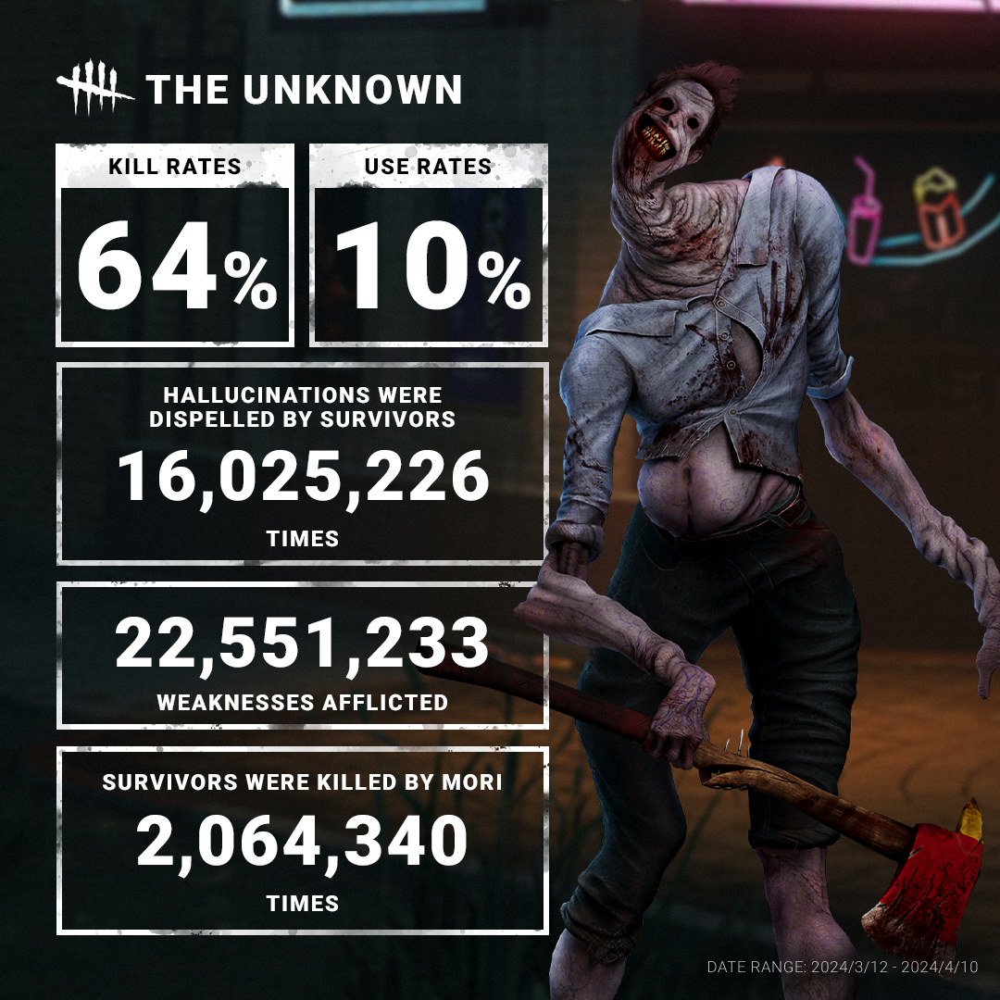
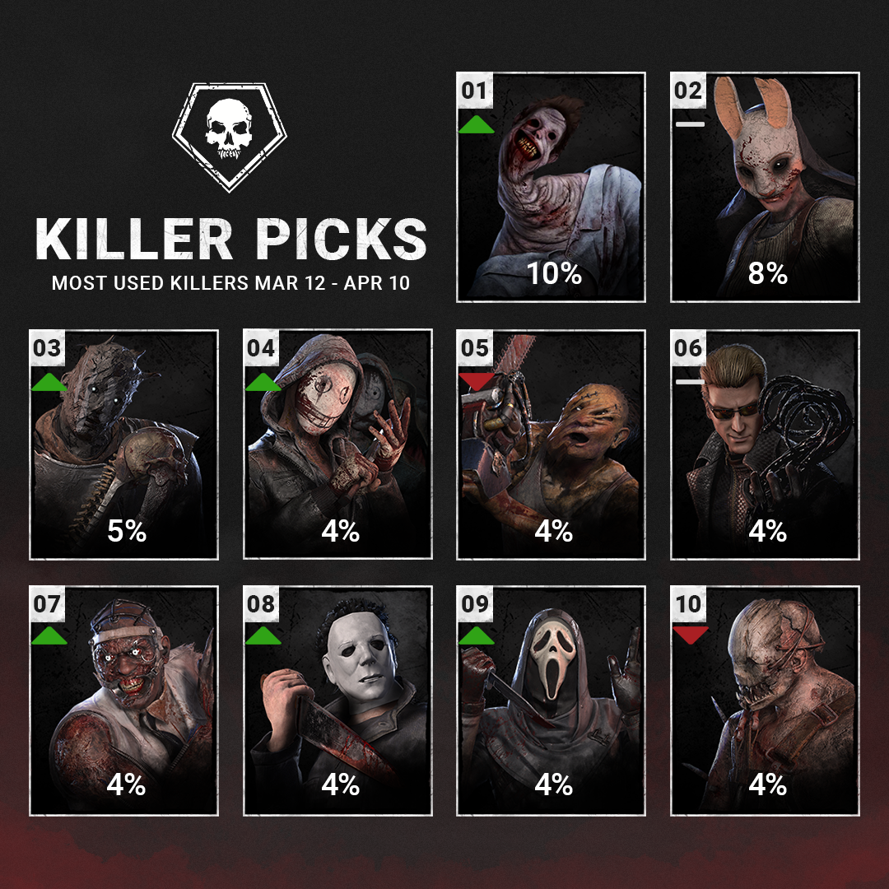
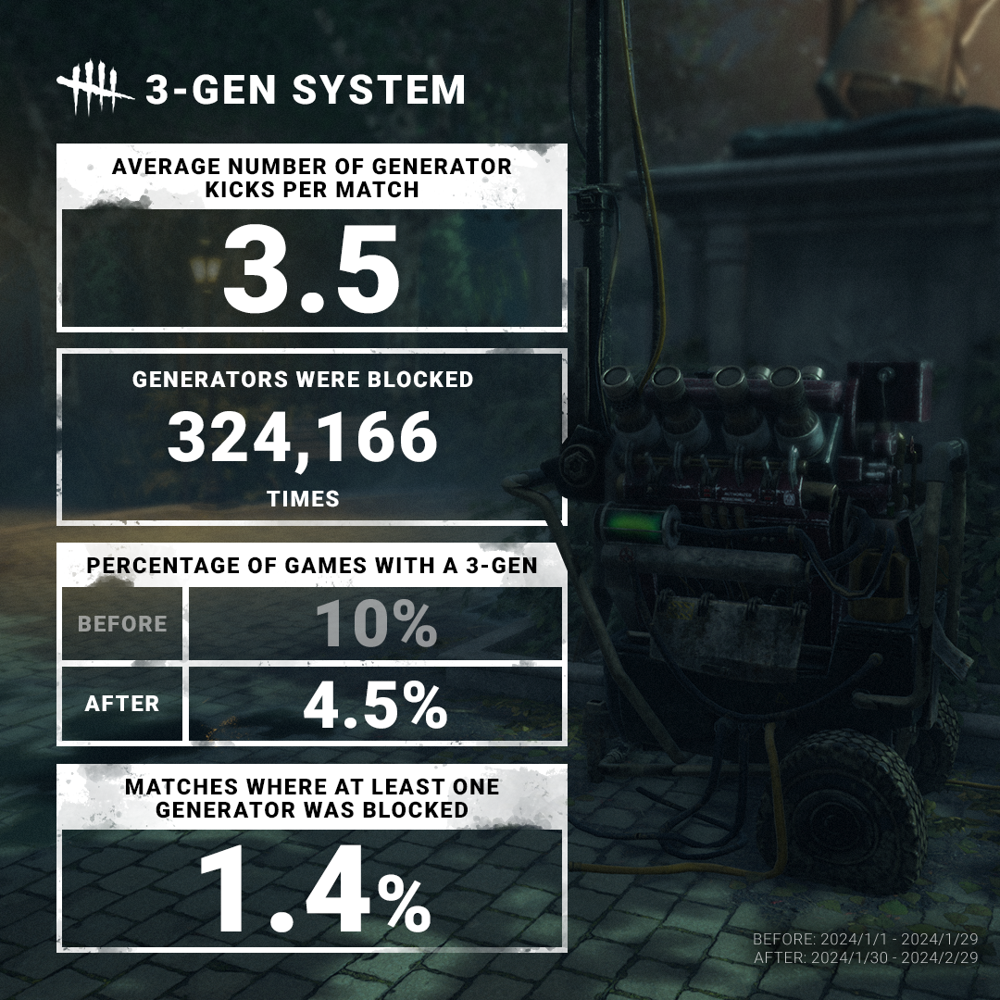
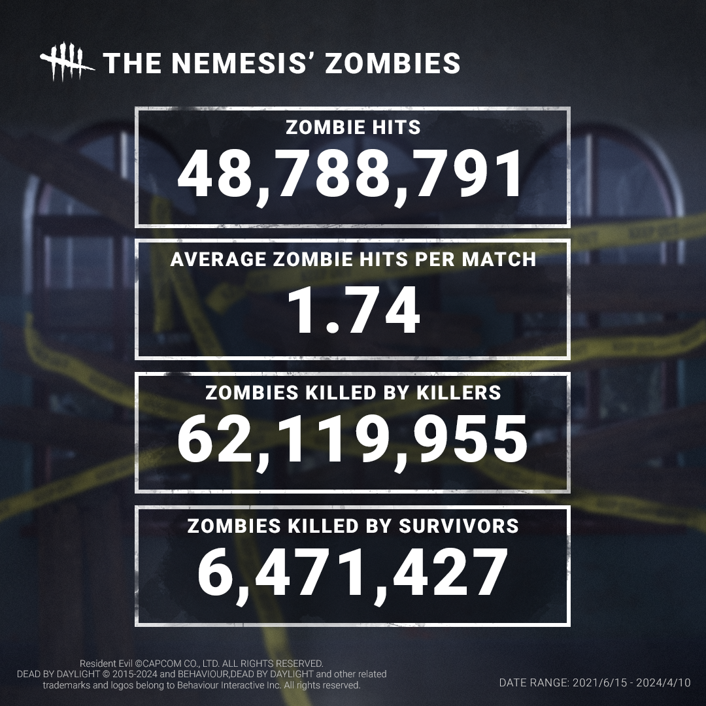

<!-- summary -->
## AI TL;DR

The Unknown posted a 64 % kill rate and 10 % usage in its debut month, topping the most-popular Killer list, while the Hillbilly fell to 4 % after his recent patch. The new generator-regression limit cut three-generator matches from 10 % to 4.5 % and left regular matches largely unchanged, with only 1.4 % seeing a blocked generator and an average of 3.5 kicks per game. Meanwhile Nemesis demonstrated overwhelming zombie-killing power, delivering roughly ten times more punches and whips than survivors, who endured 48 million zombie attacks (about 1.74 per match).
<!-- /summary -->

<!-- nav -->
&larr; [Developer Update | May 2024](448-developer-update-may-2024.md) · [Developer Updates](../index.md#developer-updates) · [Developer Update | May 2024 PTB](451-developer-update-may-2024-ptb.md) &rarr;
<!-- /nav -->

# Stats | April 2024

What is that? It’s The Unknown(‘s data). In its debut month, The Unknown climbed to a 64% kill rate and a 10% usage rate.

An average of 5.76 hallucinations were dispelled per match. If you’re having a hard time facing The Unknown, be sure to dispel those hallucinations! Dispelling hallucinations prevents The Unknown from teleporting to them.

As with any new Killer, The Unknown shot to the top of the most popular Killers list. The Hillbilly, meanwhile, has now settled at a respectable 4% usage following his recent update.

After the introduction of the generator regression limit, we kept a close eye on the system to see how it affected both 3 gen (defending 3 generators for extended periods) and regular matches.

With this system in place, the amount of 3 gen matches fell from 10% of all matches to 4.5%. (Criteria: At least 400 seconds between fourth generator being powered and the end of the match.)

As for regular matches, it appears this mechanic rarely comes into play. Only around 1.4% of matches see at least one generator blocked, with an average of 3.5 kicks per match.

Who’s the best zombie killing machine – Survivors, or The Nemesis? The answer is not even close: The Nemesis has punched and whipped near ten times more zombies than Survivors.

Those zombies aren’t going down without a fight, they’ve attacked Survivors over 48 million times, an average of 1.74 per match.

We have a challenge for you: Let’s see how many zombies you can slay! No pressure, but the impending zombie apocalypse depends on it.

Until next time…

The Dead by Daylight team

<!-- nav -->
&larr; [Developer Update | May 2024](448-developer-update-may-2024.md) · [Developer Updates](../index.md#developer-updates) · [Developer Update | May 2024 PTB](451-developer-update-may-2024-ptb.md) &rarr;
<!-- /nav -->
