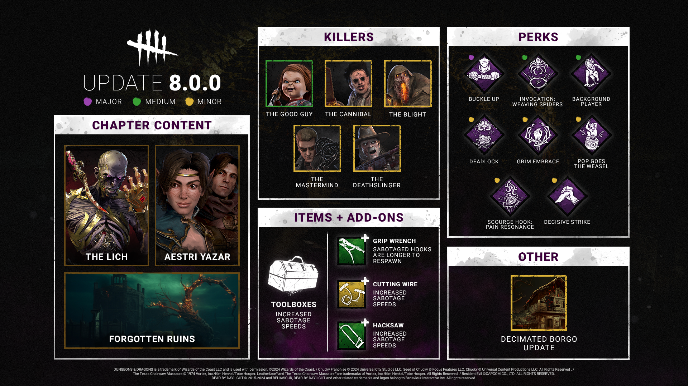

<!-- summary -->
## AI TL;DR

The Lich gets a faster spell cycle: cooldown down to 38 s, charge time 0.2 s, and charging speed now 4 m/s. Fly spell lasts 4 s, ends with a collision, while Flight of the Damned spawns faster, shoots at 9 m/s and recovers at 3.68 m/s. Dispelling Sphere and Mage Hand also see longer durations and reduced movement penalties, and Magic Items now reveal the Killer’s aura for only 1.5 s. The Blight’s Compound Thirty-Three add-on now caps Rush tokens at five. Perks Bardic Inspiration, Still Sight, Weave Attunement and Dark Arrogance receive longer durations, increased aura ranges or higher vault speed bonuses.
<!-- /summary -->

<!-- nav -->
&larr; [Stats | April 2024](450-stats-april-2024.md) · [Developer Updates](../index.md#developer-updates) · [Developer Update | June 2024](455-developer-update-june-2024.md) &rarr;
<!-- /nav -->

# Developer Update | May 2024 PTB

As we roll into the 8.0.0 Update, we have made a series of changes since the Public Test Build (PTB).

The Lich

The Lich

- \[CHANGE\] Reduced spell cooldown to 38 seconds (was 50 seconds).
- \[CHANGE\] Decreased charge time for spells to 0.2 seconds (was 0.33 seconds).
- \[CHANGE\] Increased movement speed when charging a spell to 4.0m/s (was 3.68m/s).
- \[CHANGE\] Balance adjustments for an assortment of Add-Ons.
- \[CHANGE\] Increased Bloodpoints for some score events.

*Dev note: We have made some tweaks to improve the feel of using spells across the board, and fine-tuned various Add-Ons and score events.*

- \[CHANGE\] Increased duration of Fly spell to 4 seconds (was 3.5 seconds).
- \[CHANGE\] Increased friction at the end of the Fly spell.
- \[NEW\] The Killer can now collide with Survivors as the Fly spell ends.

*Dev note: We have slightly increased the duration of the Fly spell to allow The Lich to cover more ground and increased his friction with the ground at the end of the spell to prevent sliding & improve feel.*

- \[CHANGE\] Reduced Flight of the Damned spawn time to 0.5 seconds (was 1 second).
- \[CHANGE\] Increased Flight of the Damned projectile speed to 9m/s (was 8m/s).
- \[CHANGE\] Increased Flight of the Damned recovery movement speed to 3.68m/s (was 2.3m/s).

*Dev note: Flight of the Damned can be dodged by crouching, but its slow spawn speed & projectiles made it too easy to avoid. The Lich’s slow movement speed afterwards also made missing an attack a very costly mistake, so we have reduced the speed penalty after casting.*

- \[CHANGE\] Increased Dispelling Sphere duration to 25 seconds (was 20 seconds).
- \[CHANGE\] Increased Dispelling Sphere movement speed to 5.5m/s (was 4.2m/s).
- \[CHANGE\] Increased Dispelling Sphere recovery movement speed to 3.68m/s (was 2.3m/s).

*Dev note: We have made adjustments to allow Dispelling Sphere to travel further (and faster) before it disappears. Likewise, we have also reduced the speed penalty after casting to improve the feel.*

- \[CHANGE\] Decreased Mage Hand’s time to lift a pallet to 0.35 seconds (was 0.5 seconds).
- \[CHANGE\] Increased Mage Hand recovery movement speed to 3.68m/s (was 2.3m/s).

*Dev note: The high movement speed penalty made it difficult to follow up and get a hit. We have made this a little more forgiving.*

- \[NEW\] Activating the effects of a Vecna Item inflicts Broken for 30 seconds.
- \[CHANGE\] Decreased aura reveal by Magic Items to 1.5 seconds (was 3 seconds).

*Dev note: We have reduced the time the Killer’s aura is revealed by Magic Items so they act more as a warning than a mind-game prevention.*

    

The Blight

- \[CHANGE\] **Compound Thirty-Three:**Now limits Rush tokens to 5 (was 3).

*Dev note: With the other effects of this Add-On toned down, we have increased the token limit to 5.*

    

Bardic inspiration

- \[CHANGE\] Increased duration & cooldown to 90 seconds (was 60 seconds).

*Dev note: We have extended Bardic Inspiration’s duration to give the opportunity to gain more value from the Perk before it expires.*

    

Still Sight

- \[CHANGE\] Increased aura reading range to 24m (was 18m).

*Dev note: Still Sight’s range was a little low, so we’ve extended it to 24m. This can be further increased with the Perk Open-Handed if you choose!*

    

Weave Attunement

- \[CHANGE\] Increased aura reading range to 12m (was 8m).

*Dev note: We have increased the range of the aura reveal to increase the coverage from dropped Items.*

    

Dark Arrogance

- \[CHANGE\] Increased vault speed bonus to 25% (was 20%).

*Dev note: We have further increased the vault speed bonus to make Dark Arrogance a more compelling choice compared to other vault Perks.*

Until next time…

The Dead by Daylight team

<!-- nav -->
&larr; [Stats | April 2024](450-stats-april-2024.md) · [Developer Updates](../index.md#developer-updates) · [Developer Update | June 2024](455-developer-update-june-2024.md) &rarr;
<!-- /nav -->
