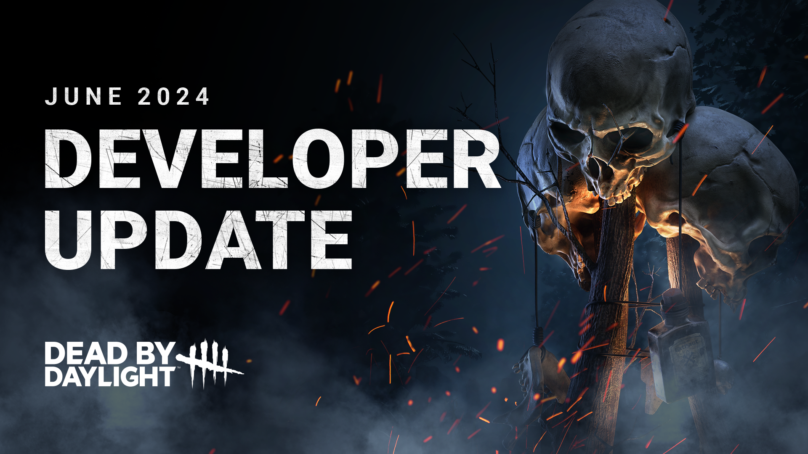

<!-- summary -->
## AI TL;DR

The update lets The Knight swap guards and requires patrol paths of at least 10 m, granting up to 1.5× longer hunt time. Hunt times, banner spawns, break speeds and detection ranges for The Carnifex, The Jailer and The Assassin are reshuffled, and The Knight’s guard depletes faster near the Killer. The Singularity gains Biopod targeting tweaks, new aim-assist, altered Overclock duration and cooldown, and EMPs now have reduced passive printing and shorter slipstream immunity.

Cooldowns for I’m All Ears, Trail of Torment, Oppression, Dragon’s Grip and other perks are cut, while Machine Learning and Babysitter durations are extended. Hooks repair themselves 60 seconds after a sacrifice, and Yamaoka Estate and Mount Ormond Resort receive layout variations. UI tweaks complete the patch.
<!-- /summary -->

<!-- nav -->
&larr; [Developer Update | May 2024 PTB](451-developer-update-may-2024-ptb.md) · [Developer Updates](../index.md#developer-updates) · [Developer Update | June 2024 PTB](458-developer-update-june-2024-ptb.md) &rarr;
<!-- /nav -->

# Developer Update | June 2024

The 8.1.0 Update approaches! Read on as we divulge all the major changes making their way to the game, including updates to Killers, Perk changes, quality of life improvements and more.

- \[NEW\] Added ability to manually swap between guards.

*Dev note: Each guard has a specialty, so we’ve added the ability to choose the right guard for each situation. This will provide a nice boost in power and quality of life.*

- \[NEW\] Patrol paths must be at least 10 meters in length.
- \[NEW\] Added a multiplier to guard hunt time based on path length. Longer paths increase hunt time up to a maximum 1.5x the normal duration.
- \[NEW\] When The Knight is within 8 meters of his guard, the guard’s hunt timer depletes 3x faster.

*Dev note: Dropping a guard at your feet in a loop is often the best choice but leaves little counterplay for the Survivor. We’ve added incentives for longer paths and improved counterplay when someone is being chased by both The Knight and his guard at the same time.*

- \[CHANGE\] Reduced The Carnifex’s hunt time to 12 seconds (was 24 seconds).
- \[CHANGE\] Increased The Jailer’s hunt time to 24 seconds (was 12 seconds).
- \[CHANGE\] Reduced The Carnifex’s banner spawn time to 5 seconds (was 10 seconds).
- \[CHANGE\] Increased The Jailer’s banner spawn time to 10 seconds (was 5 seconds).

*Dev note: The Carnifex was previously the best at both breaking things and keeping Survivors occupied, making him the best choice for multiple scenarios. We’ve swapped these hunt times (and their associated banner spawn times) around, making The Jailer the specialist for patrolling and chasing the longest.*

- \[CHANGE\] Decreased The Carnifex’s breaking time to 1.8 seconds (was 2 seconds).
- \[CHANGE\] Decreased The Assassin’s breaking time to 5 seconds (was 6 seconds).
- \[CHANGE\] Decreased The Jailer’s breaking time to 5 seconds (was 6 seconds).
- \[CHANGE\] Increased The Carnifex’s detection range to 10 meters (was 8 meters).
- \[CHANGE\] Increased The Assassin’s detection range to 10 meters (was 8 meters).
- \[CHANGE\] Increased The Jailer’s detection range to 16 meters (was 14 meters).
- \[CHANGE\] Updated various Add-Ons.

*Dev note: Map of the Realm and Pillaged Mead were fan-favorite Add-Ons, so we have incorporated some of their effects into the base kit. We’ve reviewed many of The Knight’s Add-Ons to bring the strongest and weakest Add-Ons closer together.*

 

- \[NEW\] Taking control of a Biopod will now cause it to aim at the nearest Survivor within line of sight.
- \[NEW\] After 0.25 seconds, targeting progress now decays over the next 0.5 seconds.
- \[CHANGE\] When controlling a Biopod, Survivor now only glow if they can be targeted.
- \[CHANGE\] Decreased Biopod targeting cooldown after Slipstreaming a Survivor to 3 seconds (was 3.5 seconds).
- \[CHANGE\] Improved UI when using Biopods and when shooting with the Killer.

*Dev note: The Singularity can be hard to learn but deadly when mastered, so we’ve made some adjustments to make targeting Survivors with Biopods easier. These changes won’t have a significant effect on those who have already mastered The Singularity.*

- \[NEW\] Added the ability to destroy the currently controlled Biopod.
- \[CHANGE\] The Killer can now hear audio by default when controlling a Biopod.

*Dev note: Some quality of life improvements! Biopods now have audio without needing an Add-On, and you can now destroy a Biopod from a distance.*

- \[NEW\] The Killer now receives Killer Instinct when a Survivor is Slipstreamed.
- \[CHANGE\] The last controlled Biopod has its aura revealed in yellow for 10 seconds (was 5 seconds).

*Dev note: Switching between Biopods and The Singularity can be disorienting, so we’ve made some changes to help players get their bearings and find targets.*

- \[NEW\] The Singularity gains 3% Haste while in Overclock mode.
- \[REMOVED\] Overclock’s duration no longer scales with the number of Slipstreamed Survivors.
- \[CHANGE\] Increased Overclock’s base duration to 5.7 seconds (was 4.7 seconds).
- \[CHANGE\] Stuns caused by Perks (such as Head On, Blast Mine) during Overclock mode will now cause Overheat.

*Dev note: The Soma Family Photo Add-On was much loved, so we’ve added part of its effect to the base kit. To simplify Overclock, we have removed the scaling duration and bumped up the time to 5.7 seconds.*

- \[NEW\] Added an aim assist effect to shooting a Slipstreamed Survivor.
- \[CHANGE\] Increased an aim assist when creating a Biopods.

*Dev note: When attempting to teleport to a Survivor or place a Biopod, a slight change could cause your shot to miss or become an invalid spot for a Biopod, causing it to do nothing. We have improved the aim assist to linger slightly longer on the last valid place or Slipstreamed Survivor.*

- \[NEW\] Passive EMP printing at Supply Cases is now limited to 97%. The remaining progress must be done manually by a Survivor.
- \[NEW\] Supply Cases that have reached the passive printing limit now have their auras revealed in yellow.
- \[NEW\] Disabled Biopods will pulse shortly before they are reactivated.
- \[CHANGE\] Decreased the aura reading range of Supply Cases to 28 meters (was 32 meters).
- \[CHANGE\] Increased range of EMPs to 10 meters (was 8 meters).
- \[CHANGE\] Decrease immunity to Slipstream after using an EMP to 0.35 seconds (was 2 seconds).

*Dev note: EMPs are an essential tool to playing against The Singularity, but they can be too plentiful at times, making it hard for The Killer to use their Power. Survivors will now need to spend a little more time to acquire EMPs, and they won’t be protected from further Slipstreams after using one. We’ve added new VFX to Biopods to let Survivors know when a pod that has been disabled is about to reactivate.*

- \[CHANGE\] Reduced the time it takes to switch back to The Singularity to 0.5 seconds (was 1 second).
- \[CHANGE\] Reduced the time it takes to switch back to The Singularity when near a hooked Survivor to 1.5 seconds (was 5 seconds).

*Dev note: Since the introduction of the Anti-Facecamp system, this penalty became a little redundant as staying near a hooked Survivor now carries its own risks. We’ve reduced this penalty, though accessing Biopods next to a hooked Survivor still may not be ideal. We have also reduced the base wake-up time to make swapping back to The Singularity feel more responsive.*

- \[CHANGE\] Updated various Add-Ons.

*Dev note: We have review The Singularity’s Add-Ons, giving some new effects and balance tweaks to others.*

 

- \[CHANGE\] Increased aura reveal duration to 6/7/8 seconds (was 3/4/5 seconds).

*Dev note: With a longer duration, it will be easier to take advantage of the aura reveal and allow this Perk to be used more aggressively in a chase.*

 

- \[CHANGE\] Reduced cooldown to 60/45/30 seconds (was 60/50/40 seconds).

*Dev note: I’m All Ears can be very useful, but currently has a fairly long cooldown. We have reduced the cooldown so the Perk comes into play more often.*

 

- \[CHANGE\] Reduced cooldown to 60/45/30 seconds (was 80/70/60 seconds).

*Dev note: Trail of Torment similarly has a long cooldown. We have reduced this as well to allow its effect to happen more often.*

 

- \[CHANGE\] Reduced cooldown to 60/50/40 seconds (was 120/100/80 seconds).

*Dev note: Oppression had a very long cooldown, so we have cut it in half.*

 

- \[CHANGE\] Reduced cooldown to 60/50/40 seconds (was 120/100/80 seconds).

*Dev note: This is not a copying and pasting error, we’ve done the exact same thing for Dragon’s Grip!*

 

- \[CHANGE\] Increased duration to 40/50/60 seconds (was 20/25/30 seconds).

*Dev note: Getting Machine Learning to active can be tricky, so we’ve extended its duration to help the Killer get value out of it when it does.*

 

- \[CHANGE\] Decreased starting skill check penalty to -15% (was -25%).

*Dev note: Autodidact can become very strong (with some luck) later in the match, but the large penalty often means it’ll do more harm than good. We’ve toned down this penalty to make it a little more consistent and improve its strength once you’ve built up your tokens.*

 

- \[CHANGE\] Increased healing speed bonus to 30% (was 10%).

*Dev note: Empathic Connection is great for showing injured Survivors where you are, but the healing speed bonus is a bit low. We have increased the speed at which you heal others to 30%.*

 

- \[CHANGE\] Grunts of pain are reduced by 80/90/100% (was 25/50/75%).

*Dev note: Iron Will already makes Survivors fairly quiet, but even the slightest noise can give away your position. We have increased the effects of the Perk and reduced the gap between tiers to make lower tiers more useful.*

 

- \[CHANGE\] Increased healing granted after being unhooked to 50/60/70% (was 40/45/50%).

*Dev note: Resurgence is currently a little weak, and since it can only activate twice per match, we have increased the healing it grants.*

 

- \[CHANGE\] Increased healing conversion rate to 50/60/70% (was 40/45/50%).

*Dev note: Solidarity can be a little tricky to use, requiring you to be injured and find another injured Survivor to heal. We have increased the conversion rate to make it even more impactful when it comes into play.*

 

- \[CHANGE\] Increased duration of Haste and pools of blood hiding to 20/25/30 seconds (was 4/6/8 seconds).

*Dev note: Babysitter’s duration was low, causing it to not provide much value before it ran out. We have extended its duration significantly to make it more impactful.*

 

- \[NEW\] Hooks that a Survivor has been sacrificed on will repair themselves after 60 seconds.

*Dev note: With hooks remaining permanently broken, it could create some deadzones where it was impossible to get a Survivor to a hook before they could wiggle free. Now when a Survivor is sacrificed on a hook, it will automatically be repaired after 60 seconds.*

 

- \[NEW\] Added layout variations to Yamaoka Estate maps.
- \[NEW\] Added layout variations to the Mount Ormond Resort map.

*Dev note: We have added new possible layouts for each of these three maps. While the layout of these variants are different, they’ll include the same iconic features (landmarks, decorations, etc.) and are a similar size to the originals.*

Until next time…

The Dead by Daylight team

<!-- nav -->
&larr; [Developer Update | May 2024 PTB](451-developer-update-may-2024-ptb.md) · [Developer Updates](../index.md#developer-updates) · [Developer Update | June 2024 PTB](458-developer-update-june-2024-ptb.md) &rarr;
<!-- /nav -->
