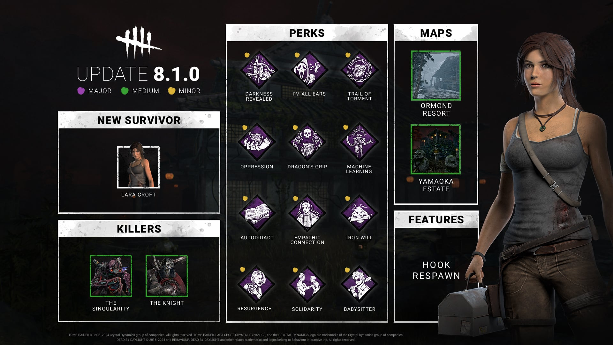
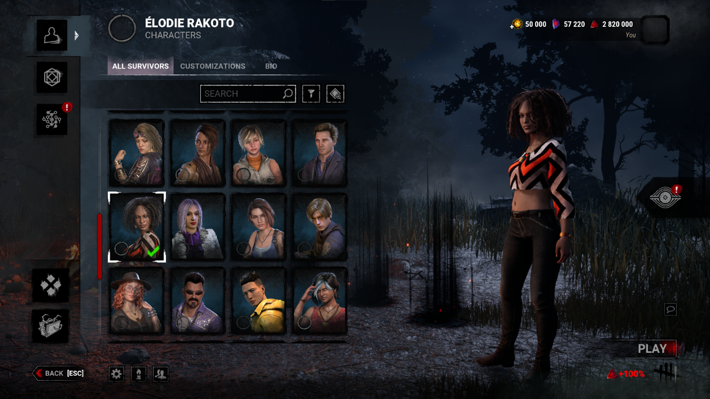

# Developer Update | June 2024 PTB

After taking in your feedback, we have made a few changes following our most recent Public Test Build (PTB).

- \[NEW\] Adding a banner spawn time multiplier based on patrol path length, up to 2x.

*Dev note: It was difficult to take advantage of the guard chase time multiplier as the Survivor could quickly grab the banner to escape the guard and negate the bonus.*

*To make longer patrol paths more effective, we are applying a similar multiplier to banner spawn times. This means the banner will take longer to appear for longer patrol paths, up to double the normal time.*

    

- \[REVERTED\] Biopods no longer automatically aim at the nearest Survivor.
- \[REVERTED\] Decreased Biopod targeting time to 0.6 seconds (was 0.8 seconds).

*Dev note: While most of the improvements to The Singularity were well received, this change stood out as contentious among players. While some appreciated this feature – particularly those playing with a controller- others found it frustrating when they were trying to target a specific Survivor or pre-aim their pods in certain directions. We’ve decided to revert this change for the release along with the corresponding targeting time adjustment.*

*In one of the following minor updates, we will be bringing this feature back as an optional mechanic and making one further adjustment:*

- \[NEW\] Holding the Ability button when taking control of a Biopod will cause it to automatically aim at the nearest Survivor. Tapping the button will take control normally.
- \[CHANGE\] Reduced the time it takes to destroy a Biopod to 0.75 seconds (was 1.5 seconds).

*Dev note: This will make the option available for anyone who finds it helpful without forcing those who prefer to play without it! We’ll also be reducing the time it takes to destroy the controlled Biopod to save a little time.*

    

- \[CHANGE\] Increased token limit to 6 (was 3).

*Dev note: Specialist seemed to be in a decent spot on the PTB, though the low token limit could make it a little awkward to use. We’ve increased the limit to 6 and will monitor to make sure it stays balanced.*

    

- \[CHANGE\] Stridor’s effect is now additive (was multiplicative). NOTE: This change will be implemented in a minor update in the coming weeks.
- \[CHANGE\] Reduced gap between Perk tiers to make lower tiers more effective.

*Dev note: Previously, Stridor acted like a multiplier on top of the Survivor’s grunt & breathing volume. This meant that Survivors who reduced their volume to 0% stayed silent even if Stridor was in play. Stridor’s effect will now be added instead, allowing it to counter grunt reducing Perks.*

*While we were at it, we’ve also reduced the gap between tiers to make lower level versions more useful.*

    

- \[CHANGE\] Reduced the size of character portraits.
- \[CHANGE\] Increased number of characters per row to 4 (was 3).
- \[REMOVED\] Removed “Owned” tags from the character select menu.

*Dev note: We received feedback from the PTB letting us know that the increased portrait size required more scrolling and made it harder to find the character you were looking for. We’ve made the portraits smaller once again to remedy this.*

*Furthermore, many found the “Owned” tags on purchased characters to be unnecessary info. While these tags were already present in the store, they felt out of place in the character select menu. We have removed the “Owned” tags to keep it clean and simple.*

Until next time…

The Dead by Daylight team
