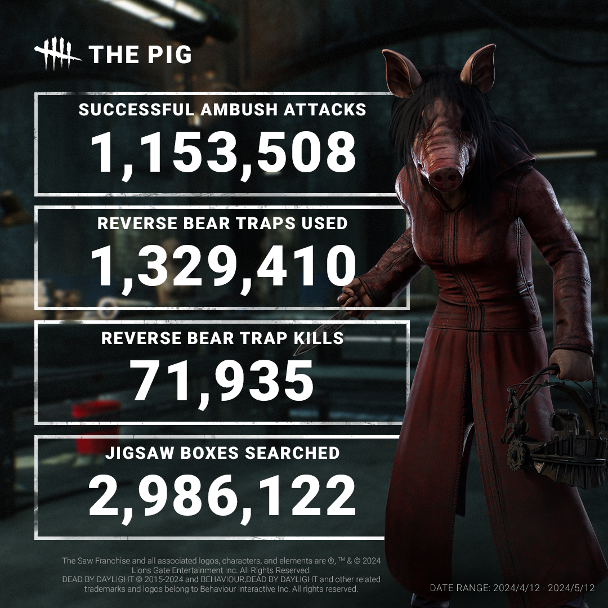
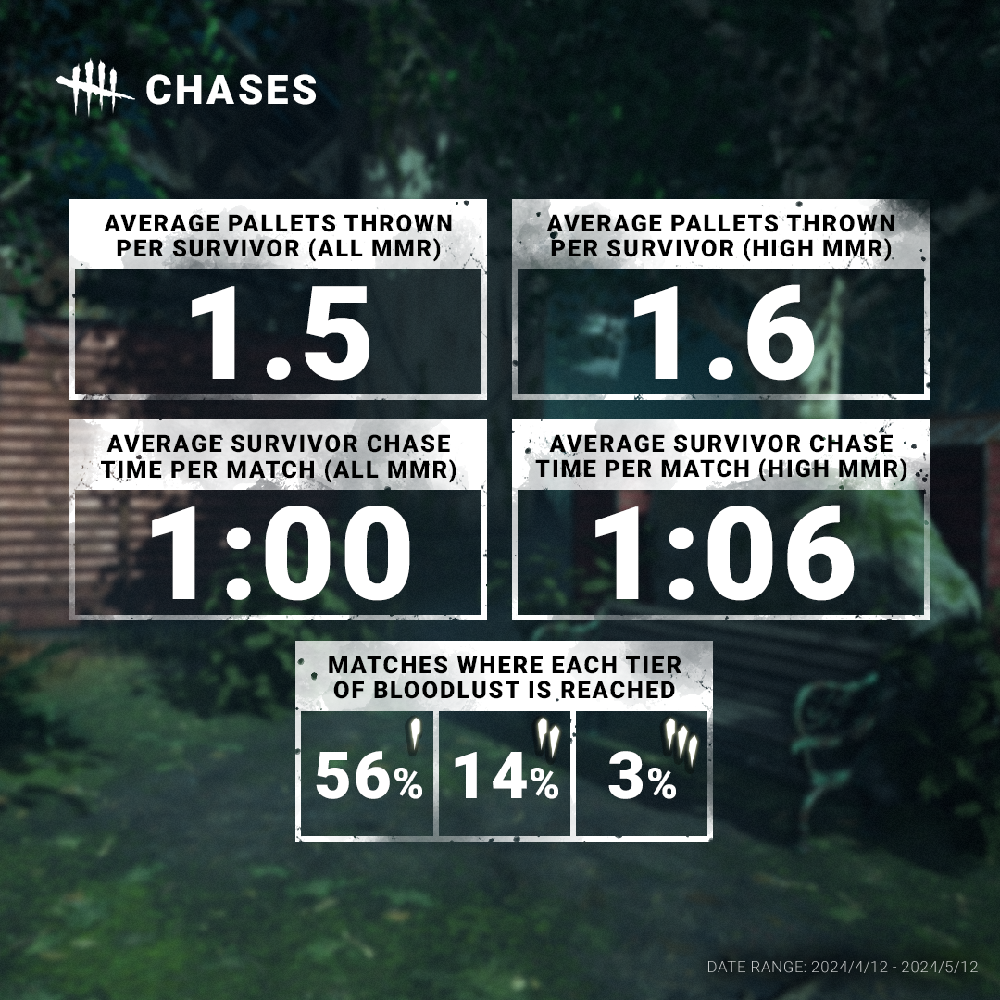
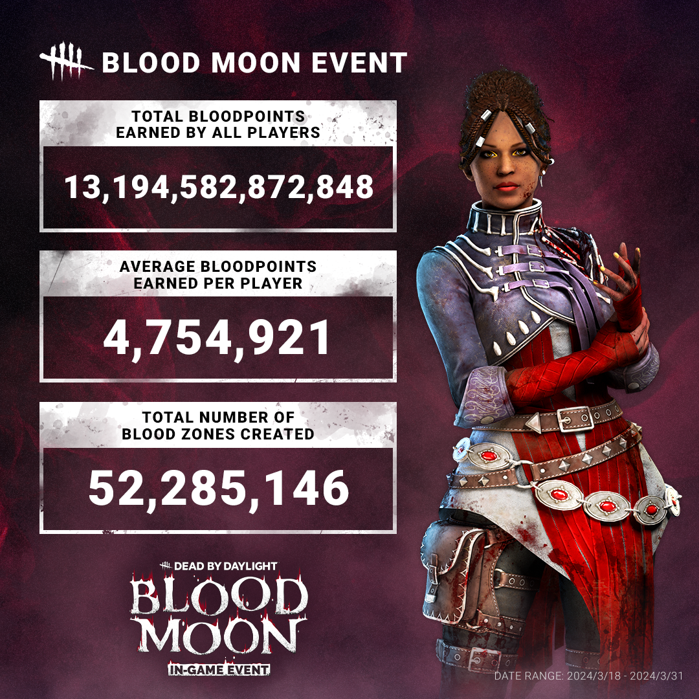
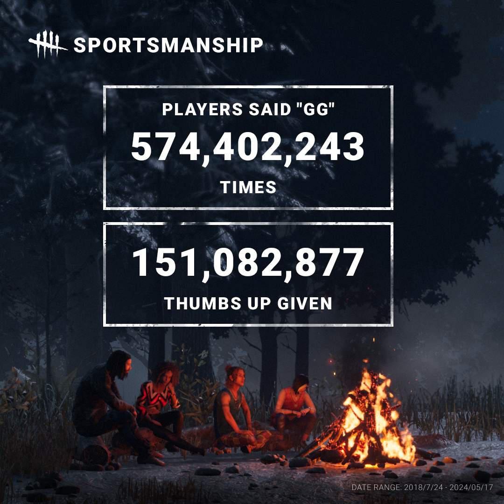

# Stats | July 2024

Ever wonder what a month in the life of The Pig is like? It turns out she’s quite busy, ambushing and fitting traps to Survivors well over a million times.

Survivors have been kept busy as well, collectively searching an average of 6.85 Jigsaw Boxes per match for the keys to their Reverse Bear Traps. These traps ultimately don’t kill many Survivors directly, killing an average of 0.17 Survivors per match, though the time spent searching for their key may be costly.

Let’s talk chases! A Survivor spends an average of one minute being chased throughout the match, throwing somewhere between one and two pallets in the process. Before you accept your “Best Survivor Award”, keep in mind that these are averages: Some Survivors may be chased more than others in a given match, and others may not be chased at all!

On the Killer side, we checked how often each tier of Bloodlust is reached. Bloodlust I kicks in at least once in about half of all matches. However, the higher tiers are far less common.

If The Entity had an accountant, they’d be sweating buckets. With more than 88,000,000 matches played, over 13 trillion Bloodpoints were awarded throughout the Blood Moon Event – that works out to an average of 4,754,921 Bloodpoints per player.

This one goes out to the good sports who managed to set aside their differences after being hunted or battered by pallets and said ‘gg’ over 574 million times. Those who prefer to show their appreciation quietly have given props to other players more than 151 million times!
