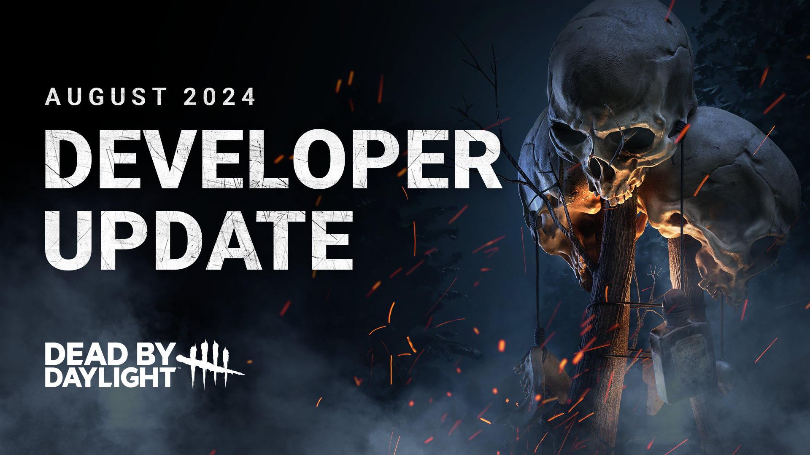
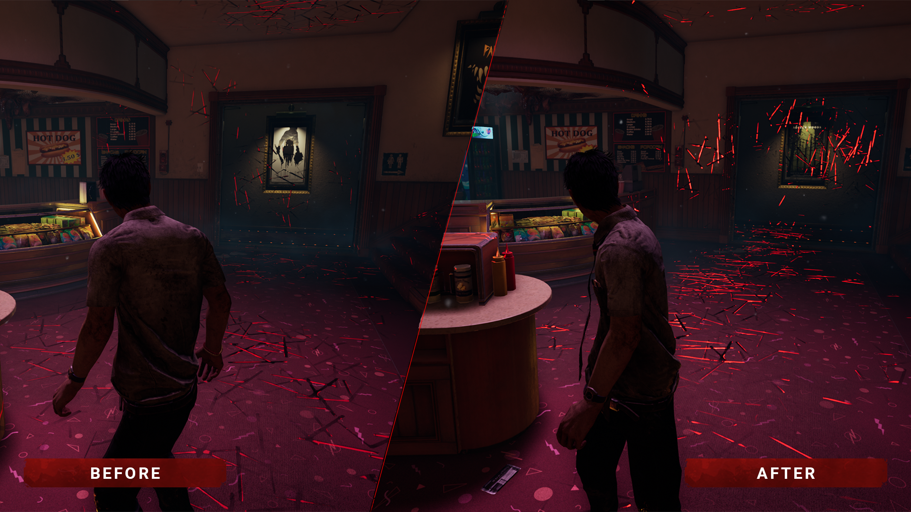

<!-- summary -->
## AI TL;DR

The Dredge receives faster movement while charging its Power and teleporting outside Nightfall, louder sound reduction, and adjusted add-ons; the Doctor’s Static Blast cooldown drops dramatically when no survivors are nearby and its charge speed rises; the Nemesis now reaches Mutation Rate 2 after five contamination points and its infection hindered penalty lasts longer. Across the board, numerous perks (Blast Mine, Wiretap, Chemical Trap, Mirrored Illusion, Dance With Me, Deception, Diversion, Flashbang) see lowered activation requirements, shorter cooldowns or trap durations. Hook phases are extended to 70 seconds, Scratch Mark visibility is improved, bathroom breakable walls are removed, hallway sightlines and exit-gate views are narrowed, and prestige levels are hidden in pre-game lobbies. All changes are slated for the upcoming PTB.
<!-- /summary -->

<!-- nav -->
&larr; [Stats | July 2024](460-stats-july-2024.md) · [Developer Updates](../index.md#developer-updates) · [Developer Update | August 2024 PTB](467-developer-update-august-2024-ptb.md) &rarr;
<!-- /nav -->

# Developer Update | August 2024

The 8.2.0 Update is on the way! In this post, we’ll reveal the various gameplay changes heading to the Public Test Build next week.

- \[CHANGE\] Increased movement speed while charging Reign of Darkness to 3.8m/s (was 3.68m/s).
- \[CHANGE\] Increased teleport speed outside of Nightfall to 19m/s (was 12m/s).
- \[CHANGE\] Reduced teleport cooldown outside of Nightfall to 10 seconds (was 12 seconds).
- \[CHANGE\] Decreased time to break out of a locked locker to 2.25 seconds (was 3 seconds).
- \[CHANGE\] Increased charge rate of the Nightfall meter to 1 charge per second per injured Survivor (was 0.75).
- \[CHANGE\] Reduced volume of The Dredge’s sound effects to make it harder to detect.
- \[CHANGE\] Adjusted several Add-Ons.

*Dev note: We’ve increased The Dredge’s movement speed both while charging its Power and while teleporting outside of Nightfall to give it a slight boost in both strength and feel. The Dredge could have difficulty taking advantage of the reduced visibility in Nightfall due to their loud sound effects when approaching, so we have reduced their volume.*

*We’ve also incorporated part of the effects of some must-have Add-Ons into the base kit, then toned them down accordingly.*

 

- \[NEW\] Reduced Static Blast’s cooldown to 30 seconds if no Survivors are in range.
- \[CHANGE\] Reduced Static Blast’s cooldown to 45 seconds if a Survivor is in range.
- \[CHANGE\] Increased movement speed while charging Static Blast to 2.99m/s (was 1.16m/s).
- \[CHANGE\] Adjusted Static Blast cooldown Add-Ons accordingly.

*Dev note: The Doctor’s Static Blast can be a helpful tool for players who struggle to find Survivors, but the long cooldown makes it punishing to miss. We’ve reduced the Static Blast cooldown slightly if a Survivor is affected, and reduced it much further if nobody is in range.*

*We have also increased his movement speed while charging a Static Blast to make it feel better to use.*

 

- \[CHANGE\] Requirement for reaching Mutation Rate 2 has been reduced to 5 Contamination Points (was 6).
- \[CHANGE\] Increased Hindered penalty duration when infecting a Survivor to 2 seconds (was 0.25 seconds).
- \[CHANGE\] Adjusted Licker Tongue and Marvin’s Blood Add-Ons.

*Dev note: To help him get up and running, we have reduced the requirement for The Nemesis to reach Mutation Rate 2. This effectively means The Nemesis can reach Mutation Rate 2 in his first three Tentacle Strikes on a single Survivor.*

*The Hindered effect caused by infecting a Survivor was previously very short, making its effect inconsequential. We have extended the Hindered effect to last throughout the speed boost the Survivor gains from being hit with the tentacle, reducing the amount of distance they gain.*

 

- \[CHANGE\] Reduced activation requirement to 40% generator repairs (was 50%).

*Dev note: Does this make it practical? No. But let’s be honest, that’s not why you’re using Blast Mine. We’ve slightly reduced the repair requirement to make it a little easier to activate, but not so easy that it becomes annoying to face.*

*This would also make it easier to activate Blast Mine when repairing a generator with other Survivors.*

 

- \[CHANGE\] Reduced activation requirement to 40% generator repairs (was 50%).

*Dev note: Wiretap can be very useful, though since the Killer must be nearby, it is always at risk of being destroyed. To get it back up and running sooner, we’ve reduced the repair requirements slightly.*

 

- \[CHANGE\] Reduced activation requirement to 20% generator repairs (was 50%).
- \[CHANGE\] Reduced trap duration to 40/50/60 seconds (was 100/110/120 seconds).

*Dev note: Chemical Trap’s previous requirement was a little steep for the effect granted. We have significantly reduced the repair requirement to allow it to come into play more often. At the same time, we’ve reduced the trap’s lifespan so the Killer has more choice in whether or not to break certain pallets until the trap has expired.*

 

- \[CHANGE\] Reduced activation requirement to 20% generator repairs (was 50%).
- \[CHANGE\] Reduced duration to 40/50/60 seconds (was 100/110/120 seconds).

*Dev note: While fun to use, Mirrored Illusion tends not to be a game changer. We have significantly reduced the activation requirement to really make the Killer question what is real.*

 

- \[CHANGE\] Reduced cooldown to 30/25/20 seconds (was 60/50/40 seconds).

*Dev note: Dance With Me’s long cooldown meant it realistically would not activate more than once per chase for many players. We have reduced this significantly to create more opportunities to shake the Killer (if only momentarily).*

 

- \[CHANGE\] Reduced cooldown to 30/25/20 seconds (was 60/50/40 seconds).

*Dev note: Similarly, Deception’s cooldown was quite long. We have reduced this Perk’s cooldown so it comes into play more often.*

 

- \[CHANGE\] Reduced activation requirement to 30/25/20 seconds (was 40/35/30 seconds).

*Dev note: Diversion requires being within the Killer’s terror radius without being chased. This is much stricter than a typical cooldown, so we have cut the requirement down significantly.*

 

- \[CHANGE\] Reduced activation requirement to 50/45/40% generator repairs (was 70/60/50%).

*Dev note: Flashbangs can come in handy, though the Perk takes a while to activate. We have reduced the requirement slightly to give them a minor boost.*

 

- \[REMOVED\] Prestige levels are no longer shown in the pre-game lobby.

*Dev note: Seeing a high prestige level caused some players to feel intimidated and leave the lobby. This has a negative effect on matchmaking and discourages players from playing their favourite Survivors.*

*Prestige levels will no longer be shown in the pre-game lobby. They will remain visible after the match has ended so you can show off your accomplishments.*

 

- \[CHANGE\] Increased duration of hook phases to 70 seconds (was 60 seconds).

*Dev note: Some time ago, the total repair time of generators was increased. For the most part this was a positive change, though it had the side effect of making camping more effective: Focusing on repairs was the best way the other Survivors could counter camping, but with repairs taking longer, the Survivors aren’t able to get as much done before the hooked Survivor is sacrificed.*

*To combat this, we are increasing the duration of each hook phase to 70 seconds. This will allot more time for Survivors to repair if the Killer chooses to camp the hooked Survivor.*

 

- \[CHANGE\] Improved Scratch Mark visibility.

*Dev note: Scratch Marks are an important tracking tool but could be hard to see on some surfaces. We’ve reviewed each map to ensure that they are adequately visible.*

  

- \[REMOVED\] Removed breakable walls in the bathrooms.

*Dev note: Navigating the map could be difficult for those who don’t have it memorized. To make it easier to get between floors, we’ve removed the breakable walls which previously blocked a path between floors in the bathrooms to improve vertical mobility.*

- \[CHANGE\] Altered layout of hallways to reduced long range visibility.
- \[CHANGE\] Added objects near exit gates to reduce visibility.

*Dev note: The hallways used to have long sightlines, making it easy to spot approaching Killers and difficult for Survivors to hide. We have moved some objects around to limit visibility in the hallways.*

*We have also added objects obstructing the view of exit gates to make it harder to stand in the center of the map and monitor both gates at once.*

Until next time…  
 The Dead by Daylight team

<!-- nav -->
&larr; [Stats | July 2024](460-stats-july-2024.md) · [Developer Updates](../index.md#developer-updates) · [Developer Update | August 2024 PTB](467-developer-update-august-2024-ptb.md) &rarr;
<!-- /nav -->
