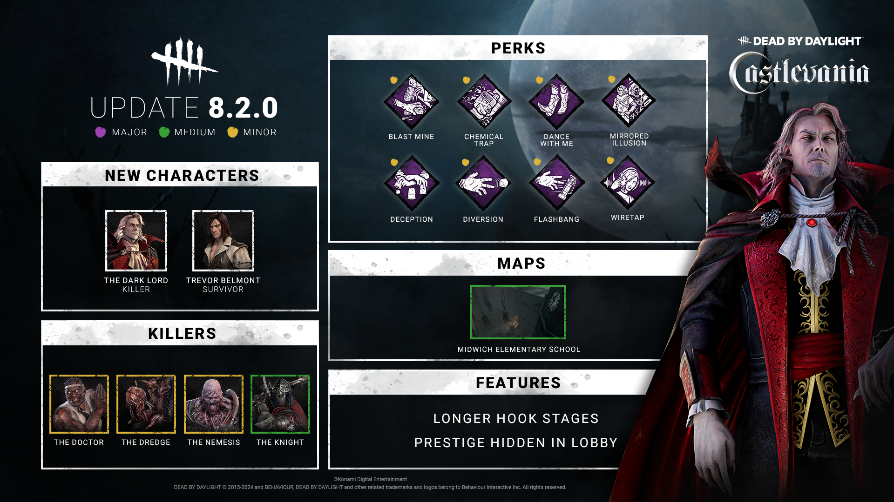

<!-- summary -->
## AI TL;DR

Hellfire now moves at 2 m/s and charges in 0.9 s, while Wolf Form’s base speed rises to 4.6 m/s, pounce cooldown drops to 20 s and the first-pounce collision no longer ends the power. Nemesis’s Tentacle Strike range expands to 6.5 m and its cooldown shortens to 2.25 s. The Knight’s guards receive individual cooldowns (Assassin 30 s, Jailer 25 s, Carnifex 20 s), summoning a new guard despawns the current one and basic attacks cut guard cooldowns to 10 s. Chest-closing cooldown is cut to 60/45/30 s from 80/70/60 s, and the rule barring upgraded items from persisting after a trial will be removed in an upcoming minor patch.
<!-- /summary -->

<!-- nav -->
&larr; [Developer Update | August 2024](464-developer-update-august-2024.md) · [Developer Updates](../index.md#developer-updates) · [Stats | September 2024](470-stats-september-2024.md) &rarr;
<!-- /nav -->

# Developer Update | August 2024 PTB

As the next update approaches, we as always have news to share! This blogpost will cover all the gameplay changes happening between the Public Test Build (PTB) and live release of the 8.2.0 Update.

- \[CHANGE\] Increased movement speed after casting Hellfire to 2m/s (was 1.48m/s).
- \[CHANGE\] Decreased Hellfire charge time to 0.9 seconds (was 1 second).
- \[CHANGE\] Adjustments to various Add-Ons.

*Dev note: The Hellfire attack proved to be useful on the PTB. We’ve fine-tuned the charge time and movement speed to improve the way it feels to use. This includes adjusting the deacceleration and reacceleration after canceling the attack to be smoother and not so sudden.*

- \[CHANGE\] Increased movement speed in Wolf Form to 4.6m/s (was 4.4m/s). Haste from Scent Orbs will increase your speed to 4.8m/s.
- \[CHANGE\] Reduced cooldown of Pounce attack to 20 seconds (was 25 seconds).
- \[CHANGE\] Colliding with a wall or obstacle during the first Pounce will no longer end your Power.

*Dev note: The Wolf form looked to need a bit more attention. For the release, we have increased the Wolf’s base movement speed to 4.6m/s – the same as the Vampire Form. We’ve also reduced the Pounce attack’s cooldown.*

*While the Pounce attack is meant to be more difficult to use in tight spaces, we found it to be a bit too restrictive. To make it easier to position for the second Pounce, hitting a collision during the first Pounce will no longer end your Power.*

    

- \[CHANGE\] Increased Mutation Rate 3 Tentacle Strike range to 6.5 meters (was 6 meters).
- \[CHANGE\] Decreased successful Tentacle Strike cooldown to 2.25 seconds (was 2.5 seconds).

*Dev note: The adjustments on the PTB definitely helped The Nemesis get up and running at the start of a trial, but many felt he could use a little more. We have made additional tweaks to his Tentacle Strike to make it even more deadly when used well.*

    

- \[NEW\] Each guard has a separate cooldown:  
   The Assassin: 30 seconds  
   The Jailer: 25 seconds  
   The Carnifex: 20 seconds
- \[NEW\] Summoning a guard will cause any active guard to despawn.
- \[NEW\] Hitting a patrolling guard with a basic attack will reduce their cooldown to 10 seconds.

*Dev note: Spawning a different guard while another was deployed was an unintended mechanic in the previous PTB, but it turned out to be loved by many. We found having guards on separate cooldowns encouraged switching between to the right guard in the right situation, meanwhile a shared cooldown encouraged using the single strongest guard.*

*We have brought back separate cooldowns as a now intended feature and tuned them according to their strength and utility. This will give The Knight a boost in power and encourage swapping between guards.*

    

- \[CHANGE\] Reduced cooldown to 60/45/30 seconds (was 80/70/60 seconds).

*Dev note: On the PTB, the cooldown for closing chests was quite long, so we have reduced it significantly.*

    

*The following change will be implemented in a minor patch in the coming weeks.*

- \[REMOVED\] Removed the condition which prevented upgraded Items from being kept at the end of the trial.

*Dev note: Many people wanted to keep the Items they had risked their lives to upgrade, so we’ll be removing this condition in a later update. Enjoy the spoils of your hard work.*

Until next time…  
 The Dead by Daylight team

<!-- nav -->
&larr; [Developer Update | August 2024](464-developer-update-august-2024.md) · [Developer Updates](../index.md#developer-updates) · [Stats | September 2024](470-stats-september-2024.md) &rarr;
<!-- /nav -->
