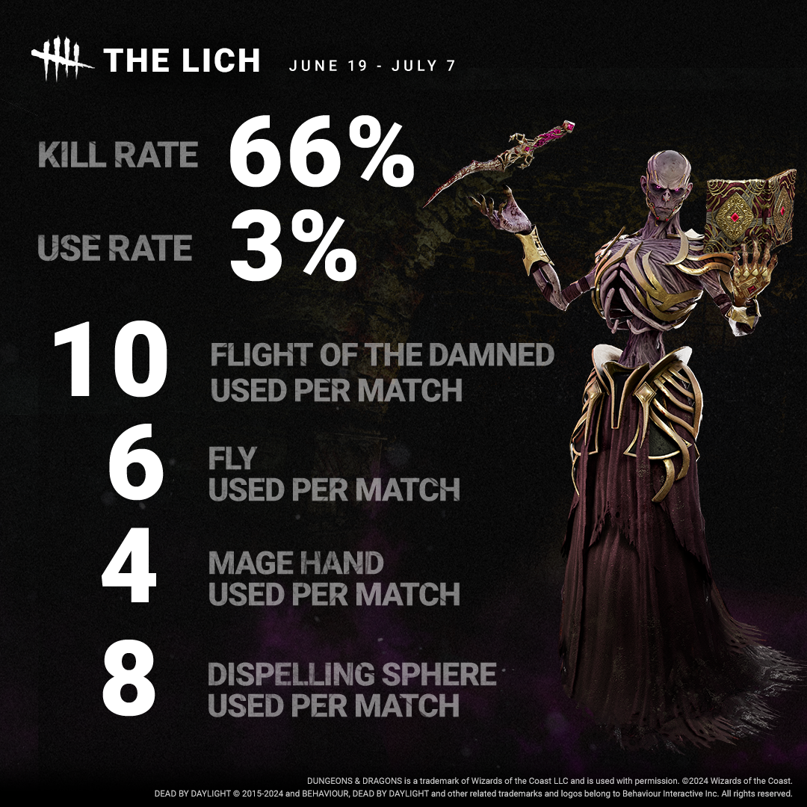
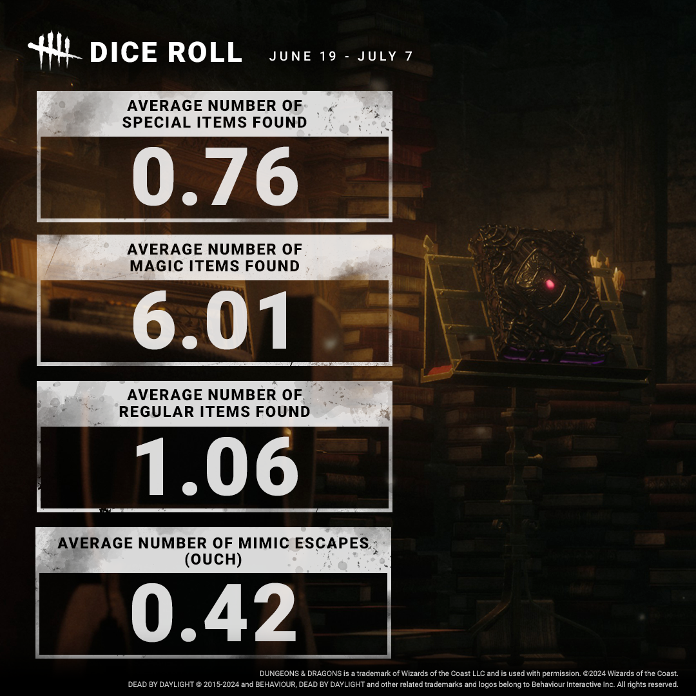
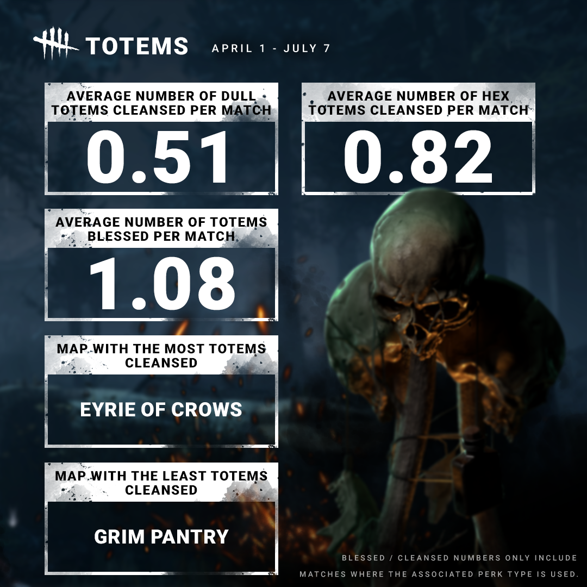

<!-- summary -->
## AI TL;DR

The September 2024 developer update released extensive statistical insight into The Lich’s debut, detailing average usage rates for each of his four powers and the typical outcomes of his dice rolls. It also quantified totem cleansing and blessing frequencies across all maps, highlighting which locations see the most or least activity, and clarified that hex and boon figures only consider matches where the relevant perk type was active. The data aims to inform balance decisions and player expectations.
<!-- /summary -->

<!-- nav -->
&larr; [Developer Update | August 2024 PTB](467-developer-update-august-2024-ptb.md) · [Developer Updates](../index.md#developer-updates) · [Developer Update | September 2024](472-developer-update-september-2024.md) &rarr;
<!-- /nav -->

# Stats | September 2024

*Poor misguided wanderers* may have come face to face with The Lich in his debut month. We gathered data on how often each of his four Powers are used in an average match.

Let’s roll! We also pulled data on the average results of dice rolls when facing The Lich. Are you luckier than this, or have you become very familiar with mimics?

If it glows, it goes. We tracked down how often totems are cleansed and blessed, as well as which maps see the most and least cleansing.

*Note: Hex and Boon data only includes matches where the appropriate Perk type was used.*

Until next time…

The Dead by Daylight team

<!-- nav -->
&larr; [Developer Update | August 2024 PTB](467-developer-update-august-2024-ptb.md) · [Developer Updates](../index.md#developer-updates) · [Developer Update | September 2024](472-developer-update-september-2024.md) &rarr;
<!-- /nav -->
