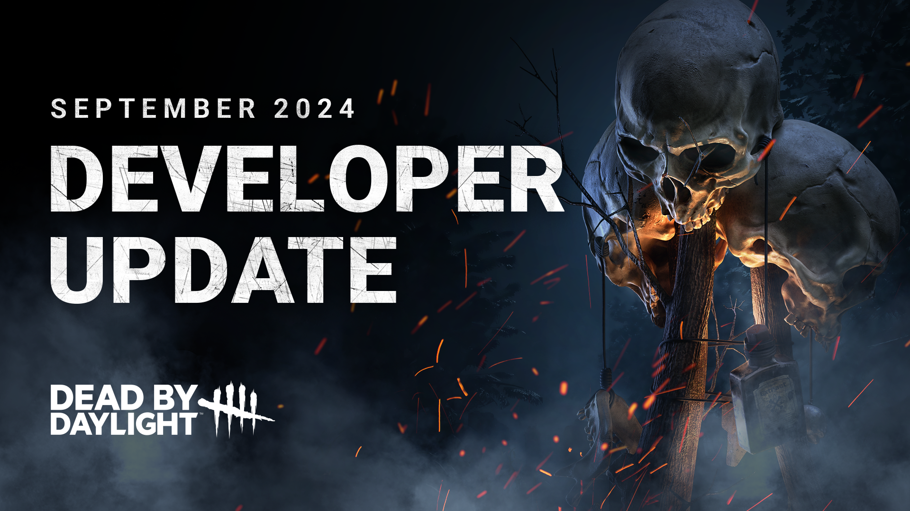

<!-- summary -->
## AI TL;DR

Killers can now finish the final Survivor with a Mori without needing an Offering, while objects that block the camera fade away; Memento Mori Offerings have been repurposed to award a sizable Bloodpoint boost on a Mori. A massive wave of perk reworks follows: survivor perks gain linger effects, range boosts, cooldown removals and simplified mechanics, while many killer perks receive token removals, duration tweaks, and new aura-reveal triggers. Additional balance changes target drones (fewer scan lines, reduced hinder penalty), The Hillbilly’s Overdrive (shorter duration, lower speed), Victor’s recovery times, and a HUD update for The Unknown. Overall the patch focuses on fine-tuning gameplay rather than adding new content.
<!-- /summary -->

<!-- nav -->
&larr; [Stats | September 2024](470-stats-september-2024.md) · [Developer Updates](../index.md#developer-updates) · [Developer Update | September 2024 PTB](474-developer-update-september-2024-ptb.md) &rarr;
<!-- /nav -->

# Developer Update | September 2024

The next update features an especially large number of Perk tweaks & reworks on top of our usual Killer tweaks & new features. In this post, we’ll dig into each of the changes and share our reasoning behind them.

- \[NEW\] The Killer can now perform a Mori on the final Survivor without using an Offering.
- \[NEW\] Objects obstructing the camera during the Mori animation will fade away.
- \[REWORK\] Memento Mori Offerings have a new effect: Gain a large Bloodpoint bonus when performing a Mori on the final Survivor.

*Dev note: When the Finishing Mori system was tested previously, many found it and the surrounding gameplay changes to have too large of an effect on the match. We have scaled back this system to better suit what players expected from it: Killers now have the option to kill the final Survivor if they so choose. This will provide some visual flair and create a satisfying end to a match.*

*Since this change would make Memento Mori Offerings obsolete, we have reworked them to instead reward the Killer with a large amount of Bloodpoints (based on their rarity) when a Mori is performed.*

*We have also added a new mechanic which hides nearby objects when a Mori is happening to prevent rocks, crates, and other things from rudely standing in the way so you can see these kills in all their glory.*

## Survivor Perks

- \[NEW\] This effect will linger for a few seconds when out of range. Re-entering this range before the linger time expires will maintain the effects.
- \[CHANGE\] Increased range to 8/12/16 meters (was 12 meters).
- \[REMOVED\] Teamwork: Power of Two no longer has a cooldown (was 180/160/140 seconds).
- \[REMOVED\] No longer deactivates when either Survivor loses a health state.

*Dev note: This Perk grants a speed boost to both Survivors after healing as long as they stick together. This alone is pretty conditional, so we have removed the cooldown entirely and removed the added deactivation clause to simplify the Perk and make it feel better to use. We’ve also increased the range slightly to make it a little easier to maintain.*

    

- \[NEW\] This effect will linger for a few seconds when out of range. Re-entering this range before the linger time expires will maintain the effects.
- \[CHANGE\] Increased range to 8/12/16 meters (was 12 meters).
- \[REMOVED\] Teamwork: Collective Stealth no longer has a cooldown (was 180/160/140 seconds).
- \[REMOVED\] No longer deactivates when either Survivor loses a health state.

*Dev note: We have given a similar treatment to Teamwork: Collective Stealth: Healing and staying near each other is already quite the demand, so we have removed the unnecessary cooldown and health state conditions. The range will match other Teamwork Perks for consistency.*

    

- \[CHANGE\] Now applies to Survivors within 8 meters (was cooperating on the same action).
- \[CHANGE\] Prevented failed Skill Checks now become Great Skill Checks (was Good Skill Checks).

*Dev note: Corrective Action previously only prevented progress lost from other Survivors’ missed Skill Checks. This could be great when playing with a new friend, but not very useful for more experienced players. We have changed the result to a Great Skill Check to provide a marginal progress boost whenever the Perk activates, giving it some value in higher end matches.*

    

- \[CHANGE\] Increased aura reading duration to 6/8/10 seconds (was 3/4/5 seconds).
- \[REMOVED\] Removed range requirement.

*Dev note: This Perk previously required you to be within 32 meters of the Survivor who loses a health state, meaning you would often know where the Killer is anyway. We have removed this condition: This will make Inner Focus a useful tool for keeping track of the Killer’s whereabouts regardless of where they are in the map.*

    

- \[CHANGE\] Increased healing speed bonus to 150% (was 100%).

*Dev note: Survivors aren’t left in the dying state often, so we want to make sure this Perk is effective when the situation arises.*

- \[REMOVED\] Endurance effect no longer needs to be activated.
- \[NEW\] Added a 30 second cooldown to the Endurance effect.

*Dev note: The Endurance aspect of the Perk made the Perk overly complicated to make use of, so we have replaced this with a cooldown instead. This cooldown only applies to the Endurance effect, not the healing speed increase.*

    

- \[NEW\] When you first start repairing a generator, see the Killer’s aura for 6 seconds.
- \[CHANGE\] Increased duration to 10/12/14 seconds (was 6/8/10 seconds).

*Dev note: To make Poised more appealing, we’re introducing a new effect in addition to the original one: When you first start repairing a generator, you’ll see the Killer’s aura. This will help keep tabs on where they are throughout the match.*

*We’ve also increased the duration of the original effect to help you cover more ground without leaving tracks.*

    

- \[CHANGE\] Blood Rush now activates for 40/50/60 seconds after being unhooked (previously activated permanently when you were one hook away from death).
- \[NEW\] Blood Rush now deactivates upon performing a Conspicuous Action.
- \[NEW\] Blood Rush now deactivates when the exit gates are powered.
- \[REMOVED\] Blood Rush no longer heals or provides the Broken Status Effect.

*Dev note: This Perk had a lot of effects and an equally strict set of conditions. We have simplified it to focus on the Exhaustion recovery which tended to be the main appeal for the Perk.*

*To allow this effect to happen more often, Blood Rush now activates for a set duration after you are unhooked. Killers will want to be careful not to chase Blood Rush users after they are unhooked since they will be harder to catch. This effect will be disabled if the Survivor performs a Conspicuous Action or if the exit gates are powered.*

    

- \[NEW\] When chased, see the auras of other Survivors.
- \[NEW\] Quick Gambit now has a 60 second cooldown upon losing a health state.
- \[CHANGE\] Reduced repair speed bonus to 3/4/5% (was 6/7/8%).
- \[REMOVED\] Repair speed bonus no longer has a limited range.

*Dev note: Quick Gambit previously required Survivors to lead the Killer toward the generator in order to get any benefit. This was very risky and often resulted in the Killer chasing those Survivors instead. This Perk no longer has a range requirement and now shows the auras of other Survivors so you can do the opposite – keep the Killer away from them!*

*To balance this out, Quick Gambit will now go on cooldown upon losing a health state, making it more challenging to keep active and providing the Killer a way to play around it.*

    

- \[REWORK\] Distortion no longer has tokens and instead deactivates once used until the next time you are chased.
- \[CHANGE\] Increased duration to 8/10/12 seconds (was 6/8/10 seconds).

*Dev note: Distortion counters a lot of Perks & Add-Ons. The token system and recharge mechanic makes Distortion far too effective and allows Survivors to go unseen for the entire match.*

*To limit its effectiveness, we have removed the token system and made it so Distortion only reactivates upon being chased. We have extended the duration slightly to help account for longer aura reading effects to compensate.*

    

- \[CHANGE\] Now suppresses grunts of pain and pools of blood as long as you are in the locker. This effect lingers for 30 seconds after exiting the locker (was 10 seconds after entering).

*Dev note: Lucky Star’s short duration often meant it would wear off before the Killer left the area. It will now stay active as long as you are in the locker and linger for a set duration after you leave.*

## Killer Perks

- \[REWORK\] Anytime a Survivor loses a health state, they suffer from the Exhaustion for 6/7/8 seconds.

*Dev note: Genetic Limits previously affected Survivors who healed, which often lead to the Exhausted effect expiring before they could be chased. It will now apply to Survivors who lose a health state instead, but with a shorter duration. This will provide more consistent value, though skilled Survivors may be able to outlast the effect.*

    

- \[REWORK\] When a Survivor performs an unhook, their healing speed is reduced by 30/40/50% for 30 seconds.

*Dev note: Leverage used to gain strength as the match went on. This made Leverage ineffective early on, often only becoming effective when the match was nearly won anyway. We have reworked it to be much simpler and provide consistent value. Leverage now discourages Survivors from healing directly under the hook.*

    

- \[REWORK\] THWACK! now starts with 3 tokens. Gain 1 token upon hooking a Survivor. When breaking a pallet or breakable wall, consume one token and cause Survivor within 24 meters to scream and reveal their location for 3/4/5 seconds.

*Dev note: THWACK! used to only activate once per hook, leading to it often being wasted. By introducing tokens, Killers can store these uses for later and potentially use it more than once in a chase.*

    

- \[CHANGE\] The most recently damaged generator becomes Compromised.

*Dev note: Machine Learning previously required you to damage one generator to activate it, then another to Compromise it. This made it awkward to use. To simplify this, the most recently damaged generator will always be Compromised. Only one generator can be Compromised at a time.*

    

- \[REMOVED\] Deathbound no longer has a distance requirement to activate.
- \[REMOVED\] Deathbound no longer has a duration and instead deactivates when the healer is hooked.

*Dev note: This Perk’s range condition made it inconsistent to use. To simplify it and give it a nice boost in strength, we have removed both the range requirement and the duration.*

    

- \[REWORK\] When a Survivor is within 6 meters of a dropped pallet within 16 meters of your location, their aura is revealed for 6/8/10 seconds.

*Dev note: Revealing pallets and windows was much less useful for Killers than Survivors since the Killer is present every time a pallet is broken. We have reworked this Perk to instead reveal Survivor auras near dropped pallets. This will provide some useful info during a chase and allow for some interesting mindgames.*

    

- \[CHANGE\] Now applies only to the first Survivors who stops repairing a generator.
- \[CHANGE\] Increased duration to 40/45/50 seconds (was 20/25/30 seconds).

*Dev note: Dead Man’s Switch provides a very powerful effect but can sometimes get out of hand when combined with other Perks. We have changed it to activate only on the first Survivor who stops repairing to limit how powerful it can be and increased its duration to compensate.*

    

- \[REMOVED\] Blood Echo no longer has a cooldown.
- \[CHANGE\] Reduced duration to 20/25/30 seconds.

*Dev note: Blood Echo previously had a long cooldown. This felt unnecessary since the requirement of hooking a Survivor itself spaced out its activations. This has been removed, allowing the Perk to activate more frequently, and reduced the duration slightly to compensate.*

    

- \[REWORK\] The last 3/4/5 vaults which Survivors rush vault are blocked by The Entity. This lasts until the hex totem is cleansed.

*Dev note: In vault-heavy areas, it was possible for Survivors to outlast the effect by linking together multiple windows. Going forward, the most recently vaulted windows will be blocked until the hex is cleansed.*

    

- \[REWORK\] When a Survivor escapes a chase, reveal their aura for 6 seconds. This Perk then goes on cooldown for 60/50/40 seconds.

*Dev note: Predator has always caused mixed feelings; some feel like tighter scratch marks make tracking easier, others find it makes finding Survivors harder. We have given this a new effect which will be more useful for all.*

*Those struggling to keep track of Survivors will find Predator handy for giving them a second chance, meanwhile more experienced players may find some use by intentionally breaking chase.*

## Killer Updates

- \[CHANGE\] Decreased Hindered penalty when scanned by a drone to 5% (was 10%).
- \[REMOVED\] The Skull Merchant no longer gains Haste when scanning a Survivor.

*Dev note: These two effects combined to create a huge speed difference between the Killer and Survivors. We have removed one and toned the other down to a fairer level.*

- \[CHANGE\] Reduced number of drone scan lines to 1 (was 2).
- \[CHANGE\] Drones are now always in their active state.
- \[CHANGE\] Drone scan lines are now invisible beyond 16 meters.

*Dev note: Being unable to see drone scan lines made them very difficult to play around accordingly. Scan lines will now always be visible when nearby and invisible when out of range. Additionally, we have reduced the number of scan lines per drone to allow for more counterplay.*

    

- \[CHANGE\] Decreased time before Overdrive starts to dissipate to 8 seconds (was 15 seconds).
- \[CHANGE\] Decreased Overdrive movement speed to 11.5m/s (was 13m/s).
- \[CHANGE\] Decreased Overdrive charges gained while revving and sprinting to 1.5/second (was 2/second).
- \[CHANGE\] Increased Chainsaw missed attack cooldown to 2.7 seconds (was 2.5 seconds).

*Dev note: It’s been great seeing The Hillbilly’s rise in popularity! Now that he’s had some time to settle, we’ve identified a few aspects of his new Overdrive mechanic that could use some fine tuning.*

*Overdrive tended to kick in very frequently, staying active for a large portion of the match. These changes will make the Overdrive mechanic a little less common and provide less of a speed boost when it is active.*

*We’ve also increased the missed attack cooldown slightly to make it harder to follow up a missed Chainsaw with a basic attack.*

    

- \[CHANGE\] Increased Victor’s cooldown when crushed to 20 seconds (was 15 seconds).
- \[CHANGE\] Increased cooldown after Victor downs a Survivor to 3.2 seconds (was 2.7 seconds).

*Dev note: Following their update earlier this year, The Twins saw a sharp increase in lethality. To keep them in check, have slightly increased how long it takes for Victor to recover after downing a Survivor. We have also slightly increased how long it takes for Victor to become available after being crushed by a Survivor to make it more impactful when a Survivor manages to pull it off.*

    

- \[NEW\] HUD update to display Teleport cooldown & Hallucination spawn time.
- \[CHANGE\] Movement speed now decreases sooner when charging your Power.
- \[CHANGE\] Increased teleport recovery speed by 15%.
- \[CHANGE\] Adjustments to Blurry Photo and Vanishing Box Add-Ons.
- \[CHANGE\] Improved visual and audio feedback when using UVX.

*Dev note: We tend to revisit Killers a few months after they release and see if they need any balance changes. It turns out The Unknown is already in a pretty good spot and is well liked by players, so that makes our job easy this time around!*

*Tapping the Power button can postpone a Hallucination from spawning, but to a Survivor it appears as if you’re about to launch UVX. This forces Survivors to constantly dodge and lose distance without slowing down the Killer. We have reduced the window before the Killer slows down while charging their Power. This will make it harder to tap the Power button without slowing down while focusing on a chase.*

*We noticed that the Blurry Photo Add-On is a fan-favourite, so we have incorporated part of its effect into the basekit and toned it down to compensate. This will allow more freedom to experiment with other Add-Ons without missing out. We have also toned down the Vanishing Box Add-On which was on the stronger side, by adding a tradeoff increase to Hallucination spawn time.*

*Lastly, we’ve improved the VFX and SFX when using UVX (that’s a lot of X’s). This doesn’t affect balance, but will make it clearer to newer Unknown players that hitting Survivors with the blast is how you apply Weakened and deal damage, not with airborne hits.*

Until next time…

The Dead by Daylight team

<!-- nav -->
&larr; [Stats | September 2024](470-stats-september-2024.md) · [Developer Updates](../index.md#developer-updates) · [Developer Update | September 2024 PTB](474-developer-update-september-2024-ptb.md) &rarr;
<!-- /nav -->
