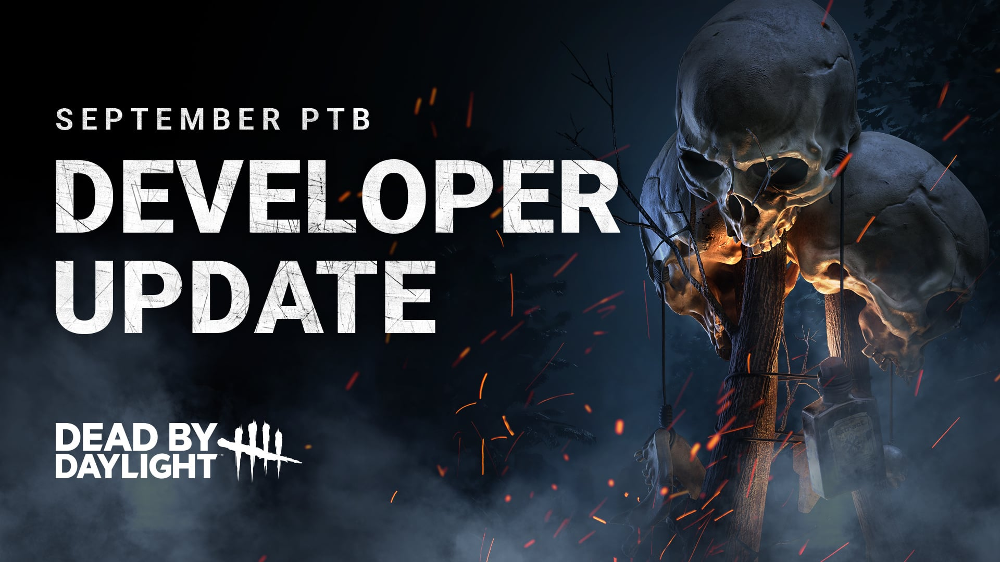
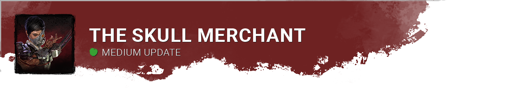
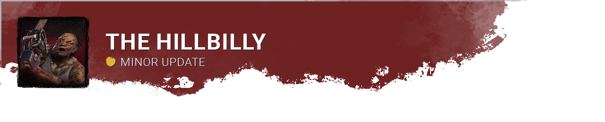
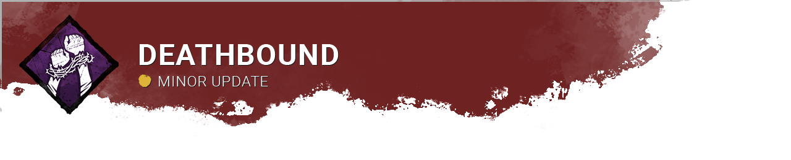

<!-- summary -->
## AI TL;DR

The Ivory & Ebony Memento Mori Offerings were reverted to allow double-hook kills, while the Cypress Offering was retired with a one-million-bloodpoint claim window. The Skull Merchant received several drone adjustments—5 % Haste after a scan, increased hinder, faster rotation, slower deployment speed, and loss of fast-vault detection—aimed at balancing its power. Hillbilly’s Overdrive Chainsaw speed was nudged to 12 m/s, Distortion tokens were re-added and now recharge in-chase, and a temporary aura reveal now follows dropped pallets, restoring limited Zanshin Tactics reading. Corrective Action again converts missed skill checks, now reveals the survivor’s aura and has unlimited range, and its effect ends when a health state is lost.
<!-- /summary -->

<!-- nav -->
&larr; [Developer Update | September 2024](472-developer-update-september-2024.md) · [Developer Updates](../index.md#developer-updates) · [Stats | October 2024](478-stats-october-2024.md) &rarr;
<!-- /nav -->

# Developer Update | September 2024 PTB

The 8.3.0 Public Test Build (PTB) has come and gone. After spending some time reading through your feedback, we’ve made a series of adjustments before the 8.3.0 Update releases on all platforms. In this post, we’ll go through each of them and provide some additional context.

- \[REVERTED\] The Ivory & Ebony Memento Mori Offerings once again allow the Killer to kill Survivor(s) who have been hooked twice.
- \[RETIRED\] The Cypress Memento Mori Offering has been retired.

*Dev note: We’ve received a lot of feedback about the changes made to the Ivory & Ebony Memento Mori Offerings during the PTB. This came down to the loss of mid-match kills & group photo opportunities, as well as concerns that the Bloodpoint reward would encourage unfun behaviour. With that in mind, we have reverted the changes to the Mori Offerings.*

*As a result, the Cypress Memento Mori Offering is now obsolete and will be retired. We will offer 1 Million Bloodpoints for any unused Offerings, which you can claim simply by logging in between October 8th and October 17th.*

- \[NEW\] The Skull Merchant gains 5% Haste when a Survivor is scanned within 5 seconds of placing a drone or changing its rotation.
- \[CHANGE\] Increased Hindered effect when scanned by a drone to 8% (was 5%).
- \[CHANGE\] Increased drone rotation speed to 95 degrees per second (was 85).
- \[CHANGE\] Decreased movement speed while deploying a drone or inspecting the radar to 4.4m/s (was 4.6m/s).
- \[CHANGE\] Fast vaults are no longer detected by drones.

*Dev note: While this update is intended to reduce The Skull Merchant’s strength, we received feedback that the changes may have gone too far. We’ve done some further tweaking and found a compromise between the old and new versions.*

*We’ve also reintroduced the Haste effect for a short time after a drone is deployed or its rotation is swapped. This will reward the Killer for using their Power actively rather than setting and forgetting or randomly gaining Haste from Survivors across the map.*

*We intend to revisit The Skull Merchant in a future release for a larger rework.*

- \[CHANGE\] Increased Overdrive Chainsaw movement speed to 12m/s (11.5m/s).

*Dev note: Many found that The Hillbilly’s movement speed during Overdrive was a little low during the PTB, making it feel similar to his normal Chainsaw movement speed. We have increased it slightly, landing it between the PTB & previous live speed.*

- \[CHANGE\] Reintroduced tokens. Tokens now recharge over 30 seconds while in chase, up to a maximum of 2.

*Dev note: Many found a single use of Distortion to be very limiting, so we have reintroduced the token mechanic. These tokens now recharge while in a chase rather than by being in the Killer’s terror radius. This will prevent Distortion from hiding a Survivor for the entire match and reward those who are play well during a chase.*

- \[NEW\] Survivors who drop a pallet have their aura revealed for 6/7/8 seconds.
- \[CHANGE\] Reintroduced aura reading for pallets & vaults within 32m.
- \[REMOVED\] No longer reveals the aura of Survivors near dropped pallets.

*Dev note: Though rarely used, some players found niche uses for the original Zanshin Tactics effect. We don’t want to stifle that creativity, so we have brought it back!*

*Constant aura reading around dropped pallets proved to be a little strong on the PTB, so we have replaced this with a temporary aura reveal after the pallet is dropped.*

- \[CHANGE\] Corrective Action once again turns missed skill checks into good skill checks.
- \[NEW\] When Corrective Action activates, reveal the aura of the Survivor who missed a skill check for a few seconds.
- \[REMOVED\] Corrective Action no longer has a range limit.

*Dev note: We challenge you to push things to the limit on the PTB – and boy did you ever. Corrective Action had some strong combos, so we’re moving onto a new design. Corrective Action will once again convert missed skill checks into good skill checks, and to make it more appealing, it will work no matter where you are in the map. This makes it far less dependent on being right next to someone when they happen to miss a skill check.*

- \[CHANGE\] Effect now ends when losing a health state.

*Dev note: With the Oblivious effect being removed only when hooked, Deathbound ended up being active for far too long in most cases. We’ve switched it to deactivate when a health state is lost, but kept the other improvements as is.*

Until next time…

The Dead by Daylight team

<!-- nav -->
&larr; [Developer Update | September 2024](472-developer-update-september-2024.md) · [Developer Updates](../index.md#developer-updates) · [Stats | October 2024](478-stats-october-2024.md) &rarr;
<!-- /nav -->
