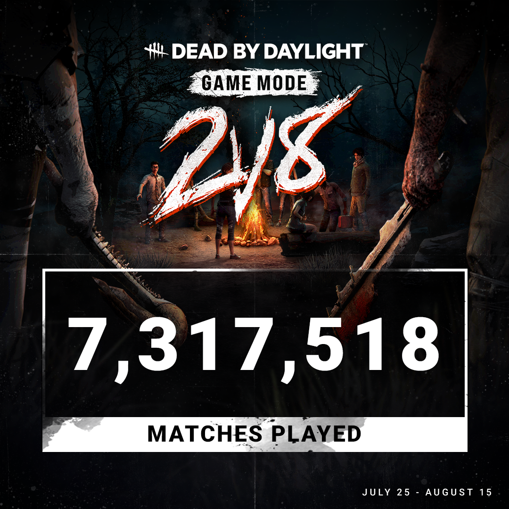
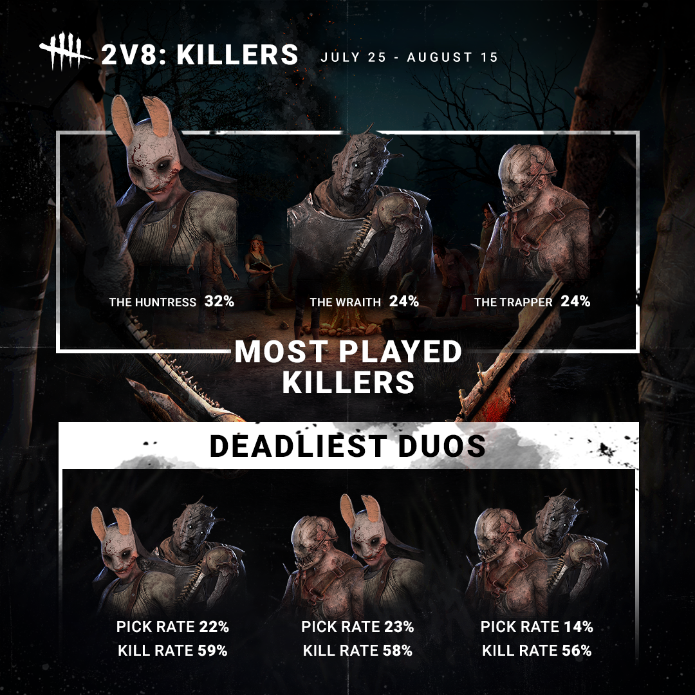
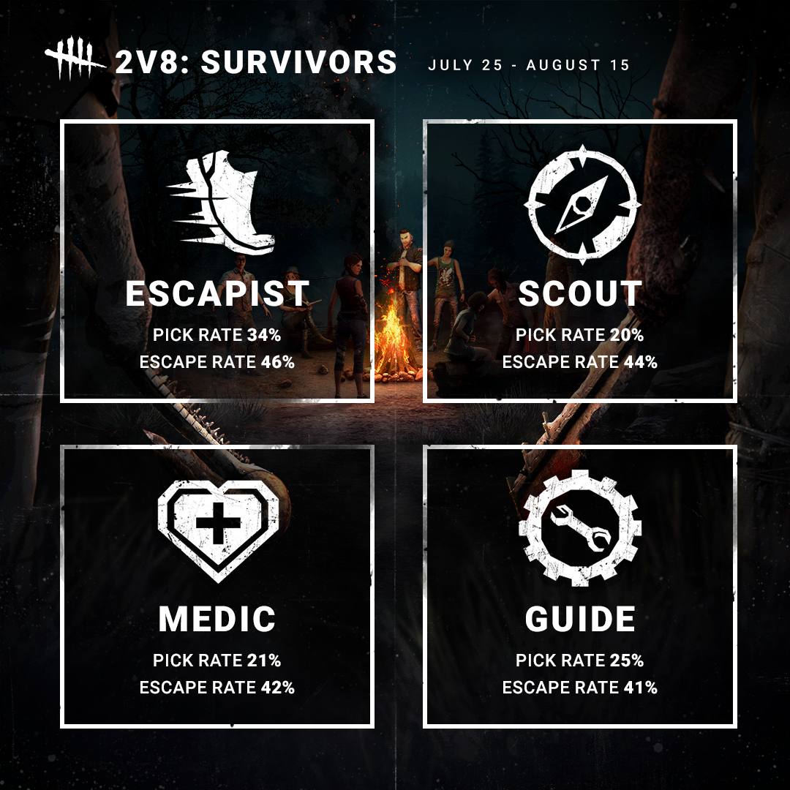
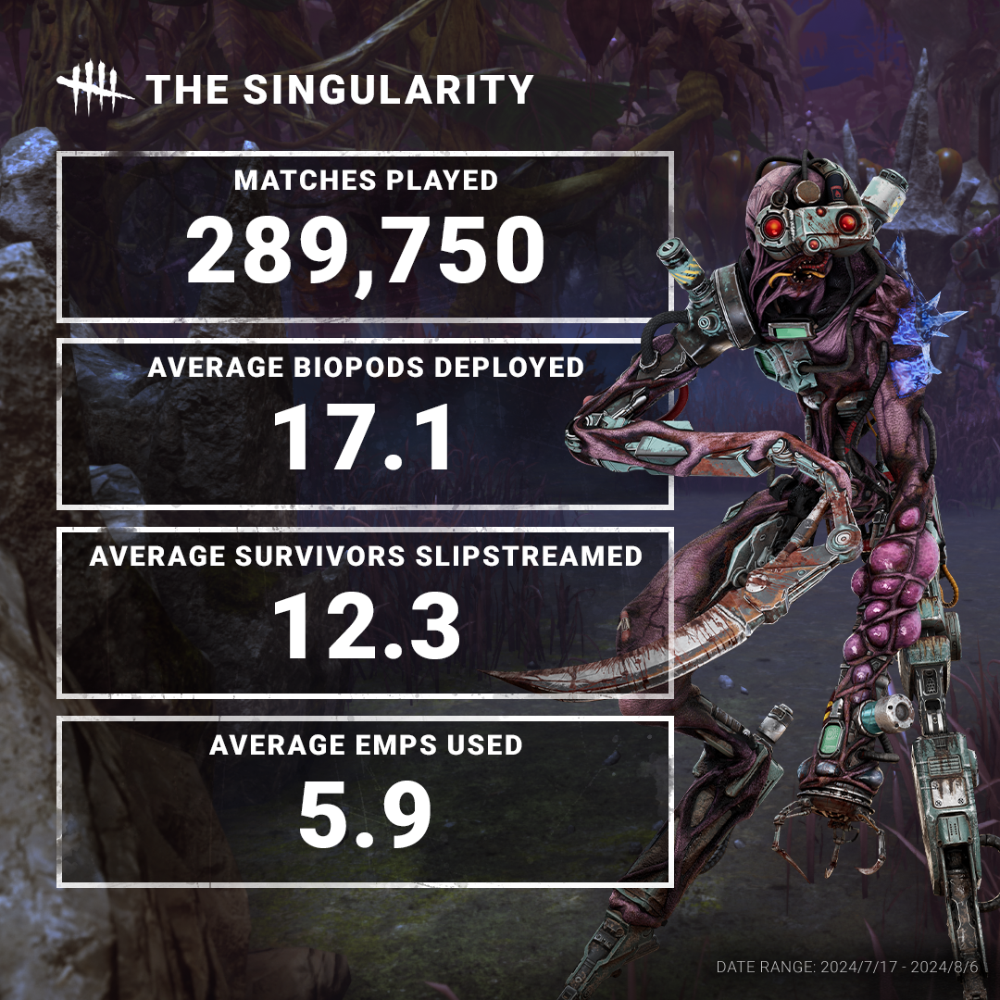
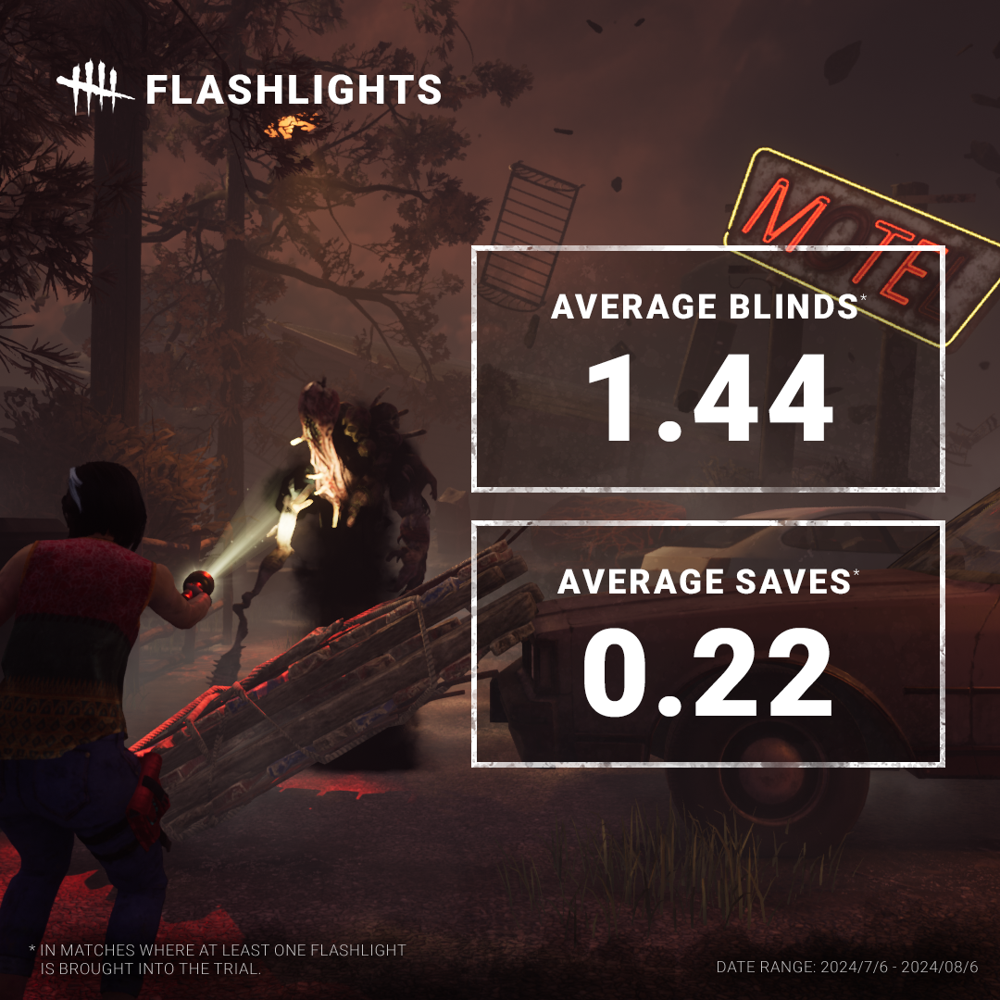
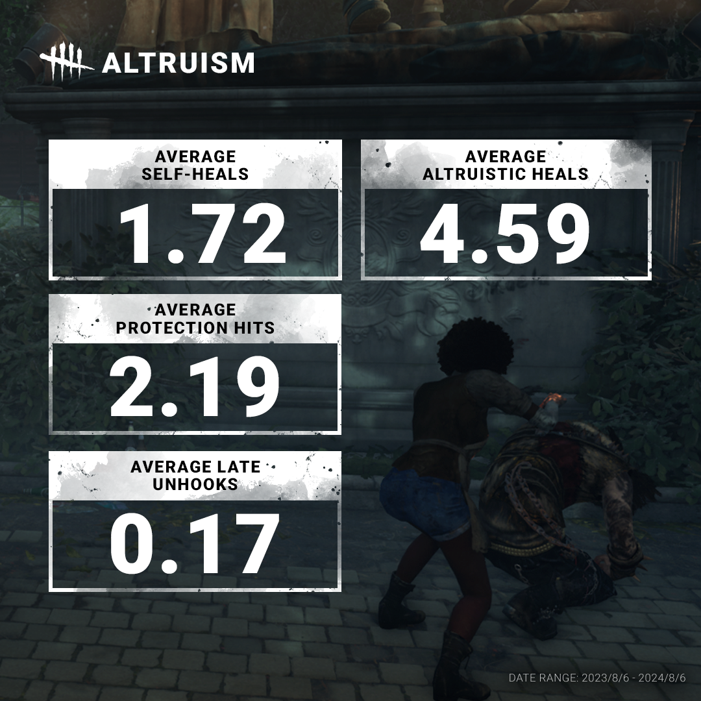

<!-- nav -->
&larr; [Developer Update | September 2024 PTB](474-developer-update-september-2024-ptb.md) · [Developer Updates](../index.md#developer-updates) · [2V8 | Developer Update](480-2v8-developer-update.md) &rarr;
<!-- /nav -->

# Stats | October 2024

We’ve been flooded with requests for 2v8 data, so we’re happy to deliver! For starters, over *seven million* matches of 2v8 were played during the event period. (For context, this is a lot!)

We’ve been hard at work on the second version of 2v8, so keep your eyes peeled for more information about the mode in the coming weeks.

If The Huntress’ lullaby haunts your dreams, it’s probably because she was the most popular Killer this time around.

You’re probably wondering which Killers made the deadliest teams, so we crunched the numbers and found the top three pairs.

Not to be left out, we’ve also grabbed the numbers for all the Survivor Classes. Escapist was the clear the favourite, though all Classes saw a decent amount of play.

    

A little while ago, we made some tweaks to The Singularity to make it a bit more approachable.

How does this compare to before the update? Firstly, the number of matches played went way up, previously only 122,861 over a similar period. The number of slipstreams went up slightly from 11.5, while the number of EMPs used decreased from 6.5.

    

If only they had some sunglasses… We’ve pulled the average number of Flashlight blinds & saves per match. These figures only include matches where someone brings a Flashlight into the trial.

As you can imagine, these numbers are much lower when nobody brings one into the match and instead finds one in a chest, dropping to 0.18 blinds and 0.03 saves.

*Please note: These are per match averages, not per Survivor averages!*

    

Do Survivors heal themselves more than they heal others? Spoiler: No. Not even close. Altruistic heals more than double the number of self-heals on average. Some even take the altruism a step further by using their own body as a meat shield around twice per match.

*Please note: These are once again per match averages, not per Survivor averages!*

Until next time…

The Dead by Daylight team

<!-- nav -->
&larr; [Developer Update | September 2024 PTB](474-developer-update-september-2024-ptb.md) · [Developer Updates](../index.md#developer-updates) · [2V8 | Developer Update](480-2v8-developer-update.md) &rarr;
<!-- /nav -->
