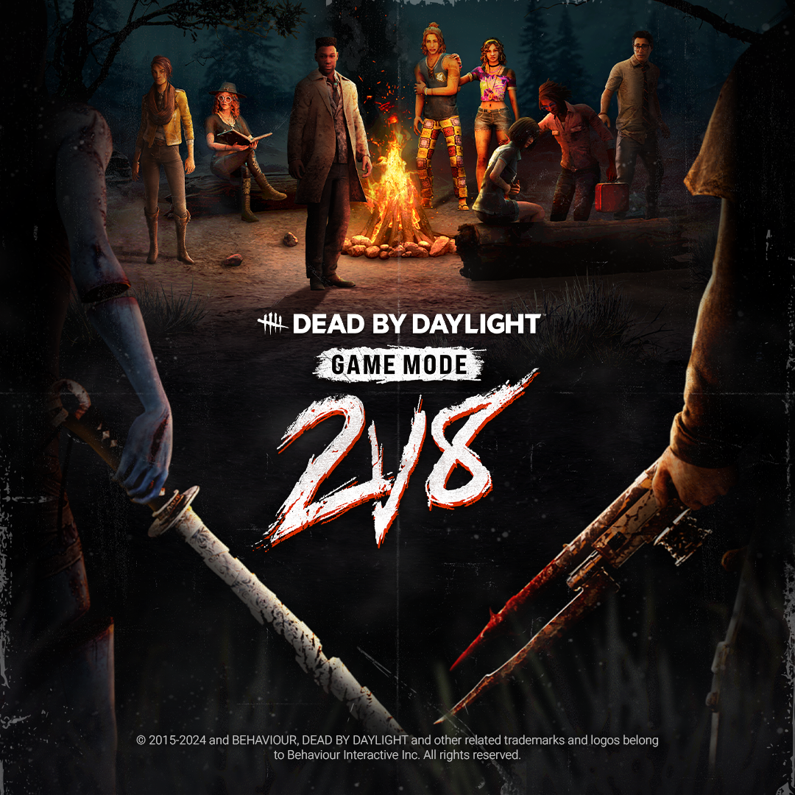
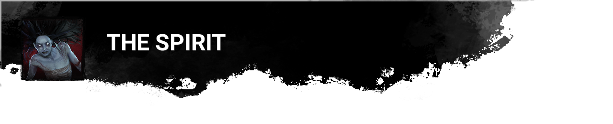

<!-- nav -->
&larr; [Stats | October 2024](478-stats-october-2024.md) · [Developer Updates](../index.md#developer-updates) · [Developer Update | November 2024 PTB](481-developer-update-november-2024-ptb.md) &rarr;
<!-- /nav -->

# 2V8 | Developer Update

*This article was created from a*[*community discussion*](https://forums.bhvr.com/dead-by-daylight/discussion/432412/2v8-developer-update).

The beloved 2v8 mode is returning! A lot has changed and since the first version – so much that we couldn’t squeeze it into our regular Developer Update – and we’re going to dive into all of it today.

Before we get started, it’s important to note that everything below only applies to the 2v8 mode and will not affect regular matches.

Cages

- \[CHANGE\] Survivors are now sent to cages after being picked up by a Killer rather than by stomping.
- \[CHANGE\] When a Survivor is near a caged Survivor, the cage will no longer move even if there is a Killer nearby.
- \[CHANGE\] Survivors perform the unhook action 15% faster while a Killer is nearby.

*Dev note: Flashlights didn’t serve much purpose in the original version of this mode as there weren’t many opportunities to make a save. Killers now need to pick up a Survivor before sending them to a cage, giving Survivors a chance to use their Flashlight.*

*To prevent Killers from camping a caged Survivor, the cage would normally disappear and reappear randomly elsewhere in the map. This created some frustrating moments where someone was about to make the save only for the cage to move. We have changed this so the cage no longer moves as long as a Survivor is nearby.*

Generators

- \[NEW\] Generator repair speeds are reduced by 5% for each generator completed.
- \[NEW\] Generator repair speeds are increased by 2.5% for each cage state.

*Dev note: 2v8 matches tend to be chaotic and swing heavily in favour of one role or the other. To help keep things from spiraling out of control early in a match, we have introduced a catch-up mechanic. The better the Survivors are doing, the slower repairs will be and vice versa. In a close match, these effects will cancel each other out.*

- \[CHANGE\] Generator auras are only visible to Killers within 64 meters.
- \[CHANGE\] Generators being repaired by 2 or more Survivors are revealed to Killers, regardless of range.

*Dev note: With so many generators and Survivors running around, the number of auras being revealed can be overwhelming. These changes will reduce the number of auras shown at any given time and instead highlight important auras when they are necessary.*

New Maps

- \[NEW\] Added the Family Residence map.
- \[NEW\] Added the Dead Dawg Saloon map.
- \[NEW\] Added the Father Campbell’s Chapel map.
- \[NEW\] Added the Rancid Abattoir map.
- \[NEW\] Added the Wrecker’s Yard map.

*Dev note: We’ve added additional maps to house these chaotic trials. Like the original set of maps, these have been given the 2v8 treatment, making them larger than usual and featuring additional adjustments such as three exit gates.*

Killer Debut: The Blight

- \[NEW\] The Blight is now available.
- \[CHANGE\] Increased rush speed to 10.5m/s (was 9.2m/s).
- \[CHANGE\] Increased slam duration to 2 seconds (was 1.25 seconds).
- \[CHANGE\] Increased turn rate to 1.1 (was 0.9).

*Dev note: The other killer can be bounced against.*

Killer Debut: The Spirit

- \[NEW\] The Spirit is now available.
- \[CHANGE\] Increased phase duration to 8 seconds (was 5 seconds).
- \[CHANGE\] Increased phase recharge rate to 0.66/second (was 0.33/second).
- \[CHANGE\] Increased phase movement speed to 1.8 (was 1.6).

*Dev note: The other killer is visible while phasing and cannot collide with The Spirit while phasing.*

Killer Debut: The Deathslinger

- \[NEW\] The Deathslinger is now available.
- \[CHANGE\] Decreased reload time to 2 seconds (was 2.6 seconds).
- \[CHANGE\] Increased reel speed to 3m/s (was 2.76m/s).

*Dev note: If the other Killer hits a chained Survivor, the chain will break.*

### Class Overhaul

- \[NEW\] Reworked all Killer & Survivor Classes.
- \[CHANGE\] Killer Classes are no longer tied to a specific Killer.

*Dev note: In the next version of 2v8, we have overhauled the Class system from the ground up. Survivors now have powerful activatable abilities, some of which become available later in the match. Killer Classes, meanwhile, have been redesigned and can now be selected on any available Killer.*

***Survivor Classes now have the following abilities:***

- Class Ability: Providing passive effects to nearby teammates as well as a strong activatable power. The active ability charges over time and gain additional charge when you or another Survivor is uncaged.
- Info Ability: Granting aura reading capabilities.
- Unlock Ability: A secondary effect that unlocks after being sent to a cage.

*Additionally, Survivors can use their Class Ability charge to pick themselves up from the dying state after recovering.*

***Killer Classes have the following abilities:***

- Class Ability: Providing bonuses to themselves and their teammate.
- Info Ability: Providing aura reading or other forms of tracking.
- Ability to mori the last remaining Survivor in a trial

*We’ll delve into each of the available Classes further in this post.*

*Balancing & adjustments to specific Killers to ensure smooth gameplay in 2v8 still exist, though these are inherent to the Killer rather than their Class.*

### Refresher: Base Killer Effects

- \[RETURNING\] Damaging a generator reveals the auras of Survivors within 20 meters for 5 seconds.
- \[RETURNING\] When starting a chase with a Survivor, reveal their aura to the other Killer for 5 seconds. This aura is removed if the other Killer enters a 16 meter radius of the Survivor.
- \[RETURNING\] When a generator is completed, Survivors with no cage states are revealed to both Killers for 10 seconds.

*Dev note: Though Classes are changing, we wanted to preserve the integral aura reveal when chasing a Survivor from the first version of 2v8. We have also added an aura reveal effect to damaging generators to ensure the mode stays fast paced. These abilities are available to all Killers, regardless of their Class.*

### Killer Classes

New Killer Class: Shadow

- **Class Ability:** When within 32 meters of a teammate, you gain Undetectable. Injuring a Survivors transfers the Undetectable effect to your teammate instead. This ability has a cooldown of 30 seconds.
- **Info Ability:** When your teammate initiates chase with a Survivor, reveal the Survivor for an additional 4 seconds.

New Killer Class: Brute

- **Class Ability:**Perform the break action 25% faster. Doing so grants a teammate within 32 meters 10% Haste for 8 seconds. This ability has a cooldown of 30 seconds.
- **Info Ability:**When damaging a generator, reveal Survivors within an additional 8 meters.

New Killer Class: Enforcer

- **Class Ability:** Move 3% faster when chasing an injured Survivor. When a teammate within 32 meters hits a Survivor, they are marked and have their aura revealed to you for 12 seconds. Putting that Survivor into the dying state grants your teammate a 60% lunge increase for 15 seconds. This ability has a cooldown of 30 seconds.
- **Info Ability:** When damaging a generator, reveal nearby Survivors for an additional 4 seconds.

New Killer Class: Fearmonger

- **Class Ability:** While unseen, gain 5% Haste. When injuring a Survivor more than 16 meters from your teammate, they gain 10% Haste for 10 seconds instead. This ability has a cooldown of 30 seconds.
- **Info Ability:** When a generator is completed, reveal the aura of Survivors with no cage states for an additional 4 seconds.

### Survivor Classes

Survivor Class: Medic

- **Class Ability:**You and Survivors within 8 meters gain a 50% heal speed bonus, and grunts of pain are reduced by 50%. When your ability is fully charged, press the ability button to instantly heal all Survivors within 8 meters by 50%.
- **Info Ability:**Reveal the aura of injured Survivors within 128 meters.
- **Unlock Ability:**While injured, your scratch marks are suppressed, and your aura is revealed to all other Survivors.

Survivor Class: Scout

- **Class Ability:**You and Survivors within 8 meters move 100% faster while crouching. When you see a Killer within 64 meters, reveal their aura to all Survivors. When your ability is fully charged, press the ability button near a dropped or broken pallet to reset or rebuild it.
- **Info Ability:**Reveal the aura of Killers performing the break action for 6 seconds.
- **Unlock Ability:**Your walking speed is increased by 25% and you make no grunts of pain while injured.

Survivor Class: Guide

- **Class Ability:**You and Survivors within 8 meters gain an additional 3% bonus progress from Great Skill Checks, and repair sounds are 50% quieter. When your ability is fully charged, press the ability button to grant nearby Survivors an 8% repair speed bonus for 10 seconds.
- **Info Ability:**Reveal the aura of any unrepaired generator within 32 meters.
- **Unlock Ability:**When completing a generator, gain a 5% charge per Survivor nearby. The next time you work on a generator, those charges are immediately applied to the generator.

Survivor Class: Escapist

- **Class Ability:**When you or a Survivor within 8 meters of you start sprinting, gain 50% Haste for 3 seconds. This causes Exhaustion for 20 seconds and cannot activate while Exhausted. When your active ability is fully charged, press the active ability button to make all rushed actions silent for you and nearby Survivors for 8 seconds.
- **Info Ability:**Reveal the aura of pallets and vaults within 16 meters.
- **Unlock Ability:**Gain the ability to heal yourself without a Med-Kit at 70% of the normal healing speed.

### Killer Updates

*With Classes being overhauled, we took this opportunity to touch up some of the available Killers & integrate some of their previous class effects into their base kit. As with everything else in this post, these changes will only apply to 2v8.*

### The Trapper

- \[NEW\] Trap auras are now visible to your teammate.
- \[CHANGE\] Increased Haste after setting a bear trap to 15% (was 8%).
- \[CHANGE\] Your teammate cannot trigger bear traps. *Note: This was previously part of The Trapper’s Class, but is now part of his base kit in 2v8.*

### The Wraith

- \[CHANGE\] Increased action speeds for breaking walls, pallets, or generators and vaulting by 60% while Cloaked.

### The Hillbilly

- \[CHANGE\] The Chainsaw will now instantly down healthy Survivors.
- \[CHANGE\] Decreased Chainsaw turn rate bonus to 30% (was 44%).

### The Huntress

- \[REMOVED\] Removed the previous 20% Hatchet throw cooldown reduction.

### The Nurse

- \[REMOVED\] Survivors within 1 meter of The Nurse’s blink will no longer scream.

Until next time…

The Dead by Daylight team

<!-- nav -->
&larr; [Stats | October 2024](478-stats-october-2024.md) · [Developer Updates](../index.md#developer-updates) · [Developer Update | November 2024 PTB](481-developer-update-november-2024-ptb.md) &rarr;
<!-- /nav -->
