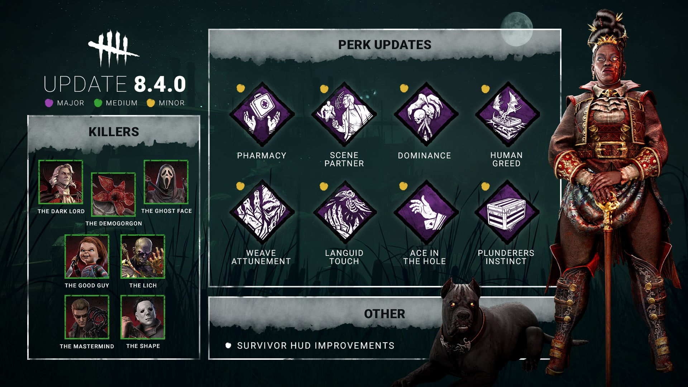

# Developer Update | November 2024 PTB

Welcome to another Developer Update!  We will be focusing on the newest content that was tested in the PTB including The Houndmaster and associated Perks. Additional Live Balance changes that were in the PTB will have their feedback addressed in the hotfixes that follow the Chapter release.

Thank you everyone for playing the PTB and providing such thorough feedback.

We received a lot of great feedback regarding The Houndmaster during the PTB and with that we’ve developed the following changes:

- **\[Change\]** Completed Generators now appear light orange to The Houndmaster
- **\[New\]** Survivors afflicted with Houndsense now appear bright red to The Houndmaster

*Dev Note: This will allow The Houndmaster to target Generators at unlimited range, wherever she is on the map. This will boost her ability to cover larger areas of the map while running on the search path.*

- **\[Change\]** Increased Search Command’s starting Houndsense radius size to 2.5m (was 1.5m)
  - **NB: On the PTB this was not working as intended.**
- **\[Change\]** Increased The Houndmaster’s movement speed bonus whilst running on the Search Path to 6.0m/s (was 5.2m/s)
- **\[Change\]** The Search Command’s detection zone to target objects has been increased and it should now be easier to aim
- **\[Change\]** Reduced the Search Command cooldown to 0.5s (was 5s)

*Dev Note: Search Command had some unfortunate bugs on the PTB, but we were still able to notice it was under tuned. Thanks to your feedback, we realized that it wasn’t particularly excelling at our intention of letting The Houndmaster move at high speed around the map or find survivors. We’ve made some significant changes to the movement speed and the Houndsense Radius around Snug! With the reduction in the cooldown time, we’re confident that this will allow the duo to move quickly to a location, find Survivors, and start threatening them with the Chase Command immediately.*

- **\[Change\]** Increased the Chase Command acceleration on the dog to 32m/s was 29m/s
- **\[Change\]** Increased the Chase Command redirect linger time once the dog completes distance to 1s (was 0.7s)
- **\[Change\]** Reduced Chase Command camera transition time from The Houndmaster to the dog (and vice versa) when activating Redirect to 0.25s (was 0.5s)

*Dev Note: The feedback that we received from the PTB showed that players found the Chase Command fun and satisfying, however the Redirect had issues that needed to be addressed. It feels great to land one, but failing to catch someone often leaves Portia in a less than desirable position, in*Survivors*gaining a lot of distance. Whilst it feels rewarding, it does have a very high skill floor, so by increasing Snug’s acceleration it should give Killers more time to turn, aim and send Snug even faster on a second mad dash at a Survivor.*

- **\[Change\]** Reduced the percentage of cooldown on the Knotted Rope Add-on to 10% (was 40%)

*Dev Note: we realized during the PTB that 40% was incredibly high for this type of add-on and would make it far too strong in conjunction with certain perks. Reducing this cooldown percentage still makes the add-on viable without being overpowering.*

- **\[Change\]** Increased the Exposed duration to 60/50/40s (was 30/25/20)

*Dev Note: we felt the Exposed time on the perk was too short for how strong the perk can be for trading hook states with another player. We wanted to ensure that the risk / reward factor was more balanced.*

We will carefully monitor these changes to The Houndmaster together with the Live Balance changes shown on the PTB and will make any necessary adjustments in the following hotfixes.

The Dead by Daylight Team
