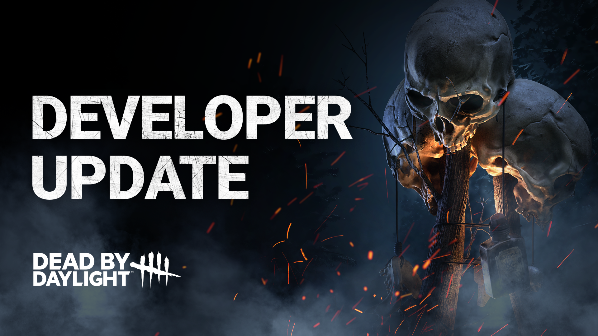
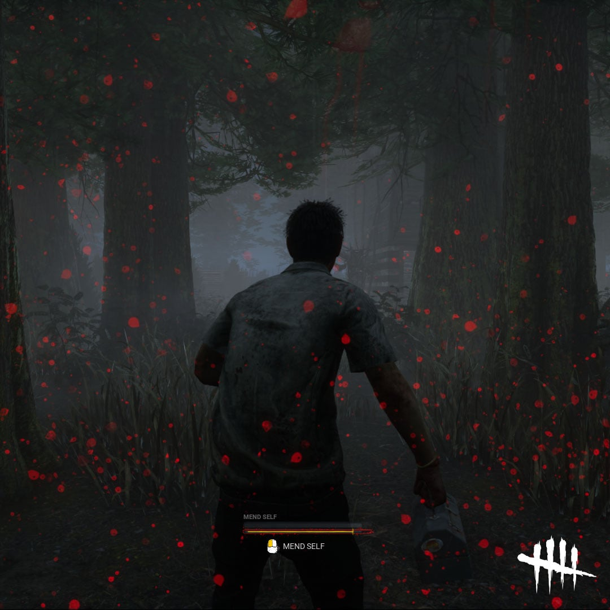

# Developer Update | January 2025

We’re back with another Developer Update, and some might say it’s pure *nightmare fuel*. That’s right – Freddy Krueger is getting a rework, and we’ve got you covered with everything to know about what’s coming.

The Nightmare – Freddy Krueger himself – is one of horror’s most iconic slashers. While he has proven himself to be a formidable foe for newer players, he’s begun to feel a little left behind in Dead by Daylight’s current landscape. We’re excited to help players rediscover the macabre joy of donning into the signature sweater and wreaking havoc like only Freddy can.

We’ve made several adjustments to his Power, which should help Freddy feel like the Dream Demon he was always destined to be. Our philosophy was to make The Dream World’s presence affect Survivors even when they’re awake, giving The Nightmare a consistently threatening edge with more flexibility than ever before.

- **\[CHANGE\]** Press Active Ability to swap between Dream Snares and Dream Pallets.

***Dev Note:**This has been long requested, and we’re thrilled to finally make it happen. With consistent access to two impactful abilities, The Nightmare can live up to his name by slowing Survivors down and shattering them psychologically. Having the ability to quickly swap between Powers has the added benefit of raising the Killer’s skill ceiling, while providing him with two different tools to utilize in a chase.*

- **\[NEW\]** Dream Snares now move at 12 m/s with a cooldown of 5 seconds. They can go through walls and up stairs, but not off ledges.
- **\[NEW\]** Dream Snares now have unique interactions with Survivors whether they are Asleep or Awake. Sleeping Survivors will be Hindered for 4 seconds, while Awake Survivors will gain 30 seconds on their Sleep Meter

***Dev Note:**This change grants The Nightmare additional flexibility while using the Snare, allowing him to use them against a wider variety of opponents. Making it so Survivors don’t need to be asleep to be affected will make quite the impact – not just on a Power level, but thematically as well.*

- **\[NEW\]** Dream Pallets can be triggered to explode in a geyser of blood. The explosion occurs 1.5 seconds after activation with a 3-meter radius. When a sleeping Survivor is hit, they become injured. When an Awake Survivor is hit, they gain 60 seconds on their Sleep Timer.

***Dev Note:**Dream Pallets have been a fun and rewarding way to mind game Survivors, and we wanted to add even more benefit to landing a successful deception. Now, even if the Survivor does manage to escape the chase, they run the risk of sustaining a dark souvenir to remember you by.*

- **\[NEW\]** The Nightmare can now teleport to completed, blocked, and endgame Generators, as well as any Survivor healing in the Dreamworld. Dream Projection on a healing Survivor will teleport The Nightmare within 12 meters of their position. Upon completing a teleport, Survivors within 8 meters will be revealed with Killer Instinct and gain 15 seconds to their Sleep Meter.
- **\[CHANGE\]** The Teleport cooldown has been decreased from 45 to 30 seconds, and the Teleport can no longer be cancelled.

***Dev Note:**An important part of The Nightmare’s playstyle is creating the illusion of being everywhere at once, and his Dream Projection is a major part of that. We’ve made a few changes to make this even more effective and removed the pain point of having Survivor progress rendering The Nightmare’s Power obsolete.*

Finally, the **Dream World**. Don’t let the name deceive you – this psychological torture chamber is far from a dream. We wanted this update to inject sleeping Survivors with a sense of terror, paranoia, and urgency – so we made a few small but crucial tweaks.

- **\[NEW\]** In the Dream World, Healing Survivors will be revealed by Killer Instinct for as long as they’re healing (lingering for 3 seconds once they stop), allowing The Nightmare to teleport to them.

We’re also giving the Dream World a slight visual polish, which should help immerse players further into the fantasy. We have plans to continue improving this in the future, so keep your eyes out for even more to come.

- **\[CHANGE\]** Sleeping Survivors can use any Alarm Clock to wake up.
- **\[NEW\]** After using an Alarm Clock, it goes on cooldown for 45 seconds, during which it cannot be used.

***Dev Note:**On the Survivor side we wanted to address a few notable frustrations, mainly around Alarm Clocks and the general process of Waking Up. We’re confident these changes will improve the experience of playing against The Nightmare without having a significant impact on the overall balance.*

We hope you enjoy this updated version of The Nightmare, and we’ll be keeping a close eye on your feedback. Unless, of course, we happen to fall asleep...

### The Nightmare’s Add-Ons

Rounding out this rework is a substantial pass to all The Nightmare’s Add-Ons, which will incentivize creativity whenever you’re preparing your next loadout. While the full list is too long to include, here are a few notable Add-Ons coming with this update:

#### Red Paint Brush (Iridescent)

- **\[OLD\]** All Survivors start the trial in the Dream World. Failed Skill Checks do not wake up Survivors in the Dream World.
- **\[NEW\]** Reveals the aura of Survivors in the Dream World when they are further than 32 meters away. Increases each Survivor's Sleep Meter by 50%.

#### Black Box (Iridescent)

- **\[OLD\]** Recently opened Exit Gates are blocked for 15 seconds.
- **\[NEW\]** Exit Gates are blocked for Sleeping Survivors for 15 seconds when they are opened.

#### Swing Chains (Very Rare)

- **\[OLD\]** Rusty but sturdy chains used to securely attach a swing seat. While Survivors are in the Dream World, the sounds of their footsteps are 50% louder.
- **\[NEW\]** After using Dream Projection, block all vaults within 16 meters for 6 seconds.

Keep an eye out for the full list once the update goes live, but rest assured that the Dream Demon will have plenty of terrifying tools to work with moving forward.

    

To decrease Realm repetition, we’re implementing a Realm Prevention System, which will replace the existing Map Repeat Prevention System.

If you’re not familiar, there is a distinction between Realms and Maps. A Realm is a unique world, generally drawn from the memories of a character and contorted into a nightmarish landscape by The Entity. Some examples are the MacMillian Estate, Coldwind Farm, and the Red Forest. Maps are a variety of different locations drawn from within each Realm, and while they are different from one another, this new system will ensure that you’ll never be sent to the same Realm for back-to-back Trials. Note that using Map Offerings will override the system.

## Deep Wound Update

While experienced players have grown familiar with the Deep Wound mechanic and Mending, it has been a continuous source of confusion for newer players.

To help clarify things, we’ve implemented a visual update similar to the Anti-Face-Camp bar. This bar will be a lot easier to track, appearing front and center in the UI and remaining there until you are fully Mended.

We’ve also reduced the blood spatter and darkening effects that appear whenever you’re in the Deep Wound State. Several subtle visual updates will now be added to the bar, highlighting the dire nature of the status. Check out a screenshot below:

        

Dead by Daylight features a massive – *and growing* – roster of characters. To make matters even more complex, each character brings 3 unique Perks into the game, with Killers having an additional Power to learn and master.

It can be especially tricky to gauge which characters might suit your preferred playstyle. Long-time players may even remember specific Offerings that let you play as a Killer you didn’t own, giving you a taste of what they’re capable of.

We’re excited to be launching a new system that will allow you to use specific characters *for free* during an Event Period, while in the Event’s queue. Note that only select characters will be available, chosen at our discretion, but they will be accessible to everyone.

While this will be for a limited time, with restricted access to the Bloodweb, it will allow players to really get a feel for a new character and even complete character-specific challenges.

That’s it for today’s Dev Update! Thanks for sticking with us, and we can’t wait to see you trying out The Nightmare in our upcoming PTB.

Until next time...

The Dead by Daylight Team
