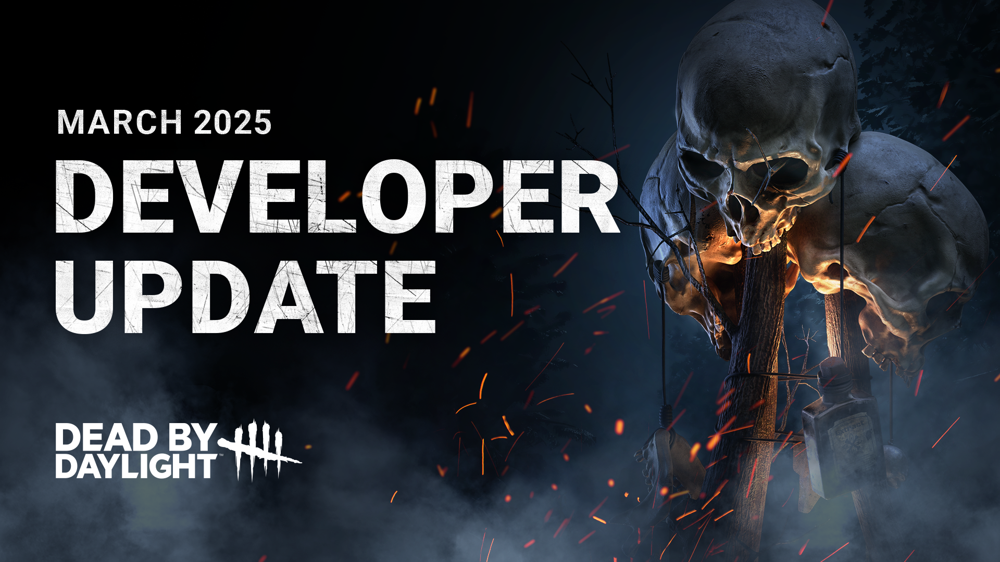
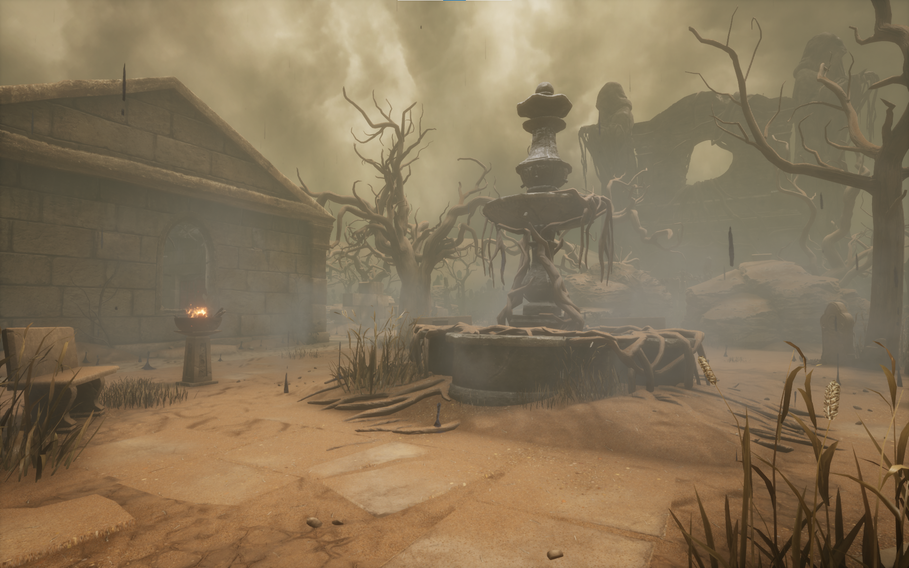
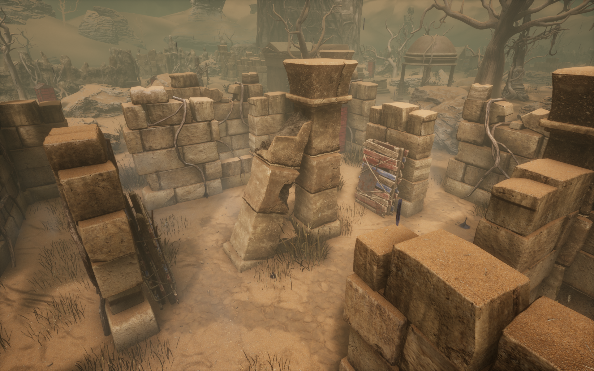
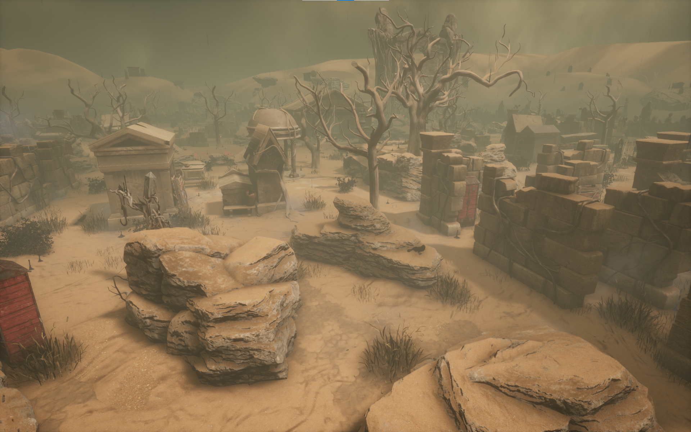

<!-- summary -->
## AI TL;DR

Legion’s fatigue, Feral Frenzy and movement values are tuned, Xenomorph’s tail charge, tunnel exit speed and heat mechanics receive adjustments, Good Guy’s Slice & Dice acceleration is sped up, and several killers (Hillbilly, Blight, Pig, Ghost Face, Skull Merchant) get their terror radii changed to match playstyle. Self-and altruistic-mending times are lowered, and a suite of perk cooldowns and durations (Quick and Quiet, Deception, Dance With Me, Red Herring, Knock Out, Alien Instinct, Hysteria, Deathbound, Nemesis) are updated for better balance. A new “Surrender” option appears in match details for specific bot or stalled-game scenarios, and the Forsaken Boneyard realm adds a Shack-centered map with revised tiles. The changes arrive in the upcoming PTB for the 8.6.0 update.
<!-- /summary -->

<!-- nav -->
&larr; [Developer Update | January 2025 PTB](489-developer-update-january-2025-ptb.md) · [Developer Updates](../index.md#developer-updates) · [Design Preview | Future Plans + Update on The Trickster](496-design-preview-future-plans-update-on-the-trickster.md) &rarr;
<!-- /nav -->

# Developer Update | March 2025

*EDIT: Updated the Good Guy changes and dev note to clarify that the quicker acceleration will also apply to the start of Slice and Dice.*

With the 8.6.0 Update quickly approaching, it's time once again to give you a look at the notable gameplay changes you can expect from the Public Test Build next week.

Read on for all the details:

## STATUS EFFECT UPDATES

- **\[CHANGE\]** Decreased self-mending time to 10 seconds *(was 12)*
- **\[CHANGE\]** Decreased altruistic-mending time to 6 seconds *(was 8)*

*DEV NOTE: We know that Deep Wound can be a frustrating mechanic to come up against as it slows down the pace of the game for Survivors. By reducing mending times, we hope to reduce this friction slightly. We want players to feel the urgency of triaging this status effect, but once they make the choice to act, we don’t want them to feel pulled away from the game for too long!*

## KILLER UPDATES

- **\[CHANGE\]** Decreased fatigue time to 2.5 seconds *(was 3)*
- **\[CHANGE\]** Increased fatigue move speed to 2.3 m/s *(was 2.07)*
- **\[CHANGE\]** Feral Frenzy lasts for 11 seconds *(was 10)*
- **\[CHANGE\]** Feral Frenzy cooldown is now 15 seconds *(was 20)*
- **\[CHANGE\]** Movement speed earned by hit during Feral Frenzy is now 0.24 *(was 0.20)*
- **\[CHANGE\]** Adjusted several Add-Ons.

*DEV NOTE: To account for reduced mending times, we’ve adjusted Legion’s kit to ease the downtime between power uses. By extending Feral Frenzy and adjusting its cooldown and movement bonus, the goal is to provide Legion with a slight buff to their ramp-up as they weaken Survivors, giving them more opportunities to lean on their mobility. Then, with the adjustments to fatigue, they’ll be able to get back into chases quicker after Feral Frenzy ends to better close the deal.*

*These changes will make Legion feel like more of an active and mobile threat, reducing their reliance on a more passive status effect.*

- **\[CHANGE\]** Increased tail attack charge time to .35 seconds *(was .2)*
- **\[CHANGE\]** Increased tail attack charge sound volume for survivors
- **\[CHANGE\]** Reduced missed attack cooldown time to 2.5 seconds *(was 3)*
- **\[CHANGE\]** Increased the Killer Instinct range when exiting a tunnel to 16m *(was 12m)*
- **\[CHANGE\]** Decreased the time it takes to get out of a tunnel to 1.5 second *(was 2.25)*
- **\[CHANGE\]** Increased amount of fire needed to burn The Xenomorph out of crawler mode to 175 *(was 100)*
- **\[CHANGE\]** Increased delay before the Xenomorph’s heat starts to dissipate to 15s *(was 1)*
- **\[CHANGE\]** Decreased the Xenomorph’s heat dissipation rate to 2/s *(was 25)*
- **\[CHANGE\]** Adjusted several Add-Ons to align with these changes.

*DEV NOTE: In its current state, Xenomorph's tail attack tends to be a little too difficult to dodge, with a short window between wind-up and attack. To give Survivors more of a chance to anticipate and react to it, we’ve adjusted its charge time and made the wind-up louder. To balance this out, we’ve reduced the cooldown on misses so Xenomorph can keep pressure up.*

*We’ve also found that turret impact can be inconsistent, providing huge value at high skill levels and being very ineffective at lower levels. Rather than having turrets act as an immediate threat that dissipates quickly, heat build-up will remain for longer. This should help give a little more value to smaller bursts of heat that aren’t enough to knock Xenomorph out of crawler mode, as weaker turret placements can still build up over time. To ensure this sustained heat isn’t too punishing, we’ve balanced it with a higher heat threshold for Xenomorph.*

*We also did a pass on Xenomorph’s Add-Ons to buff some of its weaker, less used ones, while re-aligning some turret-based Add-Ons to fit with the above changes.*

- **\[CHANGE\]** Reduced Hidey-Ho Mode cooldown to 12s *(was 14)*
- **\[CHANGE\]** Reduced time to reach max speed at the start of Slice and Dice and after Scamper

*DEV NOTE: We know that the Good Guy’s utility and mobility in chases has historically been one of his core draws. While recent changes have made him less oppressive at lower MMR ranks, we've made some adjustments to help get him back in the action quicker and improve “movement feel”, particularly accelerating quicker as you activate Slice and Dice and after the Scamper action to get you up to max speed.*

- **\[CHANGE\]** Increased the Hillbilly’s Terror Radius to 40 *(was 32)*
- **\[CHANGE\]** Increased the Blight’s Terror Radius to 40 *(was 32)*
- **\[CHANGE\]** Decreased the Pig’s Terror Radius to 24 *(was 32)*
- **\[CHANGE\]** Decreased the Ghost Face’s Terror Radius to 24 *(was 32)*
- **\[CHANGE\]** Decreased the Skull Merchant’s Terror Radius to 24 *(was 32)*

*DEV NOTE: We’ve adjusted several Killer Terror Radiuses to better fit with their intended playstyles. Killers with high mobility that can zip across the map at high speeds have had their radiuses increased to give Survivors a greater chance to react to their approach.*

*We’ve also reduced the radiuses for stealthy Killers to better fit their playstyles. The Skull Merchant is a slight outlier here. While she can gain Undetectable by deploying a drone, we felt she could still benefit from added stealth support.*

## NEW FEATURES

- **\[NEW\]** If one of the following conditions is met, the "Surrender” option will become available on the Match Details screen
  - When all remaining Survivors are bots, the **Killer can Surrender** without a disconnection penalty
  - When no generator has been completed for 10 consecutive minutes, the **Killer can Surrender** without a disconnection penalty
  - When all other remaining Survivors are bots, the **Survivor can Surrender** without a disconnection penalty
  - When all Survivors are in the Dying State, the **Survivor can Surrender** without a disconnection penalty

*DEV NOTE: We know it can be frustrating to find yourself in a scenario that’s unwinnable when you would rather move on. To address these scenarios, as well as cases where the opposing side has been fully replaced by bots, we’ve added a Match Surrender option.*

*We’re currently targeting the most disruptive cases but will continue to monitor player behaviour to identify if there are further opportunities for expanding on this option.*

*And for all you Plot Twisters out there, we see you – this will not trigger the Surrender option.*

- **\[NEW\]** Expanded the Forsaken Boneyard realm with a Shack-focused map
- **\[NEW\]** Updated the existing map tiles to improve navigation

  

*DEV NOTE: We’re expanding the Forsaken Boneyard realm and map pool with a new map layout with the Killer Shack at its center, featuring updated map tiles. Specifically, we’ve heard your feedback that Eyrie of Crows can be difficult to navigate at times thanks to collisions with certain aesthetic elements.*

*We’ve opted to remove the large bunches of branches from map tiles on this Shack map, while also introducing double pallet tiles that we hope will add some exciting new looping possibilities.*

## PERK UPDATES

**QUICK AND QUIET**

- **\[CHANGE\]** Decreased the cooldown to 25/20/15 seconds *(was 30/25/20)*

**DECEPTION**

- **\[CHANGE\]** Increased the time during which you leave no scratch marks to 5 seconds *(was 3)*
- **\[CHANGE\]** Decreased the cooldown to 25/20/15 seconds *(was 30/25/20)*

**DANCE WITH ME**

- **\[CHANGE\]** Increased the time during which you leave no scratch marks to 5 seconds *(was 3)*
- **\[CHANGE\]** Decreased the cooldown to 25/20/15 seconds *(was 30/25/20)*

**RED HERRING**

- **\[CHANGE\]** Decreased the minimum generator repair time needed to trigger this perk to 1 second *(was 3)*
- **\[CHANGE\]** Decreased the cooldown to 25/20/15 seconds *(was 60/50/40)*

*DEV NOTE: While these Perks specialize in misdirecting the Killer, we’ve found that their cooldowns don’t match their value. By reducing their cooldowns and increasing the duration of their effects (specifically Deception and Dance With Me), we hope to give these off-meta Perks a better chance at value in deception-based builds.*

**KNOCK OUT**

- **\[CHANGE\]** When a Survivor drops a pallet, if they move 6m away from it within 6s they gain 5% Hindered for 3/4/5s

*DEV NOTE: Knock Out is a perk that’s associated with slugging, leading to some particularly unfun game styles. We’re looking to make changes to the perk whilst keeping it useful for Killers.*

**ALIEN INSTINCT**

- **\[CHANGE\]** Increased the aura reveal duration to 8 seconds *(was 5)*
- **\[CHANGE\]** Increased the duration of Oblivious to 40/50/60 seconds *(was 16/18/20)*

**HYSTERIA**

- **\[CHANGE\]** Increased the duration of Oblivious to 30/35/40 seconds *(was 30/30/30)*
- **\[CHANGE\]** Decreased the cooldown to 20 seconds *(was 30)*

**DEATHBOUND**

- **\[CHANGE\]** Shortened the range at which this perk activates to 12/8/4 meters *(was 16/12/8)*

**NEMESIS**

- **\[CHANGE\]** Increased the aura reveal duration to 8 seconds *(was 4)*

*DEV NOTE: Similar to the above, we identified some Killer Perks that have also been underperforming, boasting lower pick and kill rates.*

*We’ve adjusted their values to help increase their viability in more specialized Perk builds.*

Until next time...

The Dead by Daylight Team

<!-- nav -->
&larr; [Developer Update | January 2025 PTB](489-developer-update-january-2025-ptb.md) · [Developer Updates](../index.md#developer-updates) · [Design Preview | Future Plans + Update on The Trickster](496-design-preview-future-plans-update-on-the-trickster.md) &rarr;
<!-- /nav -->
