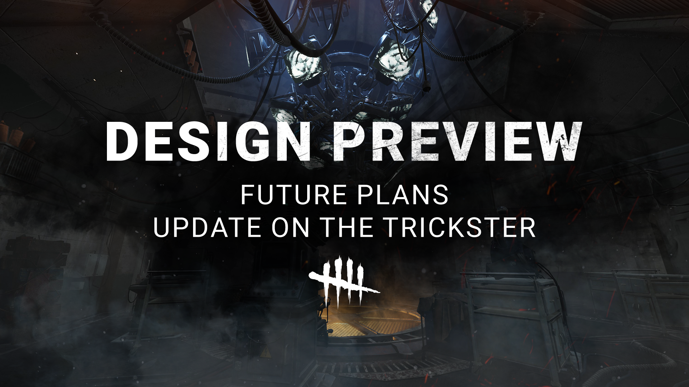

# Design Preview | Future Plans + Update on The Trickster

Last year, we tested out a new way to gather feedback with the Design Preview. In it, we shared a sneak peek at proposed changes for The Trickster with the goal of gauging how you felt about these changes very early in the design process.

We wanted to quickly follow up on how we're changing up the Design Preview process moving forward and give a little update on The Trickster’s preview.

## WHAT IS A DESIGN PREVIEW?

Coming away from last year's Design Preview, a couple things stood out to us:

1. When it comes to bigger changes like reworks, specifics matter. It’s important that we compare the perspectives of both Killers and Survivors to help inform decision-making.
2. While it’s one thing to **ask**for feedback, the original Design Preview concept didn’t let you know **how**we’re using your feedback, and it’s important to us that you have visibility on the ways your feedback helps drive improvements within the game!

With these in mind and as we look to future Design Previews (including this one!), we're making the following changes to our process:

1. Each Design Preview will use a short survey (5 mins max) to collect your feedback, ensuring we have context behind your suggestions (i.e. experience level, playstyle).
2. Within two weeks of each Design Preview, we’ll share an early look at some interesting points we’ve drawn from your feedback, while also giving an idea of how we plan to use it.

By making these changes, our goal is to bring you closer to the design process, giving you more transparency and making it clearer how your feedback is being used by the Design team. Of course, sometimes the nature of feedback is that it inspires other exciting chances for improvement, so we want to make sure we’re setting expectations that changes and timelines may differ from what you see here or in feedback threads.

Now, let’s check in on where we’re at with The Trickster.

## A SHORT UPDATE ON THE TRICKSTER

After working through your feedback, we decided to move in a different direction from what we had outlined. Rather than simply revert past changes, we think there’s an opportunity to lean into his theming to offer gameplay changes that reward Trickster mains while also providing something exciting and new for folks who have been on the fence about giving him a try.

While we don’t have a timeline to share regarding a Trickster rework right now, we’ll be back when the time is right!

## WHAT’S NEXT?

In the coming days, we’ll be back with a fresh Design Preview that we think you’re going to dig. In it, we’ll give you a first look at **our vision for the future of The Skull Merchant**. We can’t wait to hear what you think!

Keep an eye on this space and our social channels for all the details! Until then...

See you in The Fog!

The Dead by Daylight Team
