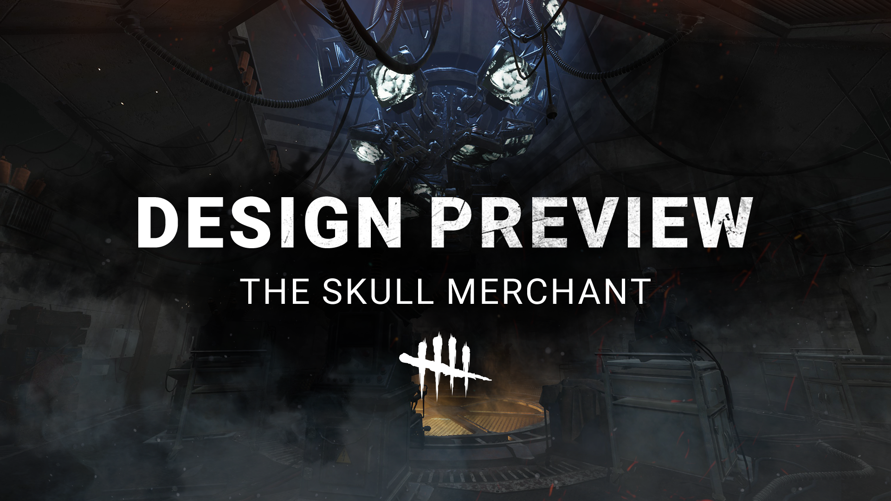
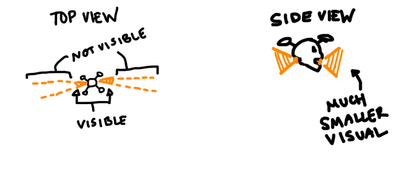

<!-- summary -->
## AI TL;DR

Dead by Daylight’s developers outlined a forthcoming overhaul of the Killer Skull Merchant, shifting her from a passive, complex kit toward an active, intel-focused playstyle. The redesign introduces Drones 2.0 with slower, invisible detection zones, remote control using a new Power resource, and a burst-propulsion attack that damages Survivors, while removing legacy effects like Hindered and Claw Trap. Drone Hacking returns with higher risk-reward, revealing the Killer’s aura on success and exposing the hacker on failure. A tentative “global detection” power will briefly reveal sprinting Survivors, echoing a red-light-green-light mechanic. The team emphasized balancing fun for both sides and said the timeline remains pending, with updates to follow.
<!-- /summary -->

<!-- nav -->
&larr; [Design Preview | Future Plans + Update on The Trickster](496-design-preview-future-plans-update-on-the-trickster.md) · [Developer Updates](../index.md#developer-updates) · [Developer Update | April 2025](500-developer-update-april-2025.md) &rarr;
<!-- /nav -->

# Design Preview | The Skull Merchant

**Click here for**[**Português Brasileiro**](https://dbd.game/4bVx069)**,**[**简体中文**](https://dbd.game/4hIKeoa)**,**[**Français**](https://dbd.game/4jfJTdV)**,**[**日本語**](https://dbd.game/4c074GH)**, and**[**Español**](https://dbd.game/4hFjuVE)**.**

Today, we want to dig into a topic that we know many of you have been yearning to know more about: **our vision for the future of The Skull Merchant**!

## REEVALUATING THE SKULL MERCHANT

We know that Skull Merchant is a divisive Killer who, regardless of her performance in a Trial, carries a lot of history and strong feelings among players.

Many players feel she’s not fun to play against and her kit is exceedingly complex. This scares away potential Killers from trying her and makes it difficult for Survivors to consider counterplay without dedicated research.

As we look to reworking Skull Merchant, our aim is to:

1. Strike a balance between being fun to play **as**and **against**
2. Preserve the intel focus of her kit, while making it intuitive to understand for both sides
3. Move away from a passive power with limited player interactions and embrace a more active playstyle, while ensuring her power is compensated in interesting ways

Those last two points may be particularly difficult to hear for long-time Skull Merchant mains, but we feel it’s important to be clear about our intentions here. While the future we envision for Skull Merchant is quite different from her previous iterations, we feel this rework brings some exciting new tools of torment to the table!

## DRONES 2.0

Skull Merchant can deploy a Stealth Drone (she carries a total of 5), which scans its immediate vicinity and provides intel back to her. After a short activation period, the Drone gives off subtle audio and visual indications of the area being scanned, **revealing any Survivors on the Radar who are caught by its two rotating detection zones**.

Importantly, we’ve slowed their rotation speed slightly and toned down the visual intensity of these zones, removing the large scan lines to replace them with something more subtle. **Namely, you'll see the direction of each detection zone as they rotate, but the detection zone itself is invisible**. This gives Survivors an impression of the space that’s being actively scanned but requires them to proceed cautiously.

*While we know they had their supporters, the original scan lines were visually loud and often clashed with the rest of the game’s look and feel. The intent here is to strike a balance between giving Survivors just enough info to assess the threat (a subtle, rotating field of detection) without that threat overwhelming the space and feeling incongruous to Dead by Daylight’s visual identity.*

## DRONE CONTROL

Once a Stealth Drone has been active for a short period, **Skull Merchant can choose to take control of Drones from a distance**. During this time, she becomes Undetectable, as her controlled Drone becomes the primary threat. These Stealth Drones move slightly faster than her base movement speed and consume a new resource – Power, unique to each Drone – while being controlled.

Power is consumed slowly as the controlled Drone idles and slightly more is consumed while moving. Skull Merchant is also able to use a burst of this Power to activate Drone Propulsion. **This charged power sends the Drone flying forward at high speed**, relative to how long it was charged.

*Put simply: Stealth Drone go brr*

**Hitting a Survivor with Drone Propulsion causes them to lose a health state**. If you hit a Survivor or collide with an object during this action, the Drone will be destroyed and return control to Skull Merchant.

*With these new Stealth Drones, we want to give players something that feels familiar (using drones to gather intel) but also opens the door for unique skill expression opportunities (re-positioning Drones and Propulsion skill shots). Using technology to hunt her prey is core to Skull Merchant’s identity and so it’s important that we stay true to that!*

*We have opted to remove many of the background effects – Hindered, Haste, Lock On, Claw Trap – that were previously tied to these Drones, though. Rather than doing a little bit of everything with her Drones under layers of complexity, we want their use cases to be clear to Killers and Survivors alike, on the fly. Basically, if they’re static, they’re likely scanning for Survivors. If they’re moving, they’re a collision hazard.*

## DRONE HACKING

Like Drones themselves, **Drone Hacking returns with a greater degree of risk and reward**. Like before, Drones can be disabled by Survivors by inputting a series of button presses while close. **If a Drone is disabled, Skull Merchant’s aura is revealed** to that Survivor, providing useful intel. **If the Hack is failed, they are revealed by Killer Instinct** and are prevented from attempting another hack for a short period.

*The intention here is to introduce a greater degree of tension to hacking, while offering a clear way for Survivors to interact with Skull Merchant’s kit in a meaningful way. The intel reward is greater than before, but the risk of being revealed is more impactful. With intel at the center of this tension on both sides, we hope it makes this interaction easily digestible by players.*

## RED LIGHT, GREEN LIGHT

In addition to her Drones, Skull Merchant has another power that ties into her Radar. While the name is currently TBD, let’s refer to it as a Global Detection Power. **Once this power is charged and activated, a global warning plays for all Survivors**. For a short period afterwards, **any Survivor who actively sprints is revealed on her Radar**. Of course, crouching, standing still, and hiding in lockers all prevent detection. Added to the intel provided by Stealth Drones around the map, this should help ensure Killers are easily able to keep tabs on Survivors’ movements.

*In line with our rationale above, we want Survivors to have a clear understanding of what’s happening when they face Skull Merchant. Where the overlapping timers and status effects of Skull Merchant’s previous kit often obscured what the expected result of an encounter might be, structuring this power around a well-known game – red light, green light – provides a clear and readable threat, a clear benefit for the Killer, and a clear path for Survivors to try and overcome it.*

## TENTATIVE RELEASE

We are currently evaluating a timeline for Skull Merchant’s rework but do envision it being quite far out as our primary focus is on driving quality-of-life updates. Once we have a timeline to share, we will be sure to keep you informed via future Design Preview updates.

Phew – that was a lot! How do you feel about this rework? We want to hear from you! Jump into our survey and share your thoughts right here:  [https://www.surveymonkey.com/r/DPSM\_DF\_MAR?value=%5Bvalue\_value%5D](https://www.surveymonkey.com/r/DPSM_DF_MAR?value=%5Bvalue_value%5D)

See you in The Fog!

The Dead by Daylight Team

<!-- nav -->
&larr; [Design Preview | Future Plans + Update on The Trickster](496-design-preview-future-plans-update-on-the-trickster.md) · [Developer Updates](../index.md#developer-updates) · [Developer Update | April 2025](500-developer-update-april-2025.md) &rarr;
<!-- /nav -->
