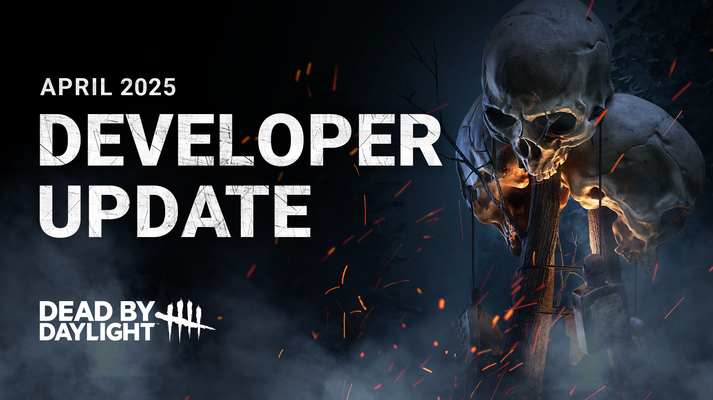

# Developer Update | April 2025

The 8.7.0 Update will be here before you know it, so let’s take a look at the notable gameplay changes you can expect from next week’s Public Test Build, including improvements we recently shared as part of our [Quality-of-Life initiative](https://x.com/DeadbyDaylight/status/1891521453041782861).

You may notice that in this Developer Update, we haven’t included the crunchy numbers associated with certain changes. Without the context of a PTB to dive right into, specific value changes can be difficult to contextualize in the form of a blog. Stay tuned for the PTB Patch Notes, where we’ll share the precise values that are changing!

Read on for all the details:

## NEW FEATURES

- **\[NEW\]**Added a Quests menu to centralize all quest-related content in one place.
  - This replaces the Daily Ritual, Tome Challenge, and Event Tome systems.
- **\[NEW\]**Quests are organized into distinct groups, including Daily Quests, Rift Pass Quests, and Event Quests.
- **\[NEW\]**Quests do not need to be selected to be considered active. All available quests are eligible for completion at all times.
- **\[NEW\]**Upon completion, players receive quest rewards automatically without needing to return to the Quests menu.
- **\[NEW\]**Added Milestone Quests, which reward players for completing progressively higher amounts of common in-game actions (i.e. hooking Survivors).
- **\[NEW\]**Added the ability to pin multiple quests for easy reference in the Lobby and Match Details screen in-game.
- **\[NEW\]**Quest notifications can be toggled on or off via the Graphics options menu.
- **\[CHANGE\]**Updated verbiage to use the term “Quest” instead of “Ritual” or “Challenge”.

***DEV NOTE**: If you caught our latest livestream, you know what’s up – if not, check out the recording*[*here*](https://www.youtube.com/live/9pR607LNhGo?si=gT2sDivmjNhOmk_m&t=3139)*for all the details on the new Quests system!*

*Our intention behind this system is that – win or lose – we want Trials to feel even more rewarding for players, making in-game tasks and rewards easier to engage with. What this means for you is that you can complete multiple quests per Trial, you can pin quests to easily reference them in-game, and rewards are unlocked automatically to minimizing the amount of time you spend in menus, among other things. Checking things off your to-do list should feel snappy and rewarding, and that’s the feeling we’re aiming for here!*

- **\[NEW\]** Extended the number of levels in the Deep Rift and increased the number of available outfit variants within it.
- **\[NEW\]** Updated the final Rift tier – following the Deep Rift – to act as a repeatable source of Bloodpoints.
- **\[CHANGE\]** Moved access to the Archives from the Lobby main menu to the bottom-screen menu.
- **\[CHANGE\]** All Tome lore in the Compendium is now unlocked for all players.
- **\[UNCHANGED\]** All existing Tome Challenges can still be completed for Bloodpoints and their page completion rewards. Note: They will not use the new Quests system, meaning they must be activated – one at a time – and redeemed once completed.

***DEV NOTE**: Alongside the new Quests system, we’ve also adjusted some of the game’s other menus and features. With the Rift, we’re really excited about how quests will make progression more streamlined and are happy to share that we’re adding even more content into the Deep Rift to spice up those level-ups.*

*While the Archives and Compendium will remain accessible in-game, Rift progression moving forward will be handled through the Quests menu, so you’ll likely see less of these legacy spaces. As a fitting way to show our respect for them, previous Tomes and their challenges will remain available for you to work through, and all lore is unlocked to let you walk down memory lane.*

- **\[NEW\]** Added a widget highlighting a player’s own Perks in the pre-game Lobby.
- **\[NEW\]** Newly unlocked Survivors and Killers come pre-equipped with a Perk in their first slot.

***DEV NOTE**: There's a lot of info that newer players face when opening the game, so we want to highlight the importance of Perks for them. This widget uses a visual effect to let players know if they have unused Perk slots, making it easy to jump to that menu with a single**click.*

*Pre-equipping a Perk for newly unlocked characters also helps ease players into the game, ensuring they won’t be at a disadvantage in their first Trial if they miss the Perks menu.*

- **\[NEW\]** Newly unlocked Survivors come pre-equipped with a small set of items and add-ons, as well as some extras in their inventory.
- **\[NEW\]** Newly unlocked Killers come pre-equipped with a small set of add-ons, as well as some extras in their inventory.

***DEV NOTE**: Similar to the above, as we look to the future of Dead by Daylight, it’s important that we re-evaluate players’ first steps within the game. It’s not always clear that they should check a newly unlocked character’s loadout before entering a Trial.*

*Giving these items and add-ons to newly unlocked characters allows us to highlight the basics of a character’s kit, giving players something to use in their first few Trials.*

- **\[NEW\]**Each Survivor can attempt to unhook another Survivor 3 times. On the next attempt, they cannot cancel this interaction.
- **\[NEW\]**Each Survivor's individual unhook attempt count resets when the hooked Survivor exits the hooked state.

***DEV NOTE**: It's not lost on us that unhooking can be used by Survivors to grief others. While we know there can be strategic reasons to cancel an unhook, this isn’t something that should be occurring over and over.*

*By setting a limit on this action before it becomes uninterruptable, our goal is to ensure well-meaning players have the flexibility to change their tactics on the fly, while also preventing others from using this action for griefing purposes.*

- **\[NEW\]** Added an additional window of time in which a skill check will be nullified when letting go of an action as the skill check pops up.

***DEV NOTE**: We’ve all been there. You get off a generator just a fraction too late and BOOM, you trigger a failed skill check. As a result of your feedback, we’ve added a slightly extended grace period for letting go of generators and healing actions. This should help reduce the frustration of a rogue skill check alerting the Killer, without being so generous that you can be careless with your actions.*

## KILLER UPDATES

- **\[CHANGE\]** DecreasedDog Chase Command vault speed.
- **\[CHANGE\]** Increased Bloodpoint rewards for all Deviousness scoring events.

***DEV NOTE**: When vaulting, Snug feels a little fast given how his animation plays out. This can feel off and leaves Survivors with very little time to react. We’ve decreased Snug’s vault speed slightly to better match his animation, while giving Survivors a little more flexibility while being chased around pallets.*

*We’ve also seen your feedback that the Houndmaster’s Bloodpoint rewards need a little buff. We’ve doubled the reward values of all her Deviousness scoring events to help bring this in line.*

## STATUS EFFECT UPDATES

- **\[CHANGE\]**Haste no longer stacks with other Haste effects.
- **\[CHANGE\]**Hindered no longer stacks with other Hindered effects.
- **\[CHANGE\]** Updated status effect widgets to display current Haste and Hindered values (this can be disabled in the game options).
- **\[CHANGE\]**Updated select Perk descriptions to change base movement speed adjustments to Haste or Hindered effects.
- **\[CHANGE\]** Introduced small buffs to Perks which previously relied on stacking.

***DEV NOTE**: Historically, stacking status effects like Haste and Hindered, as well as base movement speed changes, has led to circumstances where certain Perk combos (Made For This + Hope, anyone?) ended up far more powerful than intended.*

*By streamlining these effects, you’ll only ever move as fast (or as slow) as the highest Haste or Hindered effect currently active (note: the highest value of these two effects**will***still interact with each other)*. Our intention is to limit instances of overtuned combos, while making their effects easier to understand, especially as we welcome new players to the Fog.*

*Stay tuned for the PTB Patch Notes, for an overview of the Perks that will be receiving small buffs to account for the removal of this stacking.*

## PERK UPDATES

- **\[CHANGE\]** When a Totem is Rekindled, Survivors’ healing and repair speeds are reduced. This effect is increased for each additional Rekindled Totem. If all five totems are Rekindled simultaneously, all Totems are permanently blocked by The Entity.
- **\[CHANGE\]** Survivors cursed by this Perk see Rekindled Totems’ auras within a small radius.
- **\[CHANGE\]** Hex: Pentimento no longer reduces recovery speed from being downed or gate-opening speed.

***DEV NOTE**: It's no secret that Hex: Pentimento’s repair speed debuff is its strongest effect and main draw. With this change, we’ve moved away from giving the full power of this debuff at 1 Totem. Instead, gradually increasing healing and repair debuffs give this effect a more gradual power curve. This preserves its focus on slowing Survivor progression without being too dominant at 1 Totem.*

*As for aura reading, our goal is to help support solo players who don’t have the benefit of teammates to help with Totem callouts.*

Until next time...

The Dead by Daylight Team
