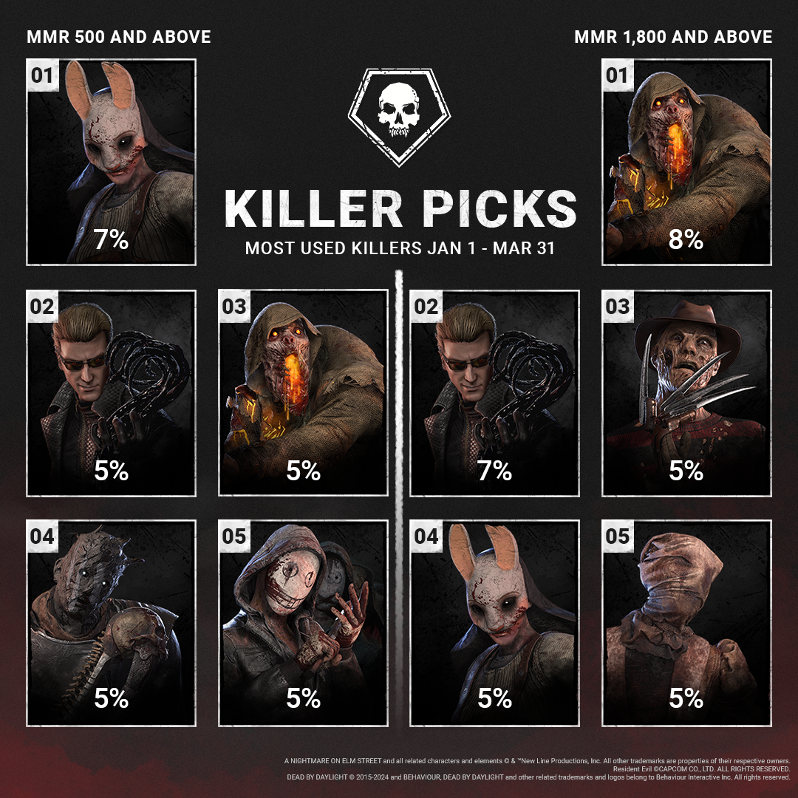
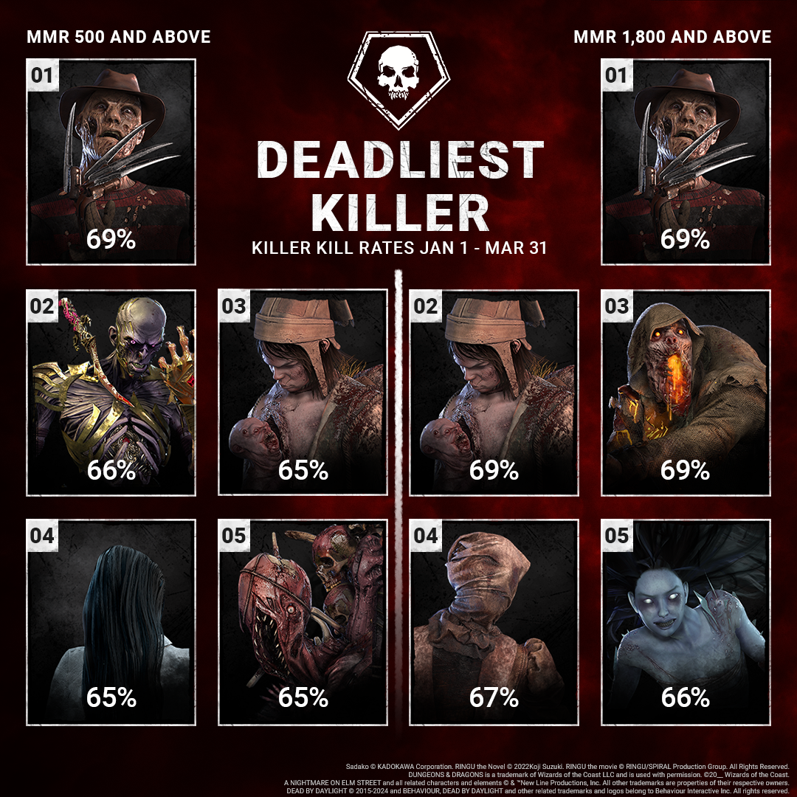
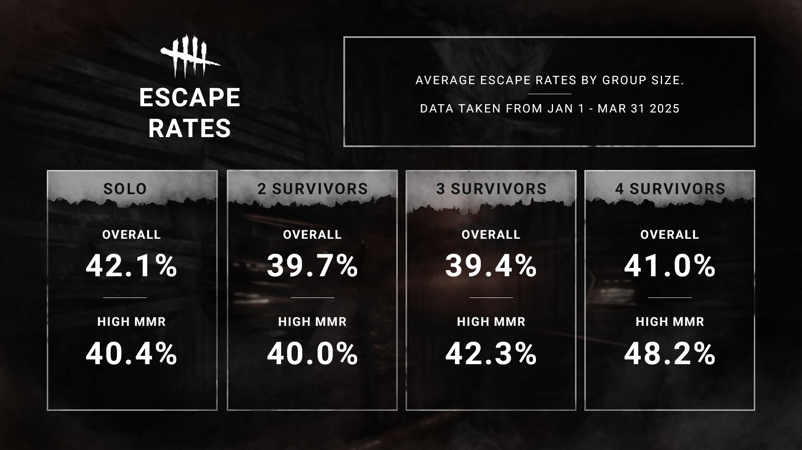

<!-- summary -->
## AI TL;DR

The team released a quarterly statistical overview for January-March 2025, spotlighting killer pick and kill rates and survivor escape rates. The Mastermind and The Blight topped pick-rate charts across MMR tiers, while The Nightmare’s recent rework boosted his kill rate among high-MMR players; The Lich, Twins, Blight and Nurse also remained strong. Overall killer kill rate averaged 60 % (63 % at high MMR). Survivor escape rates held steady at 41 % across all MMR and 42 % for high MMR, with coordinated high-MMR groups escaping most and solo players in lower brackets outpacing the average. No new content was added, the note simply reports these balance-related trends.
<!-- /summary -->

<!-- nav -->
&larr; [Developer Update | April 2025](500-developer-update-april-2025.md) · [Developer Updates](../index.md#developer-updates) · [Design Preview | The Skull Merchant Part 2](504-design-preview-the-skull-merchant-part-2.md) &rarr;
<!-- /nav -->

# Stats | January - March 2025

Can you believe how quickly April has been flying by? Not only is the Blood Moon event in full swing, but we also have a new update – Steady Pulse – quickly approaching on the horizon. In the meantime, we wanted to take a look back at the **first 3 months of the year** and share a look at how things are going for Killers and Survivors.

Kicking things off are Killer pick rates! Looking at both MMR groups, The Mastermind and The Blight were both winners, leveraging their high mobility to land in the top 5. While The Nightmare didn’t quite crack the top 10 for the wider MMR bracket, his recent rework helped drive a higher pick rate among higher MMR players.

Speaking of The Nightmare, fresh off his rework, it sure seems like he was a *dream* to play, leading kill rates across both MMR brackets, while The Lich continued to leverage his vile darkness across all MMR levels. High MMR mainstays like The Twins, The Blight and The Nurse unsurprisingly made appearances as well.

Looking at the bigger picture, there was an **average kill rate of 60% across all MMR**, while that **average kill rate increased to 63% for high MMR**. This largely falls in line with our intended Killer balance.

Of course, there’s more to a Trial than just Killers. Let’s take a look at how Survivors have fared!

Overall escape rates tended to be quite close across MMR brackets, with **all MMR seeing a 41% escape rate** and **high MMR landing at 42%**. Digging into specific party sizes is where the results differed.

Unsurprisingly, coordinated groups playing at high MMR performed best, resulting in the highest escape rate. Interestingly, however, solo queue players in the wider MMR bracket proved to be particularly hardy, falling above the overall escape rate.

But with that, we’ll see you again in July to share the next 3 months of Killer and Survivor stats.

Until next time…

The Dead by Daylight Team

<!-- nav -->
&larr; [Developer Update | April 2025](500-developer-update-april-2025.md) · [Developer Updates](../index.md#developer-updates) · [Design Preview | The Skull Merchant Part 2](504-design-preview-the-skull-merchant-part-2.md) &rarr;
<!-- /nav -->
