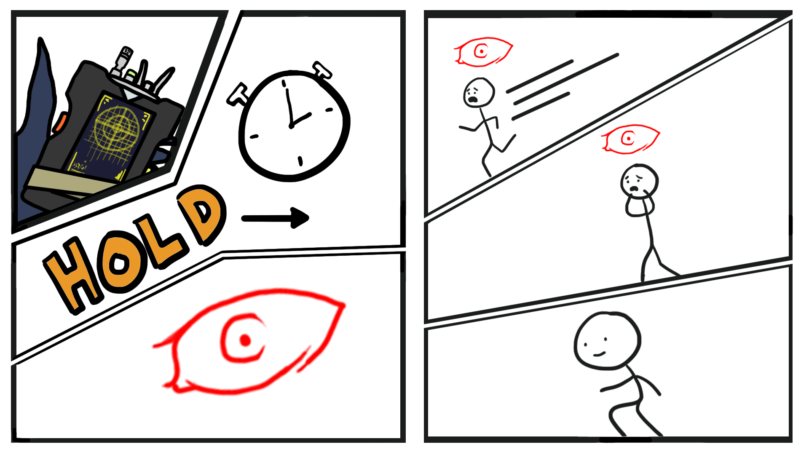
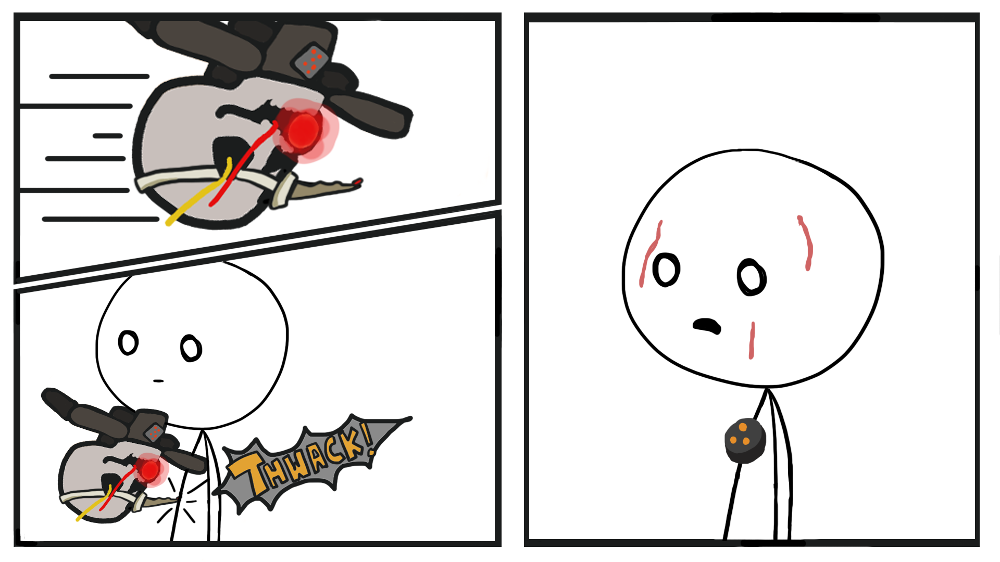
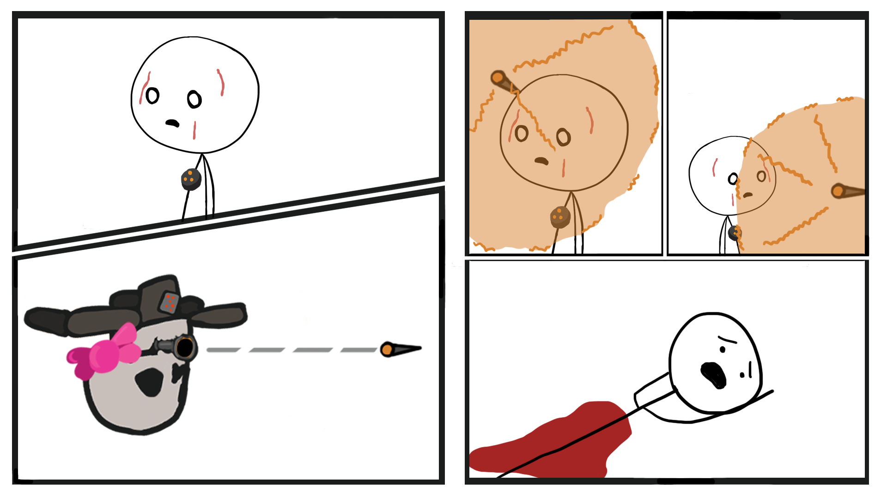
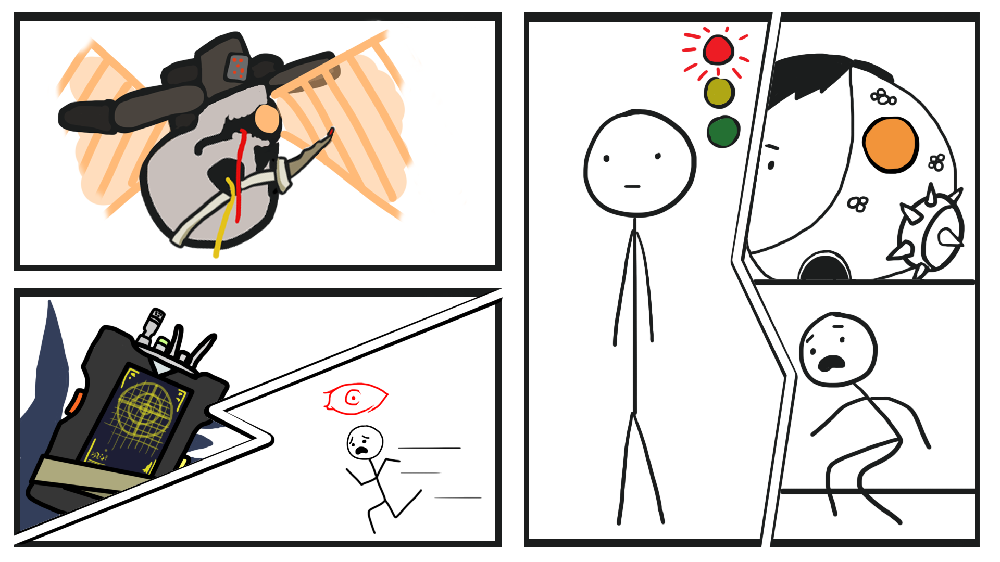
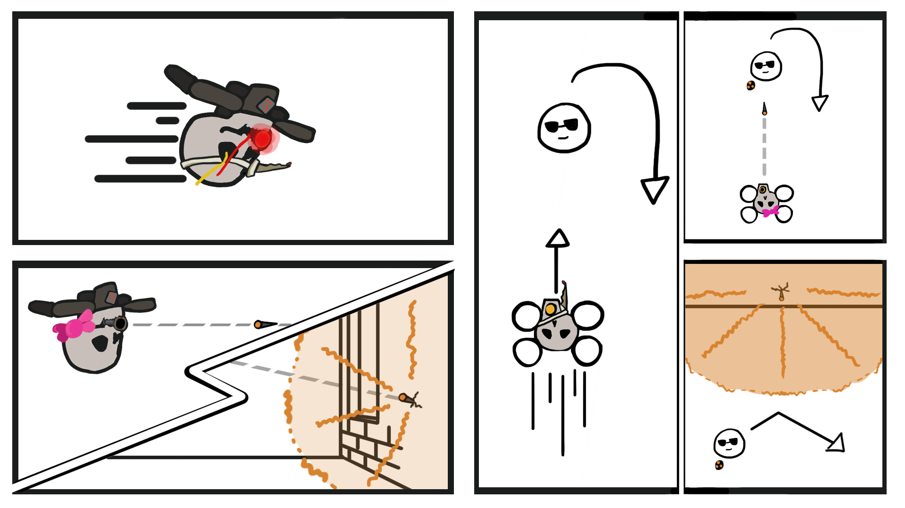
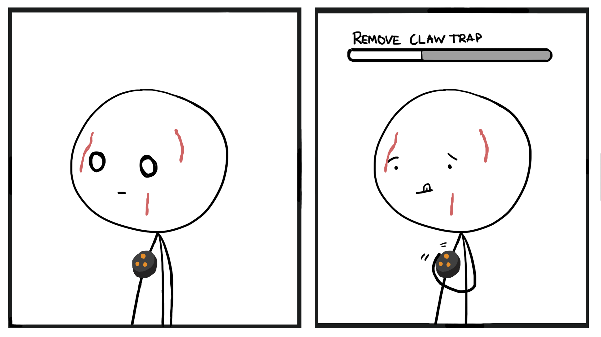

<!-- summary -->
## AI TL;DR

Skull Merchant’s rework now adds a shoulder-mounted Drone Buddy and keeps her five deployable Stealth Drones, removes the aura reveal when hacking, and makes Global Detection track both walking and running survivors to match drone sensing. Stealth Drone scan lines are visible but stop short of the ground, propulsion now only injures and tags survivors with a removable Claw Trap, and the new EMP dart ability from the Buddy down-fires only on trapped survivors.

The preview walks through a typical chase, shows survivor counterplay such as crouch-walking, hacking drones, and using obstacles to dodge the EMP, and states the design is an evolved proposal built on community feedback and will inform future updates.
<!-- /summary -->

<!-- nav -->
&larr; [Stats | January - March 2025](503-stats-january-march-2025.md) · [Developer Updates](../index.md#developer-updates) · [Developer Update | May 2025](507-developer-update-may-2025.md) &rarr;
<!-- /nav -->

# Design Preview | The Skull Merchant Part 2

Welcome back to another edition of the Skull Merchant Design Preview! As we mentioned in our [recent status update](https://forums.bhvr.com/dead-by-daylight/discussion/comment/3909956#Comment_3909956), we received a great deal of valuable feedback from you on our initial rework proposal. Today, we’re excited to share an evolution of this rework!

This places a considerable focus on Skull Merchant’s role as a high-tech hunter – a modern slasher, if you will – who uses the tools at her disposal to generate a network of information as she keeps tabs on her prey, weakens them, and then goes in for the kill when the time is right.

Let’s first dive into the specific changes:

## WHAT’S CHANGED?

- We’ve removed the Killer aura reveal when hacking a Drone.
- The Global Detection Power detects Survivors who are running **or** walking, keeping this consistent with how Drones detect players.
- Stealth Drone scan lines are now visible, but will not extend entirely down to the ground, providing a visual indicator for Survivors to crouch-walk as a counter action.
- Skull Merchant has two different types of Drones:
  - 5 deployable Stealth Drones, as previously mentioned
  - 1 Drone Buddy (name pending!) that hovers directly over her shoulder. *Note: This is not a separate AI-controlled entity.*
- Stealth Drones function as previously stated, but Drone Propulsion only injures – not downs – Survivors.
  - Any Survivor hit by Drone Propulsion is tagged and tracked with a Claw Trap.
  - Claw Traps can be removed by Survivors following a held interaction.
- Skull Merchant gains an activatable ability that fires an EMP dart from her Drone Buddy.
  - This ranged attack has a small AOE and downs Survivors tracked with a Claw Trap.
  - The EMP dart does not hurt Survivors if they are not tracked with a Claw Trap.

Sound interesting? Let’s break this down by looking at it in the context of an example chase from the perspective of Skull Merchant:

## DEPLOY AND DETECT

Your first order of business is to make use of the tools in your arsenal to figure out where Survivors are. You begin by deploying a Stealth Drone and piloting it to a high traffic loop, where you leave it passively scanning. Switching focus back to Skull Merchant, you head towards another loop, activating your Global Detection Power in hopes of catching a Survivor heading to their first gen.

Both the Global Detection Power and your passive Stealth Drone detect separate Survivors, notifying you of their whereabouts on your radar. You’re now perfectly situated for a chase...

## TAG AND TRACK

Switching focus back to the idling Stealth Drone, you see the Survivor who was detected running away. Making use of the Stealth Drone’s increased movement speed, you give chase.

Mid-chase, you see an opportunity to strike, launching your Stealth Drone forward with Drone Propulsion and hitting the Survivor. Not only does this injure them, but it attaches a Claw Trap to them. This inflicts the Broken status effect and tracks the Survivor on your radar.

While Drone Propulsion can’t be used to down a Survivor, this opens them up to her other ability...

## USE EMP DART TO DOWN

At this point, Skull Merchant could take matters into her own hands and hunt down the Claw Trapped Survivor by hand with an M1 attack, but where’s the fun in that? Hovering over her shoulder at all times is her prized Buddy Drone, which hides a secret weapon.

By charging up and releasing the activatable ability when in control of Skull Merchant, her Buddy Drone fires a short-to-mid range EMP dart that hits with a small AOE. If a Survivor is being tracked with a Claw Trap, the dart will activate this fearsome contraption, downing them. Good hunting!

## A SURVIVOR PERSPECTIVE

All that’s well and good, but if you’re a Survivor, how are you supposed to deal with these high-tech tools?

- Stealth Drone passively scanning an area? Either crouch-walk to avoid the scan lines or hack it to send this Drone back to Skull Merchant’s personal stores.

- Hear the Global Detection Power notification? Same as above – begin crouch-walking or stop moving altogether to avoid having your location given away.
- Notice a Stealth Drone being piloted? Keep to tight loops and be ready to juke to prevent the Stealth Drone from attaching a Claw Trap to you.

- Afflicted with a Claw Trap and see Skull Merchant approaching? Be ready to juke her EMP dart. It has a short charge time, so use this time to put an obstruction between you both.
- Afflicted with a Claw Trap and feeling hidden? Hold the interact button to remove it.

With that, we’d love to hear what you think of these changes! We’ll be keeping a close eye on all our community channels and relaying any feedback back to the team, so don’t hesitate to share your thoughts with us (i.e. in the replies right here)!

While we won’t be running a survey this time, we are taking note of the feedback you shared from the last iteration to inform future surveys.

See you in The Fog!

The Dead by Daylight Team

<!-- nav -->
&larr; [Stats | January - March 2025](503-stats-january-march-2025.md) · [Developer Updates](../index.md#developer-updates) · [Developer Update | May 2025](507-developer-update-may-2025.md) &rarr;
<!-- /nav -->
