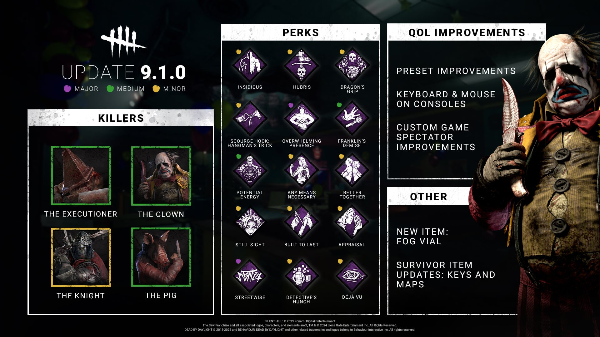
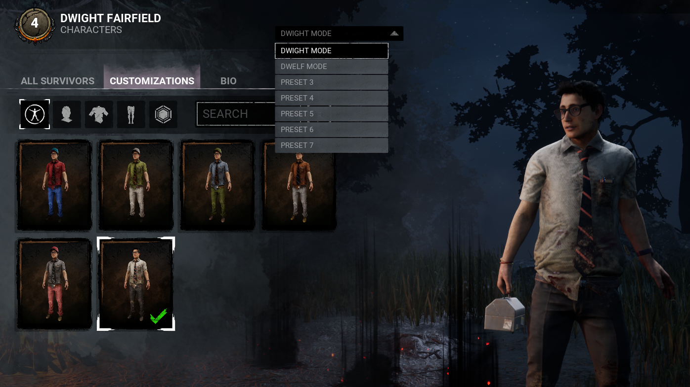

<!-- summary -->
## AI TL;DR

The new Survivors’ Fog Vial creates a fog cloud that hides scratch marks, muffles sound and blocks aura reading. Item “charges” now count as uses for Keys, Maps and other tools, adding rarities, add-ons and revised key functions. The Executioner gets a longer Punishment of the Damned range; the Clown’s yellow bottles gain faster activation, stronger haste and larger smoke, while purple bottles are slightly nerfed. The Knight’s patrol paths are longer and snappier, and Pig’s crouch and ambush speeds increase with input buffering. Mouse-and-keyboard support arrives on consoles, spectator hotkeys are refined, and customization and loadout presets expand to seven with rename. Several perks—including Any Means Necessary, Appraisal and Streetwise—are rebalanced for higher pick rates and item compatibility.
<!-- /summary -->

<!-- nav -->
&larr; [Developer Update | May 2025](507-developer-update-may-2025.md) · [Developer Updates](../index.md#developer-updates) · [Stats | 9th Anniversary](518-stats-9th-anniversary.md) &rarr;
<!-- /nav -->

# Developer Update | July 2025

The 9.1.0 Update is approaching, so let’s dive into the notable gameplay changes you can expect from the upcoming Public Test Build. Plus, stay tuned for the PTB Patch Notes where we’ll share the precise values that are changing for each of the topics below!

Read on for all the details:

## NEW FEATURES

- Added a new equippable item for Survivors: the Fog Vial. Its effects include:
  - Using a Fog Vial causes a fog cloud to expand outward from the point where it was used, dissipating after a set time
  - Scratch marks do not spawn within a fog cloud
  - Audio is muffled for anyone within a fog cloud
  - The auras of players within a fog cloud cannot be read by other players
- The Fog Vial has a cooldown which recharges over time once used
- Added item rarities and add-ons.

***DEV NOTE**: The Fog Vial specializes in creating confusion and breaking line of sight. When it’s activated, this fog obscures your surroundings while still allowing for limited visibility within your immediate vicinity. By moving to a single, recharging use, Survivors can use the Fog Vial multiple times per Trial and don’t have to be quite so precious about saving charges, letting them be more in the moment with their vial uses.*

*Stay tuned for patch notes for more information about Fog Vial rarities and add-ons.*

- Changed item “charges” to refer to individual uses of item, rather than the overall time it can be used for
- Adjusted the uses for this item to cover the following:
  - Channel the Key to consume 1 charge and reveal Survivor auras for a limited time
  - When near a closed hatch, consume 1 charge to unlock it
  - Consume 1 charge to quickly unlock a chest and gain an item of Rare rarity or higher. Once a chest has been unlocked with a Key it:
    - Is revealed to nearby Survivors
    - Can be rummaged in by 1 other Survivor to gain an additional item of Rare rarity or higher
- Adjusted the effects of individual item rarities and several add-ons.

***DEV NOTE**: Keys stood out as the least-used Survivor items and were typically outclassed by other options. We’ve reworked them to offer a wider range of utility and tap into players’ yearning for higher-rarity items.*

*Now, the “charge” system is easier to track (think of it as “uses” rather than “use time”) and the aura-reading capabilities of Keys are improved, while also adding some team-wide utility. In addition to making it easier for the equipped player to get quality items from chests, Keys also extend that opportunity to a single teammate.*

*Stay tuned for the patch notes for details on Key and Map item rarities and add-ons.*

- Changed item “charges” to refer to individual uses of item, rather than the overall time it can be used for
- Adjusted the uses for this item to cover the following:
  - Channel the Map to consume 1 charge and reveal nearby pallet and vault auras to yourself for a limited time
  - While auras are revealed, press the Use Item button again to create a beam of light (only visible to Survivors), revealing the auras of generators within the beam’s range to all Survivors
- Adjusted the effects of individual item rarities and several add-ons.

***DEV NOTE**: Similar to Keys, Maps stood out as an underutilized item which didn’t fit into beginner or experienced player kits. With this change, Maps retain the spirit of giving players an awareness of their surroundings, making their effects more consistent, and extending some value to teammates. Now, there’s no need to “track” objects before they show up.*

- Increased total number of Character Customization presets to 7
- Increased total number of Loadout presets to 7
- Added the ability to change preset names

***DEV NOTE**: Whether it’s the pursuit of fashion or prepping perks for every situation, we wanted to make it easier to save your faves. Don’t worry, your existing presets will be ported into this updated system.*

 

- Added mouse and keyboard support on the following console platforms:
  - PlayStation 4
  - PlayStation 5
  - Xbox One
  - Xbox Series X|S

*Please note: This feature is not available on the PTB, as it is only playable on Steam.*

***DEV NOTE**: Quite self-explanatory, we’ve extended full mouse and keyboard support to a number of console platforms so that players have more choice in how they approach gameplay.*

- Added hotkey inputs to Custom Game spectating to switch to the Killer’s perspective.
- Added spectators hotkeys representation next to players portraits, to improve usability
- Added the option to toggle spectator hotkeys visibility and adjust them in the Input Binding menu.
- Added a visual indicator to show spectators who they are viewing.
- Shows dead Survivor icons if joining as a spectator after getting sacrificed.

***DEV NOTE**: Following up on last update’s changes to Custom Games, we’ve introduced more improvements to make view-switching and tournament casting even easier. This also ensures viewers have more information about what they’re seeing.*

## KILLER UPDATES

- Increased Punishment of the Damned's range
- Increased the duration of Rites of Judgment’s trail drawing and trail lifetime
- Decreased Rites of Judgement's movement speed
- Added Haste and Endurance effects to Survivors saved from a cage
- Added input buffering to:
  - Transition from Punishment of the Damned to Rites of Judgment
  - Begin caging or killing a Survivor when the prompt is available
- Reworked his add-ons.

***DEV NOTE**: We’ve heard your feedback that The Executioner’s add-ons could use more variety – range shouldn’t feel like the only viable option. In addition to making range increases basekit, we’ve reworked his add-ons to introduce more interesting options, like adjusting the spread of Punishment of the Damned, or triggering effects on misses.*

*Outside of these changes (keep an eye out for the patch notes for add-on details!), we’ve made some quality-of-life adjustments and slightly reduced his zoning potential.*

- Increased movement speed while reloading bottle
- Decreased bottle reload time
- Adjusted the effects of yellow bottles:
  - Increased Haste effect
  - Increased the distance and speed that smoke spreads to
  - Increased activation speed
- Adjusted the effects of purple bottles:
  - Decreased the Hindered effect
  - Decreased how long the Hindered effect lingers after leaving smoke
- Added input buffering to:
  - Charging a bottle throw
  - Reloading bottles
- Adjusted several add-ons.

***DEV NOTE**: When it comes to The Clown’s power, his purple bottles see much more use than his yellow ones across skill levels. To better incentivize their use, we’ve given the yellow bottles a quicker activation, greater speed boost and wider effective range, coupled with some base speed increases. To compensate, purple bottles have received a slight nerf, requiring a little more throw control to get their full value.*

- Increased maximum patrol path length
- Increased path drawing speed, acceleration, and strafe speed
- The Carnifex’s Standard spawns slower
- The Assassin and Jailor’s Standards spawn quicker
- Added input buffering to:
  - Drawing a patrol path
- Adjusted Call to Arms add-on.

***DEV NOTE**: Drawing patrol paths is an important part of The Knight’s gameplay, so we’ve made it feel snappier and extended its range slightly, making Call to Arms partially basekit. We’ve also adjusted Standard spawn times for each Guard. In particular, the Standards for the two chase-focused Guards will spawn quicker to help give Survivors a little more counterplay during double team scenarios where they tend to be at their strongest.*

- Increased crouched movement speed
- Increased speed of crouching and un-crouching
- Increased the speed at which the Terror Radius fades when crouching
- Increased Ambush movement speed
- Added input buffering to:
  - Crouching
  - Charging an Ambush attack
- Adjusted several add-ons.

***DEV NOTE**: Yes, we know. We buffed Pig. Outside of her traps, her ability to surprise Survivors is an important part of her appeal. By increasing her speed and making her Terror Radius fade quicker while sneaking, she’ll have more chances to act on unprepared Survivors.*

## PERK UPDATES

- Updated **Any Means Necessary**
- Updated **Appraisal**
- Updated **Better Together**
- Updated **Built to Last**
- Updated **Déjà Vu**
- Updated **Detective’s Hunch**
- Updated **Potential Energy**
- Updated **Still Sight**
- Reworked **Streetwise**

***DEV NOTE**: We’ve adjusted values on a few perks that had low pick rates to help buff them up. In addition, we’ve adjusted perks that affect items to make sure they’re compatible with this update’s Survivor item changes.*

*Stay tuned for the patch notes for specific details on these value changes.*

- Updated **Dragon’s Grip**
- Updated **Franklin’s Demise**
- Updated **Hubris**
- Updated **Insidious**
- Reworked **Overwhelming Presence**
- Updated **Scourge Hook: Hangman’s Trick**

***DEV NOTE**: Similar to the above, we’ve buffed some perks which boasted lower pick rates and adjusted certain perks that affect items so they’re compatible with the recent changes.*

Until next time...

The Dead by Daylight Team

<!-- nav -->
&larr; [Developer Update | May 2025](507-developer-update-may-2025.md) · [Developer Updates](../index.md#developer-updates) · [Stats | 9th Anniversary](518-stats-9th-anniversary.md) &rarr;
<!-- /nav -->
