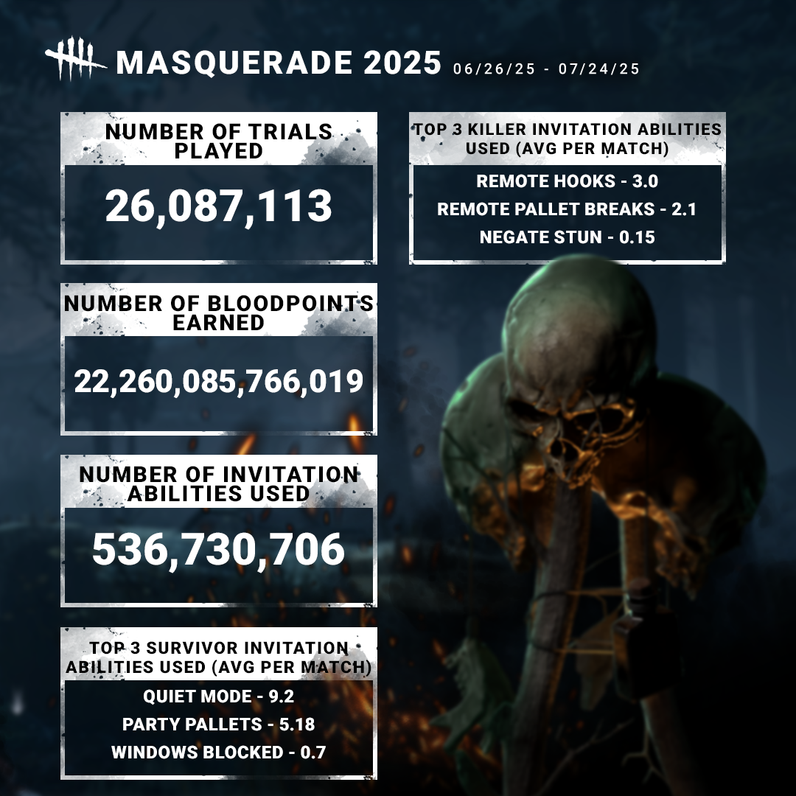
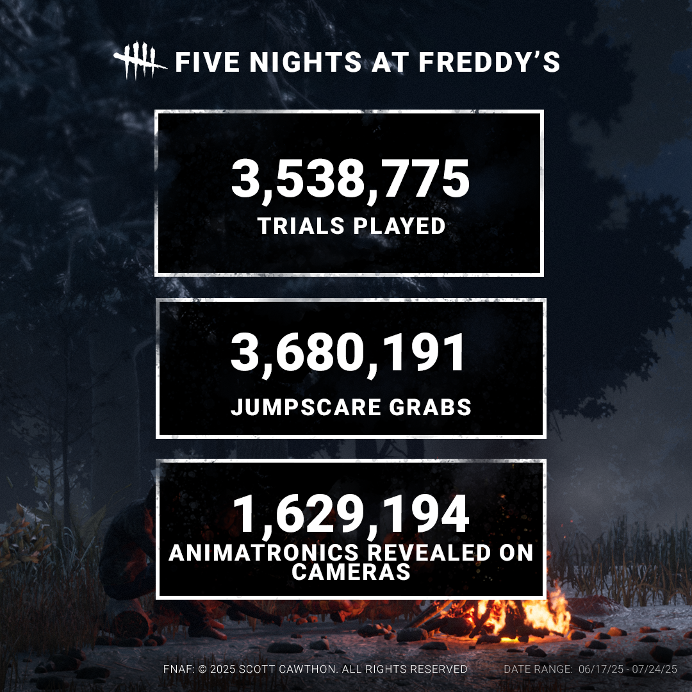

<!-- summary -->
## AI TL;DR

The developers released post-event statistics for the 9th Anniversary Masquerade and the Five Nights at Freddy’s Chapter, highlighting player behavior and engagement. Data shows Survivors leaned heavily toward stealth tactics while Killers favored aggressive chases that sent Survivors across the map, and Bloodpoint earnings spiked during the event. The summary also includes total trials played, the number of jump-scares triggered by the animatronic antagonist, and how often that foe was captured on camera, illustrating how both sides embraced surprise throughout the celebration.
<!-- /summary -->

<!-- nav -->
&larr; [Developer Update | July 2025](513-developer-update-july-2025.md) · [Developer Updates](../index.md#developer-updates) · [Developer Update | August 2025](521-developer-update-august-2025.md) &rarr;
<!-- /nav -->

# Stats | 9th Anniversary

While the Masquerade may be over, that doesn’t mean the fun has to end. We’d like to share with you some stats from the 9th anniversary Masquerade Event and from our Five Nights at Freddy’s Chapter.

Kicking things off with the Masquerade Event, we wanted to see just how much fun everyone was having while getting rich in Bloodpoints. Survivors seemed to favor a stealth approach, whilst Killers took a more overt approach by sending Survivors across the map.

On top of how many trials were played in this chapter, we also wanted to see how many poor souls got jump scared by our favorite Animatronic, and how many times he was caught on camera. Needless to say, both sides embraced opportunities to surprise each other!

Until next time…

The Dead by Daylight Team

<!-- nav -->
&larr; [Developer Update | July 2025](513-developer-update-july-2025.md) · [Developer Updates](../index.md#developer-updates) · [Developer Update | August 2025](521-developer-update-august-2025.md) &rarr;
<!-- /nav -->
